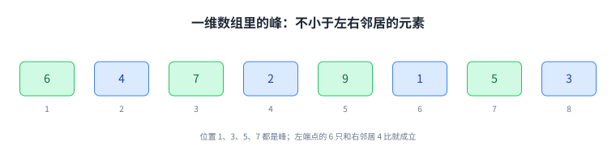
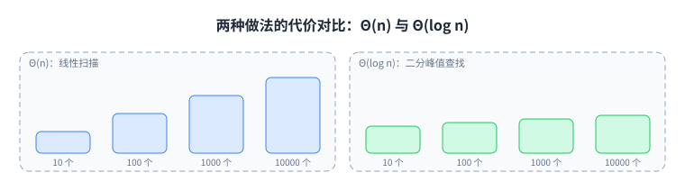
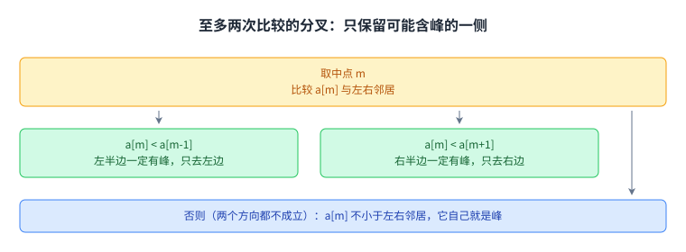
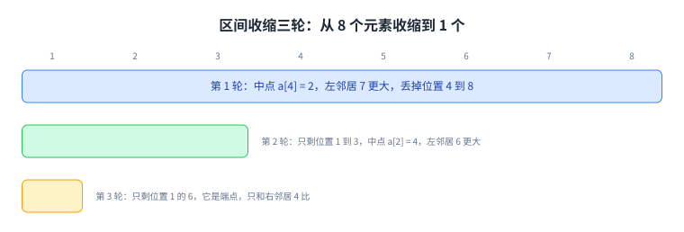
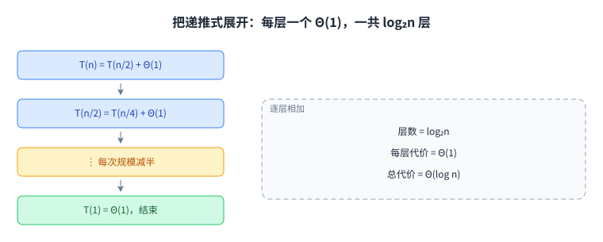
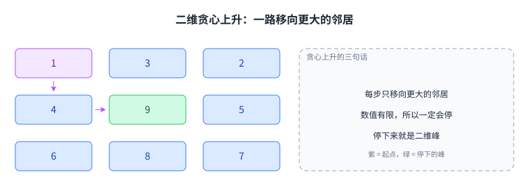
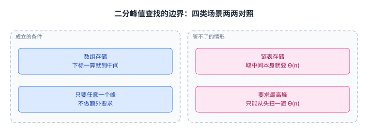

+++
title = "算法思维与峰值查找"
lecture = 1
slug = "algorithmic-thinking-peak-finding"
status = "reviewed"
source_kind = "notes"
source_url = "https://ocw.mit.edu/courses/6-006-introduction-to-algorithms-fall-2011/resources/mit6_006f11_lec01/"
source_title = "Lecture 01: Algorithmic Thinking, Peak Finding"
output_mode = "explanation"
+++

一个有一百万个元素的数组摆在面前，要你找出其中一个峰。题目看起来很小，但它把整门课要用的东西都带出来了：怎么把问题定义清楚，怎么把暴力做法换成分治，以及怎么算清代价。

MIT 6.006 的第一讲就叫算法思维，副标题正是峰值查找。这门课的教材是 CLRS（Introduction to Algorithms），实现用 Python，全课分成 8 个模块。第一个模块的引子问题，就是本讲要解决的问题。

## 一、这一讲要解决什么：在一串数里找一个峰

先给对象下定义。有 \(n\) 个数排成一排，记作 \(a[1], a[2], \ldots, a[n]\)。如果位置 \(i\) 的元素不小于它的左邻居，也不小于它的右邻居，就说 \(a[i]\) 是一个 [[term:peak]]：

\[ a[i-1] \le a[i] \ge a[i+1] \]

两端是特例。位置 1 只有右邻居，位置 \(n\) 只有左邻居，它们只要不小于唯一的那个邻居就算峰。这条端点规则后面很关键。

讲义接着把一个问题单独提了出来：峰会不会根本不存在。答案是存在。取整个数组里最大的那个元素，它比谁都不小，自然也不小于左右邻居，所以它一定是峰。讲义只提出了这个问题，没有写出这段论证，这里的证明是我们补的。

这一点顺带说明了任务的口径：要的是任意一个峰，不是最高的那个峰。

下面用一个 8 个元素的例子把定义画出来。



图里位置 1、3、5、7 都是峰。位置 1 的 6 之所以算峰，靠的正是端点规则：它只和右边的 4 比。要的只是其中一个，这个自由度后面会派上用场。

这套「每次砍掉一半以上」的做法有个正式名字：[[term:divide-and-conquer]]（分治）；而第五节要把它的代价写成式子，靠的是 [[term:recursion]]（递归）。Python 里做同类事的是 NumPy 的 `argmax`。

## 二、从左边一路扫过去：直觉做法为什么不够

最直接的做法是 [[term:linear-scan]]：从位置 1 开始往右看，哪一步发现当前元素不小于左右邻居，就返回它。它一定正确，因为它返回的正是从左往右遇到的第一个峰；峰一定存在这件事，第一节已经证过。

代价在最坏情况下要看完全部 \(n\) 个元素，也就是 \(\Theta(n)\)。平均只要看一半左右：讲义给的图注是平均 \(n/2\) 个元素、最坏 \(n\) 个。讲义没有交代对什么分布取平均，按随机排列的输入理解最自然。渐近记号关心的是最坏那一档，所以这里记作 \(\Theta(n)\)。讲义还给了一个很具体的对比：\(n = 1000000\) 时，Python 里 \(\Theta(n)\) 的做法大约要 13 秒；而代价为 \(\Theta(\log n)\) 的做法只要 0.001 秒。这里的 \(\Theta\) 读作「与某函数同阶」，说的是增长趋势，不是精确的运行时间。

线性扫描的毛病不在常数大，而在增长快。输入从 100 万个涨到 200 万个，时间就翻一倍。数组再大一个数量级，13 秒就变成两分钟以上。

把两种做法在同一组输入规模下的代价摆在一起，差距一眼可见。



左边四根蓝条形每档等量升高，右边四根绿条形越涨越慢。100 万个元素时，线性扫描要约 100 万次比较，二分只要大约 20 次。

## 三、核心思路：用至多两次比较砍掉一半以上

关键动作只有一步：不要从左端开始，先看正中间。

设当前范围是 \(a[l]\) 到 \(a[r]\)，中间位置 \(m = \lfloor (l+r)/2 \rfloor\)。拿 \(a[m]\) 和左右邻居比，按顺序处理三种情况。

- 如果 \(a[m] < a[m-1]\)，左半边 \(a[l..m-1]\) 里一定有峰，只去左半边找。
- 否则再看右边：如果 \(a[m] < a[m+1]\)，右半边 \(a[m+1..r]\) 里一定有峰，只去右半边找。
- 两个方向都不成立，说明 \(a[m]\) 不小于左右邻居，它自己就是峰。

「一定有」这三个字要有依据。以往左为例，把左半边当成一个独立的小数组，它里面最大的那个元素 \(a[k]\) 在小数组里当然是峰。它在原数组里也是峰吗？注意往左的前提是 \(a[m-1] > a[m]\)，也就是左半边最右边的元素比它右边的邻居大；而 \(a[k]\) 又不小于左半边里所有元素，于是 \(a[k]\) 不小于它所有的邻居。往右去的情形完全对称。讲义在这一步只写了一个 WHY，把论证留成练习，上面这段是我们补的。

这一步是整套算法的支点：每轮至多两次比较，就把候选范围砍掉一半以上，而且丢掉的部分里确实没有答案。

分叉的形状画在下面。



两侧只会留下一侧，另一侧整块丢掉。

## 四、一维机制的完整走查

规则既可以写成循环，也可以写成递归。递归写法如下。

```python
def find_peak(a, lo, hi):
    # 只剩一个元素：它一定也是原数组里的峰
    if lo == hi:
        return lo
    mid = (lo + hi) // 2
    # 先看左邻居。mid 可能落在左端点上，若 lo 正好是 1，a[mid - 1] 就出界了
    if mid > lo and a[mid] < a[mid - 1]:
        return find_peak(a, lo, mid - 1)
    # 再看右邻居。这一侧的守卫其实用不上（mid 永远小于 hi），保留只是为了对称
    if mid < hi and a[mid] < a[mid + 1]:
        return find_peak(a, mid + 1, hi)
    # 两个邻居都不大于它，自己就是峰
    return mid
```

代码里 `mid > lo` 是必需的：范围只剩两个元素时 `mid` 落在左端点上，若 `lo` 正好是 1，`a[mid - 1]` 就跑到数组外面去了。`mid < hi` 则是冗余的对称写法：`lo < hi` 时 `mid` 永远小于 `hi`，`mid + 1` 一定在界内，删掉它结果不变。

还有一个细节容易被跳过：递归到只剩一个元素时，它凭什么一定是原数组里的峰。因为每次收缩都在边界上留下一个不等式，保留范围的边界元素大于它外侧那个被丢掉的邻居。收缩到单元素时，它要么没有外侧邻居，要么外侧邻居更小。讲义在这里只写了一句「自己论证算法是正确的」，把整套正确性留成练习，上面这段论证是我们补的。

用一个 8 个元素的数组走一遍：

\[ a = [6,\ 4,\ 7,\ 2,\ 9,\ 1,\ 5,\ 3] \]

第一轮取中间位置 4，\(a[4] = 2\)，左邻居 \(a[3] = 7\) 更大，于是丢掉 \(a[4..8]\)，只在 \([6, 4, 7]\) 里找。第二轮取中间位置 2，\(a[2] = 4\)：这次先看左邻居，\(a[1] = 6\) 比 4 大，所以往左走，丢掉 \(a[2..3]\)，只剩 \(a[1] = 6\)。它是峰，因为位置 1 是左端点，只需要不小于右邻居 4。

整个数组有 4 个峰：位置 1 的 6、位置 3 的 7、位置 5 的 9、位置 7 的 5。算法返回位置 1 的 6。先比哪一边是自由的：换一种取中点的方式，或者换一下两个分支的先后顺序，可能返回另一个峰，这些答案都合格。

范围收缩的过程画在下面。



前两轮各丢掉一半以上，第三轮面对单元素直接给出答案。丢掉的部分不用再回头检查，这是本讲唯一需要记住的动作。

## 五、代价怎么算：递推式与它的解

一次比较花掉的时间与 \(n\) 无关，记作 \(\Theta(1)\)。真正的代价来自「还要做几次」。写成 [[term:recurrence]] 就是

\[ T(n) = T(n/2) + \Theta(1) \]

读法是：规模 \(n\) 的问题，先花一个 \(\Theta(1)\) 的比较，然后变成一个规模 \(n/2\) 的同类问题。展开更直观：

\[ T(n) = \underbrace{\Theta(1) + \Theta(1) + \cdots + \Theta(1)}_{\log_2 n\ \text{项}} \]

一共加 \(\log_2 n\) 次，因为 \(n\) 每次减半，减到 1 需要 \(\log_2 n\) 步。所以

\[ T(n) = \Theta(\log n) \]

讲义在这里停了一下，提醒了一件事：把这么多个 \(\Theta(1)\) 相加，得先确认存在一个对所有项都成立的常数。换句话说，每一步的工作量不能偷偷跟着规模变大。这是 \(\Theta\) 记号最容易被误用的地方。

代入数字：100 万个元素时 \(\log_2 n \approx 20\)，也就是大约 20 次比较，而不是 100 万次。前面 13 秒与 0.001 秒的差距，来源就在这个对数上。

三个记号从这一讲开始会一直出现，先分清：

- \(\Theta(f(n))\) 表示代价与 \(f(n)\) 同阶，上下都被 \(f(n)\) 卡住，是最强的说法。
- \(O(f(n))\) 只保证不超过 \(f(n)\) 的常数倍，是上界。
- \(\Omega(f(n))\) 只保证不少于 \(f(n)\) 的常数倍，是下界。

讲义全篇只用了 \(\Theta\)，没有出现过 \(O\) 与 \(\Omega\)，也没有给出记号定义。上面这三条是为读别的教材准备的，属于我们补的部分。

展开过程可以用 [[term:recursion-tree]] 来看。这棵树每一层只有一个结点。



层数是 \(\log_2 n\)，每层加起来是 \(\Theta(1)\)，相乘就得到 \(\Theta(\log n)\)。

## 六、二维版本：两个独立机制

把问题搬到矩阵上。\(n\) 行 \(m\) 列的 [[term:matrix]] 里，位置 \((i,j)\) 是峰，当它不小于上下左右四个邻居。矩阵的四条边只有三个邻居，四个角只有两个。

第一个机制是 [[term:greedy-ascent]]：从任意一个格子出发，只要某个邻居比它大就移过去。每移一步数值都严格变大，而矩阵里的数值有限，所以肯定会停下来；停下来时四个邻居都不大于它，那就是二维峰。讲义只给了这个做法的复杂度，没有写这段终止性论证，是我们补的。

这个做法正确，代价是 \(\Theta(nm)\)。方阵 \(m = n\) 时是 \(\Theta(n^2)\)：1000 行 1000 列的矩阵最坏要走 100 万步，而一维的二分只需要 20 步。

贪心上升的走法画在下面。



它能停在峰上，但走过的格子数没有保证。

第二个机制才是把一维的招数搬到二维。这里有个坑：直接照搬会失败，所以先把失败的做法讲清楚。

失败的尝试是这样：取中间列 \(j = m/2\)，在这一列里做一维峰值查找，得到一个位置 \((i,j)\)；再用它当起点，在第 \(i\) 行里做一维峰值查找。看起来两个方向都照顾到了，但它可能停在一个不是二维峰的位置上。讲义对这一点的说法是「第 \(i\) 行上可能根本不存在二维峰」，并配了一个反例；下面这个原因解释是我们补的。列里的一维峰只保证上下邻居不大于它，行方向没有保证；接着在行里重新找峰，只保证了左右邻居不大于它，列方向那个保证反而作废了。

正确做法只改了一处：把「列里的一维峰」换成「列里的全局最大值」。

- 取中间列 \(j = m/2\)，找出这一列的最大值，把它所在的行记为 \(i\)。
- 比较 \(a[i][j]\) 与左右邻居 \(a[i][j-1]\)、\(a[i][j+1]\)。
- 左边更大，就只保留左半边的列；右边更大，就只保留右半边的列。
- 两边都不大于它，\((i,j)\) 就是二维峰。
- 只剩最后一列时，直接取这一列的最大值，结束。

这里必须取最大值：「这一列里最大」已经一次性保证了上下邻居不大于它，接下来的比较只要管左右。一维峰只保证了一个方向，换个方向看就失效。

丢掉一半以上列的安全性要单独论证。讲义没有展开这一步。假设左边邻居更大，取左半边里的最大值 \(M\)，它落在 \((p,q)\)。\(M\) 不小于左半边里所有格子，所以只要邻居还在左半边内，就不会超过它。唯一可能出界的是右方向：如果 \(q = j-1\)，它的右邻居是 \(a[p][j]\)。这里用到「中间列取最大值」这个改动：\(a[p][j] \le a[i][j]\)，因为 \(a[i][j]\) 是第 \(j\) 列的最大值；而往左的条件给出 \(a[i][j] < a[i][j-1] \le M\)，因为 \(a[i][j-1]\) 也在左半边里。串起来是 \(a[p][j] \le a[i][j] < a[i][j-1] \le M\)，所以右邻居同样不超过 \(M\)。

代价写成递推式是

\[ T(n, m) = T(n, m/2) + \Theta(n) \]

其中 \(\Theta(n)\) 是扫一遍中间列（\(n\) 行）的开销。解出来是 \(\Theta(n \log m)\)，方阵时就是 \(\Theta(n \log n)\)。

按列二分的轮廓画在下面。


每一步丢掉一半以上的列，每一步扫一列，于是列数进了对数，行数留在外面。

## 七、代价与边界：这套办法什么时候失效

第一条边界是随机访问。二分依赖「直接取到中间那个元素」。数组可以，下标一算就到；链表不行，要走到中间得先走 \(n/2\) 步，取中间这个动作本身就要 \(\Theta(n)\)，省下的全被它吃回去。数据结构一换，算法的结论就跟着换。

第二条边界是任务口径。算法返回任意一个峰，不保证是最高峰；要最高峰就只剩老实扫一遍，\(\Theta(n)\)，没有捷径。另外这里的比较用的是「不小于」：如果改成严格大于，一串相等的数里就一个峰都没有了。

第三条边界来自二维那次失败。它的教训不在于猜错了，而在于**一个方向上的保证会被下一步作废**。正确做法之所以成立，是因为先取整列最大值，再只比左右，两次保证互不干扰。

讲义有一处没有展开：空数组或者 \(n = 0\) 时该怎么办。它对存在性只提了一个问句，接着就直接讨论怎么找峰，默认输入至少有一个元素，我们的实现也按这个前提写。讲义最后还留了一个思考题：如果把「中间列的全局最大值」换回「中间列的一维峰」，还行不行。按上面那段推理，答案是否定的，缺口正出现在 \(q = j-1\) 那一步。

几种使用场景摆在一起看，成立与不成立的分界很清楚。



左边两格是本讲结论成立的场景，右边两格是它管不了的情形。

## 读完应该能回答

- 一维峰值查找为什么能在 \(\Theta(\log n)\) 内完成，而按定义它要检查的元素个数是 \(n\)。
- 二维里为什么必须取中间列的全局最大值，换成中间列的一维峰会坏在哪一步。
- 同一个算法换到链表上，为什么 \(\Theta(\log n)\) 的说法就不再成立。
- 位置 1 的 6 为什么算峰，而位置 8 的 3 为什么不算。

## 脉络回顾

这一讲是全课 8 个模块的第一个，模块名叫算法思维，引子问题就是峰值查找。模块号与讲次号不是一回事：讲义第 1 页的模块 2（排序与树）是模块号，而模块 2 下面的讲次从第 3 讲才开始。

后面的路线是：排序与树（事件模拟）、哈希（基因组比对）、数值（[[term:rsa]]）、图（[[term:rubiks-cube]]）、最短路（从加州理工到 MIT）、动态规划（[[term:image-compression]]）、进阶专题。

本讲留下的三件工具会一直用：把问题定义成能验证的形式、用分治把规模至少减半、用递推式把代价算出来。要分清的是，留下来复用的是这三件工具，不是峰值查找这道题：峰值查找到这一讲就讲完了，第 2 讲的计算模型与文档距离不会再用到它。下一次见到「减半」是在第 3 讲，那一讲的插入排序与归并排序把它用在排序上，归并的代价是 \(\Theta(n \log n)\)。

## 溯源

对应原文：MIT 6.006 Fall 2011 第 1 讲讲稿（MIT6_006F11_lec01.pdf，6 页）的 Course Overview、Peak Finder 一维与二维三节，以及同名视频。讲义页：<https://ocw.mit.edu/courses/6-006-introduction-to-algorithms-fall-2011/pages/lecture-notes/>。

本讲的事实都能在上述讲稿里逐条对上：峰的定义与端点规则、教材指定 CLRS（第 1 页 Course Overview 里写了 CLRS text）、实现用 Python、从左扫的 \(\Theta(n)\) 与平均 \(n/2\)、二分的 \(T(n) = T(n/2) + \Theta(1) = \Theta(\log n)\)、把 \(\Theta(1)\) 相加要先找一个通用常数、100 万元素时 13 秒与 0.001 秒的对比、贪心上升的 \(\Theta(nm)\)、第一次二维尝试可能停在非峰位置，以及 \(T(n, m) = T(n, m/2) + \Theta(n)\)。

有一处表述比源更紧，登记一下：二维每轮保留的列数。源的原话是用 half the number of columns 描述新问题的规模，而保留的是 \(\lfloor m/2 \rfloor - 1\) 列，严格少于一半，所以正文写成「一半以上」。这是按精确计算收紧，不是与源冲突。

属于我们自己的部分，也就是讲义没有写、只留成练习的地方：

- 峰一定存在的证明。讲义把它提成问句，没有给论证。
- 「左半边一定有峰」的论证，以及单元素仍是原数组峰的论证。讲义在这两处分别只写了 WHY 和一句「自己论证算法是正确的」。
- 二维丢列的安全性不等式，以及贪心上升一定会停下来的论证。讲义只给了结论与复杂度。

讲义同样没有写的另一些内容：

- \(\Theta\)、\(O\)、\(\Omega\) 三条记号定义。讲义全篇只用 \(\Theta\)（14 处），没有 \(O\)，没有 \(\Omega\)。
- 「不保证最高峰」「改成严格大于就没有峰」两个变体，以及链表上取中间元素的代价分析。
- 1000 行 1000 列要走 100 万步、\(\log_2 1000000 \approx 20\) 这类算术，和「13 秒变两分钟」的外推。
- 例子数组、第六节的例子矩阵、8 个模块引子问题的中文译名，以及全部配图（自绘，没有复刻讲义里的插图）。

还有几条属于我们的补充说明与指针：

- CLRS 的全称 Introduction to Algorithms。讲义只写了缩写。
- 「平均 \(n/2\) 按随机排列的输入来理解」这条解释。讲义只写了 on average，没有交代分布。
- 第 3 讲归并排序这个前向指针，讲次顺序取自 OCW 的讲座目录页。
- 空输入（\(n = 0\)）这个缺口：讲义完全没有提，我们的实现按输入至少有一个元素来写。

授权：本页是原创中文讲解，不是逐字翻译，也不含原文段落。上游材料为 CC BY-NC-SA 4.0，义务是署名、非商用、以相同协议发布衍生内容。逐页证据见本仓库 `course.toml` 的 `[license]` 与 `docs/audit/license-ocw-6.006.md`。

补充登记（后来补的三处术语指向，不影响上面的事实与归属）：本讲反复用的「砍掉一半」属于 [[term:divide-and-conquer]]（分治），第五节的递推式要靠 [[term:recursion]]（递归）来读；Python 里做同类事的是 NumPy 的 `argmax`。
