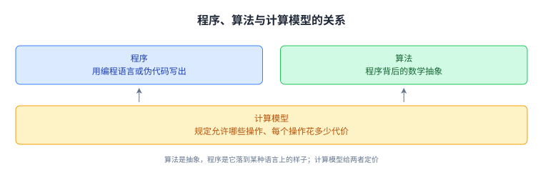
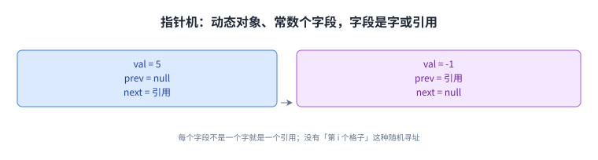
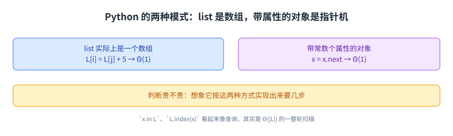
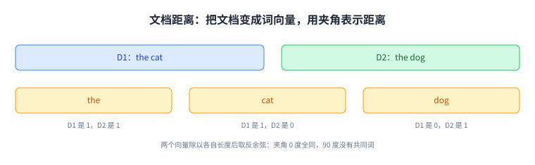
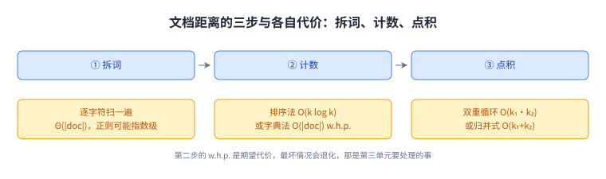
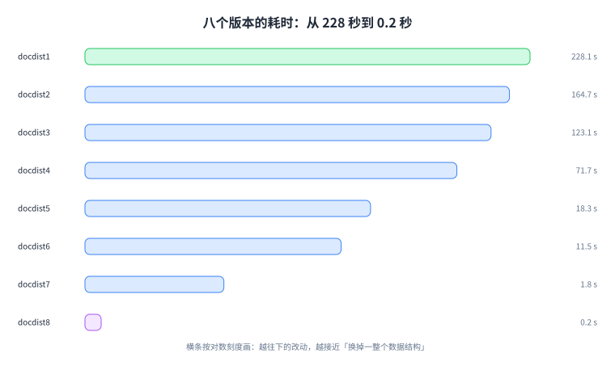

+++
title = "计算模型与文档距离"
lecture = 2
slug = "models-of-computation-document-distance"
status = "draft"
source_kind = "notes"
source_url = "https://ocw.mit.edu/courses/6-006-introduction-to-algorithms-fall-2011/resources/mit6_006f11_lec02/"
source_title = "Lecture 2: Models of Computation, Python Cost Model, Document Distance"
output_mode = "explanation"
+++

第一讲讲的是怎么把一个问题解开，这一讲先停下来问一个更靠前的问题：说一个算法「快」，到底是在给什么定价。同一段思路，写成 Python 还是写成 C，跑在这台机器还是别的机器上，耗时能差出好几个数量级。不先约定「哪种操作算一步、一步要多久」，复杂度分析就只是一句口号。

MIT 6.006 的第二讲就叫 [[term:model-of-computation]]，副标题给了三件事：[[term:random-access-machine]]（random access machine）、Python 的代价模型（Python cost model），以及一个真能跑起来的例子，[[term:document-distance]]（document distance）。这一讲的推进顺序值得先记住：先定机器，再把 Python 的写法映到机器上，最后拿「两篇文档有多像」把代价算个明白。

## 一、这一讲要解决什么：算法是什么，代价又是什么

讲义用一段历史开场。花拉子米（Al-Khwārizmī，约 780 到 850 年）被称作代数之父，他那本《复原与对消的计算概要》里解线性与二次方程的办法，被讲义点名为「最早的算法之一」。algorithm 这个词本身就是他名字的拉丁化。

接着讲义给了算法的两个说法：它是「计算机程序的数学抽象」，也是「解决问题的计算过程」。抽象这两个字是重点。同一件事，写成程序要落到某台具体的机器上，写成 [[term:pseudocode]] 只需要落到一套规则上。讲义那张图就是讲这个关系：编程语言对应程序，计算机对应算法，而计算模型托在两者之间。

> 原文：Model of computation specifies what operations an algorithm is allowed; cost (time, space, …) of each operation. Cost of algorithm = sum of operation costs.

译过来是：计算模型规定了算法允许做哪些操作，以及每个操作花多少代价；而一个算法的代价，就是它用到的所有操作代价之和。这句话是这一讲的骨架，后面 RAM、指针机、Python 模型都是它的具体版本。这门课的教材 CLRS 里，绝大多数算法就是在这个模型下分析的。

## 二、随机存取机：把一次操作定价为 Θ(1)

第一个模型叫随机存取机，缩写 RAM。它把内存想成一个很大的数组，每个格子有 [[term:index]]，格子里的东西叫 [[term:machine-word]]。除了内存，机器还有常数个寄存器，每个也是一字大小。讲义列的允许操作只有三条，而且都在 Θ(1) 时间里完成：

- 把某个内存地址的字装进一个寄存器；
- 在寄存器上做加减乘除与按位运算；
- 把一个寄存器里的字存回某个内存地址。

三条之外就没有了。这个「只有三条」的设计，正是它能给复杂度分析当尺子的原因：任何算法只要拆成这三条，代价就能对着数出来。

这里有个容易被跳过但很关键的细节：一个字到底是多少位。讲义写的是 \(w \ge \lg(\text{memory size})\)。意思是字长必须够放下一个内存地址，否则你连「指到某个格子」都做不到。同时约定基本对象（比如一个整数）能塞进一个字，所以两个整数相加算一次操作。到了第四单元讲大数运算时，这个约定会被拆掉重新讨论。

## 三、指针机：只有对象和引用

第二个模型叫 [[term:pointer-machine]]。它不假设内存是一个大数组，而是假设动态分配出来的对象：每个对象有常数个字段，每个字段要么是一个字（比如一个整数），要么是一个指向别的对象的引用，要么是空。Python 里的 `namedtuple` 就是这个东西。

两种模型的关系，讲义只用了一句括注说清：指针机比 RAM 弱，因为它可以在 RAM 上实现出来。换句话说，RAM 能做的它都能做，但它能表达的东西更少。少在哪里？它没有「第 i 个格子」这种随机寻址，只能顺着引用走。这一点在后面讲链表时会长出代价：链表上就没有「一步跳到中间」。

## 四、Python 的代价模型：把一行代码映回机器

Python 的好处，也是它的坑，在于它同时提供上面两种思维：

1. `list` 实际上是一个数组，所以 `L[i] = L[j] + 5` 是 RAM 式的随机寻址，花 Θ(1)；
2. 带常数个属性的对象是指针机式的，所以 `x = x.next` 顺着引用走一步，也花 Θ(1)。

于是判断 Python 某个操作贵不贵的办法就定了：想象它按上面两种方式实现出来要几步。讲义把常见的几个列了出来，这份清单值得背下来，因为它决定了后面每一讲里「一行 Python 算几次操作」：

- `L.append(x)`：Θ(1)。前提是动态数组在背后按需扩容，多余的一次扩容代价被摊掉，这套账在第九讲的表倍增里算；
- `L = L1 + L2`：Θ(1 + |L1| + |L2|)。它新建一个列表，把两边逐个搬过去，长度加进去是躲不掉的；
- `L1.extend(L2)`（等价于 `L1 += L2`）：Θ(1 + |L2|)。只搬右边，左边原地留下；
- `L2 = L1[i:j]`：Θ(j − i + 1)。切片要复制出一段新列表，所以它是 O(|L|) 而不是 Θ(1)；
- `x in L`、`L.index(x)`、`L.find(x)`：Θ(|L|)。它们从头逐个比，没有下标可以直接跳。

注意最后两条的共同点：它们看起来像一次查询，实际是一整轮扫描。初学者写出来的慢代码，多半就慢在这里。

## 五、文档距离：把「像不像」变成几何

接下来是这一讲的重头戏：给两篇文档算一个「有多像」的数。讲义用最短的例子开场：\(D_1\) 是「the cat」，\(D_2\) 是「the dog」。

第一步把文档看成 [[term:document-vector]]：每个出现过的词是一维，坐标就是这个词在这篇文档里出现的次数。于是文档距离最自然的定义是两个向量的 [[term:dot-product]]：

\[ d'(D_1, D_2) = D_1 \cdot D_2 = \sum_W D_1[W] \cdot D_2[W] \]

这个定义立刻出问题，讲义的原话是：

> 原文：The problem is that this is not scale invariant.

也就是说它不满足 [[term:scale-invariant]]：一篇长文档只要和另一篇有 99% 的词相同，乘出来的数会很大；而两篇短文档哪怕 10% 的词相同，数也可能更小。于是「长文更像」这种错觉会盖过真实的重合度。

修法是把两个向量的长度除掉，得到归一化的点积：

\[ d''(D_1, D_2) = \frac{D_1 \cdot D_2}{|D_1| \cdot |D_2|} \]

其中 \(|D_i|\) 是第 i 篇的词数。这个式子的几何含义是余弦：再取一次反余弦，量出来就是两个向量之间的夹角。

\[ d(D_1, D_2) = \arccos\big(d''(D_1, D_2)\big) \]

夹角为 0 度说明两篇文档完全相同，90 度说明它们没有共同词。讲义注明这套做法出自 Salton、Wong、Yang 1975 年的工作。

## 六、三步算法的代价：拆词、计数、点积

讲义的算法只有三步，难点全在每步的代价：

1. 拆词：把每篇文档切成词的列表。讲义顺手给了一个警告，正则 `re.findall(r"\w+", doc)` 在一般情况下可能是指数级的，所以它给了一个逐字符的写法做对照：扫一遍文档，遇到非字母数字就收一个词，代价 Θ(|doc|)。
2. 计数：把词列表变成「词到次数」的映射。讲义给了两条路：先排序再线性扫一遍合并同类项，代价 O(k log k · |word|)，其中 k 是词数；或者用 [[term:dictionary]] 边扫边加，代价 O(|doc|)，但讲义加了个 w.h.p.（高概率）的限定语。
3. 点积：把两篇的计数字典乘起来。最直接的双重循环是 O(k₁ · k₂)；如果两份计数表都按词排好序，就可以像归并那样各走一遍指针，降到 O(k₁ + k₂)。

第二步那个 w.h.p. 不是敷衍。字典的「查找 + 插入」在期望意义上是 Θ(1)，而最坏情况会退化，原因与哈希冲突有关，这是第三单元要专门处理的事。所以这一讲给出的不是最终答案，而是把「哪一步值得优化」指了出来。

## 七、从 228 秒到 0.2 秒：八个版本的实测

讲义最后给了一份实测记录，这也是这一讲最值得记住的地方。测试对象是两篇文本：一篇 268,778 字符、49,785 词、3,354 个不同的词；另一篇 1,031,470 字符、182,355 词、8,534 个不同的词。机器是 2.8 GHz 的 Pentium 4，CPython 2.6.2，Linux 2.6.26。

| 版本 | 耗时（秒） | 这一步改了什么 |
| --- | --- | --- |
| docdist1 | 228.1 | 三步齐全，但每行单独处理，且用了 `words = words + words` |
| docdist2 | 164.7 | 把上面的拼接改成 `+=` |
| docdist3 | 123.1 | 点积改用归并式，但排序还是 [[term:insertion-sort]] |
| docdist4 | 71.7 | 计数改用字典，但仍然要排序才能用归并式点积 |
| docdist5 | 18.3 | 拆词改用 `string.translate` |
| docdist6 | 11.5 | 排序换成 [[term:merge-sort]] |
| docdist7 | 1.8 | 计数完全用字典，排序彻底去掉 |
| docdist8 | 0.2 | 整篇处理，不再逐行 |

从 228 秒到 0.2 秒，一千多倍。而真正的大头不是换算法，是换数据结构与常数因子：把 `+` 换成 `+=`、把插入排序换成归并排序、把排序整个换掉，各自都是一次量级的跳跃。讲义没有写出这一步的结论，但数字摆在那里。

## 读完应该能回答

- 计算模型规定了哪两件事，为什么这两件事必须先定下来；
- RAM 的三条 Θ(1) 操作分别是什么，字长为什么必须不小于 lg(内存大小)；
- 指针机比 RAM 弱在哪里，为什么它反而更好实现；
- Python 的 `L[i] = L[j] + 5` 与 `x = x.next` 各自对应哪个模型、各自为什么是 Θ(1)；
- 点积当文档距离为什么不满足尺度无关，归一化与反余弦各补上了什么；
- 拆词、计数、点积三步里，哪一步给出的是期望代价而不是最坏代价，为什么。

## 脉络回顾

这一讲给的不是某个算法，而是一把尺子。往后每一讲算代价时用的都是它：先问「这一步用到了 RAM 的哪条操作」，再问「Python 把它实现成几步」。第一讲里的峰值查找之所以能说「一轮只花 Θ(1)」，依据就来自这里；而第五讲、第六讲算递推式时出现的那两个 Θ(1)，同样是这里定下的价。

要分清的是，这一讲的文档距离本身只走到「定义清楚 + 代价分析」为止：三步各是什么、每步贵在哪，讲清楚了；至于字典为什么只是「高概率」快、表倍增怎么把 append 摊成 Θ(1)，那是第三单元（哈希）与第九讲的事。下一讲从排序开始，代价第一次变成可以比较的东西。

## 溯源

本讲的内容全部来自 MIT 6.006 Fall 2011 的 Lecture 2: Models of Computation, Python Cost Model, Document Distance 讲义（typed notes，8 页，其中第 8 页是 OCW 版权页）。本讲的事实都能在上述讲义里逐条对上，包括这几组：花拉子米的生卒与著作；算法的两个说法与计算模型的两条规定；RAM 的三条操作与 \(w \ge \lg(\text{memory size})\) 这个条件；指针机的字段类型与「弱于 RAM」这句关系；Python 的两个模型与 a 到 e 五项操作的代价；文档距离的两次定义与反余弦解释，以及 Salton 等人的出处；三步算法的两种计数法、两种点积写法与 w.h.p. 限定；八个版本的耗时，以及两篇测试文本的规模与那台机器的配置。

讲义同样没有写的部分，以下是我们补的：这篇中文讲解本身（讲义是英文提纲），全部配图（讲义的两张 Figure 一律重画，不转载），以及四处展开说明：

1. 为什么「字长不小于 lg(内存大小)」是必要条件（第二节末尾的解释）；
2. 为什么切片是 O(|L|) 而不是 Θ(1)（要复制出新的列表）；
3. 为什么第二步的字典法要加 w.h.p.（期望 Θ(1)、最坏退化，第三单元处理）；
4. 以及「大头的改动是数据结构与常数因子，而不是换算法」这句总结（讲义只给数字，没有写结论）。

另外两处登记：一是「这门课的教材 CLRS 里，绝大多数算法就是在这个模型下分析的」这句指向教材惯例的话，讲义本身没有写；二是讲义第 21 页标题里的 `psuedopolynomial` 是 OCW 原文的拼写（正确拼写为 pseudopolynomial），本讲不涉及该词，此处仅登记这一事实。本讲的讲次顺序与模块号沿用第一讲的说明：OCW 日历页的 Unit 划分（8 个模块）与讲次号不是一回事。
