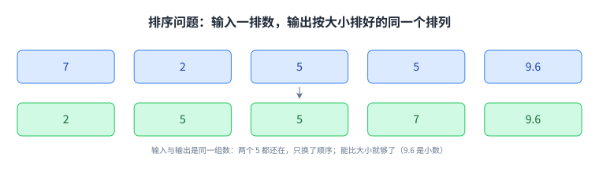
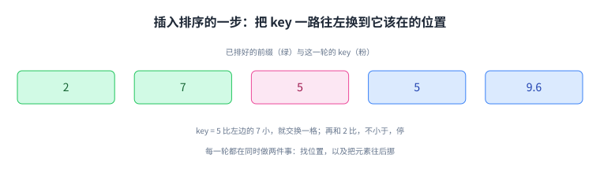
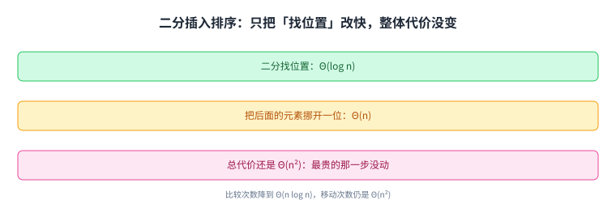
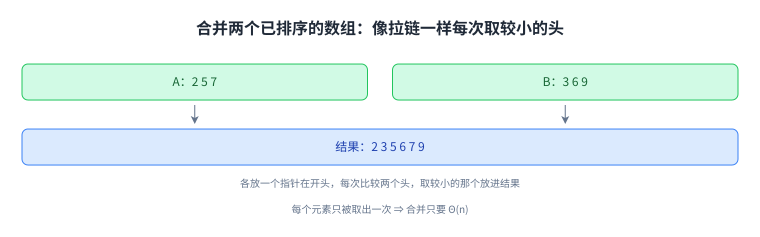
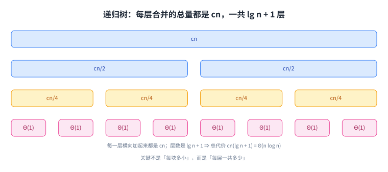
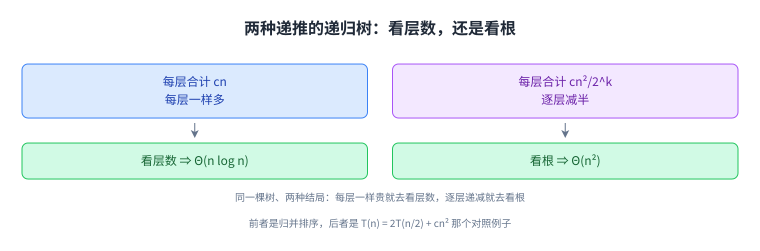

+++
title = "插入排序与归并排序"
lecture = 3
slug = "insertion-sort-merge-sort"
status = "draft"
source_kind = "slides"
source_url = "https://ocw.mit.edu/courses/6-006-introduction-to-algorithms-fall-2011/resources/mit6_006f11_lec03/"
source_title = "Lecture 03: Insertion Sort, Merge Sort"
output_mode = "explanation"
+++

前两讲把尺子造好了：什么算一步、一步值多少。这一讲开始用尺子比大小，比的是一对最古老的算法，做的是最古老的问题之一：把一排数排好。

讲义给的两个算法是 [[term:insertion-sort]]（insertion sort）与 [[term:merge-sort]]（merge sort），中间还夹着一个很有价值的半成品：二分插入排序。推进顺序是：排序问题是什么、为什么值得做；插入排序怎么做；二分的改进为什么只改了一半；归并排序怎么做；最后用递归树把它的代价算出来。讲义给的是伪代码，这门课的实现用 Python，教材是 CLRS。

## 一、这一讲要解决什么：把一排数排好

问题的定义只有两行，讲义的原话是：

> 原文：Input: array A[1…n] of numbers. Output: permutation B[1…n] of A such that B[1] ≤ B[2] ≤ … ≤ B[n].

输入是一排数，在计算机里就是一段 [[term:array]]；输出是它们的 [[term:permutation]]：同样是这些数，但按从小到大排好。讲义举的例子是 \([7, 2, 5, 5, 9.6]\)，排好之后是 \([2, 5, 5, 7, 9.6]\)。

这个例子顺带说明了两件事：相同的数要保留（两个 5 都还在），所以排序的答案常常不唯一；参与比较的不只是整数（9.6 是小数），只要两个元素能比大小就够。

那为什么要排序？讲义分了三类：日常就能想到的应用（整理一个 MP3 库、维护一本电话簿）；排好之后就变容易的问题（找中位数、找最近的一对、[[term:binary-search]]、挑出统计上的[[term:outlier]]）；以及不那么明显的应用（数据压缩：排序以后重复的元素就挨在一起了；计算机图形学：把场景从前往后画）。[[term:sorting]] 本身不是终点，它是让后面那些问题变简单的一步。

问题本身就这么两行：同一组数、换一个顺序；后面所有算法都在解它。

## 二、插入排序：像理牌一样把 key 插进去

插入排序的做法，讲义用一句话说清了：

> 原文：for j ← 2 to n: insert key A[j] into the (already sorted) sub-array A[1 .. j-1], by pairwise key-swaps down to its right position.

也就是：从第二个元素开始，每轮把当前位置的元素当作一张新牌（讲义叫它 key），左边那一段已经是有序的，把这张牌一路往左换，直到它落在正确的位置上。

拿讲义的数组走一遍 \([7, 2, 5, 5, 9.6]\)：

1. \(j = 2\)，key 是 2。它比左边的 7 小，交换 ⇒ \([2, 7, 5, 5, 9.6]\)，有序段变成 \([2, 7]\)；
2. \(j = 3\)，key 是 5。它比 7 小，交换 ⇒ \([2, 5, 7, 5, 9.6]\)，再和左边的 2 比，不小于，停下；
3. \(j = 4\)，key 是 5。它比 7 小，交换 ⇒ \([2, 5, 5, 7, 9.6]\)，和左边的 5 比，不小于，停下；
4. \(j = 5\)，key 是 9.6。它比左边的 7 大，一次都不用换，原地不动。

四轮下来就排好了。注意每一轮做的事：一边找位置，一边把元素往后挪，这两件事在这个实现里是被绑在一起的。

它的代价是讲义这一页没有写的（这一句是我们补的）：如果输入正好是倒序的，第 j 轮要挪 j−1 次，把所有轮加起来是 \(1 + 2 + \cdots + (n-1)\)，也就是 Θ(n²)；如果输入本来就排好了，每轮只比较一次，代价是 Θ(n)。同一个算法，最好与最坏能差一个数量级，这是插入排序最该记住的一点。

一轮只做两件事：找位置、挪元素；两者绑在一起，就是它最坏 Θ(n²) 的来源。

## 三、二分插入排序：只改一半，等于没改

既然每一轮都在「找位置」，那能不能用[[term:binary-search]]把找位置的成本降下来？讲义给了这个改法，也当场给出了它的代价：

> 原文：Use binary search to find the right position. Binary search will take Θ(log n) time. However, shifting the elements after insertion will still take Θ(n) time. Complexity: Θ(n log n) comparisons, Θ(n²) swaps.

意思是：找位置确实从 Θ(n) 降到了 Θ(log n)，但找到之后把后面那些元素挪开一位，还是要 Θ(n)。于是比较次数降到了 Θ(n log n)，而移动次数仍然是 Θ(n²)，总代价也就还是 Θ(n²)。（Python 里做这件事的工具就是标准库的 bisect，它解决的正是「找位置」那一半。）

这是这一讲最值钱的一个反面例子：代价由最贵的那一步决定，只把便宜的那一步改快，整体不会变。要真正变快，得换掉「每次只挪一位」这个做法本身，而这正是归并排序要做的事。

上半句是好消息、下半句是坏消息：最贵的那一步没动，总代价就不会变。

## 四、归并排序：先排两半，再合并

归并排序是一个[[term:divide-and-conquer]]算法，讲义的三行是：

> 原文：1. If n = 1, done (nothing to sort). 2. Otherwise, recursively sort A[1 .. n/2] and A[n/2+1 .. n]. 3. "Merge" the two sorted sub-arrays. Key subroutine: MERGE.

三行里前两行很平常：只剩一个元素当然就是排好的；否则把数组切成两半，各自递归排好。真正的工作量在第三行：那一步叫 [[term:merge]]，讲义为此专门用七页逐步演示。

MERGE 的做法就像拉一条拉链：两个子数组已经各自有序，那就各放一个指针在开头，每次比较两个头，把较小的那个拿出来放进结果，然后它那一边的指针往后走一格。一个数组取完了，就把另一个剩下的整段接上去。

为什么合并只要线性时间？因为每个元素只会被拿出来一次：整个合并过程里，看过去的元素总数就是两半的元素个数之和，也就是 n。代价 Θ(n) 是「看到」的代价，不是「比较」的代价。

上面这段动作就是 MERGE，它是归并排序里唯一需要新想法的部分。它的正确性依赖一个前提：两半各自已经有序。这个前提由递归保证 —— 而这正是分治的典型样子：把难的部分交给递归，自己只负责把两个结果并起来。

## 五、代价：T(n) = 2T(n/2) + Θ(n)

把上面三步翻译成[[term:recurrence]]，讲义写的是：

> 原文：T(n) = Θ(1) if n = 1; 2T(n/2) + Θ(n) if n > 1.

读法是：规模 n 的问题，先花 Θ(n) 把两半合起来，然后变成两个规模 n/2 的同类问题。这里的 Θ(n) 就是 MERGE 的代价，而前两行递归只贡献了「两个等大的子问题」这个结构。

这个式子为什么解出 Θ(n log n)？讲义用的是[[term:recursion-tree]]，但那棵树值得先说直觉：每一层的合并总量都是 cn，因为不管切到多细，同一层的所有子问题加起来还是原来的 n 个元素，所以合并的总代价不随深度变；而层数是 lg n + 1，因为 n 每次减半，减到 1 需要 lg n 次。

两者相乘就是 cn(lg n + 1)，也就是 Θ(n log n)。「每层一样贵、层数是对数」这个形状，是归并排序比插入排序快的全部原因。换个角度看也成立：递归树的每一层都在做同样多的合并工作，层数又只有对数级，所以总代价就是这个乘积。

每层的数一样大，所以总代价等于「每层代价 × 层数」；层数是对数，整体就是 Θ(n log n)。

## 六、递归树：同一套办法，两种结局

讲义在最后用同一棵树又解了一个递推，专门用来对照：\(T(n) = 2T(n/2) + cn\) 的第 k 层合计 \(cn\)，每层一样多，所以总代价 = 每层代价 × 层数 = Θ(n log n)；而 \(T(n) = 2T(n/2) + cn^2\) 的第 k 层合计 \(cn^2/2^k\)，逐层减半，总和被最上面那一层主导，加起来不超过 \(2cn^2\)，也就是 Θ(n²)。

同一棵树，两种结局。判据是（这一句是我们归纳的）：每层的总代价不随深度变，就去看层数；逐层递减，就去看根。递归树这个工具的价值就在这里：它把「每层花多少」和「有几层」变成两个可以分开看的量。

这张图把区别摆在两列里：左边那列每层的数一样大，所以必须去数层数；右边那列每层的数在缩小，最上面那一层就决定了大局。

## 读完应该能回答

- 排序问题的输入与输出各是什么，为什么答案可能不唯一；
- 插入排序每一轮在做什么，最坏与最好情况各是 Θ 多少，差在哪里；
- 二分插入排序把哪一步改快了、哪一步没动，为什么总代价没变；
- MERGE 为什么只要线性时间，它看的和比的是不是同一件事；
- \(T(n) = 2T(n/2) + \Theta(n)\) 里两个部分各自对应算法里的哪一步；
- 同一个递归树公式，为什么 \(cn\) 给 Θ(n log n) 而 \(cn^2\) 给 Θ(n²)。

## 脉络回顾

这一讲第一次把「代价」用在比较两个算法上：同一个问题，插入排序 Θ(n²)，归并排序 Θ(n log n)，而后者快的理由可以被清楚地指出来（每层合并线性、层数对数）。

要分清的是两件事。第一，归并排序的 Θ(n log n) 是这一讲的结论，而不是排序问题的下界：下界要到第七讲（计数排序、基数排序与排序下界）才讨论。第二，这一讲的 MERGE 是一套通用的动作，往后凡是「两个有序的东西合成一个」的场合都会再见到它，包括第二讲算文档距离时那个归并式的点积。

下一讲换一个容器：堆。排序这件事还会再出现一次，而这一次数组不只是「一排数」，它本身就是数据结构。

## 溯源

本讲的内容来自 MIT 6.006 Fall 2011 的 Lecture 3: Insertion sort, merge sort 讲义（47 页幻灯片；第 47 页是 OCW 版权页）。幻灯片首页带一行致谢：Courtesy of MIT Press. Used with permission.（这套幻灯片的底稿来自 MIT Press 的教材配套材料，本讲只转述它的结论，配图全部重画，未转载任何一页。）本讲的事实都能在上述讲义里逐条对上：排序问题的输入输出定义与 \([7, 2, 5, 5, 9.6]\) 这个例子；三类「为什么排序」的理由与各自的例子；插入排序的一句话做法与逐轮示意；二分插入排序的两条代价（比较 Θ(n log n)、移动 Θ(n²)）与原话；归并排序的三行伪代码与 MERGE 子程序；七页合并演示；\(T(n) = \Theta(1)\)（n = 1）与 \(2T(n/2) + \Theta(n)\)；以及最后那两个用递归树对照求解的递推。

讲义没有写的部分，以下是我们补的：这篇中文讲解本身（讲义是英文提纲），全部配图（讲义里的示意图一律重画，不转载），以及五处展开说明：

1. 插入排序的复杂度（最坏 Θ(n²)、最好 Θ(n) 与它们的来由）—— 讲义这一页只画了做法，没有给这两个界；
2. 为什么 MERGE 只要线性时间（每个元素只被取出一次，「看到」的代价不等于「比较」的代价）；
3. \(T(n) = 2T(n/2) + cn\) 的直觉解释（每层合并总量相同、层数为 lg n + 1）；
4. 递归树的判据归纳（每层总代价不随深度变 ⇒ 看层数；逐层递减 ⇒ 看根）；
5. 三处指向课外的补充：这门课的实现用 Python（第四节的 bisect 也是标准库）、教材是 CLRS，以及「排序下界要到第七讲才讨论」这个前向指针。

另外三处登记：一是 \([7, 2, 5, 5, 9.6]\) 上那四轮走查是我们按讲义的一句话做法补出来的，图里合并用的 \([2, 5, 7]\) 与 \([3, 6, 9]\) 也是我们自己的例子（讲义用另一组数组演示，且是图形，文本层读不出完整步骤）；二是幻灯片首页的 MIT Press 致谢行，是我们按署名义务如实登记的；三是本讲的三个「下界/前向指针」说法，讲义本讲没有写。
