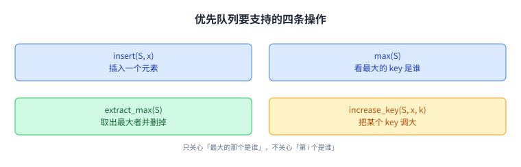
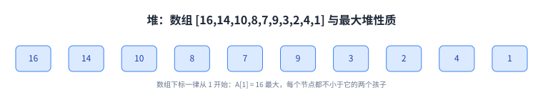
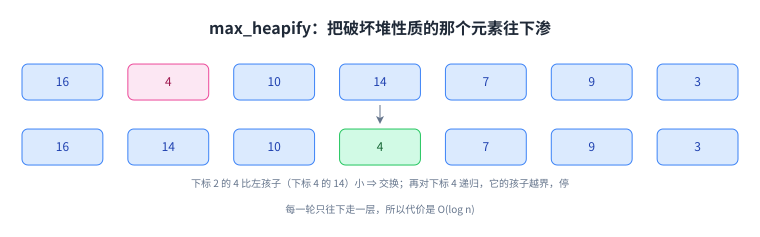
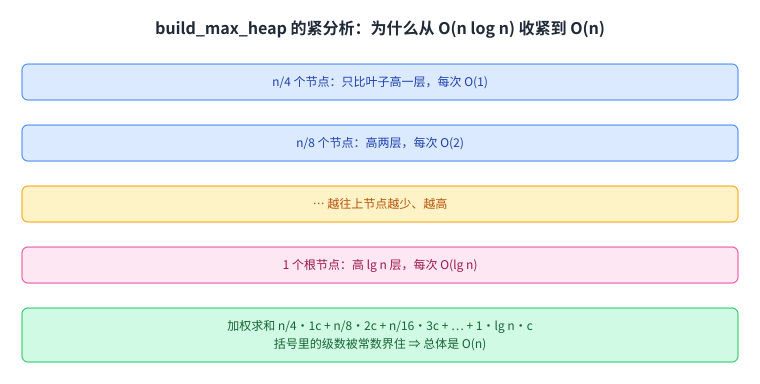
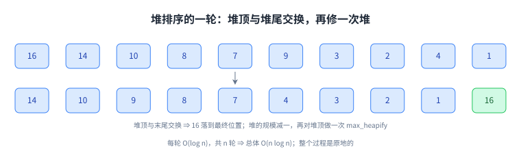

+++
title = "堆与堆排序"
lecture = 4
slug = "heaps-and-heap-sort"
status = "draft"
source_kind = "slides"
source_url = "https://ocw.mit.edu/courses/6-006-introduction-to-algorithms-fall-2011/resources/mit6_006f11_lec04/"
source_title = "Lecture 04: Heaps and heap sort"
output_mode = "explanation"
+++

前两讲的对象一直是数组：第 3 讲把它当成一排待排的数。这一讲换一个视角，把数组本身当成一种 [[term:data-structure]] 来设计，而它要满足的是一个很具体的新需求：随时能取出当前最大的那个元素。

讲义给出的路线是：先说要什么（优先队列），再给实现（堆），然后写两个基本操作（max_heapify 与 build_max_heap），最后用它们拼出[[term:heap-sort]]。这门课的实现仍然用 Python，教材是 CLRS。

## 一、这一讲要解决什么：先要一个优先队列

讲义开场定义的不是堆，而是需求：

> 原文：A data structure implementing a set S of elements, each associated with a key, supporting the following operations: insert(S, x); max(S); extract_max(S); increase_key(S, x, k).

翻译过来：有一个集合 S，每个元素带一个 key（键），这个结构要支持四件事：插入一个元素；看当前最大的 key 是谁；把最大 key 的元素取出来（并删掉）；把某个元素的 key 调大。讲义给这四件事起的名字合起来就是这个结构的名字：[[term:priority-queue]]。它是一种 [[term:queue]]：元素按优先级排队，先出去的往往不是最早进来的那个，而是最要紧的那个。

优先队列和普通数组的区别在于关心什么：数组关心「第 i 个是谁」，优先队列只关心「最大的那个是谁」。要的东西一变，实现方式就跟着变，这一讲的后半段都在做这件事。顺带记一句课外的话：Python 的 `heapq`、C++ 的 `priority_queue`、Java 的 `PriorityQueue` 都是它的实现；第 16 讲的 Dijkstra 也整个架在它上面，那个「每轮取出当前最小的顶点」的动作，正是靠它才从一次 Θ(n) 的扫描降到 O(log n)。

四件事都围着「最大」转：能插进去、能看最大、能取走最大、还能把某个 key 调大。

## 二、堆：用数组表示一棵近似完全的二叉树

[[term:heap]]是优先队列的一种实现。讲义对它的描述是两层：

> 原文：Implementation of a priority queue. An array, visualized as a nearly complete binary tree. Max Heap Property: The key of a node is ≥ than the keys of its children.

意思是：它骨子里还是一个 [[term:array]]（所以没有额外内存开销），但我们把它看成一棵几乎填满的二叉树；同时要求每个节点的 key 不小于它两个孩子的 key，这条叫[[term:heap-property]]（讲义讲的是最大堆，反过来的叫最小堆）。讲义给的例子是一段 10 个元素的数组 \([16, 14, 10, 8, 7, 9, 3, 2, 4, 1]\)。

注意讲义特意声明的一点：它的数组下标一律从 1 开始。这不是风格问题，下一节的公式要靠它。

这张图里最该盯住的是「每个节点都不小于它的两个孩子」这条约束，它把一棵树压进了一个数组。

## 三、堆当树看：三个公式，一根指针都不需要

既然「看成树」，父子关系怎么找？讲义给了三个式子，并且强调下标 [[term:index]] 从 1 开始：

> 原文：root of tree: first element in the array, corresponding to i = 1; parent(i) = i/2; left(i) = 2i; right(i) = 2i+1. No pointers required! Height of a binary heap is O(lg n).

三个式子都是下标之间的算术：父亲是 i/2（向下取整），左孩子是 2i，右孩子是 2i+1。所以堆不需要指针，数组的下标本身就编码了树的结构，这是它省内存的原因。

为什么算术能对上树？因为「近似完全」意味着元素是从上到下、从左到右一格一格填满的，中间没有空位。有空位的话，2i 就不再恰好是左孩子了。最后一句同样重要：树高（[[term:height]]）是 O(lg n)，这决定了后面每个操作最多往下走多少层。

三个公式合起来说明一件事：这棵树不需要被存下来，它随时可以从数组推出来。

## 四、max_heapify：只修一处违规

有了结构，接下来是两个操作。第一个解决「某处的堆性质被破坏了怎么办」，讲义写得很清楚：

> 原文：Assume that the trees rooted at left(i) and right(i) are max-heaps. If element A[i] violates the max-heap property, correct violation by "trickling" element A[i] down the tree, making the subtree rooted at index i a max-heap.

前一句是前提：只允许「其他部分都是好的，只有 A[i] 这一处坏了」。做法是把 A[i] 往下渗：看看它和两个孩子谁最大，如果孩子更大就交换，然后换到孩子的位置上继续渗。伪代码（讲义第 11 页）就是这三步：找出 i、left(i)、right(i) 里最大的那个下标 largest；如果 largest 不是 i，就交换 A[i] 与 A[largest]，再对 largest 递归调用一次。

拿一个例子走一遍（这个例子是我们自己造的，讲义用的是图）：数组 \([16, 4, 10, 14, 7, 9, 3]\) 里，除下标 2 之外都是最大堆，下标 2 的 4 比它的左孩子（下标 4 的 14）小。于是交换下标 2 与下标 4，得到 \([16, 14, 10, 4, 7, 9, 3]\)；再对下标 4 递归，它的孩子下标 8、9 已经超出数组，停止。

代价是 O(log n)：每一轮往下走一层，而树高是 O(lg n)。讲义在第 10 页也是这么标的。

这张图里只坏了一处（下标 2 的 4），而修的方法也只是沿着一条路径往下走，不走回头路。

## 五、build_max_heap：第一次分析给 O(n log n)，更紧的分析给 O(n)

第二个操作是把一个无序数组整个变成堆：

> 原文：Build_Max_Heap(A): for i = n/2 downto 1 do Max_Heapify(A, i). Time = O(n log n) via simple analysis. Why start at n/2? Because elements A[n/2 + 1 … n] are all leaves of the tree.

两处值得停下来看。一是为什么从 n/2 开始：数组后半段全是叶子，而单个叶子本来就满足堆性质，不用修。二是有个便宜的初步分析：循环跑大约 n/2 次，每次 O(log n)，乘起来 O(n log n)。

讲义接着做了第二次、更仔细的分析，结论是 O(n)。理由是越靠近底部的节点越矮，修它们的代价也越小：n/4 个节点只比叶子高一层，每次 O(1)；n/8 个节点高两层，每次 O(2)；一直到根节点只有一个，代价是 O(lg n)。

把这串加起来得到 \(n/4 \cdot 1c + n/8 \cdot 2c + n/16 \cdot 3c + \cdots + 1 \cdot \lg n \cdot c\)。讲义令 \(n/4 = 2^k\) 化简，括号里变成 \(1/2^0 + 2/2^1 + 3/2^2 + \cdots + (k+1)/2^k\)，而这个级数被一个常数界住，所以总和是 O(n)。

这是这一讲最漂亮的一处：第一遍分析没错，但它给的是上界而不是紧的界；把「每个节点的代价不一样」这一点算进去，结论就从 O(n log n) 变成 O(n)。

这张图按「离叶子多高」给节点分了层，每层的人数乘以每人的代价，最后得到一个被常数界住的级数。

## 六、堆排序：把最大的换到末尾，再修一次堆

有了 O(n) 的建堆和 O(log n) 的修补，排序就很直接了。讲义把策略写成四步：

> 原文：1. Build Max Heap from unordered array; 2. Find maximum element A[1]; 3. Swap elements A[n] and A[1]: now max element is at the end of the array! 4. Discard node n from heap (by decrementing heap-size variable).

读法是：堆顶就是当前最大的元素，把它和堆的最后一个元素交换，最大的那个就落在了最终位置上；然后把堆的规模减一（那个位置不再属于堆），再对新堆顶调用一次 max_heapify。这一轮叫一次 [[term:iteration]]，重复下去，换出去的元素从右往左排好，堆则越来越小。

代价讲义第 27 页写得很直接：

> 原文：after n iterations the Heap is empty; every iteration involves a swap and a max_heapify operation; hence it takes O(log n) time. Overall O(n log n).

也就是 O(n) 建堆加上 n 次 O(log n) 的修补，总体 O(n log n)。和第 3 讲的归并排序比，两者同阶；但归并排序需要额外数组来合并，堆排序是原地的（这一句是我们补的：讲义这一讲没有和归并排序作对比）。

照这张图重复 n 轮，右边的绿色后缀会一直长到整段数组，排序就结束了。

## 读完应该能回答

- 优先队列要支持哪四件事，它和数组关心的东西差在哪里；
- 为什么堆可以用下标算术代替指针，这个技巧依赖树的什么形状；
- max_heapify 的前提是什么，它为什么只需 O(log n)；
- build_max_heap 为什么从 n/2 开始，为什么初步分析给 O(n log n) 而更紧的分析给 O(n)；
- 堆排序每一步在做什么，为什么总体是 O(n log n)，它比归并排序省在哪。

## 脉络回顾

这一讲把「数据结构」放到台前：同样是存一排数，数组关心位置，堆关心最大元。而堆这种结构的特点是把树编码进数组下标里，于是操作变成沿下标的算术行走。

要分清的是，堆不是排序算法：它先是优先队列的实现，堆排序只是「拿它反复取最大元」的一个副产品。往后凡是需要「反复取当前最大或最小」的场合，都会再见到它。

下一讲接着讲排序，但换一个角度：前面两讲的排序都靠比较，而如果再给数据附加一点信息，排序可以更快。

## 溯源

本讲的内容来自 MIT 6.006 Fall 2011 的 Lecture 4: Heaps and heap sort 讲义（28 页幻灯片；第 28 页是 OCW 版权页）。本讲的事实都能在上述讲义里逐条对上：优先队列的四条操作与原话；堆的数组表示、最大堆性质与 \([16, 14, 10, 8, 7, 9, 3, 2, 4, 1]\) 这个例子；下标从 1 开始这条约定；parent(i) = i/2、left(i) = 2i、right(i) = 2i+1 与「不需要指针」「高度 O(lg n)」；max_heapify 的前提、往下渗的做法与 O(log n)；build_max_heap 的循环、从 n/2 开始的原因、O(n log n) 的初步分析与 O(n) 的紧分析（含 \(n/4 \cdot 1c + n/8 \cdot 2c + \cdots\) 这一步与「括号里的级数被常数界住」）；堆排序的四步策略、交换与丢弃的做法、以及 O(n log n) 的总体代价。

讲义没有写的部分，以下是我们补的：这篇中文讲解本身（讲义是英文提纲），全部配图（讲义里的示意图一律重画，不转载），以及五处展开说明：

1. 为什么「近似完全」这个形状是下标算术能成立的前提（中间不能有空位）；
2. max_heapify 的完整走查例 \([16, 4, 10, 14, 7, 9, 3]\)：讲义用的是图形演示，文本层读不出它的数组，所以这个例子是我们自己造的；
3. 「第一遍分析给的是上界而不是紧的界」这个说法；
4. 堆排序与归并排序的对比（同阶，但堆排序原地）；
5. 三处指向课外的补白：这本讲义的实现语言是 Python、教材是 CLRS、以及 `heapq`（Python）与 `priority_queue`（C++）、`PriorityQueue`（Java）是同类实现的例子。

另外两处登记：一是「这一讲的代码用 Python、教材是 CLRS」这两句指向课程惯例的话，讲义本讲没有写；二是堆排序策略的第二步「Find maximum element A[1]」在最大堆里是显然的（堆顶就是最大元），我们的转述把它并进了读法里。
