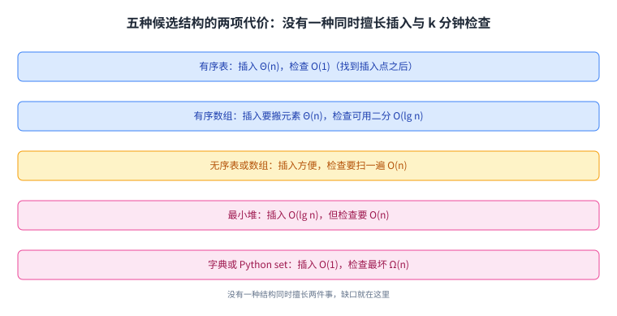
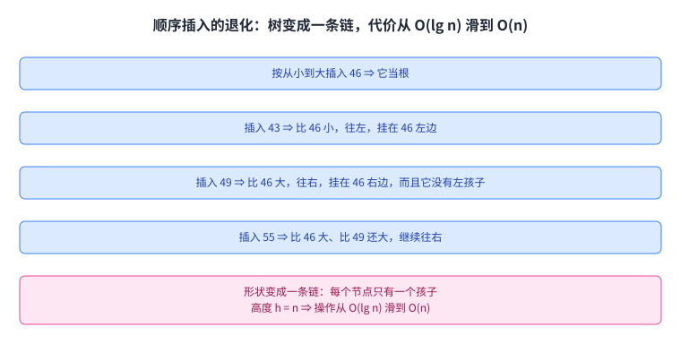

+++
title = "调度问题与二叉搜索树"
lecture = 5
slug = "scheduling-and-binary-search-trees"
status = "draft"
source_kind = "notes"
source_url = "https://ocw.mit.edu/courses/6-006-introduction-to-algorithms-fall-2011/resources/mit6_006f11_lec05/"
source_title = "Lecture 5: Scheduling and Binary Search Trees"
output_mode = "explanation"
+++

第 4 讲的结尾说「下一讲换一个角度」。这一讲真的换了一个角度：不再从数据结构出发，而是从一个真实需求出发，先把几种现成的结构摆出来比，发现都不够，才引出二叉搜索树。

而它的结尾相当特别：讲义自己反问一句「我们做成了吗」，然后给出一个反例，说明这棵树并不总是快。这门课的实现用 Python，教材是 CLRS。

## 一、这一讲要解决什么：给着陆请求排班

需求是这样的：机场要安排飞机着陆，每架飞机报一个想落的时刻。系统要维护一个集合 R，并且满足一条安全规则：任何两次着陆之间至少隔 k 分钟。讲义给的例子是：

> 原文：Request for time: 44 not allowed (46 ∈ R); 53 OK; 20 not allowed (already past)

也就是说，44 这个请求被拒绝，因为 R 里已经有一个 46，两者相差不到 k 分钟；53 可以接受；20 被拒绝，因为那个时刻已经过去了。讲义把规模记作 \(|R| = n\)，并给出目标：让这套系统在 O(lg n) 时间里运行。

朴素做法讲义也写了：把 R 维护成一个有序表，每来一个请求就逐个比一遍做 k 分钟检查，通过就追加进去再排一次序；要起飞时取最早的那个（也就是表头）。

这条流程里藏着一个瓶颈：插入新时刻这个动作，在有序表上并不便宜。

## 二、先别急，把几种结构摆出来比一比

讲义没有直接给答案，而是把候选结构一条条列出来，各自标上两项代价：插入要多少、k 分钟检查要多少。这一步比结论更有教学价值。讲义对五种结构的判断可以概括成两行：

> 原文：Actual insertion however requires shifting elements which requires Θ(n) time. … Dictionary or Python Set: Insertion is O(1) time. k minute check takes Ω(n) time.

也就是说：有序数组虽然能用[[term:binary-search]]在 O(lg n) 内找到插入点，但真正插进去要搬动 Θ(n) 个 [[term:array]] 元素；而字典或 Python 的 set 反过来，插入是 O(1)，检查却要 Ω(n)。

读法很直白：每一种结构都只擅长一半。有序表和有序数组擅长检查，但插入要搬家；无序结构擅长插入，检查却要扫一遍；[[term:heap]] 擅长插入、不擅长检查；[[term:dictionary]]（以及 Python 的 set）擅长插入、检查最坏是 Ω(n)。

还有一个特例：如果时刻都是整分钟，那开一个按时间索引的大数组就够了。但讲义马上说明这不通用（任意精度的时刻、以及还要检查降落宽度这类需求都不行），并给出这一节的关键结论：

> 原文：Key Lesson: Need fast insertion into sorted list.

**要的是「有序」加「能快速插进去」这两件事同时成立。** 这一讲后面的二叉搜索树，就是冲着这句话去的。这里的「有序」是 [[term:sorting]] 的产物，而难点在于不能为了保持它而每次搬家。

这张表的用法不是选一个最好的，而是看出缺口在哪：要同时快，就得换一种既能保持有序、又不用搬家的存法。

## 三、二叉搜索树：一条规则撑起一棵树

二叉搜索树（[[term:binary-search-tree]]）的规则只有一条，讲义用插入的例子把它讲清楚了：先插入 49 作为根；再插入 79，它比 49 大，就进右子树；插入 46，比 49 小，进左子树；插入 41，比 49 小、比 46 还小，继续往左；插入 64，比 49 大、比 79 小，落在 79 的左孩子位置。

规则可以一句话说清：**任何一个节点，它的左子树里全是比它小的元素，右子树里全是比它大的元素。** 于是「查找」变成一次沿树的下降：每一步只需要比较一次，就知道该往左还是往右。

而它和有序数组的关键差别在插入：数组插入要搬家，树插入只是接一个新叶子，原来那些节点一个都不用动。

把插入看成「沿一条路径走到空位」，也解释了为什么后面的代价都和树高有关：**一次操作要走的步数，就是这条路径的长度。**

## 四、树上的操作：都跟着高度走

讲义接着给了几个操作，它们有一个共同点。找最小值只要一直往左走，走到走不动为止；删除最小值就是先找到它再摘掉。找「下一个更大的元素」稍微讲究一点，讲义写的是：

> 原文：next-larger(x): if right child not NIL, return minimum(right) else y = parent(x); while y not NIL and x = right(y): x = y; y = parent(y); return(y).

也就是两种情形：如果 x 有右子树，那答案就是右子树里的最小值（一路往左）；否则就往上爬，直到爬到一个「自己不是它父亲的右孩子」的位置，那个父亲就是答案。

代价是这一节的总结句，也是这一讲最有用的一个记号：

> 原文：Complexity: All operations are O(h) where h is height of the BST.

**不是 O(lg n)，而是 O(h)**：h 是这棵树的[[term:height]]（高度）。查找、插入、找最小、找下一个更大，都是沿着一条路径走，所以代价都是树高的倍数。**记住这个「h」，第六节会回来找它算账。**

三种操作看着不同，走法其实是同一件事：沿一条从根到叶的路径往下或往上，所以代价都写成 O(h)。

## 五、新需求 Rank(t)：给树加上子树规模

前面那套系统跑起来之后，需求又来了一个新的：

> 原文：Rank(t): How many planes are scheduled to land at times ≤ t? … Cannot solve it efficiently with what we have but can augment the BST structure.

直接数一遍当然可以，但要 O(n)。讲义的做法是增强这棵树：在每个节点上多存一个数，也就是它左子树的[[term:subtree-size]]（规模），并在插入和删除时顺手维护。有了这个数，求 [[term:rank]] 就变成三步：

> 原文：1. Walk down tree to find desired time. 2. Add in nodes that are smaller. 3. Add in subtree sizes to the left. In total, this takes O(h) time.

意思是：沿着查找路径往下走，路上凡是比 t 小的节点都记一笔，同时把它左边的子树规模也加上。讲义给的例子算出来是 \(1 + 2 + 1 + 1 = 5\)，也就是「在 79 之前落地的有 5 架」。

这个做法的漂亮之处在于：增强没有改变结构，也没有改变代价的量级，还是 O(h)。

它说明了数据结构设计里常见的一招：结构不够用时，先在节点上多存一点信息，再看这一步能不能顺手维护。工程上，Java 的 TreeMap 与 C++ 的 std::map 就是「有序 + 快速插入」这类结构的现成例子（这一句是我们补的）。

## 六、反问自己：我们真的做成了吗

讲义的倒数第二页有一句很坦率的自问：

> 原文：Have we accomplished anything? Height h of the tree should be O(lg n).

「高度**应该**是 O(lg n)」这句话里，那个「应该」就是问题所在。因为二叉搜索树的形状完全由插入顺序决定：如果把 46、43、49、55 按从小到大插进去，每个新节点都比上一个更大，于是永远往右走，最后得到一条链，而不是一棵树。讲义的原话是：

> 原文：The tree in Fig. 7 looks like a linked list. We have achieved O(n) not O(lg n)!!

于是第四节的 O(h) 在这里变成了 O(n)：**同样是这棵树，最好情况下 h 是 lg n，最坏情况下 h 是 n。** 讲义把这件事留给了下一讲：

> 原文：Balanced BSTs to the rescue in the next lecture!

这一讲的落点就在这里：**二叉搜索树的代价不是一个数，而是一个随输入变化的量。** 它给了「有序 + 快速插入」这件事一个漂亮的解法，但这个解法有一个前提（树要长得均衡），而前提本身需要另外一套办法来保证。

对比一下第六节的两张图：树上的操作没变，变的只是形状，而代价从 O(lg n) 滑到了 O(n)。

## 读完应该能回答

- 调度系统要同时满足哪两件事，为什么「有序表」和「无序表」各只擅长一半；
- 二叉搜索树的规则是什么，为什么查找与插入都只是「沿一条路径走」；
- 为什么讲义把所有操作的代价写成 O(h) 而不是 O(lg n)；
- Rank(t) 用了什么增强，为什么增强之后代价的量级没有变；
- 什么输入会让这棵树退化成一条链，代价会变成多少。

## 脉络回顾

这一讲的形状和第 4 讲正好相反：第 4 讲先有结构（堆）再找用途，这一讲先有需求（排班）再挑结构，而且真的把候选结构逐条比较了一遍。**这种「先摆出所有选项、各自标代价」的做法，本身就是这门课想教的方法。**

要分清的是，这一讲的 O(h) 只是一个条件式的结论：它说的是「只要树高是 h，操作就是 O(h)」。而「怎么保证 h = O(lg n)」是下一讲（平衡二叉搜索树）的主题，这一讲只是把问题摆出来。

另外，这一讲第一次出现了[[term:linked-list]]：退化的 BST 和链表在形状上是同一件事，而代价也一样，都是 O(n)。

## 溯源

本讲的内容来自 MIT 6.006 Fall 2011 的 Lecture 5: Scheduling and Binary Search Trees 讲义（8 页 typed notes；第 8 页是 OCW 版权页）。本讲的事实都能在上述讲义里逐条对上：排班需求与 44/53/20 这组例子、\(|R| = n\) 与 O(lg n) 的目标；朴素的有序表做法；五种候选结构（有序表、有序数组、无序表、最小堆、字典或 Python set）各自的两项代价与原话；「整分钟」这个特例为什么不够通用，以及 Key Lesson；BST 的插入例 49/79/46/41/64 与左右子树规则；findmin 与 delete-min；next-larger 的伪代码与「所有操作 O(h)」；Rank(t) 的需求、子树规模增强与三步算法、1+2+1+1=5 这个例子；以及最后顺序插入退化成链、`We have achieved O(n) not O(lg n)!!` 与「下一讲靠平衡 BST」这句预告。

讲义没有写的部分，以下是我们补的：这篇中文讲解本身（讲义是英文提纲），全部配图（讲义里的示意图一律重画，不转载），以及四处展开说明：

1. 为什么「插入」在这棵树上是「接一个新叶子」而不用搬动已有节点；
2. 「一次操作要走的步数就是路径长度」这个说法，以及它与 O(h) 的关系；
3. Rank(t) 增强之后「量级没有变」这个评价；
4. 与第 4 讲的对照，以及「这一讲的结论是条件式的」这个提醒。

另外三处登记：一是讲义提到「本讲 BST 的 Python 代码见某链接」，本页只转述这一点，没有引用链接内容；二是「Java 的 TreeMap、C++ 的 std::map 都是有序表」这类工程例子是我们补的，讲义没有写；三是 `next-larger` 这个操作名沿用讲义原词（其他教材多叫后继 successor）。
