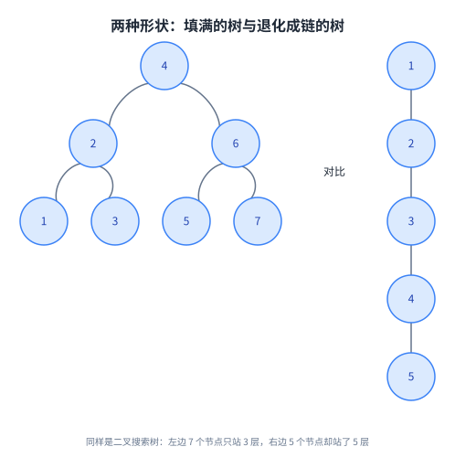
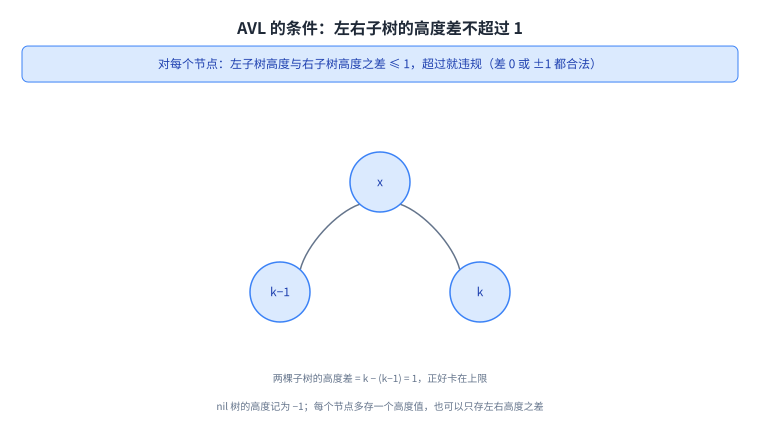
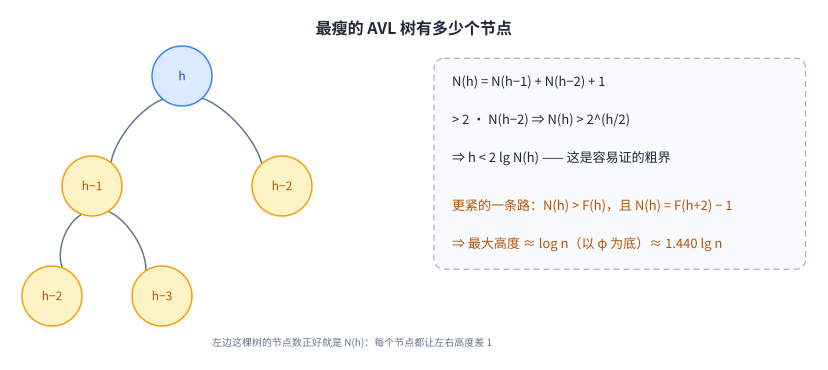
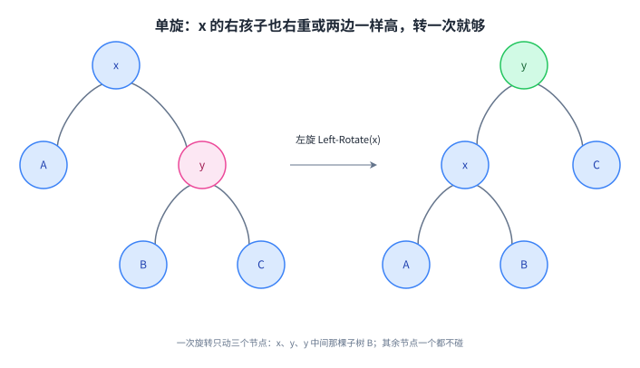
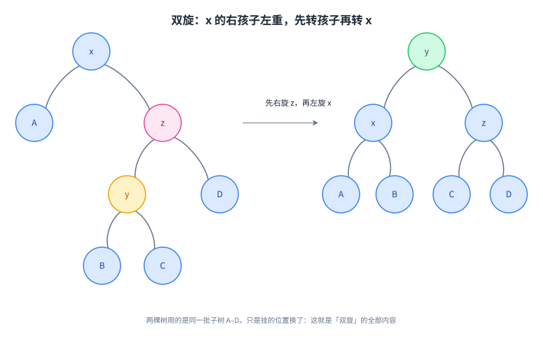
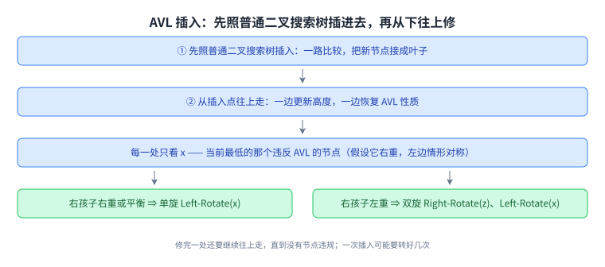
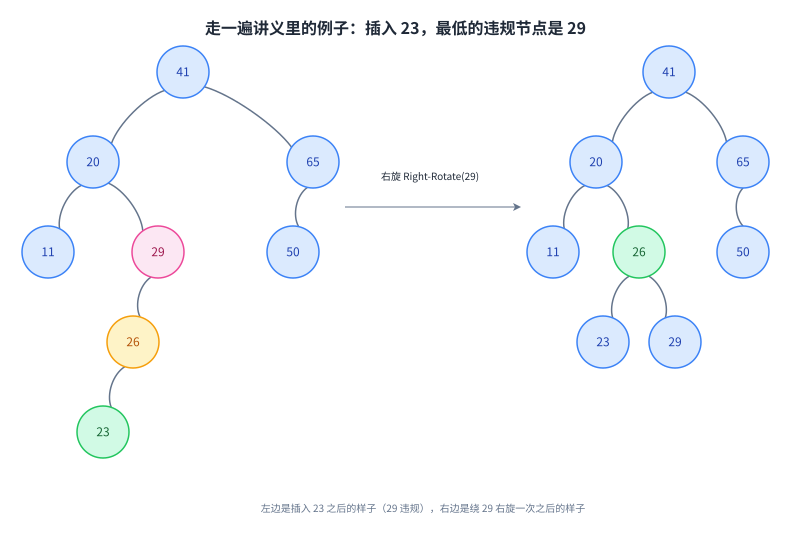

+++
title = "平衡二叉搜索树与 AVL"
lecture = 6
slug = "avl-trees-avl-sort"
status = "draft"
source_kind = "notes"
source_url = "https://ocw.mit.edu/courses/6-006-introduction-to-algorithms-fall-2011/resources/mit6_006f11_lec06/"
source_title = "Lecture 06: AVL trees, AVL sort"
output_mode = "explanation"
+++

第 5 讲结尾留了一个缺口：二叉搜索树的所有操作都是 O(h)，而 h 完全由插入顺序决定，顺序不好时 h 会从 lg n 一路滑到 n。这一讲要解决的就是这个缺口，办法不是换一个数据结构，而是把树的结构本身管起来，让 h 始终是 O(lg n)。

讲义给的路线是：先说平衡为什么重要；然后给一个具体的平衡条件（AVL 树）；接着算清楚在最瘦的形状下树最多能有多高；再给出修形状的工具（旋转）和用它修插入过程（AVL insert）；末尾一层一层往上收，讲抽象数据类型与数据结构的关系，以及「同一个接口可以有很多种实现」。这门课仍然用 Python 实现，教材是 CLRS。

## 一、这一讲要解决什么：把 h 从 n 拉回 lg n

先复习节点长什么样。讲义在第 1 页把 [[term:binary-search-tree]] 重新列了一遍：

> 原文：rooted binary tree; each node has — key, left pointer, right pointer, parent pointer.

每个节点上有四样东西：一个 key 和三个指针（左、右、父）。第 5 讲只用到左和右；父指针是为了能往上走，这一点马上就用得上，因为 AVL 插入要「从下往上修」。

那个排序约束也再抄一遍（讲义第 2 页的 Fig. 2）：任何一个节点，左子树里全是比它小的元素，右子树里全是比它大的元素。

然后是这一讲所有数字的地基，两个定义性的句子：

> 原文：height of node = length (# edges) of longest downward path to a leaf (see CLRS B.5 for details).

[[term:height]] 数的是边数，不是节点数。从某个节点往下走到叶子，最长的那条路径上有几条边，它的高度就是几。叶子没有向下的边，所以叶子高度是 0；空树（nil）的高度被规定为 −1。后一个约定是 AVL 的条件能用整数写出来的原因。

> 原文：BSTs support insert, delete, min, max, next-larger, next-smaller, etc. in O(h) time, where h = height of tree (= height of root).

讲义在这里列了六个操作：插入、删除、找最小、找最大、找下一个更大、找下一个更小。它们的内容完全不同，代价写法却一模一样，都是 O(h)。这里的 h 指整棵树的高度，也就是根的高度。

接着是这一讲的关键转折，讲义连着给了三句：

> 原文：h is between lg n and n: Fig. 3. balanced BST maintains h = O(lg n) ⇒ all operations run in O(lg n) time.

h 的取值范围是从 lg n 到 n。填满的树里 h 只有 lg n 上下，而如果每次插入的元素都比上一个大，树就长成一条链，h 变成 n。[[term:balanced-tree]] 说的就是前一种情形：只要维持 h = O(lg n)，上面那六个操作就全都变成 O(lg n)。

这张图对比的不是两种算法，而是同一套操作的两种前提：形状决定 h，h 决定所有操作的代价。

## 二、AVL 树的条件：左右子树的高度差不超过 1

讲义把这一节的名字写成两个人和一个年份，姿态很明确：这是一个有出处的具体方案，不是「随便平衡一下」。

> 原文：AVL Trees: Adel'son-Vel'skii & Landis 1962. For every node, require heights of left & right children to differ by at most ±1.

[[term:avl-tree]] 的条件只有这一句：对每一个节点，它左子树的高度和右子树的高度最多差 1。差 0 合法，差 ±1 合法，差 2 就违规 —— 而违规的位置必须被修好。

讲义紧接着补两条实现上的约定：

> 原文：treat nil tree as height -1. each node stores its height (DATA STRUCTURE AUGMENTATION) (like subtree size) (alternatively, can just store difference in heights).

第一条是给空树定一个高度，取 −1 而不是 0，这样「只有一个孩子的节点」的高度也能用同一条公式算，不必为缺孩子写特例。

第二条是这一讲唯一一处改动数据结构的动作：每个节点多存一个自己的高度，讲义把它明确标成 DATA STRUCTURE AUGMENTATION（数据结构的增强），并提醒这和第 5 讲存的[[term:subtree-size]]是同一招。存的代价是插入和删除时每一步都要顺手维护它；讲义也给了省一点内存的变体：不存高度，只存左右高度之差。

这张图展示的是「刚好达标」的样子：差 1 已经贴在条件上，再多一层就违规。

## 三、最瘦的 AVL 树有多高

条件说完了，接下来要回答的是代价：AVL 树里 h 到底能有多大？讲义问的是反面，也就是「节点最少的那种 AVL 树长什么样」。

> 原文：Worst when every node differs by 1 — let Nh = (min.) # nodes in height-h AVL tree.

节点最少的情形是每个节点的左右高度差都取到 1。讲义把「高度为 h 的 AVL 树里最少有多少个节点」记作 Nh，然后推出递推式：

> 原文：⇒ Nh = Nh−1 + Nh−2 + 1，> 2Nh−2，⇒ Nh > 2 的 h/2 次方，⇒ h < 2 lg Nh。

读法是：一个高度 h 的节点，最少的情况是孩子高度取 h−1 和 h−2，各自又要是同类的子树，所以 Nh = Nh−1 + Nh−2 + 1；把右边放缩成两个 Nh−2，就得到 Nh > 2·Nh−2，一路展开就是 2 的 h/2 次方，两边取对数得到 h < 2 lg Nh。

这个式子已经说明 h 是对数级的，但讲义觉得 2 这个常数太大，又走了一条更精确的路：

> 原文：Alternatively: Nh > Fh (nth Fibonacci number). In fact Nh = Fn+1 − 1 (simple induction). Fh = φh/√5 rounded to nearest integer where φ = (1+√5)/2 ≈ 1.618 (golden ratio). • =⇒ max. h ≈ logφ n ≈ 1.440 lg n.

也就是说这类最瘦的树节点数长得像[[term:fibonacci-number]]，而斐波那契数的通项里带着 [[term:golden-ratio]] φ ≈ 1.618。换底之后，最大的高度是 logφ n，约等于 1.440 lg n。

这里有一处要就地说明。铅印讲义写的是 \(N_h = F_{n+1} - 1\)：下标用了 n，而它上一行和下面两行用的都是 h。同一讲的手写原稿在同一个位置写的是 \(N_h = F_{h+2} - 1\)。两份对不上，而按手写稿的下标验算能对上：取 \(F_0 = F_1 = 1\)，则 \(N_0 = 1\)、\(N_1 = 2\)、\(N_2 = 4\)、\(N_3 = 7\)，与 \(N_h = N_{h-1} + N_{h-2} + 1\) 完全一致。所以我们照录铅印版的下标，把它标注为铅印版的笔误，不静默改源；配图里用的是手写稿那一版。

另外，2 lg n 与 1.440 lg n 这两个数并不矛盾：前者是放缩出来的粗界，后者才是这类树真正的高度量级。

左边这棵树就是那种最瘦的形状，右边的框里是它的节点数怎么增长、高度被压到什么量级。

## 四、旋转：只动三个节点，把高度差修回来

到这里条件有了、代价有了，剩下的问题是「违规了怎么修」。讲义的回答只在图里：第 4 页的文字只写「follow steps in Fig. 5」「follow steps in Fig. 6」，具体动作全在两张图里。所以下面这一段的动作描述是我们照着图读出来的转述。

先看第一张图（Fig. 5）适用的情况：x 右重，而且 x 的右孩子 y 也右重、或者 y 的两边一样高。这时绕 x 做一次[[term:rotation]]：

> 原文：Left-Rotate(x)

一次左旋之后，y 升上来接替 x 的位置，x 变成 y 的左孩子，y 原来的左子树 B 换给 x 当右子树。看形状就知道为什么够用：这么一转，原来「右边比左边高 2」的差被摊平了。

第二张图（Fig. 6）管的是另一种情况：x 也是右重，但它的右孩子 z 是左重的，也就是 z 的左边比右边高。这时候一次旋转不够，讲义给的动作是两步：

> 原文：Right-Rotate(z) / Left-Rotate(x)

先绕 z 右旋（把 z 的左孩子 y 提上来），再绕 x 左旋（把 y 再提到 x 上面）。两步之后 y 成为这棵子树的根，x 与 z 各自分到两棵子树。

一次旋转碰到的只有三个节点（x、y 和 y 中间那棵子树），所以它是常数时间的一步；修高度差靠的就是这种小手术。

先转孩子再转 x，看起来多了一步，但两边的子树还是 A、B、C、D 这四棵，只是挂的位置换了。

## 五、AVL 插入：先插进去，再往上修

有了旋转这个工具，插入分两步就够了：

> 原文：AVL Insert: 1. insert as in simple BST. 2. work your way up tree, restoring AVL property (and updating heights as you go).

第一步和第 5 讲的插入完全一样：一路比较，把新节点接成叶子。第二步是新东西：从接上去的地方往回走，一边更新沿途节点的高度，一边把违规的地方修好。父指针在这里派上用场，没有它就上不去。

那「修」具体要判断什么？讲义把每一处要做的判断列成一个清单：

> 原文：Each Step: • suppose x is lowest node violating AVL • assume x is right-heavy (left case symmetric) • if x's right child is right-heavy or balanced: follow steps in Fig. 5 • else: follow steps in Fig. 6 • then continue up to x's grandparent, greatgrandparent . . .

这份清单有五条：先假定 x 是当前最低的那个违规节点；再假定它是[[term:right-heavy]] 的（左重的情形左右镜像，讲义用一句 left case symmetric 带过）；然后分两种分支 —— x 的右孩子右重或平衡就走 Fig. 5 的单旋，否则走 Fig. 6 的双旋；最后修完一处不能停下，要接着往爷爷、太爷爷那一层走。

讲义在这里放了两条注释，都是要紧的提醒：

> 原文：Comment 1. In general, process may need several rotations before done with an Insert. Comment 2. Delete(-min) is similar — harder but possible.

第二条说的是删除：做法和插入相像，但更难，不过做得成。这一讲没有展开删除，只把结论摆在这里。

这张图把上面那份清单画成了流程：分支只有两个出口，所以「修」这件事其实没有多少花样。

## 六、走一遍讲义的两个例子

讲义用同一棵 8 个节点的树演示了两轮插入，key 是 41、20、65、11、29、50、26，加进去的分别是 23 和 55。

第一轮插入 23。插完之后最低的违规节点是 29：它的左孩子 26 下面又多了一层，左边比右边高 2。讲义在图上标出这是 left-left 情形，也就是 x 和它的左孩子都偏左。修法是绕 29 做一次右旋，26 升上来当 20 的左孩子，23 和 29 变成 26 的两个孩子。修完这一处，整棵树不再有违规节点。

> 原文：Insert(23) x = 29: left-left case … Done

第二轮插入 55。它接在 50 的右边，于是 65 变成了左边高 2。这次最低的违规节点是 65，而它的左孩子 50 是右重的 —— 讲义管这种叫 left-right 情形。修法正是第四节的双旋：先绕 50 左旋，再绕 65 右旋，55 升上来，50 和 65 变成它的两个孩子。

> 原文：Insert(55) … x=65: left-right case … Done

讲义在这两轮里标了每个节点的高度：插入 23 之前是 41 的高度 3、20 是 2、65 是 1、11 是 0、29 是 1、26 是 0、50 是 0；插入 23 之后 26 变成 1、29 变回 0；插入 55 之后 65 涨到 2、50 是 1、55 是 0，修完是 41 的高度 3、20 是 2、55 是 1、50 是 0、65 是 0。这些数字不是装饰：每次旋转的判据就是这些高度之间的差。

两边树的 key 完全一样，变的只是形状；「违规」和「修好」都只体现在高度标注上。

## 七、AVL sort，以及同一个接口的很多种实现

排序这件事这一讲又出现了一次，名字叫 [[term:avl-sort]]，但理由和第 3 讲不一样。讲义给的两步是：

> 原文：AVL sort: • insert each item into AVL tree Θ(n lg n) • in-order traversal Θ(n)

换成中文：把所有元素逐个插进 AVL 树，一共 n 次插入，每次 O(lg n)，合起来 Θ(n lg n)；然后按[[term:in-order-traversal]] 把树读一遍，得到的就是排好序的序列，花 Θ(n)。两项相加仍是 Θ(n lg n)。

这里要就地说明一处：讲义在第二行旁边画了一个花括号，把两行括起来写总计 Θ(n lg n)。我们用的抽取器把这个总计读到了第二行下面，于是文本层看起来像「中序遍历 Θ(n lg n)」，那是抽取顺序造成的，不是讲义自相矛盾。

把它和第 3 讲的归并排序放在一起看：两者同阶，但 AVL 树是边插边有序的，排序只是它顺手做的第一件事。

讲义没有停在这里，它把镜头拉开，列了一份同期平衡搜索树的名单，一共 8 条，每条都带作者和年份：

> 原文：AVL Trees Adel'son-Velsii and Landis 1962; B-Trees/2-3-4 Trees Bayer and McCreight 1972 (see CLRS 18); BB[α] Trees Nievergelt and Reingold 1973; Red-black Trees CLRS Chapter 13; (A) — Splay-Trees Sleator and Tarjan 1985; (R) — Skip Lists Pugh 1989; (A) — Scapegoat Trees Galperin and Rivest 1993; (R) — Treaps Seidel and Aragon 1996.

后四条前面那两个标记是代价的另一种来源：(R) 表示用随机数做决定，让结论「以高概率」成立，属于 [[term:randomized-algorithm]] 那一类；(A) 表示[[term:amortized-analysis]]，也就是把若干个操作的代价加在一起算，平均下来很快。讲义顺手指了路：Splay-Trees 到今天还是研究题目，可以接着看 6.854（Advanced Algorithms）和 6.851（Advanced Data Structures）。这份名单里今天最眼熟的大概是红黑树，Linux 内核和 Java 的 TreeMap、C++ 的 std::map 用的都是它的变体。

最后是讲义真正想留下的那层话。它把两个词分开定义：

> 原文：Abstract Data Type(ADT): interface spec. vs. Data Structure (DS): algorithm for each op. There are many possible DSs for one ADT.

[[term:abstract-data-type]]（讲义把它缩写为 ADT）是一份接口说明，说的是「有哪些操作、各自什么语义」，不提怎么实现；[[term:data-structure]] 则是每个操作的具体算法。同一个 ADT 可以有很多种 DS。讲义没有只讲道理，它拿两张表把这件事钉住了，表里是同一个接口的两种实现：

| Priority Queue ADT（第 4 讲的例子） | heap | AVL tree |
| --- | --- | --- |
| Q = new-empty-queue() | Θ(1) | Θ(1) |
| Q.insert(x) | Θ(lg n) | Θ(lg n) |
| x = Q.deletemin() | Θ(lg n) | Θ(lg n) |
| x = Q.findmin() | Θ(1) | Θ(lg n) → Θ(1) |

| Predecessor/Successor ADT | heap | AVL tree |
| --- | --- | --- |
| S = new-empty() | Θ(1) | Θ(1) |
| S.insert(x) | Θ(lg n) | Θ(lg n) |
| S.delete(x) | Θ(lg n) | Θ(lg n) |
| y = S.predecessor(x)（也就是 next-smaller） | Θ(n) | Θ(lg n) |
| y = S.successor(x)（也就是 next-larger） | Θ(n) | Θ(lg n) |

两张表读下来是同一个意思：[[term:heap]] 和 AVL 树都能当[[term:priority-queue]]用（优先队列本身是一种[[term:queue]]，先出去的往往不是最早进来的那个），但如果接口里再要一个「找前驱/后继」，堆立刻退化到 Θ(n)，而 AVL 树还是 Θ(lg n)。表里唯一带箭头的那格是讲义自己标的一处改进：AVL 树的 findmin 原本要 Θ(lg n)，但既然树已经平衡，只要一直往左走就能到最小值，所以可以做到 Θ(1)（这一步展开是我们补的，讲义只写了那个箭头）。

## 读完应该能回答

- 为什么「平衡」是一个要求而不是一种做法，它把哪些操作一起变快了；
- AVL 的条件是什么，nil 的高度为什么定成 −1，每个节点多存的那个数有什么用；
- 最瘦的 AVL 树节点数为什么按斐波那契增长，2 lg n 与 1.440 lg n 各是什么；
- 单旋和双旋各在什么情况下用，一次旋转动到几个节点；
- AVL 插入为什么必须从下往上走，修完一处为什么不能停下；
- 讲义为什么把 ADT 和 DS 分开讲，同一个接口的两种实现在哪一格上分了高下。

## 脉络回顾

这一讲补上了第 5 讲留下的洞。第 5 讲把结论写成 O(h) 并证明 h 的最坏值是 n；这一讲给了一个能保证 h = O(lg n) 的条件，于是同一个 O(h) 变成了 O(lg n)。两讲合起来才是完整的一句话：二叉搜索树的代价不取决于元素个数，而取决于形状，形状可以被管住。

要分清的是三类东西的位置。AVL 的**条件**是一条定义（左右高度差不超过 1）；**旋转**是修条件的工具（一次只动三个节点）；**AVL insert** 是把两者串起来的流程（先插，再从下往上修）。第三讲和第四讲也出现过「增强节点上的信息」这一招，这一讲用的是高度，第 5 讲用的是子树规模。

往后看，这一讲的落点在讲义自己的总结里：ADT 与 DS 是两件事，而平衡搜索树是「同一个接口可以有很多种实现」这句话最扎实的例子。第八讲之后还会再出现哈希表，那是同一个问题的另一种回答。

## 溯源

本讲的内容来自 MIT 6.006 Fall 2011 的 Lecture 6: AVL trees, AVL sort 讲义（8 页 typed notes；第 8 页是 OCW 版权页，正文 7 页）。本讲的事实都能在上述讲义里逐条对上：第 1 页的节点四件套（key 与三个指针）与课程总览的五条；第 2 页的 BST 性质、高度按边数定义与「见 CLRS B.5」、六个操作 O(h)、h 在 lg n 与 n 之间、平衡 BST 维持 h = O(lg n) 于是所有操作 O(lg n)；第 3 页的 AVL 出处与年份、高度差不超过 ±1、nil 高度 −1、节点存高度（DATA STRUCTURE AUGMENTATION，与子树规模同类，或只存高度差）、Nh = Nh−1 + Nh−2 + 1 > 2Nh−2、Nh > 2 的 h/2 次方、h < 2 lg Nh、斐波那契那条路、Fn+1 − 1、φ ≈ 1.618 与 1.440 lg n；第 4 页的 AVL Insert 两步、Each Step 的五条、Fig. 5 的 Left-Rotate(x)、Fig. 6 的 Right-Rotate(z) 与 Left-Rotate(x)、以及两条 Comment；第 5 页 Fig. 7 的两个例子（Insert(23)、x = 29 的 left-left 情形、Insert(55)、x = 65 的 left-right 情形）与图上的高度标注；第 6 页的 AVL sort 两行与花括号总计、8 条平衡搜索树名单（含年份、CLRS 18 与 CLRS Chapter 13、(R) 与 (A) 的含义、6.854 与 6.851）；第 6、7 页的 ADT 与 DS 定义、两张表（Priority Queue ADT 与 Predecessor/Successor ADT，heap 与 AVL tree 两列、四个与五个操作各自的代价、findmin 那一格的 Θ(lg n) → Θ(1)）。另外，这一页里唯一一处读不通的地方（第 3 页的斐波那契下标）已用同一讲的手写原稿交叉核对，见下方登记第一条。

### 我们补的

讲义没有写的部分，以下是我们补的：这篇中文讲解本身（讲义是英文提纲），全部配图（讲义里的 Figure 1–7 一律重画，不转载），以及八处展开说明：

1. 为什么旋转是常数时间的一步（讲义只在图里画了动作，没有给这一句代价结论）；
2. 「一次旋转只动三个节点，其余节点一个都不碰」这个说法；
3. 双旋为什么必须先转孩子（先 Right-Rotate(z) 再 Left-Rotate(x)）——讲义只列了两个动作，没有解释顺序的理由；
4. 第 1 页那个 DSL 式清单里「父指针」的用处：它被第 5 节解释为「没有它就上不去」，讲义没有把两处连起来；
5. 第 3 节末尾「2 lg n 是粗界、1.440 lg n 才是真正的高度量级」这个比较，以及「黄金比例出现在这里是因为节点数按斐波那契增长」这条因果；
6. 第 6 节把 Fig. 7 里散落的高度标注按节点整理成一行文字（讲义把它们标在图上，文本层读不出对应关系，我们对着渲染出的页面逐点核对过）；
7. 第 7 节里 ADT 与 DS 那段话用第 4 讲的优先队列落地，以及「接口里多要一个前驱/后继，堆就退化到 Θ(n)」这个读法；
8. 四处指向课外的补白：这门课的实现语言是 Python、教材是 CLRS，以及红黑树在 Linux 内核、Java 的 TreeMap、C++ 的 std::map 里的使用。

### 另外的四处登记

另外四处登记。一是**铅印讲义的笔误，并已用手写原稿交叉核对**：铅印版第 3 页写的是 \(N_h = F_{n+1} - 1\)，下标用了 n，而上下文一律用 h；同一讲的手写原稿（`mit6_006f11_lec06_orig`）在同一处写的是 \(N_h = F_{h+2} - 1\)。按手写稿的下标验算与递推式自洽（取 \(F_0 = F_1 = 1\)，则 N(0) = 1、N(1) = 2、N(2) = 4、N(3) = 7），所以我们照录铅印版的下标并就地标注它不一致，配图用的是手写稿那一版。二是**抽取器造成的一处假象**：AVL sort 那句总计的花括号被文本抽取器读到了第二行旁边，看起来像「中序遍历 Θ(n lg n)」，我们对照渲染页核过之后在正文里说明了。三是讲义第 7 页把 `new-empty-queue` 这个构造函数名沿用自第 4 讲的优先队列，表头写的却是 Predecessor/Successor ADT，我们没有替它改名。四是本讲只覆盖铅印讲义正文 7 页；手写原稿（8 页，没有文本层，逐页渲染后读）只用于上面第一处的核对，OCW 资源页上的代码包（`lec06_code`）本次没有使用。
