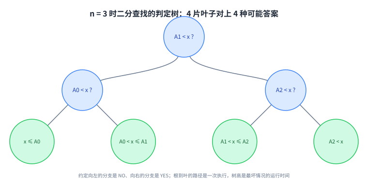
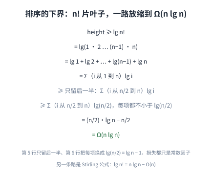
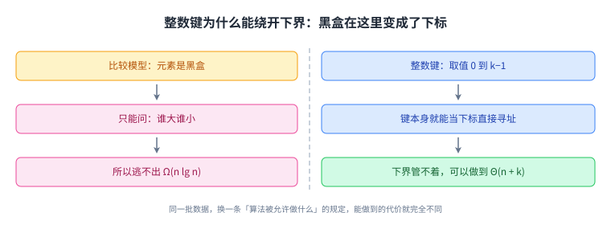
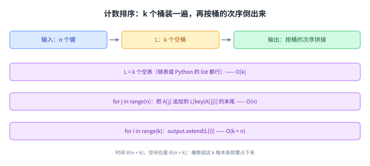
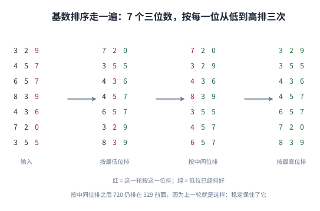
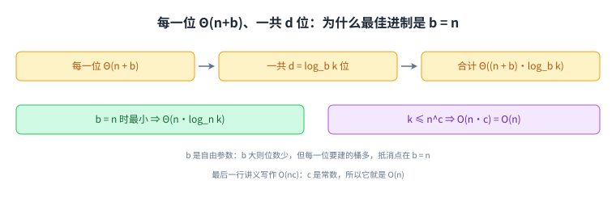

+++
title = "计数排序、基数排序与下界"
lecture = 7
slug = "counting-radix-sort-lower-bounds"
status = "draft"
source_kind = "notes"
source_url = "https://ocw.mit.edu/courses/6-006-introduction-to-algorithms-fall-2011/resources/mit6_006f11_lec07/"
source_title = "Lecture 07: Counting sort, radix sort, lower bounds for sorting and searching"
output_mode = "explanation"
+++

第 3 讲到第 5 讲都在做[[term:sorting]]，而且都用同一种办法决定先后：比一比。这一讲把这件事本身当成研究对象，问的是：如果一个算法只被允许比较，它能做到多快？

这个问题有两个方向的答案。对[[term:comparison-sort]]来说有一个天花板（[[term:lower-bound]]），而对整数键来说这个天花板可以绕开（计数排序、基数排序）。

## 一、这一讲要解决什么：比较排序的天花板在哪里

讲义第 1 页的目录只有三行，逐条抄下来是：比较模型；两条下界（查找 Ω(lg n)、排序 Ω(n lg n)）；对小整数的 O(n) 排序算法（计数排序、基数排序）。三行的次序就是这一讲的结构：先规定算法只被允许做什么，再把这个规定的代价算到底，最后给数据附加一点信息、跳出这个规定。

讲义标题页写的是 Linear-Time Sorting，而第 1 页目录里那句 for small integers 是全部余地所在。


读这张图要顺着箭头看：左格是限制，中格是限制的后果，右格是绕开限制之后的收获。第三格不是第一格的反例，而是换了前提之后的另一套办法。

## 二、比较模型：把元素当成黑盒

讲义对这个模型的定义只有三条：

> 原文：input items are black boxes (ADTs); only support comparisons (<, >, ≤, etc.); time cost = # comparisons

输入的元素是黑盒（ADT），算法只能对它们做比较（<、>、≤ 之类），而代价记作比较次数。第三条是 [[term:model-of-computation]] 的老规矩：先规定允许哪些操作，再数操作次数。

三条里最容易被跳过的是第一条。「黑盒」的意思是算法看不见键的数值本身，只能通过比较得到「谁在前谁在后」。所以任何以「键是 5，桶下标就是 5」为前提的技巧，在这个模型里根本写不出来。这不是比较排序笨，而是规则不允许。


这张图想让人记住的是中间那个窄口子：输入和输出都很大，而唯一被允许的动作只有比较。

## 三、判定树：把一次执行写成一条根到叶的路径

讲义接下来做了一件很关键的事：把「任意一个比较算法」画成一棵树。

> 原文：Any comparison algorithm can be viewed/specified as a tree of all possible comparison outcomes & resulting output, for a particular n

对某个固定的 n，每个内部节点是一次比较（结果有两种，所以每个节点有两个孩子），每片叶子是一个输出（走到叶子算法就结束了）。讲义用[[term:binary-search]]在 n = 3 时的[[term:decision-tree]]当例子，总共 4 片叶子。

讲义在同一页给了五条读法，逐条是：内部节点 = 一次二选一的判断；叶子 = 输出（算法结束）；根到叶的路径 = 一次执行；路径长度（深度）= 这次执行的运行时间；[[term:height]] = [[term:worst-case]]下的运行时间。最后一条把树的形状和代价接上了。

还有一句绿色小字值得单独记住：binary decision tree model is more powerful than comparison model, and lower bounds extend to it。意思是判定树模型比[[term:comparison-model]]更强（它能表达的东西更多），而下界在它上面照样成立。这句话是后面两条下界的许可证。



看这棵树时先数叶子：4 片叶子对应 x 落在 4 个位置上。再数最长的路径：根到叶是 2 条边，也就是 2 次比较。这正好是二分查找在 n = 3 时的最坏情况。

## 四、查找的下界：为什么二分查找不可能更快

查找的下界单独算一遍，讲义只有三行：

> 原文：# leaves ≥ # possible answers ≥ n (at least 1 per A[i]); decision tree is binary; ⟹ height ≥ lg Θ(n) = lg n ±Θ(1)

第一步：可能的答案至少 n 个。答案的形式是「x 落在哪两个元素之间」，而 A[0] 到 A[n−1] 每一个都可能是「恰好等于 x」的那一个。第二步：树是二叉的，所以高度为 h 的树最多有 2 的 h 次方片叶子。两步合起来就是 2 的 h 次方 ≥ n，也就是 h ≥ lg n。

最后那一行讲义写的是 height ≥ lg Θ(n) = lg n ±Θ(1)。这个写法不严格：严格的说法是 h ≥ ⌈lg n⌉，讲义把取整和差一层的常数一起收进了 ±Θ(1)。结论本身没有含糊，它是任何只靠比较的查找算法都逃不掉的 Ω(lg n)。

讲义顺手接了一句推论：二分查找与平衡树上的查找都是最优的（原文用的词是 optimal）。所以 Python 的 bisect 模块、Java 的 TreeMap、C++ 的 std::map 这些有序结构上的查找，在比较模型里已经没有提升空间了（这三个库是我们补的例子，讲义没有点名）。


这张图把三行推理排成一条向下的链：前两行各给一个条件，第三行是它们撞出来的结果。

## 五、排序的下界：n! 片叶子

排序的答案比查找长一些：它是输入的一个[[term:permutation]]，讲义用 A[3] ≤ A[1] ≤ A[9] ≤ ⋯ 来表示。n 个元素一共有 n! 种排列，所以判定树至少有 n! 片叶子，高度至少是 lg n!。

接下来是一串[[term:asymptotic-notation]]的放缩，讲义写得很完整：

> 原文：= lg 1 + lg 2 + ⋯ + lg(n − 1) + lg n = Σ from i=1 to n of lg i ≥ Σ from i=n/2 to n of lg i ≥ Σ from i=n/2 to n of lg(n/2) = (n/2)·lg n − n/2 = Ω(n lg n)

读法是：先把 lg n! 拆成 n 个对数之和；再只保留后一半的项（i 从 n/2 到 n）；后一半里每一项都不小于 lg(n/2)；而 lg(n/2) = lg n − 1，所以这个和至少有 n/2 份的「lg n 减去 1」。丢掉的只是常数因子，量级不变，于是得到 Ω(n lg n)。

有一处数字要照录并就地说明。讲义最后一行写作 (n/2)·lg n − n/2；严格算的话，从 i = n/2 到 n 一共是 n/2 + 1 项，每项 lg n − 1，乘出来会多出一个 lg n − 1。我们照录讲义的值，并在这里说明这处出入：它只是低阶项，Ω(n lg n) 的结论不受影响。

讲义另外给了一条独立的路：用 Stirling 公式（讲义原文拼作 Sterling's Formula，通行写法是 Stirling）得到 lg n! = n lg n − O(n)。两条路给出的是同一个 n lg n。



这张图要连着上一张看：查找用的是「答案有 n 个」，排序用的是「答案有 n! 个」，后面的推理是同一套。

## 六、跳出下界：键是整数，而且小到能放进一个字

下界讲完，讲义立刻转身：如果键不是黑盒呢？

> 原文：If n keys are integers (fitting in a word) ∈ 0, 1, …, k−1, can do more than compare them; if k = n^{O(1)}, can sort in O(n) time

读法是：n 个键都是整数、取值范围是 0 到 k−1，而且小到能塞进一个[[term:machine-word]]。这时候算法就不必只比较了，键本身就是一个合法的下标，可以直接拿去寻址。下界管的是只允许比较的那一类算法，所以它管不着这里。讲义给的门槛是 k = n^{O(1)}，此时可以在 O(n) 时间内排好。

讲义在这一页最后留了一个绿字的开放问题：OPEN: O(n) time possible for all k? 也就是对任意大的 k，能不能也做到 O(n)。这一讲不回答它，只把问题挂在那里。



左列与右列是同一批数据的两种命运：左列被规则锁住，右列拿规则换了另一件东西，也就是键的数值。

## 七、计数排序：k 个桶装一遍，再倒出来

第一个 O(n + k) 的算法是[[term:counting-sort]]。讲义第 3 页的[[term:pseudocode]]只有四段：

> 原文：L = array of k empty lists; for j in range n: L[key(A[j])].append(A[j]); output = []; for i in range k: output.extend(L[i])

做法是：开一个长度 k 的[[term:array]]，每格挂一张空表（讲义补了一句，说不论用链表还是 Python 的 list 都行）；然后扫一遍输入，把 A[j] 直接追加到下标为 key(A[j]) 的那张表末尾；最后从下标 0 到 k−1 把每张表里的元素依次倒进输出。

代价的记账是这一节的要点。讲义把三段的花费分别标在大括号右边：建 k 个空表是 O(k)；扫一遍输入是 O(n)，其中每次追加是 O(1)，旁边标着 random access using integer key，也就是用整数键做随机访问；倒出来是 O(Σ 里的 (1 + |L[i]|))，等于 O(k + n)。那个 1 是看一眼桶是否为空，而所有 |L[i]| 加起来恰好是 n，因为每个输入元素只落在一张表里。

合起来就是时间 Θ(n + k)、空间也是 Θ(n + k)。空间那一半要注意：桶数组本身就有 k 格，这笔开销躲不掉。

讲义第 4 页还补了三条话。它的直觉是 Count key occurrences using RAM，也就是数一遍每个键出现几次，再按顺序输出那么多份，这正是 [[term:direct-addressing]] 的做法。紧接着的一句是 …but item is more than just a key：这里排的只是键，如果元素还带别的负载，要么把负载一起搬进桶里，要么排完下标再回原数组取。第三条是 CLRS 有一个不用链表、改用计数器的实现，界是一样的。



图中三行的右端就是讲义三处大括号旁的数字：O(k)、O(n) 与 O(k + n)。

## 八、基数排序：一位一位排，但必须稳定

[[term:radix-sort]]把「键小」这个条件用得更彻底。讲义的开场是：

> 原文：imagine each integer in base b ⟹ d = log_b k digits ∈ {0, 1, …, b−1}; sort by least significant digit → can extract in O(1) time; sort by most significant digit → can extract in O(1) time

把每个整数看成 b 进制数，它就有 d = log_b k 位，每位取值 0 到 b−1。基数排序按[[term:least-significant-digit]]排到[[term:most-significant-digit]]：先按最低位把全部 n 个元素排一遍，再按次低位排，一直到最高位。讲义在每一句后面都标了 can extract in O(1) time，取某一位是按下标算出来的，不做比较。

但这里有一个附加条件，讲义用蓝色写着：

> 原文：sort must be stable: preserve relative order of items with the same key ⟹ don't mess up previous sorting

每一位上用的那个排序必须是[[term:stable-sort]]：被排的那一位相同的元素，要保持上一轮已经排好的相对次序。原因一句话能说清：高位相同的元素谁在前谁在后，完全由低位决定；如果这一轮把它们的相对次序打乱了，上一轮的成果就白费了。

讲义给了一个 7 个三位数的例子，四栏从左到右是输入、按最低位排、按中间位排、按最高位排：

```
输入          329 457 657 839 436 720 355
按最低位排     720 355 436 457 657 329 839
按中间位排     720 329 436 839 355 457 657
按最高位排     329 355 436 457 657 720 839
```

第一轮与第二轮之间最容易看出稳定的作用：上一轮里 720 排在 329 前面，而它们的中间位都是 2，于是这一轮不动这两个，720 仍在前面。我们按这个规则核对过两轮，次序与讲义的图逐格对得上（核对过程是我们走的，讲义只给了图）。



图中红色是这一轮用来排序的那一位，绿色是此前已经排好的位。最后一栏的绿色铺满三列，说明排完了。

## 九、基数排序的代价：为什么最佳进制是 b = n

基数排序的代价是这一讲最实用的一处计算。讲义逐条写下来是：

> 原文：use counting sort for digit sort ⟹ Θ(n + b) per digit ⟹ Θ((n + b)d) = Θ((n + b) log_b k) total time; minimized when b = n ⟹ Θ(n log_n k); = O(nc) if k ≤ n^c

每一位都用计数排序来排，所以每一位是 Θ(n + b)，其中 b 是桶的个数；一共 d = log_b k 位，所以总共 Θ((n + b)·log_b k)。

b 是这里的自由参数，两头拉扯：b 大则位数 d 少，但每一位要建的桶多。讲义说这个式子当 b = n 时最小，代进去得到 Θ(n·log_n k)。最后一行是条件式的：若 k ≤ n^c，则 log_n k ≤ c，于是总代价是 O(n·c)，也就是 O(n)。这一行讲义写作 O(nc)，我们把 c 读作常数，它和前面那句「k = n^{O(1)} 时可以在 O(n) 时间内排好」是同一件事。



图中上一行的三个格子是「每位多少、一共多少位、乘起来多少」，下面两个格子是它的两个结论。

## 读完应该能回答

- 比较模型允许算法做什么、不允许做什么，代价为什么记作比较次数；
- 判定树的内部节点、叶子、路径长度、树高各自对应算法里的什么；
- 查找的 Ω(lg n) 与排序的 Ω(n lg n) 各是从哪一句话推出来的；
- 为什么「键是整数」就能让这两条下界失效；
- 计数排序的三笔代价分别来自哪里，为什么空间是 Θ(n + k)；
- 基数排序为什么必须用稳定排序，为什么最佳进制是 b = n。

## 脉络回顾

这一讲站在第 3 讲到第 5 讲的排序之后，回头问了一个更基本的问题：那些 O(n lg n) 到底是算法的极限，还是「只允许比较」这条规则的极限。答案是后者。讲义先证明规则之内不可能更快，再换一条规则拿到 O(n)。

要分清的是两条下界各自管谁。Ω(lg n) 管查找，讲义用它说明二分查找与平衡树已经最优；Ω(n lg n) 管排序，讲义用它说明[[term:merge-sort]]、[[term:heap-sort]]与 AVL 树排序已经最优。它们都是对「只允许比较」这一整类算法的陈述，而不是对某一个算法的评价。

还有一处边界要记住。计数排序与基数排序的 O(n) 附带着条件：键必须是 0 到 k−1 之间的小整数，而且 k 不能太大。k 大到与 n 的幂同阶时，收益就没了，这也是讲义把 OPEN: O(n) time possible for all k? 留在最后的原因。

## 溯源

本讲的内容来自 MIT 6.006 Fall 2011 的 Lecture 7: Counting sort, radix sort, lower bounds for sorting and searching 讲义（5 页 typed notes：第 1 页目录与比较模型，第 2 页判定树与查找下界，第 3 页排序下界与计数排序，第 4 页基数排序，第 5 页是 OCW 版权页）。同一讲的手写原稿（`mit6_006f11_lec07_orig`，6 页）用来交叉核对，其中第 3、4、5 页与打字稿逐条一致。本讲的事实都能在上述讲义里对上：三行目录；比较模型的三条定义；判定树的五条读法与 n = 3 的例子；查找下界的三行与 lg Θ(n) = lg n ±Θ(1)；排序下界的整条放缩链与 (n/2)·lg n − n/2；Stirling 公式那一段；整数键、k = n^{O(1)} 与那句 OPEN；计数排序的四段伪代码与三处代价标注，以及「用 RAM 数 key 的出现次数」「item is more than just a key」「CLRS 用计数器的实现」三句；基数排序的 base b、d = log_b k、从最低位排到最高位、稳定性的两句、7 个三位数的四栏例子，以及代价链的五行。

讲义没有写的部分，以下是我们补的：这篇中文讲解本身（讲义是英文提纲），全部配图（讲义里的 Figure 一律重画，不转载），以及六处展开说明：

1. 判定树「比比较模型更强」这句话的含义，以及它为什么是后面两条下界的许可证；
2. 讲义把 height ≥ lg Θ(n) 写成 = lg n ±Θ(1) 的读法：严格说法是 ⌈lg n⌉，取整与差一层的常数被并进了那个 ±Θ(1)；
3. 排序下界最后一行 (n/2)·lg n − n/2 的核算：从 i = n/2 到 n 共 n/2 + 1 项，严格算会多出一个 lg n − 1，这是低阶项出入，Ω(n lg n) 不变（照录并就地说明，未改源；讲义把这条链的最后两行合并写成一行，配图里拆成两行）；
4. 基数排序第一轮到第二轮的核对过程，以及「720 仍在 329 前面」这个观察（讲义只给了图）；
5. 工程指涉：Python 的 bisect、Java 的 TreeMap、C++ 的 std::map 是有序结构上查找的例子；Python 的 list 与 CLRS 的计数器实现是计数排序的两种落地；
6. 计数排序与 direct addressing 的联系，以及「桶数组这 k 格躲不掉」这个空间解读。

另外三处登记：一是 `source_title` 用的是 OCW 资源页的逐字标题，与 `docs/lecture-manifest.md` 第 7 行一致，而讲义 PDF 自己的页眉写的是 Linear-Time Sorting，两者是同一份材料的不同署名；二是讲义第 1 页右侧有一个绿色花边框，内写 theorem、proof 与 [[term:counterexample]] 三个词，本讲没有用到它；三是讲义把 Stirling 公式拼作 Sterling's Formula，本页照录原文并在括号里给出通行拼写。
