+++
title = "哈希与链地址法"
lecture = 8
slug = "hashing-with-chaining"
status = "draft"
source_kind = "notes"
source_url = "https://ocw.mit.edu/courses/6-006-introduction-to-algorithms-fall-2011/resources/mit6_006f11_lec08/"
source_title = "Lecture 08: Hashing with chaining"
output_mode = "explanation"
+++

第 5 讲把几种能做字典的结构摆在一起比过，结论都落在 O(lg n)：堆和二叉搜索树都能按 key 存取，但都要沿着一条路径走。这一讲换了一个目标，每次操作要 O(1)。

要解决的问题是[[term:dictionary]]（字典）问题：维护一组元素，每项带一个 key，支持插入、删除、按 key 查找。讲义把它定义成一个[[term:abstract-data-type]]（抽象数据类型），只规定有几项操作、各自什么语义，不说怎么实现。所以这一讲可以先不管结构长什么样，只看那几项操作能有多快。讲义自己给的自述目录一共七条：字典与 Python、动机、预哈希、哈希、链地址法、简单均匀哈希、以及「好」的哈希函数。

## 一、字典问题：三个操作，目标是 O(1)

先把这个集合的要求写清楚。讲义的原句是：

> 原文：Abstract Data Type (ADT) — maintain a set of items, each with a key, subject to

维护一组元素，每个元素带一个 key，然后受三条操作约束。讲义把这三条逐条列了出来：

> 原文：insert(item): add item to set / delete(item): remove item from set / search(key): return item with key if it exists

数一遍就是三条：插入一个元素、删除一个元素、按 key 找出那个元素。

讲义在下面补了一句约定，说的是 key 重复时怎么办：

> 原文：We assume items have distinct keys (or that inserting new one clobbers old).

它假定所有元素的 key 互不相同；如果插入的 key 已经存在，就把旧的那个覆盖掉。这条约定让「查找」有唯一答案，后面的代价分析都建立在它上面。

然后是这一讲全部动力的来源：

> 原文：Balanced BSTs solve in O(lg n) time per op. (in addition to inexact searches like next-largest). Goal: O(1) time per operation.

平衡二叉搜索树已经解决了这个问题，每次操作 O(lg n)。它还能顺手多做一件事，就是那些「不精确」的查找，比如找下一个更大的元素。这一讲要的是另一件事，把每次操作压到 O(1)。

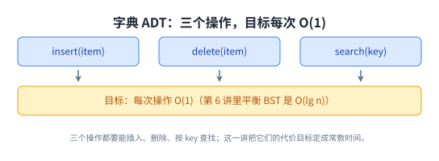

这张图把三样东西并排放：三个操作是题面，O(lg n) 是上一章已经拿到的成绩，O(1) 是这一讲要交的答案。

## 二、Python 的字典：这套接口最眼熟的一份实现

讲义没有停在抽象的 ADT 上，它马上把 Python 的 dict 摆出来，因为这是同一套接口最常见的实现。建表的一行是：

> 原文：Items are (key, value) pairs e.g. d = {'algorithms': 5, 'cool': 42}

每个元素是一对 key 和 value。接着它给了五个表达式的求值结果：

> 原文：d.items() → [('algorithms', 5),('cool',5)] / d['cool'] → 42 / d[42] → KeyError / 'cool' in d → True / 42 in d → False

五条结果各自说明一件事：字典能一次列出全部键值对；按 key 取值取到的是 value；查一个不存在的 key 抛 KeyError；in 判的是 key 在不在；42 这个整数不在字典里，因为它的键是字符串。

这里有一处要就地说明。讲义上面把 d 定义成 {'algorithms': 5, 'cool': 42}，而 d.items() 那一行印出来的是 ('cool', 5)。同一个 key 在两行里配了两个不同的 value。我们照录，不静默改源；按上面那行的定义，这一处应当是 ('cool', 42)。

讲义在这一节最后补了一句：

> 原文：Python set is really dict where items are keys (no values)

set 就是只有 key、没有 value 的 dict。这一句把字典的地位说得很清楚，它不只是[[term:data-structure]]里的一员，还是另一个更常用容器的底子。

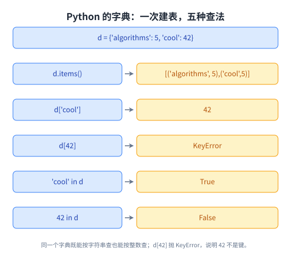

这张图把上面那五行抄成两列，左边是写法，右边是结果。出错的那一格恰好说明「按 key 查」和「按下标查」是两件事。

## 三、字典大概是计算机里最常用的结构

讲义在 Motivation 那一节开门见山：

> 原文：Dictionaries are perhaps the most popular data structure in CS

然后它把用处分成两组。第一组是直接把字典当字典用的地方，一共七条：

> 原文：built into most modern programming languages (Python, Perl, Ruby, JavaScript, Java, C++, C#, . . . ) / e.g. best docdist code: word counts & inner product / implement databases: (DB HASH in Berkeley DB) / compilers & interpreters: names → variables

> 原文：network routers: IP address → wire / network server: port number → socket/app. / virtual memory: virtual address → physical

逐条数：语言内置、第 2 讲文档距离里最优版本的两个动作、数据库、编译器与解释器、路由器、网络服务器、虚拟内存，一共七条。其中数据库那一条下面还挂着四个小例子，讲义写的是英语单词到释义、拼写纠错、单词到包含它的所有网页、用户名到账号对象。

第二组是讲义自己加了 less obvious 这个说法的四条，它们借的是哈希技术，不是字典本身：

> 原文：substring search (grep, Google) [L9] / string commonalities (DNA) [PS4] / file or directory synchronization (rsync) / cryptography: file transfer & identification [L10]

四条分别是子串搜索、DNA 这类字符串的共同之处、文件或目录同步、密码学里的文件传输与识别。每一条后面那个方括号是它在课程里的位置：前两条指向第 9 讲和第四次作业，最后一条指向第 10 讲。

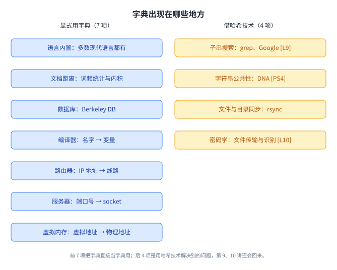

这张图左右两组的划分来自讲义自己的小标题：一组是字典本体，另一组是哈希技术被借去别处。两张名单合起来是 11 项。

## 四、直接访问表：一个键一个格子

想解决字典问题，最直接的办法是开一个数组，用 key 当下标，讲义管它叫[[term:direct-access-table]]（直接访问表）。它的原话是：

> 原文：Simple Approach: Direct Access Table — This means items would need to be stored in an array, indexed by key (random access)

元素存在数组里，下标就是 key，取用是一次[[term:array]]的随机访问。讲义画的 Figure 1 是一张三行两列的示意：左边一列写 key，右边一列写 item，下标从 0 开始往上排。

这个办法的好处是快得不能再快。键直接就是下标，中间不需要算任何函数，所以取用是一条指令的事。

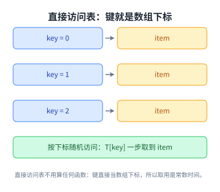

图里左边是键、右边是元素，中间那条箭头就是「下标找位置」这个动作。它之所以值得画一遍，是因为后面所有改进都是在这个形状上做减法。

## 五、直接访问表的两个问题

讲义紧接着就把这个办法判了。它列了两条理由：

> 原文：1. keys must be nonnegative integers (or using two arrays, integers) 2. large key range =⇒ large space — e.g. one key of 2^256 is bad news.

第一条是 key 必须是非负整数。它后面那个括号给了半个补救：如果 key 有负数，可以用两个数组分别装正负两半。

第二条更要命，键的取值范围有多大，数组就得有多大。讲义举的例子是 2^256，只要有一个 key 落在这个范围里，就得开出 2^256 个格子。

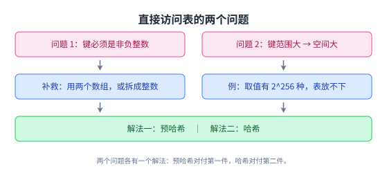

两条的性质不一样。第一条说的是键长什么样，第二条说的是空间要多少。讲义下面给的两个解法正好一人对付一个。

## 六、解法一：预哈希，把键变成非负整数

> 原文：Solution to 1 : "prehash" keys to integers.

[[term:prehashing]]（预哈希）要做的就是把任意类型的键变成整数。讲义在这一节列了六条，前两条讲为什么可行、Python 里用什么工具：

> 原文：In theory, possible because keys are finite =⇒ set of keys is countable / In Python: hash(object) (actually hash is misnomer should be "prehash")

理论上的理由是键总是有限的，所以能数得出来，也就能编码成整数。Python 里的工具是 hash(object)，对象可以是数字、字符串、元组，或者任何实现了 __hash__ 的东西；默认实现取对象的内存地址，也就是 id。讲义顺手吐槽了一句，hash 这个名字其实起错了，它干的是 prehash 的活。

第三条是一个等式，很要紧：

> 原文：In theory, x = y ⇔ hash(x) = hash(y)

理论上两个对象相等，当且仅当它们的哈希值相等。但第四条说 Python 在实用上会留例外：

> 原文：Python applies some heuristics for practicality: for example, hash('\0B ') = 64 = hash('\0\0C')

例子是两个不同的字符串给出了同一个值 64。这没有推翻上面那个等式，因为两个字符串本来就不相等；它只说明「值相等」不能反推「键相等」。

最后两条是硬约束：

> 原文：Object's key should not change while in table (else cannot find it anymore) / No mutable objects like lists

对象进了表之后，它的 key 不能再变，否则就再也找不回来了。也正因为这个，列表这类可变对象不能当键。这两条不是风格建议，是上面那个等式能成立的前提。

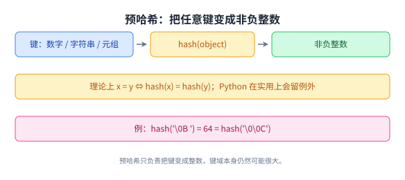

把三条并起来看就清楚了：预哈希只保证「键变成了整数」，它不保证「不同的键得到不同的整数」。

## 七、解法二：哈希，把整个键域压进 m 个槽

> 原文：Solution to 2 : hashing — Reduce universe U of all keys (say, integers) down to reasonable size m for table / idea: m ≈ n = # keys stored in dictionary / hash function h: U → {0, 1, . . . , m − 1}

第二条解法是[[term:hashing]]（哈希），把整个键域 U 压到一个合理的规模。这里的关键是中间那条 idea：m 取在 n 的量级上，n 是字典里真正存的键的个数。于是[[term:hash-function]]（哈希函数）成了一个从 U 到 {0, 1, …, m − 1} 的映射。

压到一个更小的范围，必然有键挤到一起。讲义在 Figure 2 下面给了定义：

> 原文：two keys k_i, k_j ∈ K collide if h(k_i) = h(k_j)

两个不同的键，如果哈希到同一个槽，就说它们发生了[[term:hash-collision]]（碰撞）。

讲义接着摆出两条路：

> 原文：How do we deal with collisions? We will see two ways 1. Chaining: TODAY 2. Open addressing: L10

对付碰撞一共两条路。[[term:chaining]]（链地址法）是这一讲的内容，[[term:open-addressing]]（开放寻址）留给第 10 讲。这份七页的讲义只讲第一条。

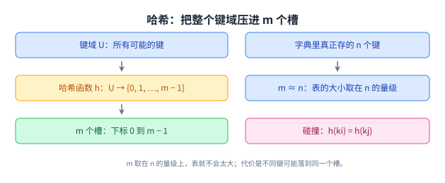

把这张图和第 6 节那张放在一起看，两个解法的分工就出来了：预哈希解决的是「键不是整数」，哈希解决的是「键的取值范围太大」，两者串起来才是完整的答案。

## 八、链地址法：每个槽挂一条链表

> 原文：Chaining — Linked list of colliding elements in each slot of table

链地址法一句话就说完了：表里每个槽挂一条[[term:linked-list]]，所有哈希到这个槽的元素都串在这条链上。查找的做法是先算哈希找到槽，再沿着链把那个键找出来。讲义对这一节只列了两条：

> 原文：Search must go through whole list T[h(key)] / Worst case: all n keys hash to same slot =⇒ Θ(n) per operation

第一条说查找要把 T[h(key)] 这条链整个走一遍。第二条说最坏情况：n 个键全部落到同一个槽，那时每次操作是 Θ(n)，和线性扫描没有区别。这就是[[term:worst-case]]。

这条路线在工程里到处都是。Java 的 HashMap 把落进同一个桶的键串成一条链，Redis 的字典也是同一个做法（这两句是我们补的，讲义没有点名任何实现）。

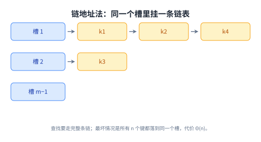

这张图画的是讲义 Figure 3 的同一件事：表在左边，链往右挂。它也顺手解释了下一节为什么要算「期望」，最坏情况是 Θ(n)，而平均情况要看链有多长。

## 九、算代价：装填因子与简单均匀哈希

要算平均情况，先得给键的分布立一个假设。讲义很坦率，把它标了出来：

> 原文：An assumption (cheating): Each key is equally likely to be hashed to any slot of table, independent of where other keys are hashed.

[[term:simple-uniform-hashing]]（简单均匀哈希）说的是每一个键落到哪个槽都等可能，而且和其他键落在哪里无关。括号里那个 cheating 是讲义自己加的，它知道这个假设不一定成立，但先靠它把账算出来。

在这个假设下，两个量就够了：

> 原文：let n = # keys stored in table / m = # slots in table / load factor α = n/m = expected # keys per slot = expected length of a chain

n 是表里键的个数，m 是槽的个数。[[term:load-factor]]（装填因子）α 等于 n 除以 m，它同时是每个槽的期望键数，也是每条链的期望长度。

然后是这个假设买来的结论：

> 原文：This implies that expected running time for search is Θ(1+α) — the 1 comes from applying the hash function and random access to the slot whereas the α comes from searching the list. This is equal to O(1) if α = O(1), i.e., m = Ω(n).

查找的期望时间是 Θ(1 + α)。那个 1 是算一次哈希、再随机访问到槽的代价；α 是沿着链找的代价。只要 α = O(1)，也就是 m = Ω(n)，期望时间就是 O(1)。

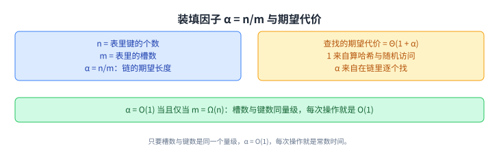

这张图把上面的推理压成两块加一行：左边是 n 和 m 怎么比出 α，右边是 Θ(1 + α) 里两份代价各自的来处，底下是让它变成 O(1) 的条件。

## 十、哈希函数：三种做法与它们的条件

上面那套代价全都建立在一个假设上：键均匀地落到 m 个槽里。这一节的题目就是让这件事接近成立。讲义的说法是：

> 原文：Hash Functions — We cover three methods to achieve the above performance:

三种方法，数一遍是除法法、乘法法、全域哈希。

> 原文：Division Method: h(k) = k mod m — This is practical when m is prime but not too close to power of 2 or 10 (then just depending on low bits/digits). But it is inconvenient to find a prime number, and division is slow.

[[term:division-method]]（除法法）就是取余，h(k) = k mod m。它有两个讲究：m 取质数，而且别太靠近 2 的幂或 10 的幂。讲义给了理由，m 贴着 2 的幂时结果只取决于 k 的低位，贴着 10 的幂时只取决于低位的那几个十进制数字。它同时说了两条坏话：找一个质数不方便，除法本身也慢。

> 原文：Multiplication Method: h(k) = [(a · k) mod 2^w] ≫ (w − r) — where a is random, k is w bits, and m = 2^r. This is practical when a is odd & 2^{w−1} < a < 2^w & a not too close to 2^{w−1} or 2^w. Multiplication and bit extraction are faster than division.

[[term:multiplication-method]]（乘法法）把除法整个换掉了。k 是一个 w 位的数，a 是一个随机的 w 位数，先算 a 乘 k、对 2^w 取模，再右移 w − r 位，取出来的就是中间那 r 位。m 不是随便取的，它固定成 2^r，所以取出来的 r 位正好就是一个下标。讲义对 a 也有讲究：取奇数、落在 2^{w−1} 和 2^w 之间，而且别贴着这两头。

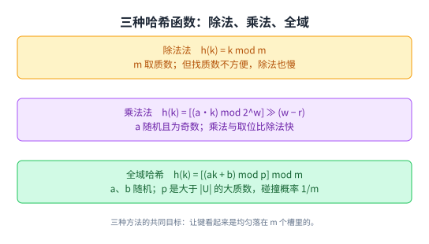

这张图把三条并排抄下来。值得多看一眼的是每行末尾的条件：第一条依赖 m 的选择，第二条依赖 a 的选择，第三条把选择权交给随机数。

## 十一、乘法法为什么取中间那几位

乘法法的好处讲义只用一句话交代：

> 原文：Multiplication and bit extraction are faster than division.

乘法和取位都比除法快，所以值得多花一段。但那个式子里的每个符号都得对得上位置，不然「取中间 r 位」这句话就是空的。k 有 w 位，a 也有 w 位，两者相乘最多 2w 位。讲义先对 2^w 取模，把高位砍掉，剩下的还是 w 位；再右移 w − r 位，取出的就是这 w 位里靠上的 r 位，也就是原乘积的中间那一段。

讲义画了 Figure 4 来配这个式子。图里有一个标着 w 的括号跨在整个宽度上，下面是几行 k 的副本，中间一格用红色斜线标出来，底下那个花括号标着 r，长度正好是 r 位。

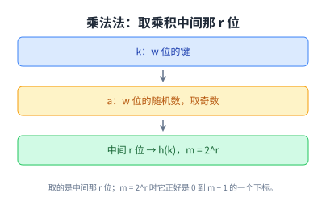

这张图把式子拆成三步：w 位的键、w 位的随机数、以及取出来的那 r 位。最后一步之所以正好落在一个合法下标上，是因为 m 被定成了 2^r。

## 十二、全域哈希：不用假设键是均匀的

前两种方法都在调参数，第三种换了思路。讲义的说法是：

> 原文：Universal Hashing [6.046; CLRS 11.3.3] — For example: h(k) = [(ak + b) mod p] mod m where a and b are random ∈ {0, 1, . . . p − 1}, and p is a large prime (> |U|).

[[term:universal-hashing]]（全域哈希）先算 (ak + b) mod p，再对 m 取余，其中 a 和 b 是 0 到 p − 1 之间的随机数，p 是一个比整个键域还大的质数。标题下面挂着两个出处：6.046 这门课，以及 CLRS 的 11.3.3 节。

随机数买来的是一条很干净的性质：

> 原文：This implies that for worst case keys k1 ≠ k2, (and for a, b choice of h): Pr_{a,b}{event X_{k1k2}} = Pr_{a,b}{h(k1) = h(k2)} = 1/m. This lemma not proved here

对任意两个不同的键，在 a、b 随机取的情况下，它们碰撞的概率正好是 1/m。讲义明确写了这条引理不在这里证，只把结论拿来用。

然后它把这个结论推了一遍：

> 原文：E_{a,b}[# collisions with k1] = E[Σ X_{k1k2}] = Σ_{k2} E[X_{k1k2}] = Σ_{k2} Pr{X_{k1k2} = 1} = n/m = α

读法是：k1 期望会和多少个键碰撞，等于把其他每个键的碰撞概率加起来。每个概率是 1/m，一共有 n 个键，加起来就是 n/m，也就是 α。讲义对这个结果的评价只有一句：

> 原文：This is just as good as above!

它的意思是，全域哈希拿到了和简单均匀哈希假设一样好的期望代价，但这一次不用假设键是均匀的，代价换成了两组随机数。

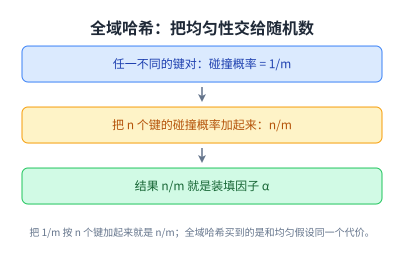

这张图就是上面那条推导的三步：概率从哪来、怎么加、加到什么。第 9 节那个 cheating 到了这里可以摘掉了。

## 读完应该能回答

- 字典问题的三个操作分别是什么，这一讲给它们定的目标代价是多少；
- 直接访问表为什么快，它倒下的两条理由分别是什么；
- 预哈希对付哪个问题，它为什么不能保证不同的键得到不同的整数；
- 碰撞的定义是什么，对付碰撞的两条路各自留给哪一讲；
- 装填因子 α 是什么，查找的期望代价为什么写成 Θ(1 + α)；
- 除法法、乘法法、全域哈希各自要满足什么条件，又是谁可以不要「键是均匀的」这个假设。

## 脉络回顾

这一讲是同一个问题的第三次回答。第 5 讲给出[[term:binary-search-tree]]，代价是 O(h)；第 6 讲把 h 管住，得到 O(lg n)；这一讲换了思路，不再让元素有序地待在树里，而是用一个函数把它们直接送到某个位置，于是代价掉到了期望的 O(1)。

代价的另一面是承诺变弱了。[[term:balanced-tree]]的最坏情况是 O(lg n)，那是对所有输入都成立的上界；链地址法的最坏情况是 Θ(n)，同样对所有输入成立；而哈希表那个 O(1) 只在「键大致均匀」的前提下是期望值。讲义在第 9 节就把这个前提标成了 cheating。

两种思路的差别还体现在附带能力上。讲义第一页特意提了一句，平衡 BST 顺手能做 next-largest 这类不精确查找；哈希表做不到这件事，因为槽与槽之间没有次序。要排序、要找前驱后继，还得回到第 5、6 讲的树。

往后看，这一讲只拆了一半。链地址法解决了碰撞，但表的大小 m 是固定的，键越插越多时 α 会一路涨上去。第 9 讲接着讲表怎么扩容，以及怎么用同一套想法做字符串匹配。

## 溯源

本讲的内容来自 MIT 6.006 Fall 2011 的 Lecture 8: Hashing with chaining 讲义（7 页 typed notes；第 7 页是 OCW 版权页，正文 6 页）。讲义自己的标题页写的是 Lecture 8: Hashing I，资源页与讲义清单上的逐字标题是 Hashing with chaining，本页以后者为准。

事实都能在上述讲义里逐条对上：第 1 页的自述目录七条、ADT 的定义与三个操作、key 互不相同的约定、平衡 BST 的 O(lg n) 与 next-largest 这类不精确查找、Goal: O(1)，以及五个 Python 表达式的结果和「set 就是只有 key 的 dict」；第 2 页的「最常用的数据结构」、直接用字典的七条与数据库下挂的四个小例子、less obvious 的四条与各自的 [L9] / [PS4] / [L10]；第 3 页的 Figure 1、两个问题与 2^256、预哈希那节的六条（键有限所以可数、hash(object) 与 id、x = y ⇔ hash(x) = hash(y)、hash('\0B ') = 64、key 进表后不能变、可变对象不能当键）；第 4 页的 Figure 2 与碰撞定义、对付碰撞的两条路与各自的讲次、Figure 3、链地址法的两条；第 5 页的 cheating 假设、n 与 m 与 α、Θ(1 + α) 与 m = Ω(n)、除法法与乘法法各自的适用条件；第 6 页的 Figure 4、全域哈希的式子与 [6.046; CLRS 11.3.3] 这两个出处、碰撞概率 1/m、期望碰撞数的推导与 This is just as good as above! 这句评价。

讲义没有写的部分，以下是我们补的：这篇中文讲解本身（讲义是英文提纲），全部 12 张配图（Figure 1 到 Figure 4 一律重画，没有转载任何一页），以及九处展开说明：

1. 第 1 节把三样东西并排的读法（三个操作是题面、O(lg n) 是已有成绩、O(1) 是本讲目标）；

2. 第 2 节把 d[42] 抛 KeyError 读成「42 不是键」，以及 in 判的是 key 而不是 value；

3. 第 3 节把两组名单合成 11 项这个总数；

4. 第 4 节「后面所有改进都是在这个形状上做减法」这个说法；

5. 第 6 节把两个字符串哈希值相同读成「值相等不能反推键相等」，并与第 7 节的碰撞挂钩；

6. 第 7 节「预哈希解决键不是整数、哈希解决键域太大」这个分工；

7. 第 8 节末尾那句工程例子（Java 的 HashMap、Redis 的字典都用链地址法），讲义没有点名任何实现；

8. 第 11 节把乘法法那个式子按位数展开（乘积最多 2w 位、取模后仍是 w 位、右移 w − r 位取出靠上的 r 位）；

9. 第 12 节把期望推导读成「把 n 个 1/m 加起来」，以及「第 9 节那个假设到这里可以摘掉」这个比较。

另外六处登记。一是**源自身的矛盾**：第 1 页把 d 定义成 {'algorithms': 5, 'cool': 42}，而 d.items() 印的是 ('cool', 5)，同一个 key 配了两个 value，我们照录并在第 2 节就地说明。二是**抽取器造成的假象**：第 6 页原文是 k1 ≠ k2，两条文本抽取（pypdfium2 与 pypdf）都读成了等号，我们对着渲染页核过之后按 ≠ 照录。三是**讲义自己的停顿**：第 4 页对 T[h(key)] 与 Θ(n) 的处理、第 6 页明写 This lemma not proved here，都照录「不在这里证」，没有替它补证明。四是**讲次归属**：开放寻址指向第 10 讲是讲义原文，扩容指向第 9 讲是按清单的预告，属于我们补的指路。五是**跨讲联系**：第 2 讲的文档距离、第 5、6 讲的 O(h) 与 O(lg n)、以及脉络回顾里三种思路承诺强弱的比较，都是我们串的。六是**署名**：讲义正文没有「Courtesy of MIT Press. Used with permission.」这类第三方授权声明，OCW 资源页的许可为 CC BY-NC-SA 4.0；本页只转述结论、配图全部重画，未转载任何一页。
