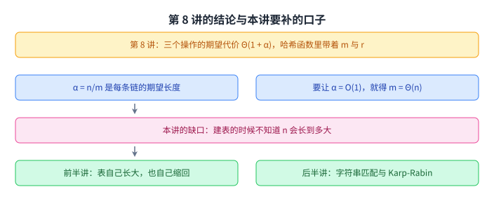
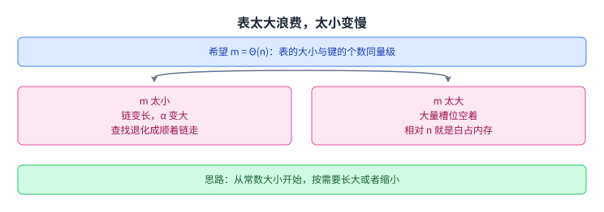
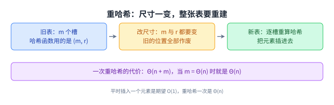
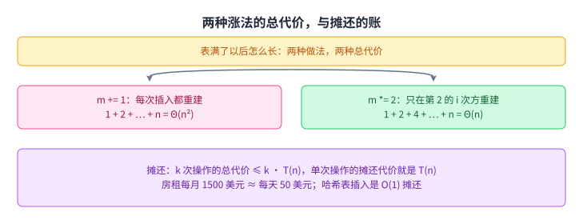
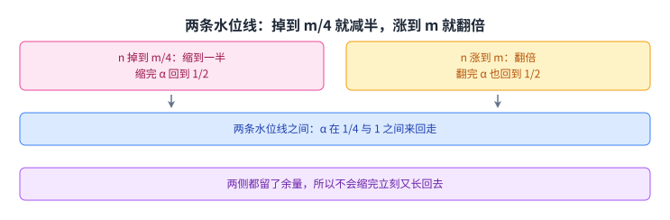
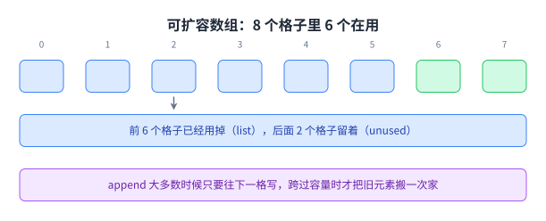
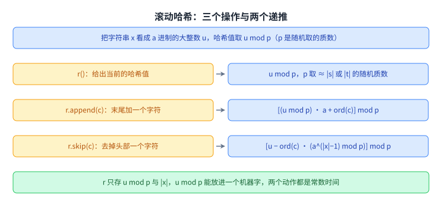

+++
title = "表倍增与 Karp-Rabin"
lecture = 9
slug = "table-doubling-karp-rabin"
status = "draft"
source_kind = "notes"
source_url = "https://ocw.mit.edu/courses/6-006-introduction-to-algorithms-fall-2011/resources/mit6_006f11_lec09/"
source_title = "Lecture 09: Table doubling, Karp-Rabin"
output_mode = "explanation"
+++

第 8 讲用[[term:hashing]]（哈希）把字典的代价压到期望 O(1)，但它留了一个前提没有解决：[[term:load-factor]]（装填因子）α = n/m 必须一直是常数。这一讲要解决的第一件事就是这个前提，因为表在创建的时候并不知道以后会收到多少个键。

后半讲换到另一个问题上：[[term:string-matching]]（字符串匹配），也就是在一段长文本里找一段短文本。它借的还是哈希，只是这一次要把哈希值在滑动中续着算下去。

## 一、先把第 8 讲留下的账翻出来

讲义第一页是 Recall。它把[[term:chaining]]（链地址法）那张图又画了一遍（Figure 1）：左边是键域 U 与真正存进集合的 n 个键，中间是哈希函数 h，右边是一张 m 个槽的表，落进同一个槽的键串成一条链。图下面跟的是上一讲最要紧的那句结论：

> 原文：Expected cost (insert/delete/search): Θ(1 + α), assuming simple uniform hashing OR universal hashing & hash function h takes O(1) time.

插入、删除、查找这三个操作的期望代价都是 Θ(1 + α)。α 是每条链的期望长度，所以只要 α 是常数，三个操作就都是 O(1)。这里的假设有两条路可选：[[term:simple-uniform-hashing]]（简单均匀哈希），或者 [[term:universal-hashing]]（全域哈希），两条路都要求[[term:hash-function]]本身花 O(1)。

讲义紧接着把两个哈希函数抄了一遍，因为这一讲要动它们里面的参数：

> 原文：Division Method: h(k) = k mod m
> 原文：where m is ideally prime

[[term:division-method]]（除法法）就是取余，m 最好是质数。另一个是：

> 原文：h(k) = [(a · k) mod 2^w] ≫ (w − r)
> 原文：where a is a random odd integer between 2^(w−1) and 2^w, k is given by w bits, and m = table size = 2^r.

[[term:multiplication-method]]（乘法法）把 m 固定成 2 的 r 次方，a 取 2 的 (w−1) 次方到 2 的 w 次方之间的随机奇数，k 占 w 位。两个式子里都带着表的大小：除法法是 mod m，乘法法是 m = 2 的 r 次方。这句话是这一讲前半段的引线，尺寸一改，哈希函数就得跟着改。

讲义的自述目录一共四条：Table Resizing、Amortization、String Matching and Karp-Rabin、Rolling Hash。数一遍是：表怎么改大小、摊还分析、字符串匹配与 Karp-Rabin、滚动哈希。

上面这三个结论都是条件式的：α = O(1) 要先有 m = Θ(n)。而建表的时候没人知道 n 会长到多大，所以这个条件本身还没有人来管。

## 二、表太大浪费，太小变慢

讲义把这件事的条件写得非常直白，三条并列：

> 原文：• want m = Θ(n) at all times
> 原文：• don’t know how large n will get at creation
> 原文：• m too small =⇒ slow; m too big =⇒ wasteful

希望 m 始终与 n 同量级；可是建表时不知道 n 会到多大；m 太小就慢，m 太大就浪费。这两句「慢」与「浪费」都有具体来处：α = n/m 是每条链的期望长度，m 太小则 α 大，查找就变成顺着一条长链一个个走；m 太大则每个键平均占掉的槽位远超一格，内存白花。讲义给的思路只有一句：

> 原文：Idea: Start small (constant) and grow (or shrink) as necessary.

从小开始，取一个常数大小，然后按需要长大或者缩回去。这句话里「长」与「缩」都要付代价，下一节先算「长」的那笔。

左右两列是两种错误的方向：往小走会换来更长的链，往大走会换来更多空槽。讲义要的是中间那条线，也就是 m 与 n 同量级。

## 三、重哈希：尺寸一变，整张表要重建

改 m 就必须换哈希函数，这件事在这门课里叫[[term:rehashing]]（重哈希）。讲义把原因和做法写在一起：

> 原文：Rehashing: To grow or shrink table hash function must change (m, r) =⇒ must rebuild hash table from scratch

除法法与乘法法的式子里都带着表的大小，m 或 r 一改，同一个键算出来的槽位就变了。原来待在第 3 号槽里的键，在新表里可能应该去第 7 号槽，所以旧表上的位置全部作废，只能重建。讲义把重建的循环也写了出来：

> 原文：for item in old table: → for each slot, for item in slot / insert into new table

从旧表的每个槽出发，把槽里每个元素重新算一次哈希，插进新表。代价是：

> 原文：=⇒ Θ(n + m) time = Θ(n) if m = Θ(n)

Θ(n + m)，当 m 与 n 同量级时就写成 Θ(n)。这里要拎出来的对比是：平时插一个元素是期望 O(1)，而重哈希一次是 Θ(n)。这个差距就是下一节所有算术的来源。

图里那条代价的意思是「偶尔一次很贵」，而不是「每次都很贵」。只要贵的那几次不要把总量抬起来，摊到每一次就还是常数。

## 四、涨得多快：每次加一，还是每次翻倍

讲义设的场景是表满了，也就是 n 追上了 m。它给了两种长法，并且把两种都算到了底：

> 原文：• m + =1? =⇒ rebuild every step =⇒ n inserts cost Θ(1 + 2 + ··· + n) = Θ(n²)
> 原文：• m ∗ =2? m = Θ(n) still (r+ =1) =⇒ rebuild at insertion 2^i =⇒ n inserts cost Θ(1 + 2 + 4 + 8 + ··· + n) where n is really the next power of 2 = Θ(n)

每次只加一格（m += 1）等于每一步都要重建：第 i 次插入要搬 i 个元素，n 次插入合起来要搬 1+2+⋯+n 个。把这笔账算出来，1+2+⋯+n 等于 n 乘 n+1 再除以 2，是 Θ(n²)。

翻倍（m *= 2）只在第 2 的 i 次方那些插入上重建，也就是第 1、2、4、8、…… 次，总的搬运量是 1+2+4+8+⋯+n，这里的 n 取到下一个 2 的幂。这笔账也算一遍：等比数列求和等于 2n 减 1，是 Θ(n)。讲义把「满了就翻倍」这一条写进了讲次标题，本页叫它[[term:table-doubling]]（表倍增）。

讲义对翻倍的评价是最后那一句：

> 原文：• a few inserts cost linear time, but Θ(1) “on average”.

少数几次插入是线性的，指的就是恰好撞上重建的那几次；平均下来是 Θ(1)。这就是「摊还」这个词的来处。讲义用一个租房的比方解释它，并且给了定义：

> 原文：Amortized Analysis: This is a common technique in data structures — like paying rent: $1500/month ≈ $50/day
> 原文：• operation has amortized cost T(n) if k operations cost ≤ k · T(n)

房租每月 1500 美元，换算成每天 50 美元，按 30 天一个月算正好对得上。这个换算的好处是不用管某一天是不是交房租的日子。[[term:amortized-analysis]]（摊还分析）的定义就在下面那行：如果 k 次操作的总代价不超过 k 乘 T(n)，就说单次操作的摊还代价是 T(n)。[[term:hash-table]]（哈希表）的插入是这种例子：

> 原文：• e.g. inserting into a hash table takes O(1) amortized time.

它说的是摊还 O(1)，不是每次都是 O(1)。

上半张的对比是这一节的重点：加一与翻倍，单看某一次插入都可能撞上重建，而 n 次插入的总代价一个是 Θ(n²)，一个是 Θ(n)。下半张把摊还的定义和房租的比方放在一起，它们说的是同一件事。

## 五、删到 m/4 就减半，表也要会缩

删除这一侧在链地址法上本来就不贵：先算哈希走到槽，再从链上把元素摘掉，期望 O(1)。讲义写的是：

> 原文：Delete: Also O(1) expected as is.

要处理的是空间的另一头：

> 原文：• space can get big with respect to n e.g. n× insert, n× delete

先插进 n 个元素、再删掉 n 个，表的大小还停在扩容后的那一档，相对于当前的 n 就显得过大。讲义给的解法是一条水位线：

> 原文：• solution: when n decreases to m/4, shrink to half the size =⇒ O(1) amortized cost for both insert and delete — analysis is harder; see CLRS 17.4.

n 掉到 m 的四分之一时，把表缩到一半。缩完 m 减半，α 大约回到 1/2。这条线与上面那条「n 涨到 m 就翻倍」合起来，把 α 关在两个刻度之间：高处是 n = m，低处是 n = m/4。这个区间是我们读出来的，讲义只给了两条水位线，没有写出范围。

讲义还特意交代了一句实情：两个方向的分析都更难做，它把细节推给了 CLRS 的 17.4 节，本讲不展开。

图里左边那条线管缩，右边那条管长，中间是 α 在 1/4 与 1 之间来回走的区间。两条线分开而没有贴在一起，是为了避免刚缩完就立刻又长回去。

## 六、同一个招数，也撑起了 Python 的 list

讲义把这一节叫 Resizable Arrays，因为它发现哈希表扩容的那笔账不只属于哈希表：

> 原文：Resizable Arrays: • same trick solves Python “list” (array)
> 原文：• =⇒ list.append and list.pop in O(1) amortized

Python 的 list 是一种[[term:array-list]]（动态数组），底层是一段连续的[[term:array]]（数组）。长度不够时它换一段更大的、把旧元素搬过去，所以 list.append 与 list.pop 都是摊还 O(1)。讲义总是把结论落到具体实现上，第 8 讲说「Python 里的字典就是 dict」也是同一个写法。

讲义为这件事画了 Figure 2：一行 8 个格子，下标从 0 到 7，前面 6 个格子标着 list（已经用掉），后面 2 个格子标着 unused（留着）。这些数字的含义是「数组的容量可以大于实际元素个数」，多出来的那几格就是下次 append 的余量。

我们补一句课外的：这类会自己长的数组在别的语言里也有，Java 的 ArrayList 与 C++ 的 std::vector 都属于同一类东西，只是各自扩容的倍数不同。讲义没有点名任何实现。

这张图说明容量与元素个数是两件事，也解释了为什么 append 大多数时候只要往下一格写，只有跨过容量时才要搬家。

## 七、字符串匹配：朴素做法为什么可能变平方

后半讲换了题目。讲义的问题陈述是：

> 原文：Given two strings s and t, does s occur as a substring of t? (and if so, where and how many times?)

给两段字符串 s 与 t，问 s 是否作为 t 的子串出现；如果出现，在哪里、出现了几次。它给的例子很好记：

> 原文：E.g. s = ‘6.006’ and t = your entire INBOX (‘grep’ on UNIX)

s 取 '6.006'，t 取你的整个收件箱。这说的就是 grep 干的事，Linux 上也是同一个工具（这一句是我们补的）。朴素做法写出来只有一行：

> 原文：Simple Algorithm: any(s == t[i : i + len(s)] for i in range(len(t) − len(s)))

做法是把 s 对齐到 t 的每个起点，逐字符比一遍。代价来自两个数相乘：

> 原文：— O(|s|) time for each substring comparison
> 原文：=⇒ O(|s| · (|t| − |s|)) time = O(|s| · |t|) potentially quadratic

每个起点要比 |s| 个字符，能对齐的起点有 |t| 减 |s| 个，乘起来是 O(|s| · (|t| − |s|))，当 |s| 与 |t| 同量级时就是 O(|s| · |t|)，平方级。

这里有一处要就地说明。讲义那行代码写的是 range(len(t) − len(s))，它取到的下标是 0 到 |t| − |s| − 1；最后一个能对齐的起点（下标为 |t| − |s|）没有被遍历到。我们照录这行代码，不静默改源；少掉一个起点不影响后面「平方级」这个量级结论。

图里画的是相邻的两个起点：s 从 t 的这一格挪到下一格，两个位置都要比 |s| 个字符。这就是它可能变成平方级的原因。

## 八、Karp-Rabin：先比哈希，比中了再核对

[[term:karp-rabin]]（卡普-拉宾算法）换了一个比较的对象。它不比字符串，先比哈希值：

> 原文：Karp-Rabin Algorithm: • Compare h(s) == h(t[i : i + len(s)]) / • If hash values match, likely so do strings

比两个字符串要 O(|s|)，比两个哈希值只要 O(1)。哈希值不等就一定不匹配，可以立刻挪到下一个起点；哈希值相等才需要核对：

> 原文：– can check s == t[i : i + len(s)] to be sure ∼ cost O(|s|) / – if yes, found match — done / – if no, happened with probability < 1/|s| =⇒ expected cost is O(1) per i.

核对这一步要花 O(|s|)，但它只在哈希撞车时才会发生，而撞车的概率小于 1/|s|。两个数一乘，每个起点上的期望核对代价是 O(1)，也就是讲义那句 expected cost is O(1) per i。总的期望时间是：

> 原文：• expected time = O(|s| + |t| · cost(h)).

|s| 是算 s 的哈希，|t| 是扫过 t 里的每个起点，cost(h) 是算一个长度为 |s| 的窗口的哈希要多少。剩下的事就是把 cost(h) 压下来：

> 原文：– naively h(x) costs |x| / – we’ll achieve O(1)! / – idea: t[i : i + len(s)] ≈ t[i + 1 : i + 1 + len(s)].

朴素地算一个窗口的哈希要 |x|，也就是窗口长度，那样总代价又回到平方级。讲义说它要把这一步做到 O(1)，靠的思路是相邻两个窗口几乎一样：t[i : i + len(s)] 与 t[i + 1 : i + 1 + len(s)] 只差首尾两个字符。

把这三步连起来读：哈希把「比一串字符」换成「比一个数」，概率把「偶尔核对」摊成常数，而整套算法的成败落在 cost(h) 上。

## 九、滚动哈希：把上一个哈希值用起来

要让 cost(h) 是 O(1)，就得让下一个窗口的哈希能从上一个窗口的哈希算出来。讲义为这件事定义了一个 ADT：

> 原文：Rolling Hash ADT — maintain string x subject to
> 原文：• r(): reasonable hash function h(x) on string x
> 原文：• r.append(c): add letter c to end of string x
> 原文：• r.skip(c): remove front letter from string x, assuming it is c

[[term:rolling-hash]]（滚动哈希）维护一段字符串 x，对外有三个操作：r() 给出它的哈希值，r.append(c) 在末尾加一个字符，r.skip(c) 从前面去掉一个字符（调用者保证去掉的正是 c）。配到字符串匹配上的用法是这样的：

> 原文：for c in s: rs.append(c) / for c in t[:len(s)]: rt.append(c) / if rs() == rt(): ...
> 原文：This first block of code is O(|s|)

先把 s 整个喂进去，再把 t 的前 |s| 个字符喂进另一个滚动哈希，然后比一次，这一段是 O(|s|)。

> 原文：for i in range(len(s), len(t)): rt.skip(t[i-len(s)]) / rt.append(t[i]) / if rs() == rt(): ...
> 原文：The second block of code is O(|t|) + O(# matches − |s|) to verify.

第二段沿着 t 往右滑，每次去掉最左边那个字符、加进新来的字符，再比一次，这一段是 O(|t|)。至于后面跟着的核对代价，讲义写的是 O(# matches − |s|)，这一项按读法应当相乘：核对一条候选要花 O(|s|)。同一讲的手写原稿在这里也写成减号，所以这不是抽取造成的，我们照录并标出它按原样讲不通。

讲义在这一节里讲的是[[term:data-structure]]（数据结构）层面的做法，也就是两个操作怎么做到常数时间：

> 原文：Data Structure: Treat string x as a multidigit number u in base a where a denotes the alphabet size, e.g., 256

把 x 看成一个 a 进制的大整数 u，a 是字母表大小，讲义举的例子是 256。哈希值取 u mod p：

> 原文：• r() = u mod p for (ideally random) prime p ≈ |s| or |t| (division method) / • r stores u mod p and |x| (really a^(|x|)), not u

p 是一个随机取的质数，量级在 |s| 或 |t| 上下，用的还是上面那个除法法。r 只存 u mod p 与 |x|（真正要留的是 a 的 |x| 次方这个幂），不存整个 u，所以 u mod p 能放进一个[[term:machine-word]]（机器字）。两个动作的式子写在下面：

> 原文：• r.append(c): (u · a + ord(c)) mod p = [(u mod p) · a + ord(c)] mod p
> 原文：• r.skip(c): [u − ord(c) · (a^(|u|−1) mod p)] mod p = [(u mod p) − ord(c) · (a^(|x−1|) mod p)] mod p

append 就是在 a 进制数后面补一位：旧的 u 乘 a 再加新字符的编码，两边同时对 p 取模，所以只用 u mod p 就够了。skip 是减去最前面那位字符乘上它所在的位值，也就是 a 的「长度减一」次方。

这两个式子里还有一处不一致，一并登记在这里。skip 的指数，讲义第一行写成 |u| − 1（u 是一个数，对它取长度讲不通），第二行写成 |x−1|（按上一行「r 存的是 |x|」这条，应当是 |x| − 1）。同一讲的手写原稿在同一个位置两行都写的是 |x| − 1，与上面的说法自洽，配图里用的就是手写原稿那一版。

这张图的读法是：左列三个操作是接口，右列两个式子是实现，最下面那行是让两者都能在常数时间里跑起来的那条约定。

## 读完应该能回答

- 为什么链地址法的 O(1) 要先有 m = Θ(n)，建表时不知道 n 会带来什么麻烦；
- 重哈希为什么要重建整张表，一次要付多少代价；
- 每次加一与每次翻倍，n 次插入的总代价各是多少，差在哪里；
- 「摊还代价 T(n)」的定义是什么，房租那个比方在比什么；
- 表在什么条件下缩，缩完之后 α 大约是多少；
- 朴素字符串匹配的代价怎么算出来，它为什么会变成平方级；
- Karp-Rabin 为什么可以先比哈希，撞车的概率与核对代价怎么抵消；
- 滚动哈希要支持哪三个操作，append 与 skip 的式子各自在说什么。

## 脉络回顾

这一讲把第 8 讲的结论补成了完整的一句。第 8 讲说字典的期望代价是 Θ(1 + α)，这一讲给出维持 α 的办法：表用翻倍长大、用减半缩小，两次调整之间 α 在 1/4 与 1 之间游走，于是那个 Θ(1 + α) 里的 α 一直是常数。

代价的形状值得记一下。单次操作是常数，每过一段却要付一次线性代价；[[term:amortized-analysis]]（摊还分析）就是把这两笔账合起来算的工具。它是这一讲唯一的新方法，后面讲别的数据结构时还会再用到，第 6 讲里 AVL 树名单上标着 (A) 的那几条也是同一件事。第 8 讲那个「哈希需要一个假设」的缺口，在这里没有变大也没有变小。

后半讲换了目标：不再问「往集合里插一个键要多久」，而是问「在一段文本里找一段模式要多久」。它把哈希从「定位一个键」改成「比较一个窗口」，滚动哈希让窗口滑一步只要常数时间。第 8 讲的除法法在这里又出现了一次，连 p 的取法都还是那一套。

## 溯源

本讲的内容来自 MIT 6.006 Fall 2011 的 Lecture 9 讲义（typed notes 6 页，第 6 页是 OCW 版权页，正文 5 页）。标题要说明一处：OCW 的资源页与讲次清单给的逐字标题是 Table doubling, Karp-Rabin，而讲义自己的页眉写的是 Lecture 9: Hashing II，本页以资源页的标题为准。讲义正文没有「Courtesy of MIT Press. Used with permission.」这类第三方授权声明（在抽取出的文本里检索 Courtesy 与 MIT Press，0 命中）；本页只转述结论，配图全部重画，未转载任何一页。

事实都能在上述讲义里逐条对上：第 1 页的四条目录、Figure 1（键域 U、集合里的 n 个键、m 个槽、碰撞、期望长度 α = n/m）、三个操作的期望代价 Θ(1 + α) 与两条假设、除法法 h(k) = k mod m 与 m 取质数、乘法法 h(k) = [(a · k) mod 2^w] ≫ (w − r) 与 a 取 2^(w−1) 到 2^w 的随机奇数、k 占 w 位、m = 2^r；第 2 页的 want m = Θ(n)、建表时不知道 n、太小太慢太大浪费、从小开始、重哈希要换 (m, r) 并重建、Θ(n + m) = Θ(n)、m += 1 与 m *= 2 两种涨法与 Θ(1+2+⋯+n) = Θ(n²)、Θ(1+2+4+8+⋯+n) = Θ(n)（n 取到下一个 2 的幂）、a few inserts cost linear time 那句、摊还分析的房租比方（$1500/月 ≈ $50/天）与定义（k 次操作 ≤ k·T(n)）、哈希表插入是 O(1) 摊还；第 3 页的 Maintain m = Θ(n) ⇒ α = Θ(1) ⇒ O(1)、删除也是期望 O(1)、先插后删会让空间相对 n 变大、n 掉到 m/4 就缩到一半、分析更难并指向 CLRS 17.4、Resizable Arrays 与 Python list 的 append / pop、Figure 2 的 8 个格子（0 到 7，6 格 list、2 格 unused）、字符串匹配的问题陈述与 '6.006' / INBOX / grep 的例子、朴素算法的代码与 O(|s| · (|t| − |s|)) = O(|s| · |t|)；第 4 页的 Figure 3、Karp-Rabin 的两条、核对代价 O(|s|)、撞车概率 < 1/|s|、每个起点期望 O(1)、期望时间 O(|s| + |t| · cost(h))、朴素 h(x) 要 |x|、要把 cost(h) 做到 O(1)、相邻窗口几乎一样这个思路、Rolling Hash ADT 的三个操作、Karp-Rabin 应用的两段代码与各自的代价；第 5 页的数据结构（x 看成 a 进制大整数、a 例如 256、r() = u mod p、p 取 ≈ |s| 或 |t| 的随机质数、r 只存 u mod p 与 |x|、能放进一个机器字、append 与 skip 的两个式子）。

### 我们补的

讲义没有写的部分，以下是我们补的：这篇中文讲解本身（讲义是英文提纲），全部 9 张配图（讲义里的 Figure 1 到 Figure 3 一律重画，没有转载任何一页），以及六处展开说明：

1. 第 1 节把「两个哈希函数里都带着表的大小」读成本讲前半段的引线；
2. 第 2 节把「慢」与「浪费」分别落到 α 变大与每键占用的槽位变多这两件事上；
3. 第 4 节把两个和算到底（1+2+⋯+n = n(n+1)/2、1+2+4+8+⋯+n = 2n−1），以及「$1500/月按 30 天算就是 $50/天」这个换算；
4. 第 5 节把两条水位线读成一个区间（n/m 落在 1/4 与 1 之间），讲义只给了水位线，没有写出这个范围；
5. 第 6 节提到 Java 的 ArrayList 与 C++ 的 std::vector 也属于可扩容数组，讲义没有点名任何实现；
6. 第 7 节把 grep 与 Linux 连起来写，讲义原文只说 'grep' on UNIX。

### 另外四处登记

另外四处登记。一是**源自身的疏漏，已就地说明**：第 3 页朴素算法的 range(len(t) − len(s)) 少遍历了最后一个起点。二是**源自身的写法，已就地说明**：第 5 页第二段代码把核对代价写成 O(# matches − |s|)，按「核对一条候选要 O(|s|)」读应当相乘，同一讲的手写原稿也写成减号。三是**铅印讲义与手写原稿不一致，已就地说明**：第 5 页 r.skip(c) 两行的指数分别写作 |u| − 1 与 |x−1|，而同一讲的手写原稿（mit6_006f11_lec09_orig，5 页手写加 1 页 OCW 版权页，没有文本层，逐页渲染后读）两处都写 |x| − 1。四是**标题的两处写法**：讲义页眉作 Lecture 9: Hashing II，OCW 资源页与日历页作 Table doubling, Karp-Rabin，本页以 OCW 为准。
