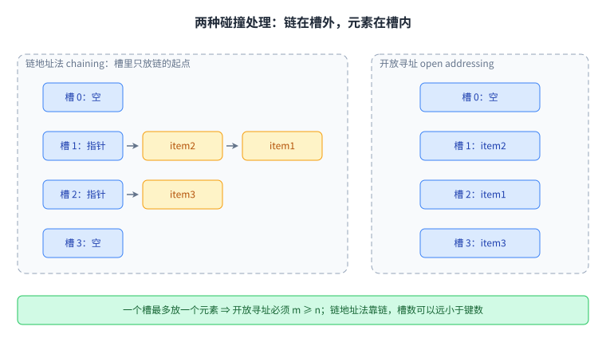
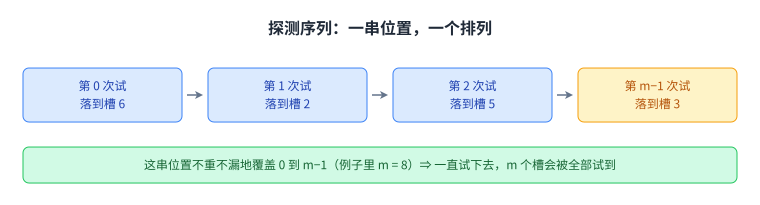
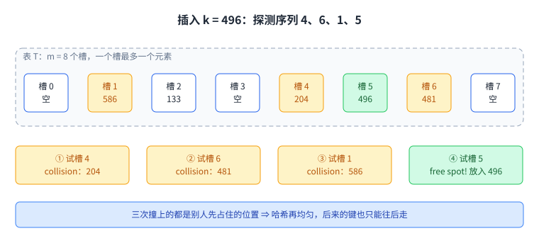
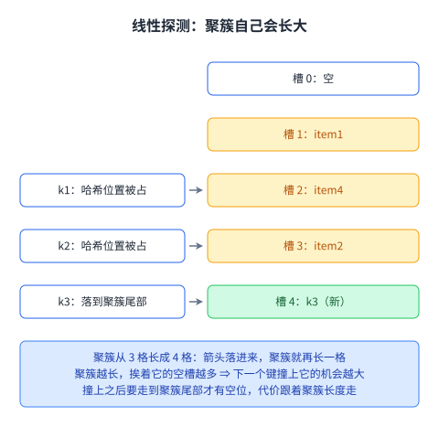
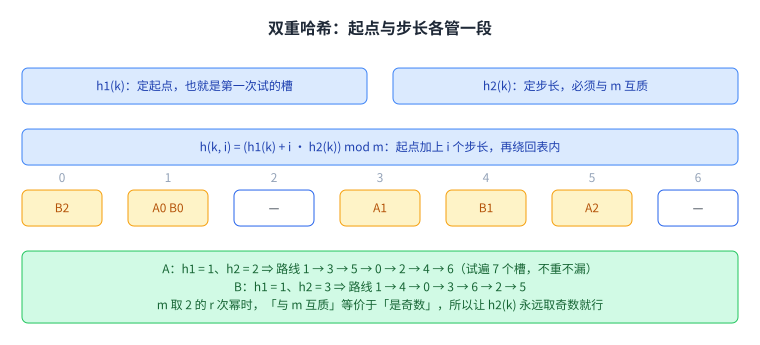
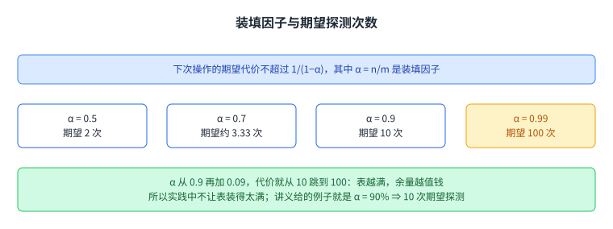
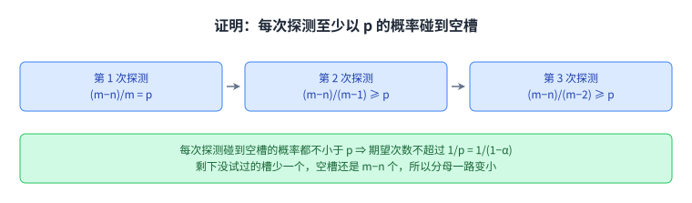
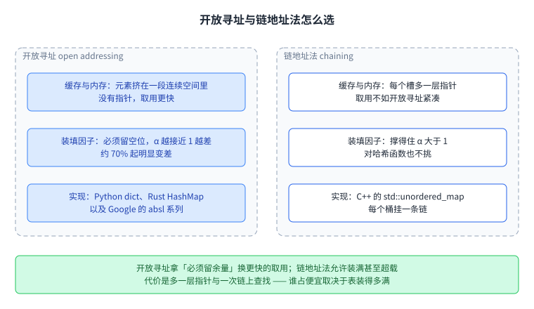
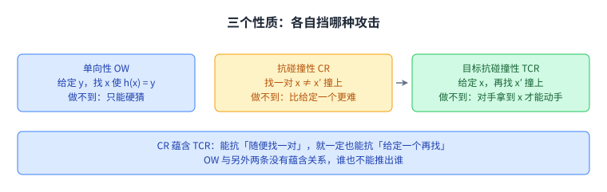
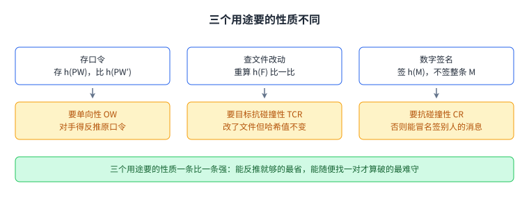

+++
title = "开放寻址与密码学哈希"
lecture = 10
slug = "open-addressing-cryptographic-hashing"
status = "draft"
source_kind = "notes"
source_url = "https://ocw.mit.edu/courses/6-006-introduction-to-algorithms-fall-2011/resources/mit6_006f11_lec10/"
source_title = "Lecture 10: Open addressing, cryptographic hashing"
output_mode = "explanation"
+++

第 8 讲用[[term:hashing]]把字典的查找压到期望 O(1)，办法是每个槽挂一条[[term:linked-list]]。这一讲要解决的是同一个碰撞问题的另一条路：不挂链，所有元素都直接待在表本身里，一个槽最多一个元素。位置被别人占了就换个位置再试，前半程回答的就是「换位置的规矩」与「这么换要付多少代价」。

后半程换了目标，讲[[term:cryptographic-hash-function]]。两者都叫哈希，要求却相反：表里的哈希要算得快，密码学里的哈希要让人算不出来。

## 一、不挂链：元素自己占一个槽

讲义这一讲指定的阅读材料是 CLRS 第 11.4 节，另外两节 11.3.3 与 11.5 标注的是「有兴趣再看」。它把这件事放在 Another approach to collisions 这个标题下面，三条要点逐条抄下来是：

> 原文：no chaining; instead all items stored in table (see Fig. 1)

> 原文：one item per slot =⇒ m ≥ n

> 原文：hash function specifies order of slots to probe (try) for a key (for insert/search/delete), not just one slot

数一遍是三条。第一条说链没有了，元素都存在表本身里。第二条是这个决定的直接后果：一个槽最多放一个元素，所以槽数 m 不能少于键数 n。第 8 讲的[[term:chaining]]没有这个限制，槽数可以比键数小很多，多出来的元素顺着链挂下去；[[term:open-addressing]]没有这个余地，表本身就得装得下全部元素。

第三条是全部难点所在。[[term:hash-function]]不再只报一个位置，而是报一串位置的先后次序，插入、查找、删除三个动作都要按这个次序走。

讲义自己画的 Figure 1 是一张竖着的表格，三行里各放一个元素，写的是 item2、item1、item3，槽里没有别的东西。下面这张图把两种做法并排放在一起看。

两张图的差别只在槽里装什么：左边装的是链的起点，右边装的是元素本身。省掉指针是开放寻址的好处，代价是多了一个动作，也就是[[term:probing]]（探测）。

## 二、哈希函数多了第二个参数

开放寻址的哈希函数比上一讲多一个参数，讲义用一行写清了它的类型：

> 原文：h : U × {0, 1,...,m − 1} → {0, 1,...,m − 1}

式子下面有三个标注，说明这三个位置各是什么：U 是键域，第二个参数是第几次尝试，右边那一串是表里的槽。所以 h(k, i) 读作「键 k 第 i 次试的时候落在哪个槽」。i 从 0 数起，第 0 次就是第一次尝试。这一串位置合起来叫[[term:probe-sequence]]（探测序列）。

光有一个函数还不够，讲义要的是它给出的整串值满足一条性质：

> 原文：is a permutation of 0, 1, . . . , m − 1. i.e. if I keep trying h(k, i) for increasing i, I will eventually hit all slots of the table.

这串值必须是 0 到 m−1 的一个[[term:permutation]]。换个说法：i 一路加上去，m 个槽会被一个一个全部试到，既不重复也不遗漏。这条性质让探测有了终点，最坏的情况是把整张表走完，那时一定能碰到空格。

这张图要记住的是「一串」这两个字。链地址法里，哈希函数给出一个槽，事情就结束了；开放寻址里，它给出的是一条路线。

## 三、插入与查找：探测到空格子为止

插入的规则讲义只用一句话说：

> 原文：Insert(k,v) : Keep probing until an empty slot is found. Insert item into that slot.

一直探，直到碰到一个空槽，把元素放进去。跟的是一段五行[[term:pseudocode]]：

> 原文：for i in xrange(m): / if T[h(k, i)] is None: # empty slot / T[h(k, i)] = (k, v) # store item / return / raise 'full'

循环把 m 个候选槽走一遍。碰到空的就写进去、返回；走完一遍仍然没有空位，说明表满了，抛 full。注释里那个 empty slot 与 store item 是讲义自己标的。这段代码是 Python 的写法，xrange 与 raise 后面那串字符都是它的记号。

查找的规则多一个提前退出的条件：

> 原文：Search(k): As long as the slots you encounter by probing are occupied by keys ≠ k, keep probing until you either encounter k or find an empty slot—return success or failure respectively.

读法是：沿探测序列往下走，遇到别的键就继续，遇到 k 就成功，遇到空槽就失败。空槽是终止信号，因为按插入的规则，一个键如果要在这条路线上，它一定被放在碰到空槽之前的位置。查找的[[term:pseudocode]]有六行，比插入多了两处返回。

讲义给的例子是插入 k = 496，表里有 8 个槽，已经躺着四个键。图里把每次探测的结果都标了出来：

> 原文：probe h(496,0)=4 / probe h(496,1)=6 / probe h(496,2)=1 / probe h(496,3)=5

数一遍是四次探测。槽 4 里是 204，槽 6 里是 481，槽 1 里是 586，三次都撞上了别人，图里在这三处标的就是 collision。第四次落在槽 5，那里是空的，图里标的是 free spot!，元素就放进槽 5。

例题里的三次碰撞说明一件事：即使哈希函数挑的位置很均匀，先来的人已经把位置占了，后来的就得往下走。这一类等待正是后面要算的代价。

## 四、删除：不能把格子清成空

开放寻址的删除比插入和查找都别扭，讲义列了三条：

> 原文：can't just find item and remove it from its slot (i.e. set T[h(k, i)] = None)

> 原文：example: delete(586) =⇒ search(496) fails

> 原文：replace item with special flag: "DeleteMe", which Insert treats as None but Search doesn't

第一条说不能找到就挖掉、把槽设成空。第二条用上一节那个例子说明为什么。586 躺在槽 1，而槽 1 正是 496 探测序列里第三次要经过的位置。如果把槽 1 挖成空，再查 496 就会在槽 1 处看到空槽而停下，返回「没找到」。这个判断是错的，496 明明还在槽 5 里躺着。

第三条是补救：删掉的位置不设成空，而是塞一个特殊标记 DeleteMe，这种标记也叫[[term:tombstone]]（墓碑标记）。插入把它当空位用，可以往里放新元素；查找不把它当空位，会继续往下探。同一个格子对两个动作表现出两种含义，这就是删除要付的代价。

三个小画面讲的是同一件事的三种状态：直接挖空的后果、加标记之后的结果、以及标记对两个动作的不同含义。

## 五、线性探测与聚簇

先试最简单的探测次序，讲义叫它[[term:linear-probing]]：

> 原文：h(k, i) = (h′(k) +i) mod m where h′(k) is ordinary hash function

h′(k) 就是上一讲那种普通哈希函数，只报一个位置。线性探测在这个位置上依次加一，到表尾绕回表头。讲义给了一个日常比方，像在街边找车位：一号位满了就试二号位，二号位满了就试三号位。

代价也来自这个比方：

> 原文：problem? clustering—cluster: consecutive group of occupied slots

> 原文：as clusters become longer, it gets more likely to grow further (see Fig. 4)

一组连续被占的槽叫 [[term:clustering]]，中文说聚簇。聚簇有两个性格。一是它会自己长大：聚簇越长，挨着它的空格越多，下一个落进来的键撞上这个聚簇的概率就越大。二是撞上之后要走的格子更多，因为得一直走到聚簇的尾巴才能找到空位。讲义给的量是：

> 原文：can be shown that for 0.01 < α < 0.99 say, clusters of size Θ(log n).

装填因子 α 在 0.01 与 0.99 之间时，聚簇的长度是 Θ(log n)。这句话的意思是聚簇的长度跟着元素个数缓慢增长，比线性慢得多，但也不是常数。

这张图画的是讲义 Figure 4 的同一件事：左边几个箭头代表可能落到这里的键，右边那段连着的槽就是聚簇，箭头落进来，聚簇就再长一格。

## 六、双重哈希：用第二个哈希函数定步长

线性探测的问题是步长固定为 1，所以撞在一起的人永远排在一块。办法是让步长也随键变：

> 原文：h(k, i) =(h1(k) +i·h2(k)) mod m where h1(k) and h2(k) are two ordinary hash functions.

这里有两个普通哈希函数。h1(k) 定起点，h2(k) 定步长，第 i 次试的位置就是起点加上 i 个步长。这套做法叫[[term:double-hashing]]（双重哈希）。键不同，起点和步长都不同，于是撞在一起的键不会一路黏着。

步长不能随便取，否则探测序列会兜圈：

> 原文：actually hit all slots (permutation) if h2(k) is relatively prime to m for all k

只要 h2(k) 与 m 互质，整串值还是 0 到 m−1 的一个排列，m 个槽仍然能全部试到。讲义跟着问了一句 why?，然后给了理由：

> 原文：h1(k) + i · h2(k) mod m = h1(k) + j · h2(k) mod m ⇒ m divides (i − j)

两边相减，等式变成 m 整除 (i−j)·h2(k)。因为 h2(k) 与 m 互质，m 的因子不可能藏在 h2(k) 里，只能整份落在 (i−j) 上。所以 i 与 j 在 0 到 m−1 范围内只能相等，也就没有重复的槽。

最后一行的取法很省事：

> 原文：e.g. m = 2r, make h2(k) always odd

把 m 取成 2 的 r 次幂，那么「与 m 互质」就等价于「是奇数」，只要让 h2(k) 永远返回奇数就行。判断互质变成判断奇偶。

把它和上一节对照着看就清楚了：线性探测里所有人的步长都是 1，双重哈希给了每个键一条自己的步长。

## 七、均匀哈希假设与期望代价

要算期望，先得给按键的分布立一个假设。上一讲的假设管的是键落到哪个槽，这一讲的假设管的是探测序列：

> 原文：Uniform Hashing Assumption (cf. Simple Uniform Hashing Assumption)

> 原文：Each key is equally likely to have any one of the m! permutations as its probe sequence

每个键的探测序列在 m! 个排列里等可能地取一个。讲义自己也说这个假设不真，但给了台阶：

> 原文：not really true

> 原文：but double hashing can come close

不真，不过双重哈希能接近它。括号里的 cf. 指向第 8 讲的[[term:simple-uniform-hashing]]（简单均匀哈希），两者是同一类工具，只是作用对象从「落到哪个槽」换成了「走哪条路线」。

在[[term:uniform-hashing-assumption]]下，代价有一个干净的式子：

> 原文：Suppose we have used open addressing to insert n items into table of size m. Under the uniform hashing assumption the next operation has expected cost of ≤ 1/(1−α), where α = n/m(< 1).

表里已经插了 n 个元素，表的大小是 m，下一次操作的期望代价不超过 1/(1−α)，其中 α = n/m。[[term:load-factor]]在这里的分母不再是链长，而是「空槽的比例」。它越接近 1，剩下的空槽越少，平均要试的次数涨得越快。

讲义给的例子是：

> 原文：Example: α = 90% =⇒ 10 expected probes

按式子算一遍：1/(1−0.9) = 1/0.1 = 10，对得上。再补几个值，算式一样：

| 装填因子 α | 期望探测次数 1/(1−α) |
| --- | --- |
| 0.5 | 1/0.5 = 2 次 |
| 0.7 | 1/0.3 ≈ 3.33 次 |
| 0.9 | 1/0.1 = 10 次 |
| 0.99 | 1/0.01 = 100 次 |

后三行是我们按同一个式子算出来的，讲义只给了 0.9 那一行。

表里能看出来的趋势是：α 从 0.9 再加 0.09，代价就从 10 跳到 100。表快满的时候，每次多留一点余量，省下的代价都很可观，这也是实践中不让表太满的原因。

## 八、证明：每次探测至少以 p 的概率碰到空槽

式子是靠一个概率论证出来的。讲义先假定要插的键不在表里，表里有 n 个已占的槽和 m−n 个空槽：

> 原文：probability first probe successful: (m−n)/m =: p

第一次探测的槽是等可能的，所以撞上空槽的概率是空槽比例 (m−n)/m，讲义把它记作 p。注意 p 就是 1−α。

> 原文：if first probe fails, probability second probe successful: (m−n)/(m−1) ≥ (m−n)/m = p

第一次失败之后，剩下 m−1 个槽没试过，空槽还是 m−n 个。分母小了一点，分子没变，所以这个比值不小于 p。

> 原文：if 1st & 2nd probe fail, probability 3rd probe successful: (m−n)/(m−2) ≥ (m−n)/m = p

第三次同理，分母变成 m−2，比值仍然不小于 p。讲义写到这里打住：

> 原文：⇒ Every trial, success with probability at least p.

每一次探测碰到空槽的概率都不小于 p。这是一个下界，所以后面算出来的次数是一个上界。

> 原文：Expected Number of trials for success? 1/p = 1/(1−α).

一次成功概率不低于 p 的试验，它的期望次数不超过 1/p。把 p = 1−α 代进去，就是 1/(1−α)。用第七节那组数验一遍：m = 100、n = 90 时 p = 10/100 = 0.1，1/p = 10 次；第二次的分母是 99，10/99 ≈ 0.101；第三次的分母是 98，10/98 ≈ 0.102。后两个都比 0.1 大，与式子里的 ≥ 一致。

讲义最后把这句结论推广到另外两个动作：

> 原文：With a little thought it follows that search, delete take time O(1/(1 − α)). Ditto if we attempt to insert an item that is already there.

查找和删除也是 O(1/(1−α))。用同样的理由补一句，插入一个已经在表里的键也一样快。这句推论讲义没有展开，它把证明停在了插入新键上。

图的读法是从左到右看分母：分子一直是空槽的个数 m−n，分母一路变小，所以三个概率一个比一个大，最小的是 p，期望次数就被 1/p 卡住了。

## 九、开放寻址与链地址法怎么选

两种做法各有便宜可占，讲义分两段说：

> 原文：Open Addressing: better cache performance (better memory usage, no pointers needed)

> 原文：Chaining: less sensitive to hash functions (OA requires extra care to avoid clustering) and the load factor α (OA degrades past 70% or so and in any event cannot support values larger than 1)

开放寻址的优势在内存和缓存：没有指针，元素挤在一段连续的空间里，取用时的局部性更好，同样的空间也装得下更多元素。Python 的 dict 与 set、Rust 标准库的 HashMap、Google 的 absl 系列走的都是这条路。链地址法的优势是皮实：对哈希函数没那么挑，也不用担心聚簇，C++ 的 std::unordered_map 就是每个桶挂一条链。链地址法的装填因子涨过 70% 左右才开始明显变差，而且它撑得住 α 大于 1，也就是元素比槽多的局面。开放寻址撑不住，因为一个槽放不下两个元素。

一句话的取舍是：开放寻址把「表要留余量」当成硬条件，换来更快的取用；链地址法允许表装满甚至超载，代价是多一层指针和一次链上的查找。

左右两列是同一组取舍的两面：左边那列的条件越严，右边那列就越稳。

## 十、密码学哈希：定义与三个性质

后半程从数据结构转到安全。讲义先给定义：

> 原文：A cryptographic hash function is a deterministic procedure that takes an arbitrary block of data and returns a fixed-size bit string, the (cryptographic) hash value, such that an accidental or intentional change to the data will change the hash value.

这个函数是确定性的：任意长度的一段数据进去，固定长度的一串比特出来，这串比特叫哈希值。数据哪怕只改一点点，哈希值也应该跟着变。讲义顺手给了两个别名：进去的那段数据叫消息，出来的那串比特也叫[[term:message-digest]]。

接着它把参数交代清楚：

> 原文：d is the number of bits in the output of the hash function. You can think of m as being 2d. d is typically 160 or more.

d 是输出的位数，输出的取值一共有 2 的 d 次方种，d 通常取 160 或者更大。讲义补了一句用途：这些函数也能拿来当哈希表的下标，但它们主要还是用在安全上。

然后是三个性质，逐条抄下来是：

> 原文：One-Way (OW): Infeasible, given y ∈ {0, 1}d to find any x s.t. h(x) = y.

> 原文：Collision-resistance (CR): Infeasible to find x, x′, s.t. x ≠ x′ and h(x) = h(x′).

> 原文：Target collision-resistance (TCR): Infeasible given x to find x′ ≠ x s.t. h(x) = h(x′).

数一遍是三条。[[term:one-way]]说的是反推：随便给一个输出 y，想找一个输入 x 让 h(x) 等于 y，做不到。[[term:collision-resistance]]说的是找一对：想找出两个不同的输入 x 与 x′，让它们的哈希值相等，做不到。[[term:target-collision-resistance]]说的是给定一个输入再找对手：先给你一个 x，你想找另一个 x′ 与它撞上，做不到。

三条之间的关系讲义写得很清楚：

> 原文：TCR is weaker than CR. If a hash function satisfies CR, it automatically satisfies TCR. There is no implication relationship between OW and CR/TCR.

第三条比第二条弱。能抗碰撞的，一定也能抗目标碰撞，因为「随便找一对」比「给定一个再找另一个」更难。反过来不成立。至于单向性，它和另外两条之间没有蕴含关系，谁也不能推出谁。

图里三条并排，箭头只有一条：抗碰撞性指向目标抗碰撞性。单向性单独站在一边，跟另外两条都没有箭头相连。

## 十一、三个用途各自要哪条性质

讲义给了三个用途，每个都点明了需要哪条性质。第一个是存口令：

> 原文：Password storage: Store h(PW), not PW on computer. When user inputs PW′, compute h(PW′) and compare against h(PW).

存的是口令的哈希值，不是口令本身。用户下次输入 PW′，算一遍 h(PW′) 与存着的那份比。这个用途要的是单向性，因为对手拿到的是哈希值，他得反推出原口令才有用。讲义特意说明抗碰撞性在这里不重要，对手并不知道原文，撞上一两个也无所谓。

第二个是查文件有没有被改：

> 原文：File modification detector: For each file F, store h(F) securely. Check if F is modified by recomputing h(F).

给每个文件存一份哈希值，要查的时候重算一遍比对。讲义说这个用途要的是目标抗碰撞性，因为对手的赢法是改掉文件而不让哈希值变，这正是「给定一个输入再找另一个」。

第三个是[[term:digital-signature]]：

> 原文：Digital signatures: ... For large M it is easier to sign h(M) rather than M, i.e., σ = sign(SKA, h(M)).

消息很长的时候，直接签整条消息不方便，改成签它的哈希值。这个用途要的是抗碰撞性：如果对手能造出 x′ 与 Alice 签过的 x 撞上，他就能对外声称 Alice 签的是 x′。

三个用途排在一起看，需要一条比一条强的性质：能反推就够了的地方最省，能随便找一对才算破的地方最难守。

讲义最后一节说现状，一共两条要点。一是这类函数的提案很多，其中一些已经被攻破，它点名的例子是 MD-5：

> 原文：MD-5, for example, has been shown to not be CR.

二是当年还在选新的标准：

> 原文：There is a competition underway to determine SHA-3, which would be a Secure Hash Algorithm certified by NIST.

讲义写这句话是 2011 年秋，那时 SHA-3 还在比选，2012 年 NIST 选定了 Keccak 这一族作为 SHA-3，这句是我们补的后续。顺带两句也由我们补上：MD-5 的输出只有 128 位，连上面那条「d 通常取 160 或更大」都没达到；Java 的 MessageDigest 里至今能拿到 MD-5 与 SHA 系列。最后讲义感慨了一句难度：密码学哈希比哈希表里用的那种复杂得多，可以把它想成把普通哈希反复跑很多很多遍，中间插进伪随机置换。

## 读完应该能回答

- 开放寻址与链地址法在形状上的差别是什么，为什么开放寻址要求 m ≥ n；
- 探测序列为什么必须是 0 到 m−1 的一个排列，这个要求保证了什么；
- 查找为什么不走完整张表就能停下来，空槽为什么是终止信号；
- 删除时为什么不能把槽设成空，DeleteMe 对插入与查找的含义有什么不同；
- 聚簇为什么会自己长大，线性探测与双重哈希在这一点的差别在哪里；
- 均匀哈希假设说的是什么，期望代价 1/(1−α) 里的 α 是什么；
- 单向性、抗碰撞性、目标抗碰撞性各自挡的是哪种攻击，多出来的那条蕴含是哪一个；
- 存口令、查文件改动、数字签名这三个用途各自需要哪条性质。

## 脉络回顾

这一讲把第 8 讲留下的碰撞问题补完了。第 8 讲选了链地址法，元素挂在槽外面；这一讲选了另一条路，元素待在槽里面，用一个探测序列决定试哪些位置。两条路的期望代价形状一样，都靠空余量把每次操作压到 O(1)，只是第 8 讲衡量的是链有多长，这一讲衡量的是空槽还剩多少。

两条路的承诺强弱不同。链地址法的最坏情况是 Θ(n)，而开放寻址的最坏情况也是 Θ(n)，聚簇把整张表连成一片时，每次插入都要走到底。讲义对两者都只给了期望与平均值，没有哪一个拿到了对所有输入都成立的好上界。开放寻址还多一条硬约束：装填因子不能超过 1，表里必须一直留着空位，所以删除只能靠标记，标记又会让空间看起来更满。

往后看，这一讲最后那段关于密码学的内容和前面不是一个目标。前面在算「多久能取出一个元素」，后面在算「别人多久能造出一个假的」。同一个词在两边指的是不同的东西，这一页把它们放在一起，正好能看清「难」有两种：「算不快」和「算不出来」。算法课到这一讲为止把哈希这条线走完，数值那一讲还要再用一次哈希，那时用的是它当伪随机源的另一面。

## 溯源

本讲的内容来自 MIT 6.006 Fall 2011 的 Lecture 10 讲义（typed notes 8 页，第 8 页是 OCW 版权页，正文 7 页）。标题有两处写法，讲义页眉与标题页都写 Lecture 10: Hashing III: Open Addressing，而 OCW 资源页与讲次清单的逐字标题是 Open addressing, cryptographic hashing，本页以后者为准。

事实都能在上述讲义里逐条对上：第 1 页的三条目录与 Readings 的三个章号（11.4、11.3.3、11.5）、Another approach to collisions 与开放寻址的三条要点（不挂链、一个槽一个元素所以 m ≥ n、哈希函数给出一串待探测的槽）、Figure 1 的三行 item2 / item1 / item3、h 的类型 U × {0,…,m−1} → {0,…,m−1} 与图下三个标注（universe of keys、trial count、slot in table）、⟨h(k,0), …, h(k,m−1)⟩；第 2 页的「是 0 到 m−1 的一个排列」与「一直试下去会碰遍所有槽」、Figure 2、插入的规则与五行代码（xrange(m)、None、store item、raise 'full'）、插入例子 k = 496、查找的规则与六行代码（空槽终止、exhausted table）；第 3 页的 Figure 3（槽 0 到 7、586 在槽 1、133 在槽 2、204 在槽 4、481 在槽 6、496 落在槽 5、三次 collision 与一处 free spot!、四次探测 4 / 6 / 1 / 5）、删除的三条（不能设成 None、delete(586) 会让 search(496) 失败、DeleteMe 对 Insert 当 None 而对 Search 不当）、线性探测的式子与三条要点（像街边找车位、聚簇的定义与越长越容易再长、0.01 < α < 0.99 时聚簇长度 Θ(log n)）、双重哈希的式子；第 4 页的 Figure 4（Primary Clustering）、双重哈希的两条（h2(k) 与 m 互质就仍能试遍所有槽、why? 那行 m 整除 (i − j)）与 m = 2^r 时让 h2(k) 取奇数、均匀哈希假设（m! 个排列、not really true、双重哈希能接近）、Analysis 一段与 α = 90% 给出 10 次期望探测；第 5 页的证明三条（分母 m、m−1、m−2，后两个 ≥ p）、Every trial 那句、期望次数 1/p = 1/(1−α)、search 与 delete 同为 O(1/(1−α)) 那句、开放寻址与链地址法的两段比较（缓存与内存、对哈希函数与 α 的敏感度、70% 左右开始变差、撑不住大于 1 的 α）、密码学哈希的定义一段；第 6 页的 d 与 2^d 与 160、三个性质 OW / CR / TCR 的原文与它们之间的关系（TCR 弱于 CR、CR 蕴含 TCR、OW 与它们没有蕴含关系）、三个用途（存口令要 OW、文件改动检测要 TCR、数字签名要 CR）；第 7 页的数字签名收尾与实现现状一段（提案很多、有的被攻破、MD-5 已知不抗碰撞、SHA-3 正在比选、密码学哈希比表里用的复杂得多、可以想成反复跑普通哈希并插入伪随机置换）。

### 我们补的

讲义没有写的部分，以下是我们补的：这篇中文讲解本身（讲义是英文提纲），全部 11 张配图（讲义里的 Figure 1 到 Figure 4 一律重画，没有转载任何一页），以及八处展开说明：

1. 第 1 节把两条路的分工读成「槽里装链还是装元素」，并指出链地址法对 m 与 n 的宽松来自链；
2. 第 7 节把 p = (m−n)/m 认成 1−α，并补了 α 为 0.5、0.7、0.99 三个值的期望探测次数（那张表的后三行），讲义只给了 0.9 那一行；
3. 第 8 节用 m = 100、n = 90 把三个分母算了一遍（0.1、10/99 ≈ 0.101、10/98 ≈ 0.102），用来核对式子里的 ≥，讲义只给了符号形式；
4. 第 9 节把两段比较合成一句话的取舍，并指出开放寻址还多一条「必须留空位」的硬约束；
5. 第 10 节把三个性质各自挡的攻击读成「反推」「找一对」「给定一个再找另一个」，讲义只给了形式定义；
6. 第 11 节补了 SHA-3 的后续（2012 年 NIST 选定 Keccak 这一族），也补了 MD-5 输出 128 位、没达到讲义那条 160 位的门槛，这两句讲义没有；
7. 第 9 节点出 CPython 的 dict 与 set、Rust 标准库的 HashMap（hashbrown）与 Google 的 absl 系列用开放寻址，C++ 的 std::unordered_map 用链地址法，讲义没有点名任何实现；
8. 脉络回顾里把两种「难」并排放（算不快与算不出来），以及第 11 讲还会再用一次哈希那句预告，是我们串的。

### 另外五处登记

一是**抽取器造成的假象**：第 2 页查找那段的条件、第 6 页 CR 与 TCR 两处的条件，原文都是「不等于」，两条文本抽取（pypdfium2 与 pypdf）都读成了等号，我们对着渲染页核过之后按 ≠ 照录。同一类的还有三处：第 2 页代码注释的 # 在两份抽取里分别成了别的字形，第 2 页 `T[h(k, i)][0]` 的下标 0 被抽成了 ∅，第 3 页线性探测式子里的 h′ 被其中一份抽取读成了 h 下标 0，这些都以渲染页为准。

二是**源里的不等号方向不同**：CR 写作 x ≠ x′，TCR 写作 x′ ≠ x，排版上两个不等号的位置相反，含义都是「两个输入不相同」，我们照录原样。

三是**源自身的松紧不一致**：第 1 页写 m ≥ n，也就是 α ≤ 1；第 4 页写 α = n/m (< 1)，把等号去掉了。表刚好装满时 α 等于 1，1/(1−α) 就没有意义。我们照录两处，不改源，并在第七节用 α = 0.9 与 α = 0.99 这两个小于 1 的值做例子。

四是**源自己划出的界限**：证明里明写 With a little thought it follows 之后才把结论推广到查找与删除，还补了一句插入已有元素也一样；这三句都不在证明范围内，我们照录「讲义没有展开」，没有替它补证明。第 5 节的聚簇长度 Θ(log n) 在讲义里也是「can be shown that」一句带过，同样没有给推导。

五是**署名**：讲义正文没有「Courtesy of MIT Press. Used with permission.」这类第三方授权声明（检索 Courtesy 与 MIT Press，0 命中），讲义里也没有 TODO 之类的待补标记（检索 TODO，0 命中）；OCW 资源页的 JSON-LD 与页脚都是 CC BY-NC-SA 4.0。本页只转述结论、配图全部重画，未转载任何一页。
