+++
title = "整数运算与 Karatsuba 乘法"
lecture = 11
slug = "integer-arithmetic-karatsuba"
status = "draft"
source_kind = "notes"
source_url = "https://ocw.mit.edu/courses/6-006-introduction-to-algorithms-fall-2011/resources/mit6_006f11_lec11/"
source_title = "Lecture 11: Integer arithmetic, Karatsuba multiplication"
output_mode = "explanation"
+++

第 9 讲把哈希表怎么长大、怎么缩回算完了，第 10 讲换了哈希函数，两讲的题目都还落在「一个集合里放键」上面。这一讲离开哈希，进入 OCW 讲义页归在 Unit 4: Numerics 的那两讲。要解决的问题换成了数字本身：位数长到几百位、几百万位的时候，怎么把它们算准、算快。讲义给出的答案叫 Karatsuba 乘法，它把两个 n 位数的相乘从 θ(n²) 压到 n 的 1.585 次方。这条路上还会先路过两个看起来不像算法的题目：无理数与牛顿法。

## 一、这一讲的自述目录

讲义第一页只有三条目录。

> 原文：• Irrationals
> 原文：• Newton's Method (√a, 1/b)
> 原文：• High precision multiply ←

数一遍是：无理数、牛顿法（求 √a 与 1/b）、高精度乘法。第三条后面跟着一个红色箭头，从 High precision multiply 那一行指过来，意思是这一讲的重心落在第三条上，前两条是铺垫。

第三条与 Karatsuba 乘法直接相关，它问的是两个 n 位数怎么相乘，n 位就是 n 个数字，二进制或十进制都行。朴素做法要 θ(n²) 时间，讲义要给出一个更快的做法，再把两笔代价摆在一起比。

讲次归属要交代一句。OCW 的讲义页把第 11、12 两讲一起归进 Unit 4: Numerics，标题分别是 Integer arithmetic, Karatsuba multiplication 与 Square roots, Newton's method。资源页与讲次清单的逐字标题是前者，本页以它为准；讲义自己首页与页眉写的是 Lecture 11: Numerics I，这一处不一致我们在溯源里登记。

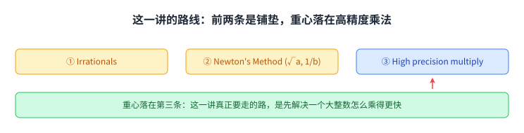

图里把三条目录摆成一排，箭头指向第三条，下面那一行是本讲真正要走的路：先解决一个大整数怎么乘得更快。

## 二、无理数：一个写不成分数的比值

讲义从毕达哥拉斯讲起。

> 原文：Pythagoras discovered that a square's diagonal and its side are incommensurable, i.e., could not be expressed as a ratio - he called the ratio "speechless"!

正方形的对角线长 √2，边长是 1，两者的比值写不成两个整数之比。讲义说他把这个比值叫作 speechless，字面意思是「说不出话的」。

[[term:irrational-number]]（无理数）就是从这一类比值进来的。它不是算不出来的数：它能被算到任意多位，只是不能写成分数。

讲义紧接着把它的小数开头排成三行。

> 原文：√2 = 1. 414 213 562 373 095
> 原文：048 801 688 724 209
> 原文：698 078 569 671 875

每行 15 位，一共 45 位，整数部分是 1。我们把这 45 位与真实展开逐位对过，完全一致。

> 原文：Motivating Question: Are there hidden patterns in irrationals?

讲义在这里提了一个动机问题：无理数里有没有藏着规律。它当时没有回答，这个问题要到本讲最后一道几何题才拐回来。

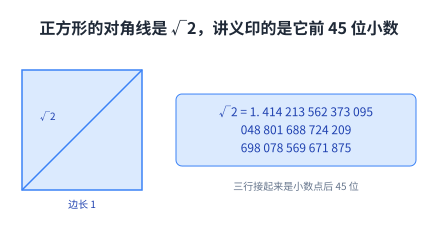

图左边是讲义 Figure 1 的那个正方形，右边是它印的三行数字。

## 三、插叙：平衡括号与卡塔兰数

讲义在这里插了一段计数，它与最后那道几何题有关。

> 原文：Set P of balanced parentheses strings are recursively defined as
> 原文：• λ ∈ P (λ is empty string)
> 原文：• If α, β ∈ P, then (α)β ∈ P

[[term:balanced-parentheses]]（平衡括号串）用两句话定完：空串算一个；如果 α 与 β 都是平衡的，那么把 α 用一对括号包起来、再接上 β，得到的仍然平衡。

> 原文：Every nonempty balanced paren string can be obtained via Rule 2 from a unique α, β pair.
> 原文：For example, (()) ()() obtained by (α)β

每个非空的平衡括号串都能按第二条规则唯一地拆成 (α)β。讲义举的例子是 (())()()：α 取第一个 ()，β 取后面的 ()()。

拆法唯一，就可以数数。

> 原文：C_n: number of balanced parentheses strings with exactly n pairs of parentheses
> 原文：C_{n+1} = Σ_{k=0}^{n} C_k · C_{n−k},  n ≥ 0

C_n 是恰好 n 对括号的平衡串个数。[[term:recurrence]]（递推式）的来处就是上面那个唯一拆法：最外面那一对括号由规则本身给出，设 α 里有 k 对，β 里就有 n − k 对。

讲义把前几项算了一遍。

> 原文：C_0 = 1  C_1 = C_0² = 1  C_2 = C_0C_1 + C_1C_0 = 2  C_3 = ··· = 5

读法是 C_0 = 1 对应空串，C_1 = C_0 · C_0 = 1，C_2 = C_0C_1 + C_1C_0 = 2，C_3 = 5。

接着是一列 30 个数，从 1, 1, 2, 5, 14, 42 一直排到 1002242216651368。我们按递推式把这 30 个全算了一遍，逐个对得上，它们就是 C_0 到 C_29。[[term:catalan-number]]（卡塔兰数）说的就是这一列。

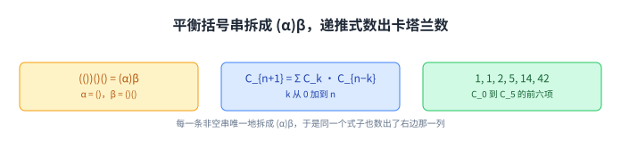

图里左边是 (())()() 的拆法，中间是递推式，右边是它的前几项。

## 四、牛顿法：顺着切线往前走

要从 √2 出发算出一个数，得有一个能反复做、每做一次更准的办法。

> 原文：Find root of f(x) = 0 through successive approximation e.g., f(x) = x² − a

[[term:newtons-method]]（牛顿法）解的是 f(x) = 0 这个方程。直觉是这样的：先随便挑一个起点，把曲线在这个点上的[[term:tangent-line]]（切线）画出来，沿着切线走到横轴，落点通常比起点更靠近根。

> 原文：Tangent at (x_i, f(x_i)) is line y = f(x_i) + f'(x_i)·(x − x_i) where f'(x_i) is the derivative.

切线方程说了两件事：它经过点 (x_i, f(x_i))，斜率是导数 f'(x_i)。把 y = 0 代进去，解出来的 x 就是落点。

> 原文：x_{i+1} = intercept on x-axis
> 原文：x_{i+1} = x_i − f(x_i)/f'(x_i)

这一步就是牛顿法的一步，整个算法是把它反复做：拿上一步的落点当起点，再画一次切线。

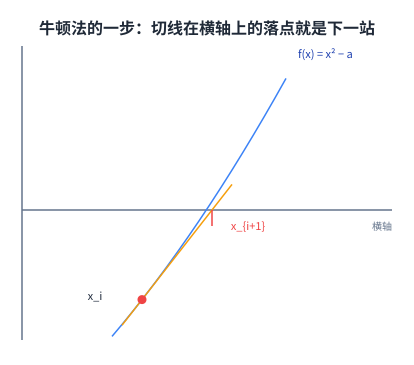

图是讲义 Figure 2 的重画，曲线取 f(x) = x² − a，红点那一步的切线与横轴相交，交点的横坐标就是 x_{i+1}。

## 五、平方根：一个能立刻上手的特例

这一节的题目是[[term:square-root]]（平方根）。把 f(x) 取成 x² − a，它的根正好是 √a。

> 原文：f(x) = x² − a

这个 f 的导数是 2x，代进牛顿法的一步。

> 原文：χ_{i+1} = χ_i − (χ_i² − a)/(2χ_i) = (χ_i + a/χ_i)/2

第二个等号是把上面通分得到的，右边那个形式每一步只用一次除法、一次加法与一次减法。

讲义把 a = 2 的五步印了出来。

> 原文：Example
> 原文：χ_0 = 1.000000000    a = 2
> 原文：χ_1 = 1.500000000
> 原文：χ_2 = 1.416666666
> 原文：χ_3 = 1.414215686
> 原文：χ_4 = 1.414213562

这五个数我们算了一遍：它们分别是 1、3/2、17/12、577/408、665857/470832 印到小数点后 9 位，而且是截断不是四舍五入，17/12 = 1.41666…，印出来是 1.416666666。与 √2 从头对齐的小数位数依次是 0、0、2、5、11，第 3 步对到 5 位，第 4 步对到 11 位。

> 原文：Quadratic convergence, `♯` digits doubles.

讲义的结论是[[term:quadratic-convergence]]（二次收敛），有效位数每步大约翻一倍。这条路要走通，还差一样东西。

> 原文：Of course, in order to use Newton's method, we need high-precision division. We'll start with multiplication and cover division in Lecture 12.

要用牛顿法就得会高精度除法，而讲义把除法推到第 12 讲，这一讲先做乘法。目录里写的 1/b 也在这一推里，正文没有展开，这一处停顿我们照录。

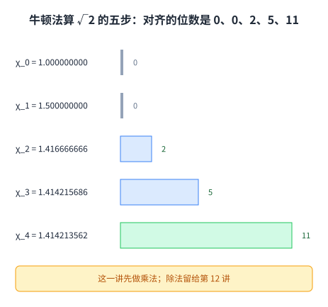

图里每一行是一个 χ 值，右边的柱子是它与 √2 从头对齐的小数位数，最下面一行写着这一讲先做乘法。

## 六、高精度计算：把「算到 d 位」写成一个整数

「把 √2 算到 d 位」这句要求在实数上不好操作，讲义把它换成一个整数。

> 原文：√2 to d-digit precision: 1.414213562373 ··· (d digits)
> 原文：Want integer ⌊10^d√2⌋ = ⌊√(2 · 10^{2d})⌋ - integral part of square root

要求的是 ⌊10^d · √2⌋，也就是把小数点往右挪 d 位之后取整。右边那个写法把 2 搬进了根号：10^d · √2 等于 √(2 · 10^{2d})。所以这道题的输入是一个 2d 位左右的整数，输出是它平方根的整数部分。两种写法我们都核过，取整之后相等。

> 原文：Can still use Newton's Method.

换成一个整数之后，牛顿法照样能用。[[term:high-precision-arithmetic]]（高精度运算）这一讲要解决的就是：d 变大时，里面的乘法怎么跟上。

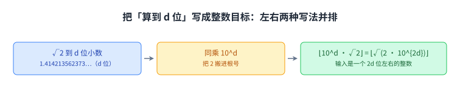

图把两种写法并排：左边是小数，右边是整数，中间那一步是把 2 搬进根号。

## 七、高精度乘法：拆成两半的朴素做法

> 原文：Multiplying two n-digit numbers (radix r = 2, 10)
> 原文：0 ≤ x, y < r^n

[[term:radix]]记作 r，讲义说取 2 或 10 都行，两个 n 位数 x 与 y 都小于 r 的 n 次方。

> 原文：x = x_1 · r^{n/2} + x_0    x_1 = high half
> 原文：y = y_1 · r^{n/2} + y_0    x_0 = low half

每个数拆成两半：[[term:high-half]]（高半段）是 x_1 与 y_1，[[term:low-half]]（低半段）是 x_0 与 y_0，各自 n/2 位。

> 原文：z = x · y = x_1y_1 · r^n + (x_0 · y_1 + x_1 · y_0)r^{n/2} + x_0 · y_0

把两个式子乘开就是这一行，三项分别带 r 的 n 次方、n/2 次方与 0 次方。要知道它要几次乘法，数一遍括号内外的乘号：x_1y_1 一次，x_0y_0 一次，括号里的 x_0y_1 与 x_1y_0 各一次。

> 原文：4 multiplications of half-sized `♯`'s =⇒ quadratic algorithm θ(n²) time

一共 4 次「半规模」的乘法，代价写成 T(n) = 4T(n/2) + θ(n)：每往下走一层规模减半，子问题却变成 4 个，解出来是 θ(n²)。[[term:divide-and-conquer]]（分治法）在这里没有赚到便宜，因为子问题的个数没有降下来。

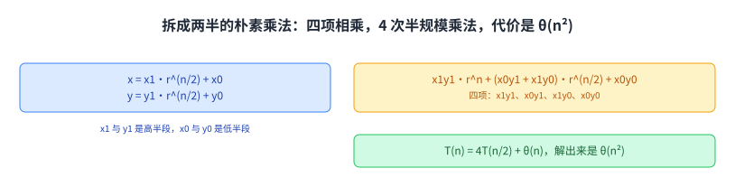

图里左边是拆半，右边是乘开的四项，右下角那句是它的结论。

## 八、Karatsuba：用三次乘法换掉第四次

[[term:karatsuba-multiplication]]（Karatsuba 乘法）的做法是重新安排这四项。

> 原文：z_0 = x_0 · y_0
> 原文：z_2 = x_1 · y_1
> 原文：z_1 = (x_0 + x_1) · (y_0 + y_1) − z_0 − z_2 = x_0y_1 + x_1y_0

第三行的等号需要验一下。把 (x_0 + x_1) · (y_0 + y_1) 乘开，得到 x_0y_0 + x_0y_1 + x_1y_0 + x_1y_1；从这个和里减掉 z_0 与 z_2，剩下的正好是 x_0y_1 + x_1y_0。

> 原文：z = z_2 · r^n + z_1 · r^{n/2} + z_0
> 原文：There are three multiplies in the above calculations.

拼回去的形式与上一节一样，只是中间那一项换成了算出来的 z_1。三次乘法是 z_0、z_1、z_2，中间两项原本要各乘一次，现在只用一次乘法加上三次加减法换出来。

拿 1234 乘 5678 走一遍，n = 4，r = 10，这一处算例是我们补的：x_1 = 12，x_0 = 34，y_1 = 56，y_0 = 78；z_0 = 34 × 78 = 2652，z_2 = 12 × 56 = 672，z_1 = (34 + 12) × (78 + 56) − 2652 − 672 = 46 × 134 − 3324 = 2840。拼起来是 672 × 10^4 + 2840 × 10^2 + 2652 = 7006652，与直接算 1234 × 5678 的结果一致。

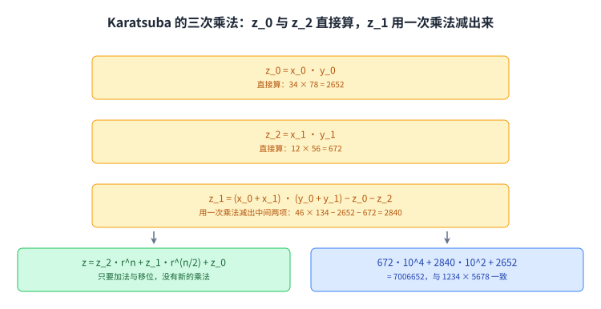

图里上面三行是三次乘法，下面是拼回去的式子与刚才那组数字。

## 九、代价：分支因子决定指数

> 原文：T(n) = time to multiply two n-digit `♯`'s
> 原文：= 3T(n/2) + θ(n)
> 原文：= θ(n^{log₂3}) = θ(n^{1.5849625···})

合并的代价 θ(n) 来自加减法与移位，递归的层数是 log₂n 层，每层把子问题乘 3。叶子数就是 3 的 log₂n 次方，等于 n 的 log₂3 次方，也就是 n 的 1.5849625… 次方。变动的只有一个数，[[term:branching-factor]]（分支因子）：从 4 换成 3。

讲义画了 Figure 3 来配这件事。左边那棵树每个节点分四支，叶子数是 4 的 log₂n 次方，等于 n 的平方；右边分三支，叶子数是 3 的 log₂n 次方。用[[term:recursion-tree]]（递归树）读它，就是每层代价 θ(n)，一共 log₂n 层。

数字上差多少，取 n = 1024 算一下（我们算的）：n² = 1048576，n 的 1.5849625… 次方约等于 59049，前者是后者的 17.76 倍。这一族递推式的解，这门课的教材 CLRS 写在主定理那一节里，讲义本身没有提它（这一处指路是我们补的）。

> 原文：This is better than θ(n²). Python does this, and more (see Lecture 12).

讲义补了一句：Python 就是这么做的，还做了更多，细节在第 12 讲。我们补一句课外的：Python 的整数与 Java 的 BigInteger 都用这一类做法，大整数乘法也是 [[term:rsa]]（RSA 加密）这类公钥算法里的地基。讲义没有点名任何实现。

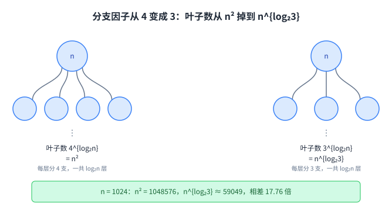

图里两棵树的高度都是 log₂n，不同的是每个节点分几支，这也决定了叶子数。

## 十、那道几何题，与每 24 位出现的卡塔兰数

讲义最后给了一道几何题，看图只有几个字母。

> 原文：BD = 1
> 原文：What is AD?
> 原文：AD = AC − CD = 500, 000, 000, 000 − √(500,000,000,000² − 1)

图里是一个圆，BD 长为 1，并且垂直于直径 CA，D 落在 CA 上，要求 AD 的长度。直径那条线上标着 1000,000,000,000，所以半径 AC 是 500,000,000,000。在直角三角形 CDB 里，CD 等于 √(AC² − BD²)；而 A、C、D 在同一条直线上，所以 AD = AC − CD。

这个差很小：500000000000 的平方减 1，开方之后与 500000000000 只差一点点，于是 AD 大约是 1.000000000000000000000001 乘 10 的负 12 次方（我们算的）。

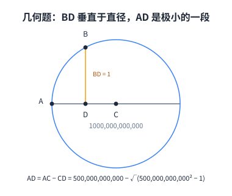

图是讲义 Figure 4 的重画：C 是圆心，CA 是半径，那条 1000,000,000,000 标的是整条直径；BD 只有 1，却足以让 AD 与 0 差得很远，只是它自己极小。

> 原文：Let's calculate AD to a million places. (This assumes we have high-precision division, which we will cover in Lecture 12.)

讲义说要把它算到一百万位，这一步又用到了第 12 讲的高精度除法。

> 原文：Remarkably, if we evaluate the length to several hundred digits of precision using Newton's method, the Catalan numbers come marching out!

意外的地方在这里：算到几百位以后，卡塔兰数会一个接一个冒出来。讲义给的 demo 在下面这一行。

> 原文：http://people.csail.mit.edu/devadas/numerics_demo/chord.html.

讲义对这一现象的解释，开头就写明它不在课上讲。

> 原文：An Explanation
> 原文：This was not covered in lecture and will not be on a test.

解释从一个幂级数开始。

> 原文：Q(x) = c_0 + c_1x + c_2x² + c_3x³ + ...
> 原文：Q(x) = 1 + xQ(x)²

[[term:power-series]]（幂级数）的系数是 c_0、c_1、c_2 这些。如果要求 Q 等于 1 + xQ(x)²，两边同一次幂的系数必须相等，于是 c_0 = 1，c_1 = c_0²，c_2 = c_0c_1 + c_1c_0，c_3 = c_0c_2 + c_1c_1 + c_2c_0，一路下去。这正是第 3 节那个递推式，所以这一列系数就是卡塔兰数。

> 原文：Q(x) = (1 ± √(1 − 4x))/(2x)

解这个方程得到闭式，讲义取负根。把 x = 10 的负 24 次方代进去。

> 原文：10^{−12} · Q(10^{−24}) = 10^{−12} · (1 ± √(1 − 4 · 10^{−24})) / (2 · 10^{−24})
> 原文：= 500000000000 − √(500000000000² − 1)

右边那个数就是几何题里的 AD。我们核过这个等号，两边在高精度下完全相等。再把 Q 展开。

> 原文：10^{−12} · Q(10^{−24}) = c_0 10^{−12} + c_1 10^{−36} + c_2 10^{−60} + c_3 10^{−84} + ...

展开式相邻两项差 24 个数量级，所以把 AD 乘上 10 的 12 次方之后，小数第 24、48、72、96、120、144、168 位上依次落着 1、1、2、5、14、42、132，也就是 C_0 到 C_6。第 2 节那个动机问题在这里有了一个具体答案。

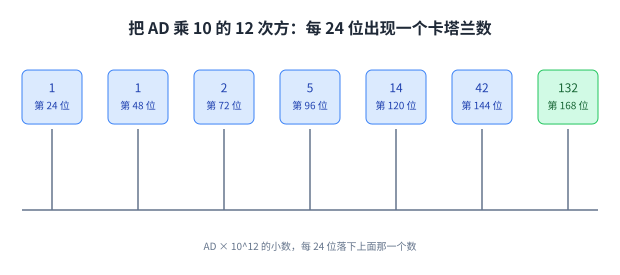

上面那条刻度是 AD 乘 10 的 12 次方之后的小数，刻度上每 24 位标一个出现的数。

## 读完应该能回答

- 讲义为什么从一个正方形的对角线与边长讲起，无理数在这里扮演什么角色；
- 平衡括号串的两条规则怎么数出卡塔兰数，递推式的每一项来自哪里；
- 牛顿法的一步在几何上做的是什么，迭代式里的每一项来自哪里；
- 把 f(x) 取成 x² − a 之后迭代式变成什么样，讲义那五个 χ 值各自对到 √2 的几位；
- 「把 √2 算到 d 位」为什么能改写成一个大整数的平方根；
- 拆成两半的朴素乘法为什么要 4 次乘法，代价为什么是 θ(n²)；
- Karatsuba 用哪三次乘法换掉了第四次，递归式与指数分别是什么；
- 那道几何题里 AD 为什么那么小，卡塔兰数为什么会每 24 位出现一次。

## 脉络回顾

这一讲把话题从「一个键放在集合里的哪里」换成了「一个数本身怎么算」。前两讲关心一张表怎么组织，这一讲关心一个数的位数变长以后，基本运算还剩下多少代价。

代价的形状值得记一下。拆成两半的乘法把规模减半、把子问题乘 4，于是 θ(n²)；Karatsuba 只改了子问题的个数，把 4 换成 3，指数就掉到 1.585。这个思路与第 3 讲的归并排序同源：归并排序是 T(n) = 2T(n/2) + θ(n)，叶子数是 n，多出来的只是一个 log 因子。

这一讲只做完了乘法。牛顿法要用高精度除法，几何题要算到一百万位，两个口子都推给了第 12 讲。它自己留下的东西是三样：一个动机问题（无理数里有没有规律），一个工具（牛顿法），以及一个把大整数乘法变快的算法。

## 溯源

本讲的内容来自 MIT 6.006 Fall 2011 的 Lecture 11 讲义（typed notes，8 页；第 8 页是 OCW 版权页，正文 7 页）。标题要说明一处：OCW 资源页与讲次清单的逐字标题是 Integer arithmetic, Karatsuba multiplication，而讲义首页与每页页眉都写 Lecture 11: Numerics I，本页以资源页为准。这一讲的资源页只有 typed notes，没有同一讲的手写原稿（本课程其他多数讲次两版都有），所以本页没有第二版本可以对照。

事实都能在上述讲义里逐条对上。第 1 页的自述目录三条（Irrationals、Newton's Method (√a, 1/b)、High precision multiply 加一个红色箭头）、毕达哥拉斯与 speechless、Figure 1 的正方形（边长 1、对角线 √2）、Pythagoras worshipped numbers 与 All is number 与 Irrationals were a threat! 三行、动机问题、√2 的 45 位小数；第 2 页的平衡括号串两条递归规则与唯一拆法 (())()()、C_n 的定义、C_{n+1} = Σ_{k=0}^{n} C_k · C_{n−k} 与 n ≥ 0、C_0 到 C_3 的算式、从 1 到 1002242216651368 的 30 个数；第 3 页的 Find root of f(x) = 0、Figure 2、切线方程、x_{i+1} = intercept on x-axis、x_{i+1} = x_i − f(x_i)/f'(x_i)、Square Roots 的 f(x) = x² − a、χ 的迭代式与第二个等号、χ_0 到 χ_4 的五个值、Quadratic convergence 与 `♯` digits doubles、要用牛顿法就得先有高精度除法、除法留给第 12 讲；第 4 页的高精度计算（√2 到 d 位、要求 ⌊10^d√2⌋ = ⌊√(2 · 10^{2d})⌋、还能用牛顿法）、High Precision Multiplication 的拆半与乘开、4 次半规模乘法与 θ(n²)；第 4 至 5 页的 Figure 3 与两棵树（4T(n/2) 与 3T(n/2)、log₂n、4^{log₂n} = n²、3^{log₂n} = n^{log₂3}）、z_0 与 z_1 与 z_2 的定义与三次乘法、z 的拼接、T(n) = 3T(n/2) + θ(n) = θ(n^{log₂3}) = θ(n^{1.5849625···})、This is better than θ(n²) 与 Python does this, and more；第 5 页的 Figure 4、BD = 1、What is AD?、AD = AC − CD = 500,000,000,000 − √(500,000,000,000² − 1)、算到一百万位与除法留给第 12 讲；第 6 页的 Catalan numbers come marching out 与那个 demo 地址、An Explanation 开头声明不在课上讲也不考、Q(x) 的幂级数、Q(x) = 1 + xQ(x)²、系数相等得到的四条、Q(x) = (1 ± √(1 − 4x))/(2x) 与取负根；第 7 页的 10^{−12} · Q(10^{−24}) 的两条式子、c_0 10^{−12} + c_1 10^{−36} + c_2 10^{−60} + c_3 10^{−84} + …、以及 every twenty-fourth position 这句观察。

讲义没有写的部分，以下是我们补的：这篇中文讲解本身（讲义是英文提纲），全部 11 张配图（讲义里的 Figure 1 到 Figure 4 一律重画，没有转载任何一页），以及九处展开与核算。

1. 第 2 节把 √2 的 45 位逐位对过真实展开；

2. 第 3 节按递推式把讲义那 30 个数全部重算一遍（就是 C_0 到 C_29），并把 C_0 到 C_3 的算式读出来；

3. 第 5 节把五个 χ 值还原成 1、3/2、17/12、577/408、665857/470832，量出它们与 √2 对齐的小数位数 0、0、2、5、11，并指出讲义那五行是截断不是四舍五入；

4. 第 6 节把两种写法核成同一个值；

5. 第 7 节把 4 次乘法逐个数出来，并写出 T(n) = 4T(n/2) + θ(n) 这个递归式与它的解；

6. 第 8 节的 1234 × 5678 算例、z_0 与 z_1 与 z_2 的具体数字、以及拼接验算，讲义只有符号没有数字；

7. 第 9 节取 n = 1024 把两个指数算成 1048576 与 59049，得出 17.76 倍；

8. 第 9 节末尾那句课外话：Python 的整数、Java 的 BigInteger、以及 RSA 这类公钥算法都用到大整数乘法，讲义只说 Python does this；

9. 第 9 节把 CLRS 的主定理与第 3 讲归并排序的递归式串过来作对照，讲义没有提这两处；第 10 节把等号 AD = 10^{−12} · Q(10^{−24}) 做高精度验证（两边完全相等），并算出小数第 24、48、72、96、120、144、168 位上的 1、1、2、5、14、42、132。

## 五处登记与溯源

另外五处登记。一是**讲义自己的停顿**：目录里写了 Newton's Method (√a, 1/b)，而正文只展开 √a，1/b 与高精度除法都被推到第 12 讲，本页照录这一停顿，没有替它补。二是**讲义的自我声明**：An Explanation 一节明写 not covered in lecture 与 not be on a test，我们照录，同时仍然转述它，因为几何题里那个现象的解释全在这一节。三是**图 4 的标签读法**：那条 1000,000,000,000 压在整条直径下方，而算式用的是半径 500,000,000,000，讲义没有明写这个标签量的是哪一段，我们按直径读，并已在第 10 节就地说明；同一张图里 BD = 1 相对半径被画得很大，那是示意图的取舍。四是**两个精度数字**：第 5 页说算到 a million places，第 6 页说 several hundred digits，两个都照录，没有替它们统一。五是**抽取器的记号**：讲义用 `♯` 当「数字」的简写（half-sized `♯`'s、two n-digit `♯`'s），两套抽取器都读成 `♯`，我们按「数字」转述。讲义正文没有「Courtesy of MIT Press. Used with permission.」这类第三方授权声明（检索 Courtesy 与 MIT Press，0 命中）；本页只转述结论，配图全部重画，未转载任何一页。
