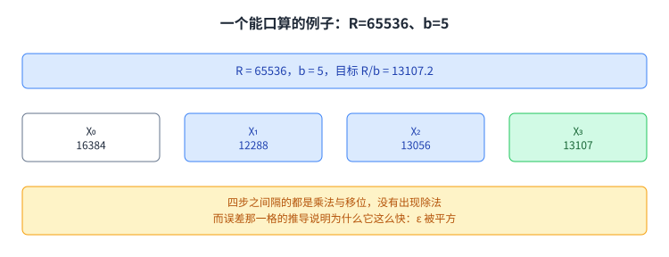
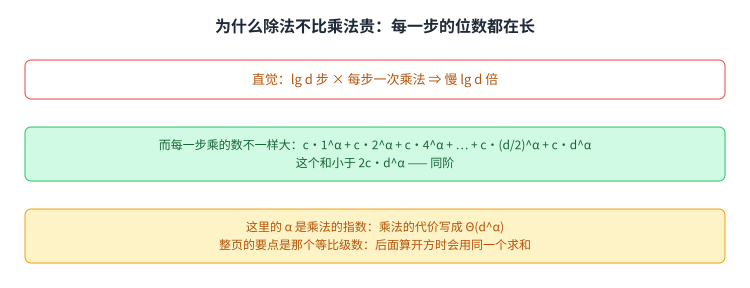
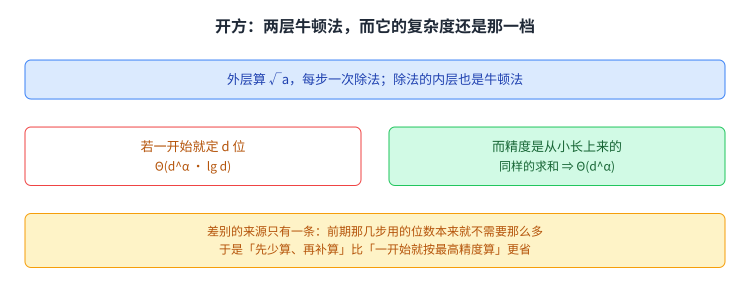

+++
title = "开方、除法与牛顿法"
lecture = 12
slug = "square-roots-newtons-method"
status = "draft"
source_kind = "notes"
source_url = "https://ocw.mit.edu/courses/6-006-introduction-to-algorithms-fall-2011/resources/mit6_006f11_lec12/"
source_title = "Lecture 12: Square roots, Newton's method"
output_mode = "explanation"
+++

这一讲要解决的是一个看起来不像算法的问题：怎么把 √2 算到第一百万位。第 11 讲把高精度乘法做到了 Karatsuba 那一档，而在那一讲的末尾留了一句话，说这一讲先做乘法，除法留给第 12 讲。这一讲就是来接那一句的。麻烦出在中间：算开方的那套迭代每一步都要做一次除法，而除法正是第 11 讲没做的那一件事。所以题目会被连着退两步，从开方退到除法，再从除法退到乘法。这一讲给出的答案是：把除法也写成牛顿法，而它的复杂度最后与乘法是同一档。

## 一、这一讲的自述目录

讲义第一页的目录分三块。第一块回顾前两讲的高精度算术与乘法；第二块是除法，下面挂着算法与误差分析两条；第三块是终止性。

全讲的骨架就是这三块：先承认开方要用除法，再把除法做出来，最后回答取整会不会卡住。第二块占的篇幅最长，而第三块只有一页，因为它问的是前两块都不管的那件事：前面都在实数上推，而程序里每步都要取下整。把这三块摆在一起看，这一讲其实是在回答一个先有鸡还是先有蛋的问题：要算开方就得先有除法，而除法又要靠开方那一套方法来算。

## 二、目标：√2 的第一百万位

讲义的目标很具体：取 √2 的第一百万位。

做法是把小数点移走。设 d = 10⁶，则 √2 的第一百万位等于 √(2·10^(2d)) 取整数部分。于是「算一个 [[term:irrational-number]] 的很多位」被换成了「算一个整数的平方根取整」，后面全部讨论都落在这个整数问题上。

这一步换法的意义在于它把「精度」这个说法变成了「位数」这个可以数的量。后面所有的复杂度都用 d 来写，而 d 就是我们要求出的位数。寻求高精度的那类需求在真实系统里也有例子：课本 CLRS 里讨论过需要很多位的整数运算，而这类运算也是 [[term:rsa]] 那类公钥算法的基础；在实现侧，Python 的数值库与 gmpy 这类包都能直接提供它。所以这一讲讲的东西不是纯理论的练习，它有具体的去处。

## 三、牛顿法算 √a，而每步要一次除法

讲义给的迭代是 χ₀ = 1，χᵢ₊₁ = (χᵢ + a/χᵢ) / 2。

它收敛得很快，而每一步里那个 a 除以 χᵢ 是一次高精度除法。于是「怎么算开方」变成了「怎么算除法」。

这一页是整讲的转折点。讲义没有停在「这个迭代收敛得快」，而是立刻去问它每步要花什么。问出来的是一个除法，而除法正是第 11 讲没做的那一件事。这个做法在前面几讲里已经出现过多次：一个算法可以很快，而它的代价可能全部藏在它调用的那个子程序里，所以真正要解决的问题是那个子程序。

## 四、收敛有多快：误差被平方

讲义设 χₙ = √a·(1+εₙ)，把迭代代进去化简，得到 εₙ₊₁ = εₙ² / (2(1+εₙ))。

分子上的平方是主要的那一项，所以误差大致被平方。而一个误差被平方，意味着正确位数翻倍。这个性质叫平方收敛，在前面讲[[term:tangent-line]]那一页已经见过一次。

值得留意的是分母里的 (1+εₙ)。只要 εₙ 还没大到接近 1，它就只是个接近 1 的系数，不影响「平方」这个主要行为。而一旦 εₙ 接近或超过 1，这个分母就不再是温和的系数了。后面讨论终止性时那个「初始猜测要好」的条件，来源就在这里。

另外，平方收敛还解释了为什么这个迭代只需要很少几步：位数是翻倍的，所以要到 d 位，只需要大约 lg d 步。这个账在下一页会被用到。可以顺手把两个量分清楚：一步能让位数翻倍，所以步数与位数的对数是同量级的；而每一步内部要做一次除法，那个除法的代价才是真正要算的东西。

## 五、插叙：讲义回顾的乘法五条

讲义顺手把当时已知的高精度乘法列了五条。

朴素分治是 d 的平方。[[term:karatsuba-multiplication]] 是 d 的 1.584 次方。Toom-Cook 把它推广成切成 k 份，取 k 等于 3 时得到 d 的 1.465 次方。Schönhage-Strassen 用快速傅里叶变换做到几乎线性，是 d lg d lg lg d。Fürer 在 2007 年做到 n log n 乘上 2 的 log 星号 n 次方，讲义还专门解释了那个 log 星号：把 log 反复作用，直到结果不大于 1 所需的最少次数。讲义说这些在 gmpy 包里都有。

这份清单放在这里是有用意的。它交代了一件事：乘法那一侧已经解决得差不多了，指数一路降到接近线性，所以这一讲的焦点可以转到除法。而它同时也给了一个尺度：后面说「除法与乘法同阶」时，那个「同阶」是相对哪一档说的。

## 六、除法：先算倒数再乘

讲义不直接算 a 除以 b，而是先算 1/b 的高精度表示，再把 a 乘上去。

为了让中间那一步好办，它引入一个很大的 R，先算 R/b，最后把结果除以 R。而 R 取 2 的 k 次方时，除以 R 只是移位，不算真正的除法。

取二的幂这一步是整页的关键：它把「除法」这个难点挪出了内层循环。于是内层只剩乘法和移位，而乘法前面已经解决了。

## 七、算 R/b 的牛顿法

讲义对 f(x) = 1/x 减 b/R 用[[term:newtons-method]]。这个函数的零点是 x = R/b，正是要算的东西。

代入化简之后得到 χᵢ₊₁ = 2χᵢ 减 (b/R)·χᵢ²。式子里只有乘法和一次除以 R，而除 R 是移位。

这一步是整讲的枢纽：一个原本要除法的迭代，被换成了只乘不除的迭代。而它也有代价，每步要两次乘法，这也是后面算复杂度时那些规模不同的乘法的来源。

选 f(x) 等于 1/x 减 b/R 这一步也有讲究。如果直接对 b 减 R/x 用牛顿法，化简之后会出现真正的除法项；而写成 1/x 的形式并配上那个 R，除号就被挪到了常数上，于是每一步只剩乘法。所以这一页的技巧全部在函数的选择上，而不在迭代本身。

## 八、一个能口算的例子

讲义给的例子取 R = 2¹⁶ = 65536、b = 5，要算的 R/b = 13107.2。

初始猜 2¹⁴ = 16384。第一步得到 12288，第二步 13056，第三步 13107。第三步已经落到整数部分。

四步之间隔的都是乘法与移位，没有出现除法。而这也说明前面那套推导不是纸上的：它给出的迭代在具体数字上确实一步步逼近，而且每一步都在把上一步的误差平方掉。把四步的误差大约估一下就能看出这个节奏：16384 离目标差得很远，12288 近了一些，13056 已经很近，而 13107 基本上就是答案。

## 九、除法的误差分析

讲义设 χᵢ = (R/b)(1+εᵢ)，代进 χᵢ₊₁ = 2χᵢ 减 (b/R)χᵢ² 化简，得到 1 减 εᵢ²，也就是 εᵢ₊₁ = 负的 εᵢ²。

误差同样被平方，只是每一步翻一次符号。所以除法和开方收敛得一样快，这里用到的就是前面那个[[term:quadratic-convergence]]。

而这里有一个容易被读错的地方：既然要 d 位就要 lg d 步，那很容易顺手推出「除法比乘法慢 lg d 倍」。讲义没有放过这个直觉，它在下一页专门去推翻它。

符号每一步翻一次这件事本身不影响速度，因为误差的绝对值才是决定位数的那一项。但它会带来一个实现上的小后果：迭代值会从上下两侧交替逼近目标，所以在取整的时候要从正确的方向去截。

## 十、第一个直觉被推翻：除法为什么不必慢 lg d 倍

讲义先点出那个直觉：要 lg d 步、每步一次乘法，看起来除法应该是乘法的 lg d 倍。

它接着推翻它。关键是每一步乘的两个数不一样大：开始很小，后来才长到 d 位。把各步的代价加起来，是一个等比级数：c·1^α 加 c·2^α 加 c·4^α，一直加到 c·d^α。而这个和小于 2c·d^α，也就是与乘法同阶。

这里的 α 是乘法的指数，把乘法的代价写成 Θ(d^α)。如果乘法是 d 的平方，α 就是 2；如果是 Karatsuba，α 就是 1.584。

整页的要点是那个等比级数。它成立的前提是「每一步的位数都在长」，而这个前提在算开方时会再用一次。讲义也在这一页写清了「复杂度」这个词指的是什么：它比的是两个运算各自的代价随位数增长的速度，而不是某一次具体计算的耗时。所以要比较除法与乘法，比的不是「谁调用谁」，而是两条增长曲线；而下一页那个求和正是把除法那条曲线摊开来看。

## 十一、开方：两层牛顿法与 Θ(d^α)

算开方要用两层牛顿法。外层对 f(x) = x² 减 a 用牛顿法求[[term:square-root]]，而它每步要一次除法；除法内部又是牛顿法，那是内层。

如果一开始就把精度定成 d 位，那外层要 lg d 步，代价就写成 Θ(d^α · lg d)。可是我们并不需要一开始就给足精度：前期那几步用的位数本来就不需要那么多。

认清这一点之后，用与上一页同样的求和，代价就落回 Θ(d^α)。差别的来源只有一条，「先少算、再补算」比「一开始就按最高精度算」更省。这与第 11 讲讲 Karatsuba 时的做法形状相同：都是靠改变分解方式把指数压下去，而不是靠把每一步做得更快。

讲义在这一页还加了一条脚注，用来消除一个可能的混淆：它把外层叫作第一层，因为除法内部还嵌着一次牛顿法，那是第二层。所以「两层」这个说法指的是嵌套关系，不是迭代次数。

## 十二、终止性：取整会不会卡住

前面的推导都在实数上做，而程序里每一步都要取下整：χᵢ₊₁ = ⌊(χᵢ + ⌊a/χᵢ⌋)/2⌋。

讲义把取整造成的那一点点差写成 γ，并证明它落在 0 与 1 之间。于是每步至多减掉不到 1，而 χᵢ + a/χᵢ 那部分一直不小于 2√a，所以减完仍然不小于 ⌊√a⌋，不会掉到下面去。

讲义在这一页还加了一个前提：初始猜测要满足 ε 小于 1，否则它可能停在上面下不来。这一页是全讲唯一一处「数值方法回到离散」的地方，而它要回答的正是离散世界里才会有的那个问题：这个程序会不会停。前面那些推导只说明了它会越来越接近，而「越来越接近」不等于「会停下来」。这两件事在实数上没有区别，而在整数上有区别，因为整数的取值是离散的，一步要么前进要么不动，而没有中间状态。

## 十三、收束：三个运算落在同一档

把整讲串起来是一条链。乘法那一侧已经解决；除法靠「先算倒数」换成了乘法，而复杂度分析说明它与乘法同阶；开方靠牛顿法换成了除法，而它的精度是从小长上来的，所以也与乘法同阶。

三个运算最后是同一档复杂度。而让后两者不掉档的那一招是同一个：不要让精度从头到尾都是 d 位。

这一讲也是这门课第一次把近似与收敛带进来。前面那些讲的算法都在精确的离散对象上做，而这里第一次出现「算到足够准」这件事，以及随之而来的两个新问题：收得多快，以及停了没有。而[[term:high-precision-arithmetic]]这一整套东西的代价，最后就落在这一档上。

## 读完应该能回答

1. √2 的第一百万位为什么可以换成一个整数开方问题，d 指的是什么。
2. 算开方的牛顿法每步要做哪一件事，这一讲为什么从它开始。
3. 平方收敛是什么意思，它的推导里哪一个因子是主导项。
4. 讲义列的乘法五条各自是什么复杂度，它列这一串是为了交代什么。
5. 算除法为什么要先算 R/b，R 取 2 的幂带来了什么。
6. 算 R/b 的迭代式是什么，它为什么不需要做除法。
7. 为什么除法不必比乘法慢 lg d 倍，那个求和的前提是什么。
8. 开方的代价为什么能从 Θ(d^α · lg d) 落回 Θ(d^α)，终止性那一页加的是什么条件。

## 脉络回顾

这一讲接着第 11 讲的最后一句。那一讲的末尾写的是「这一讲先做乘法；除法留给第 12 讲」，而这一讲正是来接它的：乘法已经做到 Karatsuba 那一档，而算开方的迭代每步都要一次除法，于是题目从开方退到除法，再从除法退到乘法。

要看清它在整门课里的位置，得把这条线拉长。第 11 与第 12 讲属于课本里数值那一块，它在这门课里是第一次离开离散对象：前面从峰值查找讲到哈希与排序，处理的都是精确的对象，而这里第一次面对「算到足够准」。这一步的分量比它看起来大：一旦允许近似，问题的提法就变了，从「答案是什么」变成「怎么一步步逼近它」，而后者又会立刻带出两个新问题，也就是收敛多快、以及会不会停。

本讲留下的三件工具会一直用。第一件是把一个运算归约到另一个已经解决的运算上（开方归约到除法，除法归约到乘法），并且每次归约都要重新算一次代价，而不能想当然地乘一个倍数。第二件是「精度是可以长出来的」这个想法：前期不需要那么多位，于是「先少算、再补算」比一开始就按最高精度算更省；第 11 讲的 Karatsuba 与后面讲快速傅里叶变换时都会再见到这个形状。第三件是平方收敛与它那个前提，初始猜测要落在误差小于 1 的范围内，否则迭代可能停在一个不对的地方。

要分清的是，留下来复用的是这三件工具，不是牛顿法这一个迭代式。牛顿法在第 11 讲讲切线那一页就出现过，本讲把它用在了开方与求倒数上，而它的角色始终是「把非线性问题换成可以重复做的线性步骤」。下一次再见到「用迭代逐步逼近」是在讲图的算法时那些逐层扩展的遍历里，那里的「收敛」换成了「把距离一层层推出去」，但「每一轮用上一轮的结果」这个形状是一样的。

## 溯源

对应原文：MIT 6.006 Fall 2011 第 12 讲讲稿（`MIT6_006F11_lec12.pdf`，5 页；正文 4 页，第 5 页是 OCW 的版权页），OCW 资源页：<https://ocw.mit.edu/courses/6-006-introduction-to-algorithms-fall-2011/resources/mit6_006f11_lec12/>。该页给出的 PDF 直链是 `/courses/6-006-introduction-to-algorithms-fall-2011/d16678659cb7c98d611f12e7c1f7298d_MIT6_006F11_lec12.pdf`，页面标题为 Lecture 12: Square roots, Newton's method，与 `docs/lecture-manifest.md` 第 12 行的 slug 与标题一致。

本讲的事实都能在上述讲稿里逐条对上：三块目录；第一百万位换成 √(2·10^(2d))；χ₀ = 1 与 χᵢ₊₁ = (χᵢ + a/χᵢ)/2；εₙ₊₁ = εₙ²/(2(1+εₙ)) 与平方收敛；乘法五条（朴素 Θ(d²)、Karatsuba Θ(d^1.584)、Toom-Cook 的 5T(d/3) + Θ(d) = Θ(d^1.465)、Schönhage-Strassen Θ(d lg d lg lg d)、Fürer 2007）与「这些在 gmpy 里都有」；先算 1/b 与取 R = 2^k；对 1/x 减 b/R 用牛顿法得到 χᵢ₊₁ = 2χᵢ 减 (b/R)χᵢ²；R = 65536、b = 5、目标 13107.2 与 16384、12288、13056、13107 四步；除法误差 εᵢ₊₁ = −εᵢ²；那个等比级数与「和小于 2c·d^α」；两层牛顿法与 Θ(d^α · lg d) 对 Θ(d^α) 的对比；以及终止性那一页的取下整迭代、γ 落在 0 与 1 之间、与「初始猜测要好」。上述数字与公式都取自讲稿本身。

版本说明：四道取件校验为体积 208,816 字节、尾部有 `%%EOF`、大小不是 2 的整数次幂、也不是 64 KiB 的整数倍（余数 12,208）。两份独立抽取互为核对：`pypdfium2` 5 页 4948 字符，`pypdf` 5 页 4496 字符。

一处源文问题，报出来而不代为改动：讲稿第 2 页写的是「We covered multiplication in Lecture 12」，而讲稿本身正是第 12 讲，乘法是在第 11 讲讲完的。按上下文这里应指第 11 讲，属于源文的一处笔误。本页正文按「乘法在第 11 讲已经讲过」来写，并在这一条里留下记录。

措辞与延伸属于 CourseLingo 的讲解：把三块目录讲成「先承认要用除法、再把除法做出来、最后回答会不会卡住」这条骨架；把分母里的 (1+εₙ) 与终止性那一页「初始猜测要好」这个条件接起来；把「取 R 为二的幂」讲成「把难点挪出内层循环」；把「选 1/x 这个函数形式」讲成技巧全在函数选择上；以及把整讲收束成「三个运算落在同一档，而让后两者不掉档的那一招是同一个」。讲义本身没有把这些联系显式写出来。

本页未引用教材 CLRS 的具体章节与页码，讲义也没有指定；正文里提到 CLRS、Python、NumPy、SciPy、RSA 与 Karatsuba 是为了说明这类计算在实现侧与用途侧的常见去处，不是讲稿里的内容。

本页的 13 张配图全部由我们自绘，未转载原讲稿里的任何图片。原讲稿的图都是公式推导，本页按同样的推导重新画成了图文，未改动任何数字或公式。
