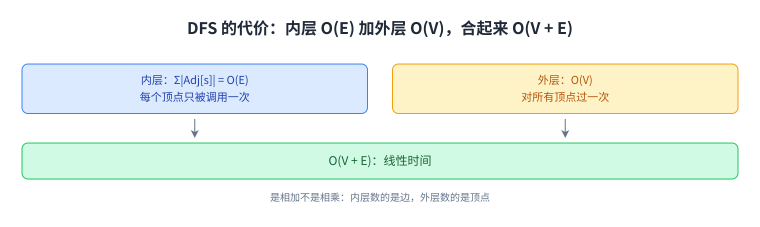

+++
title = "深度优先搜索与拓扑排序"
lecture = 14
slug = "14-depth-first-search-topological-sort"
status = "draft"
source_kind = "notes"
source_url = "https://ocw.mit.edu/courses/6-006-introduction-to-algorithms-fall-2011/resources/mit6_006f11_lec14/"
source_title = "Lecture 14: Depth-first search (DFS), topological sorting"
output_mode = "explanation"
+++

第 13 讲把图搜索按层展开：从起点出发，一圈一圈往外扩。这一讲换一个次序，先沿一条路走到底，走不动了再退回来换下一个方向。讲义页眉把这一讲标成「图论 II」，它的 Lecture Overview 列了四件事：[[term:depth-first-search]]、边的分类、环检测、[[term:topological-sort]]。

这两件事的关系值得先点出来：前两件是搜索本身，后两件是它的副产品。而这门课的实现用 Python，教材是 CLRS。

## 一、这一讲要解决什么：从回顾图搜索开始

讲义先回顾了两个前置概念。第一个是图搜索要做什么：

> 原文：graph search: explore a graph. e.g., find a path from start vertex s to a desired vertex

第二个是[[term:graph]]在内存里怎么存：[[term:adjacency-list]]，也就是一个长度 \(|V|\) 的[[term:array]]，每一项挂一条链表。

> 原文：adjacency lists: array Adj of |V| linked lists — for each vertex u ∈ V, Adj[u] stores u's neighbors, i.e., {v ∈ V | (u, v) ∈ E} (just outgoing edges if directed)

读法是：`Adj[u]` 里放的是 `u` 的[[term:neighbor]]；如果图是[[term:directed-graph]]，那就只放「出去」的那些边，进来的边不在里面。这个细节在后面数代价时会用到。

然后讲义用一句话交代了上一讲的做法，作为对照：

> 原文：Breadth-first Search (BFS): Explore level-by-level from s — find shortest paths

按层展开、用[[term:queue]]，这是第 13 讲的[[term:breadth-first-search]]。而这一讲的 DFS 用另一种次序。

这份存储决定了后面所有代价的算法：DFS 花的时间，最终就是「把每条链表都走一遍」的时间。

## 二、深度优先搜索：像走迷宫一样

讲义给的第一句比喻是「这就像探一座迷宫」，算法本身用四条要求说清：

> 原文：follow path until you get stuck; backtrack along breadcrumbs until reach unexplored neighbor; recursively explore; careful not to repeat a vertex

翻成中文的动作序列：沿着一条路一直往前走，直到走不动；然后沿着来时的标记退回，退到第一个还有没走过的邻居的地方；这是一个[[term:recursion]]的过程；而全程都要小心，同一个[[term:vertex]]不能重复访问。

讲义接着给了两段代码，它们的层次不一样：

- `DFS-visit(V, Adj, s)`：从 `s` 出发做递归。遍历 `Adj[s]`，遇到还没访问过的邻居 `v`，就把它记下来（`parent[v] = s`）然后递归下去。
- `DFS(V, Adj)`：外层循环。把每个顶点都看一遍，没访问过的就当作新的起点调一次 `DFS-visit`。

这两段的分工，讲义在旁边写得很清楚：前者只看到「从起点 `s` 能到达的部分」，后者才「探索整张图」；并且注明这套外层循环同样可以用来扩展 BFS。

代码里还有一处值得注意：判断「访问过没有」用的就是 `v not in parent`，也就是说 `parent` 这个字典同时干了两件事，记录发现关系，以及充当已访问标记。

把两层分开看，才能解释后面那个代价：内层的总工作量是所有邻接表之和，外层只是多走一遍顶点。

## 三、边的分类：树边与非树边

DFS 每走到一个顶点，都会顺手看一遍它在邻接表里的边。讲义按这些边的走向把它们分了类：

> 原文：back edge: to ancestor. forward edge: to descendant. cross edge (to another subtree). tree edges (formed by parent). nontree edges

四类的名字对应四种关系：**回边**指向自己的祖先，**前向边**指向自己的后代，**交叉边**指向另一棵子树，**树边**就是由 `parent` 记录下来的那些边；后面三类合起来叫非树边。

怎么把「回边」认出来？讲义给的做法是给顶点打时间戳：

> 原文：to compute this classification (back or not), mark nodes for duration they are "on the stack"

也就是记下每个顶点在[[term:stack]]上的那段时间。如果一条边指向的顶点此刻还在栈上，那它指向的就是祖先，也就是回边。讲义还补了一句限定：**在无向图里只会出现树边与回边**，前向边与交叉边是有向图才有的。

区分它们的实际用途马上就会出现：环检测只关心有没有回边，而拓扑排序要用到每棵子树结束的先后。

## 四、代价：O(V + E)

DFS 的代价分析很短，但用到了一个关键事实：`DFS-visit` 对每个顶点只会被真正调用一次，因为第一次调用时就把 `parent[s]` 设上了，之后再遇到它就会被 `v not in parent` 挡住。于是：

> 原文：DFS-visit gets called with a vertex s only once (because then parent[s] set) ⇒ time in DFS-visit = Σ_{s∈V} |Adj[s]| = O(E). DFS outer loop adds just O(V) ⇒ O(V + E) time (linear time)

照着念一遍：内层把所有邻接表加起来，正好是边数的常数倍，也就是 O(E)；外层只多花 O(V)；合起来是 O(V + E)，讲义强调这是**线性时间**。注意这里的 O(E) 依赖第一节那个细节：邻接表里只放出去的边，所以每条边只被数一次。

这张图解释的是「为什么是相加而不是相乘」：内层与外层访问的是不同规模的东西，一边是边、一边是顶点。

## 五、环检测：图有环，等价于 DFS 见到回边

讲义给了一个充要条件，一句话：

> 原文：Graph G has a cycle ⇔ DFS has a back edge

两个方向它都给了理由。

先看充分性（有回边就有环）：回边是从某个顶点指向它祖先的边，而祖先到它本来就有一条树边的路径，两条合起来正好构成一个环，所以有回边就意味着有环。

再看必要性（有环就有回边）：取一个环，看 DFS 第一次访问到这个环上的顶点时会发生什么。设这个环上的顶点依次是 \(v_0, v_1, \dots, v_k\)，而 \(v_0\) 是第一个被访问到的。讲义的三步推理是：

> 原文：before visit to vi finishes, will visit vi+1 (& finish) ⇒ visit vi+1 now or already did ⇒ before visit to v0 finishes, will visit vk (& didn't before) ⇒ before visit to vk (or v0) finishes, will see (vk, v0) as back edge

也就是说：在 `v_i` 的访问结束之前，一定会去访问 `v_{i+1}`（要么现在就访问，要么之前已经访问过）；一路推下去，`v_k` 会在 `v_0` 的访问结束之前被访问（而它之前没被访问过）；于是在 `v_k` 的访问结束之前，DFS 会看到边 \((v_k, v_0)\)，而 `v_0` 此刻还在栈上，所以它是回边。

**这个等价关系的用法是把「找环」变成「看栈」**：不用去枚举环，只要在 DFS 过程中判断一条边是否指向栈上的顶点。

## 六、作业调度与拓扑排序

最后是这一讲的应用。讲义的场景是[[term:directed-graph]]上的依赖关系：

> 原文：Given Directed Acylic Graph (DAG), where vertices represent tasks & edges represent dependencies, order tasks without violating dependencies

也就是：[[term:vertex]]代表任务，[[term:edge]]代表「必须先做完」的依赖，要给出一个顺序，使得没有任何一个任务排在它的依赖之前。这样的图必须是无环的，否则依赖会互相绕回来。

讲义先给了一个自然的想法：从「没有进来的边」的顶点开始做搜索。它把这种顶点叫 Source：Source 就是没有入边的顶点，可以最先安排（讲义举的例子是 A、G、I）。然后它试了从每个 Source 各做一次 BFS，结果并不好，讲义用两个词总结：

> 原文：from D finds D, BE, CF ← slow . . . and wrong!

**慢，而且错。** 错在哪里？从某个源点出发的搜索，只会沿着那个源点能到达的地方走，而「哪些任务还没被安排」这件事并不能靠局部搜索一次算清。

正解是回头用 DFS 的副产品。讲义在 DFS 里加一行，在每次 `DFS-visit` 结束（也就是顶点完成）时把它追加进列表，最后把列表整个倒过来：

> 原文：Topological Sort: DFS-Visit(v) ... Reverse of DFS finishing times (time at which DFS-Visit(v) finishes) ／ order.append(v) … order.reverse()

所以拓扑序就是**完成时间的逆序**：完成得越晚的顶点，排在越前面。

这张图里第一次出现了「完成时间」这个概念：它是每个顶点离开栈的时刻，而不是进入的时刻。

## 七、为什么倒过来是对的

讲义用一条边来论证。对任意一条边 \((u, v)\)，它要证明的是「`u` 排在 `v` 之前」，而它的等价说法是「`v` 先完成」：

> 原文：For any edge (u, v) — u ordered before v, i.e., v finished before u

证明分两种情形，取决于 `u` 和 `v` 谁先被访问到。

第一种，`u` 先被访问：那么在 `u` 的访问结束之前，一定会通过边 \((u, v)\)（或者别的路径）访问到 `v`，于是 `v` 在 `u` 之前完成。

第二种，`v` 先被访问：由于图是无环的，从 `v` 出发不可能到达 `u`，也就是说 `u` 在 `v` 还活着的时候不会被碰到，于是 `v` 先完成。

两种情形都得到「`v` 先完成」，所以按完成时间从晚到早排，每条边的起点都会排在终点之前，拓扑序成立。

这张图是全讲的收口：无论谁先被访问，被指向的那个顶点总是先完成，所以倒序之后每条边的起点都排在终点之前。

这条论证只用到「图无环」这一个前提。也正因为如此，拓扑序在 DAG 上的路径问题里很好用；而换到带权图上求最短路时，Dijkstra 与 Bellman-Ford 用的是另一套工具（[[term:priority-queue]]），与这里的次序无关。

## 读完应该能回答

- DFS 与 BFS 的展开次序差在哪里，为什么讲义说 DFS 像走迷宫；
- 边的四种分类各指向什么关系，怎么用「是否还在栈上」把回边认出来；
- DFS 的代价为什么是 O(V + E)，那个 O(E) 依赖邻接表的什么约定；
- 为什么「图有环」等价于「DFS 见到回边」，以及拓扑序为什么是完成时间的逆序。

## 脉络回顾

这一讲与第 13 讲是同一个主题的两半。BFS 用队列，按层展开，得到的是最短路径；DFS 用栈（或者递归），按路径深入，得到的是深度优先的次序与每个顶点的完成时间。两者的代价都是 O(V + E)，而差别只在于「先访问哪个邻居」这件事上的约定。

而这一讲真正被后面反复用到的东西，是那两个副产品：**回边**给了一个 O(V + E) 的环检测办法，**完成时间的逆序**给了一个同样线性时间的拓扑排序。它们都不是新算法，而是把 DFS 过程中本来就出现的信息留下来。

要分清的是，拓扑排序只对有向无环图有意义：一旦有环，就存在互相依赖的任务，排序无从谈起，而这正是第五节那个等价关系的用处。

## 溯源

本讲的内容来自 MIT 6.006 Fall 2011 的 Lecture 14: Graphs II: Depth-First Search 讲义（7 页 typed notes；第 7 页是 OCW 版权页）。本讲的事实都能在上述讲义里逐条对上：Lecture Overview 的四项；图搜索与邻接表的定义（含「有向图只放出去的边」这条括注）；BFS 的「按层展开、求最短路径」这句对照；DFS 的四条动作要求与两段伪代码、以及「只看起点可达」与「探索整张图」的分工；边的四种分类与「用栈上时间认回边」「无向图只有树边与回边」；O(V + E) 的推导（含「每个顶点只被调用一次」这条理由）；环检测的充要条件与两个方向的理由；作业调度的 DAG 说法、Source 的定义与 A/G/I 这个例子、以及「从每个 source 做 BFS」那个被否定的尝试；拓扑排序等于完成时间的逆序与 `order.append` + `reverse`；最后正确性证明里「对任意边 (u, v)，u 排在 v 之前，也就是 v 先完成」这条等价说法与两种情形。

讲义没有写的部分，以下是我们补的：这篇中文讲解本身（讲义是英文提纲），全部配图（讲义里的插图一律重画，不转载），以及三处展开说明：

1. 充分性方向「有回边就有环」的那句解释（祖先到它的树边路径与回边合成一个环）；
2. 「`parent` 这个字典同时兼任发现记录与已访问标记」这个观察；
3. 「把找环变成看栈」与「不用枚举环」这个用法说明。

另外四处登记：一是讲义原词写作 `Directed Acylic Graph`，正确拼写应为 `Acyclic`，本页按原文保留引文形态、正文用「无向环的图」这类说法回避；二是「边的分类在无向图里只有两种」这句限定，讲义写在分类之后，本页提前到同一段里；三是「DFS 用栈（或者递归）」这个说法，讲义只写了递归实现，栈是我们的解释；四是资料来源里的 `_orig` 手写版讲义我们只登记、未使用。
