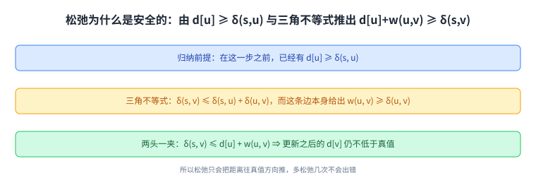
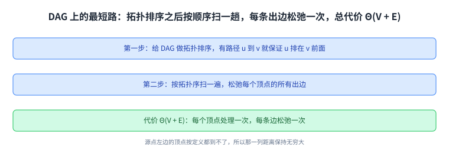
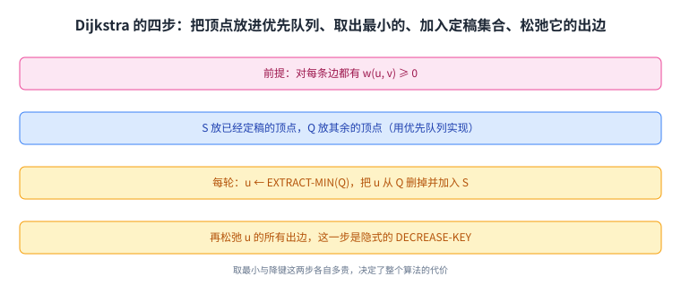
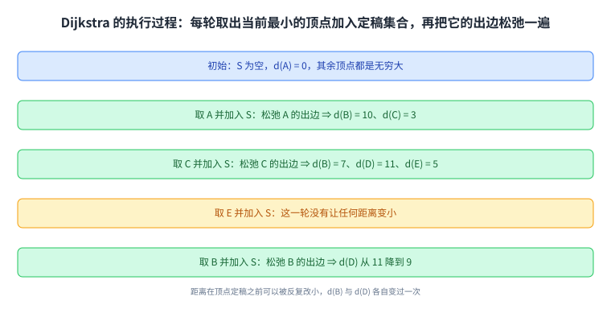
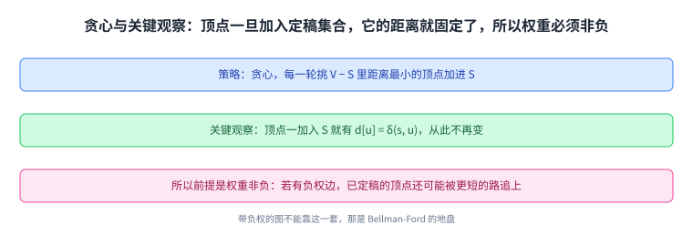
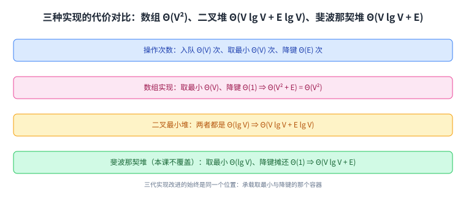

+++
title = "Dijkstra 算法"
lecture = 16
slug = "16-dijkstra"
status = "draft"
source_kind = "notes"
source_url = "https://ocw.mit.edu/courses/6-006-introduction-to-algorithms-fall-2011/resources/mit6_006f11_lec16/"
source_title = "Lecture 16: Dijkstra"
output_mode = "explanation"
+++

第 15 讲搭好了所有最短路算法共用的骨架：初始化加松弛。而那个骨架里留着一个空位，就是「按什么顺序挑边」。这一讲填上第一种顺序，也是最快的一种：每次都挑当前距离最小的那个顶点。

讲义自己的标题是「Shortest Paths II - Dijkstra」，Lecture Overview 按顺序列了四件事：回顾、DAG 上的最短路、无负权边图上的最短路、Dijkstra 算法。参考读物是教材 CLRS 的 24.2 到 24.3 节。

## 一、这一讲要解决什么：先弄清松弛为什么安全

讲义先复习了上一讲的两样东西：\(d[v]\) 是从源点出发的当前[[term:shortest-path]]长度，经过反复[[term:relaxation]]之后它应当等于 \(\delta(s, v)\)；\(\Pi[v]\) 是最短路径上 \(v\) 的前驱。而基本动作只有一个：

> 原文：RELAX(u, v, w): if d[v] > d[u] + w(u, v) then d[v] ← d[u] + w(u, v); Π[v] ← u

接着它证明了这个动作不会把事情弄坏：

> 原文：Lemma: The relaxation algorithm maintains the invariant that d[v] ≥ δ(s, v) for all v ∈ V.

证明用归纳法，关键一步是三角不等式：既然 \(d[u] \ge \delta(s, u)\)，而 \(\delta(s, v) \le \delta(s, u) + \delta(u, v)\)，又有 \(w(u, v) \ge \delta(u, v)\)（这条边本身就是一条从 \(u\) 到 \(v\) 的路），合起来就得到 \(\delta(s, v) \le d[u] + w(u, v)\)。所以把 \(d[v]\) 设成 \(d[u] + w(u, v)\) 永远不会低于真值。

这一步很重要，因为它是后面所有结论的地基：**只要松弛是安全的，算法就不怕多松弛几次，只怕漏掉。**

这张图把证明的三步串起来：归纳给出 \(d[u]\) 的下界，三角不等式给出 \(\delta(s,v)\) 的上界，两者一夹就得到新材料也不会低于真值。

## 二、DAG 上的最短路：拓扑排序加一趟松弛

讲义先看一个特例：如果图是有向无环的，那么上一讲提过的负环麻烦根本不会出现。

> 原文：DAGs: Can't have negative cycles because there are no cycles!

于是算法简单到只有两步：先给图做拓扑排序，这时「从 \(u\) 到 \(v\) 有路径」就意味着 \(u\) 排在 \(v\) 前面；再按拓扑序把顶点过一遍，松弛每个顶点的所有出边。

> 原文：1. Topologically sort the DAG. Path from u to v implies that u is before v in the linear ordering. 2. One pass over vertices in topologically sorted order relaxing each edge that leaves each vertex. Θ(V + E) time

代价是 \(\Theta(V + E)\)，也就是线性时间。讲义走了一个例子：[[term:vertex]]按拓扑序从左到右排列，源点是 \(s\)；处理它左边的 \(r\) 时 \(d\) 保持无穷大（源点左边的顶点按定义都到不了），处理 \(s\) 时把 \(t\) 从无穷大降到 2、把 \(x\) 降到 6。这一趟之所以够用，是因为每条[[term:edge]]只被松弛一次；而在无权的图上，第 13 讲的 BFS 做的就是同一件事的序。

**这就是第 14 讲那个拓扑序的用处：一旦顶点排好了序，最短路只需要按顺序扫一趟。**

这张图解释了为什么它这么快：每个顶点只被处理一次，每条边也只被松弛一次。

## 三、Dijkstra 算法：每次挑当前最小的那个

有环的图不能这么做，于是讲义给出 Dijkstra，前提是权重非负：

> 原文：For each edge (u, v) ∈ E, assume w(u, v) ≥ 0, maintain a set S of vertices whose final shortest path weights have been determined. Repeatedly select u ∈ V − S with minimum shortest path estimate, add u to S, relax all edges out of u.

读法是：维护一个集合 \(S\)，里面的顶点是「已经定稿」的；每一轮从剩下的顶点里挑 \(d\) 最小的那个加进 \(S\)，然后松弛它的所有出边。

讲义给的伪代码只有几行：

> 原文：Dijkstra(G, W, s) // uses priority queue Q … S ← φ; Q ← V[G]; while Q = φ; do u ← EXTRACT-MIN(Q); S = S ∪ {u}; for each vertex v ∈ Adj[u]; do RELAX(u, v, w) ← this is an implicit DECREASE KEY operation

这里有一处要提前说明：**引文里那句 `while Q = φ` 在抽取出来的文本层里就是这样显示的**，而按上下文它应当是「当 \(Q\) 不为空时继续」。本页照录所见的文本，读者按「不为空」理解即可，这条也登记进了溯源。

撇开这处笔误，四步很清楚：把所有顶点塞进[[term:queue]]式的[[term:priority-queue]] \(Q\)；取出 \(d\) 最小的那个；把它加进 \(S\)；松弛它的出边。讲义还特别点出最后一步的性质：松弛一条出边，本质上就是对这个顶点在 \(Q\) 里做一次隐式的 DECREASE-KEY（也就是[[term:decrease-key]]）操作。用 Python 写出来，这四步加起来不过十几行，真正的差别全在 \(Q\) 用什么实现。

**所以整段算法里最贵的那一步就是「从 \(Q\) 里取出最小者」以及「更新某个键」，而这两种操作的代价取决于 \(Q\) 用什么实现**，第六节就是算这笔账。

这张图里第二步与第四步都落在优先队列上，它们各自要花多少时间，决定了整体代价。

## 四、走一遍例子

讲义给了一张执行过程表，逐行看它很直观。一开始 \(S\) 是空的，\(Q\) 里是全部顶点，源点 \(A\) 的距离为 0，其余都是无穷大。

把 \(A\) 取出来加进 \(S\) 之后，松弛它的出边，得到 \(d(B) = 10\)、\(d(C) = 3\)。接着取 \(d\) 最小的 \(C\) 加进 \(S\)，松弛它的出边，于是 \(d(B)\) 降到 7，同时得到 \(d(D) = 11\)、\(d(E) = 5\)。再取 \(E\) 加进 \(S\)（这一轮没有让任何距离变小），然后取 \(B\)，松弛它的出边，把 \(d(D)\) 从 11 降到 9。

到这里可以看清这套做法与 DAG 那种做法的区别：**DAG 是靠事先排好的顺序保证每条边只松弛一次，而 Dijkstra 是靠「每次取最小」边算边排出顺序。**

这张表里最值得盯的是 \(B\) 的那两次变化：10 到 7 再到 5 那几列，说明距离在定稿之前是可以被反复改小的。

## 五、为什么它是对的，以及为什么要求非负权

讲义把 Dijkstra 的性质归结成一句话：

> 原文：Strategy: Dijkstra is a greedy algorithm: choose closest vertex in V − S to add to set S.

它属于[[term:greedy-algorithm]]：每一轮只做眼前最优的选择，也就是挑当前最近的那个。而正确性的关键观察是：

> 原文：We know relaxation is safe. The key observation is that each time a vertex u is added to set S, we have d[u] = δ(s, u).

也就是说：**顶点一旦被加进 \(S\)，它的距离就永远定稿了。** 结合第一节那个「松弛安全」的不变量，这就是全部证明。

而这个「一进去就定稿」的性质，正是权重必须非负的原因（这一层解释是我们补的，讲义只写了 \(w(u, v) \ge 0\) 这个前提）。假设存在一条负权边，那么一个已经进 \(S\) 的顶点，之后可能被另一条经过负权边的路径追上，那时 \(d\) 还要再变小，而它已经离开了 \(Q\)，算法不会再修正它。所以在带负权的图上，这套做法给不出正确答案；那种图要靠上一讲点过名的 Bellman-Ford。

把这张图和第一节那张放在一起看：一张说明「松弛不会把距离压到真值以下」，另一张说明「取最小的那个可以安全定稿」，两者合起来才是完整的正确性。

## 六、代价：换一种优先队列就换一个复杂度

讲义先数操作的次数，再分别代入三种实现。操作次数是：入队 \(\Theta(V)\) 次、[[term:extract-min]] \(\Theta(V)\) 次、[[term:decrease-key]] \(\Theta(E)\) 次。

> 原文：Array impl: Θ(V) time for extract min; Θ(1) for decrease key. Total: Θ(V·V + E·1) = Θ(V² + E) = Θ(V²). Binary min-heap: Θ(lg V) for extract min; Θ(lg V) for decrease key. Total: Θ(V lg V + E lg V). Fibonacci heap (not covered in 6.006): Θ(lg V) for extract min; Θ(1) for decrease key amortized cost. Total: Θ(V lg V + E)

三代实现一代比一代快，而改进的位置始终是同一处：**怎么让「取最小」和「改键」更快**。[[term:array]]实现取最小要扫一遍，所以总代价是 \(\Theta(V^2)\)；二叉[[term:heap]]把两个操作都压到 \(\Theta(\lg V)\)；而讲义注明本课不讲的[[term:fibonacci-heap]]把改键降到摊还 \(\Theta(1)\)，于是总代价变成 \(\Theta(V \lg V + E)\) —— 这也正是第 15 讲在问题形式化时给 Dijkstra 标的那个代价。

**所以 Dijkstra 的复杂度不是一个固定的数，而是「图的代价 + 优先队列的代价」两笔账合起来的结果。**

这张表要从下往上看：每一次改进都不是改算法，而是改承载「取最小」与「改键」的那个容器。

## 读完应该能回答

- 为什么只要松弛是安全的，算法就不怕多松弛几次；
- DAG 上的最短路为什么只要一趟 \(\Theta(V + E)\)，它靠什么保证顺序；
- Dijkstra 每一轮做的四件事，以及它属于贪心算法的哪一层含义；
- 「顶点一进 \(S\) 就定稿」为什么要求权重非负，负权时该换什么算法；
- 三种优先队列实现各自把代价算成了多少，改进发生在哪一步。

## 脉络回顾

这一讲把第 15 讲留的那个空位填上了第一种答案。第 15 讲给的是通用骨架：初始化加松弛，而在「按什么顺序挑边」这个位置上什么都没有规定，并且用一个病态的例子说明乱挑会慢到指数级。Dijkstra 给出一条具体规则：每一轮取当前距离最小的顶点。这条规则一旦立起来，松弛的总次数就被限制住了，代价随之落到了 \(\Theta(V \lg V + E)\) 这一档。

要分清的是，这条规则换来的效率有一个前提。第 15 讲把负权边与负环区分开：负权边本身没问题，能绕成负环才让最短距离失去意义。而这一讲的前提更强，它连**负权边**都不允许，因为「取出来就定稿」这条性质会被负权边破坏。所以第 15 讲提到的另一个算法 Bellman-Ford 并不是 Dijkstra 的备胎，而是覆盖另一类图的主力，它的做法是反复松弛所有边，代价更高但前提更宽。

下一讲就是这个更宽的算法。而这一讲真正值得记住的，是**算法与容器被分开看**：同一套 Dijkstra，换成三种优先队列就是三种复杂度。

## 溯源

本讲的内容来自 MIT 6.006 Fall 2011 的 Lecture 16: Shortest Paths II - Dijkstra 讲义（7 页 typed notes；第 7 页是 OCW 版权页；讲义自身页眉与标题写作 Shortest Paths II: Dijkstra 与 Shortest Paths II - Dijkstra，而 OCW 资源页的标题是 Dijkstra，本页 front matter 用后者、正文按讲义内容写）。本讲的事实都能在上述讲义里逐条对上：Lecture Overview 的四项；Readings 写的是 CLRS Sections 24.2-24.3；\(d\)、\(\Pi\) 与 RELAX 的复习；「松弛是安全的」这条引理与它的归纳证明（含 \(\delta(s,v) \le d[u] + w(u,v)\) 这一步）；DAG 上「没有环所以没有负环」、拓扑排序加一趟松弛的两步与 \(\Theta(V + E)\)；那个 \(r, s, t, x, y, z\) 的例子与「处理 \(r\) 时保持无穷大、处理 \(s\) 时把 \(t\) 降到 2、把 \(x\) 降到 6」；Dijkstra 的前提 \(w(u, v) \ge 0\)、集合 \(S\) 的含义与「反复取 \(V - S\) 中最小者」；伪代码的六行与「松弛是隐式的 DECREASE-KEY」这条注释；Figure 4 那张执行表里出现的距离值（\(A\) 为 0，松弛 \(A\) 之后 \(B\) 为 10、\(C\) 为 3，松弛 \(C\) 之后 \(B\) 为 7、\(D\) 为 11、\(E\) 为 5，松弛 \(B\) 之后 \(D\) 降到 9）；「Dijkstra 是贪心算法」与「顶点加入 \(S\) 时 \(d[u] = \delta(s, u)\)」这条关键观察；以及三种实现的六行代价与斐波那契堆「本课不覆盖」这条注记。

讲义没有写的部分，以下是我们补的：这篇中文讲解本身（讲义是英文提纲），全部配图（讲义里的示意图一律重画，不转载），以及三处展开说明：

1. 「一进 \(S\) 就定稿」这条性质为什么要求权重非负（讲义只写了前提，没有写反例的方向）；
2. 「Dijkstra 的复杂度是图的代价与优先队列的代价两笔账合起来」这个说法；
3. 第六节与第 15 讲那个 Dijkstra 代价的对照（\(O(V \lg V + E)\) 与 \(\Theta(V \lg V + E)\) 出自两讲的同一处结论）。

另外四处登记：一是伪代码里的 `while Q = φ`，文本层的两个抽取引擎都给出这个 `=`，而按上下文它只能是「当 \(Q\) 不为空时」（第 23、24 讲各出现一处同类的「不等号被抽成等号」现象，因此这里**不断言讲义印错**，只说明所见的文本与逻辑上唯一的读法），本页在引文之前先行说明、照录所见的文本、并在此登记；二是讲义 Figure 3 那组「小球与绳子」的演示图，其数字在文本层只读出三行排列与组数（如 A C E B D 对应 7 12 18 22），本页只说明它演示的是同一个算法，不逐格复述；三是讲义把「取最小的顶点」写成 select u ∈ V − S with minimum shortest path estimate，本页统一说成「取当前距离最小的顶点」；四是讲义注明斐波那契堆「not covered in 6.006」，本页照此保留这条限定。
