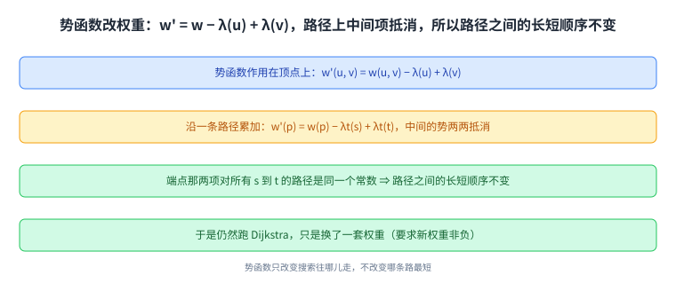
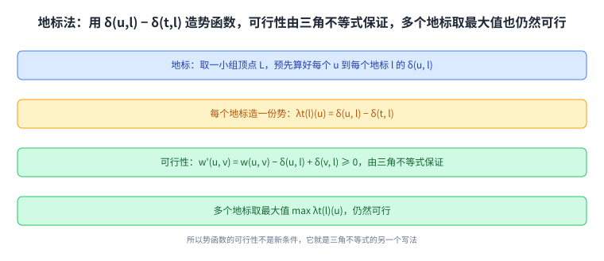

+++
title = "加速 Dijkstra"
lecture = 18
slug = "18-speeding-up-dijkstra"
status = "draft"
source_kind = "notes"
source_url = "https://ocw.mit.edu/courses/6-006-introduction-to-algorithms-fall-2011/resources/mit6_006f11_lec18/"
source_title = "Lecture 18: Speeding up Dijkstra"
output_mode = "explanation"
+++

前三讲（第 15 讲到第 17 讲）解决的都是「单源到所有顶点」：一个起点，算出到每一处的最短距离。而现实里更常见的问法是「从这个路口到那个路口怎么走」，也就是只要一个起点到一个终点的那一条[[term:shortest-path]]。这一讲就在 Dijkstra 上做加速。

讲义自己标成「Shortest Paths IV - Speeding up Dijkstra」，它的 Lecture Overview 列了三件事：单源单目标、双向搜索、目标导向搜索（势函数与地标）。而开篇第一句就要打个预防针：

> 原文：Note: Speedup techniques covered here do not change worst-case behavior, but reduce the number of visited vertices in practice.

**这些技术不改变最坏情况的复杂度**，它们减少的是实际访问的顶点数。这一点决定了本讲的读法：它讲的是工程上的常数与实测，而不是新的渐进界。参考读物也印证了这一点，讲义引的不是教材 CLRS，而是一篇专门综述加速技术的会议论文（Wagner 与 Willhalm，STACS 2007，读到 3.2 节为止）。

## 一、这一讲要解决什么：只想求一条路

改成单目标之后，Dijkstra 本身只需要一处小改动。讲义先写出原版骨架，然后在取最小那一步加了个条件：

> 原文：do u ← EXTRACT-MIN(Q) (stop if u = t!) … Observation: If only shortest path from s to t is required, stop when t is removed from Q, i.e., when u = t

也就是说：当终点 \(t\) 被从[[term:queue]]（[[term:priority-queue]]）里取出来的那一刻，就可以收工了，不必等队列空掉。

这里有一处要提前说明：伪代码里那句 `while Q = φ` 与第 16 讲是同一处笔误，按上下文应当是「当 \(Q\) 不为空时继续」。本页照录原文，读者按「不为空」理解即可，这条也登记进了溯源。

为什么能提前收工？因为第 16 讲证明过的那条性质：**顶点一旦被取出来，它的距离就定稿了**。所以 \(t\) 被取出来的那一刻，它的答案已经确定，后面那些顶点再算都与这条路无关。用 Python 写，这个改动只是循环里多一个判断。

而在无权的图上，「只求一条路」这件事用第 13 讲的 BFS（也就是 [[term:breadth-first-search]]）就能做到，因为按层展开时第一次碰到终点就是最短；一旦边带上权重，就必须靠 Dijkstra 这套按距离取[[term:extract-min]]的机制。至于 Bellman-Ford 那种把所有边反复扫的做法，本来就是为负权准备的，用它来做单目标搜索只会更慢。

这张图解释了提前退出的依据：它靠的不是新定理，而是第 16 讲那条「取出即定稿」的性质。

## 二、双向搜索：两头同时展开

只从起点一头搜，访问的[[term:vertex]]会铺成一个以起点为中心的圆。而如果同时从终点反向搜，两个圆会在中间相遇，访问的总面积就小了。这张图里的[[term:graph]]就是讲义那个小例子。这就是双向搜索：

> 原文：Bi-D Search: Alternate forward search from s, backward search from t (follow edges backward). df(u) distances for forward search, db(u) distances for backward search.

反向搜索的意思是：沿着边反着走，也就是在原图上求「谁到 \(t\) 最近」。两个搜索交替推进，各自维护一份距离（\(d_f\) 与 \(d_b\)）。

这张图里两个搜索是并排的：一个从起点往外铺，一个从终点往外铺，中间相遇的那一圈就是它省下来的部分。

终止条件看着很自然，实际上藏着一个坑：

> 原文：Algorithm terminates when some vertex w has been processed, i.e., deleted from the queue of both searches, Qf and Qb. Subtlety: After search terminates, find node x with minimum value of df(x) + db(x). x may not be the vertex w that caused termination as in example to the left!

**触发终止的那个顶点 \(w\) 不一定就是答案经过的顶点。** 终止之后还要在所有「至少被一边处理过」的顶点里，找 \(d_f(x) + d_b(x)\) 最小的那个 \(x\)，然后分别用两份前驱数组把两段路径拼起来。

讲义给了一个例子把这件事量化：在图 2 那张小图上，\(d_f(u) + d_b(u) = 3 + 6 = 9\)，\(d_f(u') + d_b(u') = 6 + 3 = 9\)，而触发终止的 \(d_f(w) + d_b(w) = 5 + 5 = 10\)。三个数里最小的两个都不是 \(w\)，所以「谁先被两边都处理过」与「谁在最短路上」是两件事。

这张图把「终止条件」与「答案」分开：前者只是一个停止信号，后者要再扫一遍候选顶点才能确定。

## 三、A\*：用势函数把搜索引向目标

第二种加速换了思路：不改变搜索的先后规则，而是改权重，让搜索更愿意朝终点方向走。讲义引入一个作用在顶点上的势函数 \(\lambda\)：

> 原文：Goal-Directed Search or A*: Modify edge weights with potential function over vertices. w'(u, v) = w(u, v) − λ(u) + λ(v)

读法是：每条[[term:edge]]的新[[term:weight]]等于旧权重，减去起点的势、加上终点的势。沿着一条路累加时，中间的势会两两抵消，只剩两个端点：

> 原文：Correctness: w'(p) = w(p) − λt(s) + λt(t). So shortest paths are maintained in modified graph with w' weights.

这正是它「不改变答案」的原因：对所有从 \(s\) 到 \(t\) 的路径来说，\(-\lambda_t(s) + \lambda_t(t)\) 是同一个常数，所以路径之间的长短关系一条都没变。而搜索本身仍然跑 Dijkstra，只不过跑在新权重上。

代价是 Dijkstra 的前提不能忘：

> 原文：To apply Dijkstra, we need w'(u, v) ≥ 0 for all (u, v). Choose potential function appropriately, to be feasible.

新权重必须非负，所以势函数不能随便取，它要满足一个条件：讲义把这个条件叫**可行**（feasible）。讲义用一张示意图说明它的直觉形状：势函数让某些边的新权重变大（上坡）、另一些变小（下坡），而每条边都不能被压到零以下。

这张图的两半要连起来看：上面是每条边的改动方式，下面是它对整条路径的净效果。

## 四、地标与可行性：怎么造出一个可行的势函数

光说「取一个可行的势函数」还不够，讲义给了一个具体造法，用的是**地标**（landmarks）：

> 原文：Landmarks: Small set of landmarks L ⊆ V. For all u ∈ V, l ∈ L, pre-compute δ(u, l). Potential λt(l)(u) = δ(u, l) − δ(t, l) for each l. CLAIM: λt is feasible.

读法是：先挑出一小撮顶点当地标，**预先算好每个顶点到每个地标的距离**；然后对每个地标定义一份势函数，它的值是「从 \(u\) 到地标的距离」减去「从终点 \(t\) 到地标的距离」。讲义声称这样造出来的势函数是可行的，并且当场给了推导：

> 原文：w'(u, v) = w(u, v) − λt(l)(u) + λt(l)(v) = w(u, v) − δ(u, l) + δ(t, l) + δ(v, l) − δ(t, l) = w(u, v) − δ(u, l) + δ(v, l) ≥ 0 by the Δ-inequality

关键是最后一步：\(w(u, v) - \delta(u, l) + \delta(v, l) \ge 0\) 等价于 \(\delta(u, l) \le w(u, v) + \delta(v, l)\)，而这就是第 15 讲那条[[term:triangle-inequality]]（沿着 \(u \to v \to l\) 绕一下，不会比直接从 \(u\) 到 \(l\) 更短）。**所以势函数的可行性不是新条件，它就是三角不等式的另一个写法。**

讲义最后补了一句：把多个地标造出的势函数**取最大值**，也就是 \(\lambda_t(u) = \max_{l \in L} \lambda_t^{(l)}(u)\)，仍然可行。直觉是每个地标都给出一个可行的下界，取其中最大的那个只会让搜索更靠近目标，而不会破坏非负性。

这张图是从「怎么造」到「为什么合法」的一条链：地标给出来路，三角不等式给出保证。

## 五、这一讲没有改变什么

前面三节都是加速，而这一讲最该记住的反而是它的边界：

> 原文：Note: Speedup techniques covered here do not change worst-case behavior, but reduce the number of visited vertices in practice.

三条技术的渐进代价都与原版 Dijkstra 相同：单源单目标只是提前退出，双向搜索只是把两个搜索拼起来，A\* 只是换了一套非负权重。**它们该慢的图还是慢**，比如最坏情况下的网格图或对抗性输入。讲义之所以把它们放在一起讲，是因为在真实的路网数据上，它们能让访问的顶点数降下来，而这一步恰恰是实际速度的来源。

**所以这一讲的定位是一次工程视角的补充**：算法本身在第 16 讲就讲完了，这里讲的是它在真实数据上怎么跑得更快，以及为什么「更快」不等于「渐进更好」。

这张图是这一讲的定盘星：把「实测更快」与「渐进更优」分开，前者是工程收益，后者才是算法结论。

## 读完应该能回答

- 单源单目标相对单源全图，改的是哪一处，依据是哪条性质；
- 双向搜索的终止条件是什么，为什么触发终止的顶点未必在最短路上；
- 势函数改了权重之后，为什么最短路径本身没有被改掉；
- 势函数要「可行」是什么意思，地标法凭什么保证它可行；
- 这一讲的三种加速各自有没有改变最坏情况的复杂度。

## 脉络回顾

这一讲是图搜索这条线的第四个环节。第 13 讲的 BFS 解决的是无权图上的最短路，靠的是按层展开；第 14 讲用 DFS 与完成时间给出了拓扑序；第 15 讲把边带上权重，给出通用骨架，并把「按什么顺序挑边」留成空位；第 16 讲的 Dijkstra 用「每次取最小」填这个空位，代价 \(\Theta(V \lg V + E)\) 但要求非负权；第 17 讲的 Bellman-Ford 填另一种顺序，允许负权并负责报出负环。

而这一讲补的是**同一个 Dijkstra 的另一面**：前三讲关心的是「能不能算、算得对不对」，这一讲关心「实际跑起来快不快」。所以它不给出新的渐进结论，而是给出三种在真实路网上行之有效的收窄办法：少搜一点（单目标提前退出）、两头搜（双向）、朝目标搜（A\* 与地标）。而它们能成立，靠的仍然是第 15、16 讲立下的三条性质：松弛安全、取出即定稿、三角不等式。

## 溯源

本讲的内容来自 MIT 6.006 Fall 2011 的 Lecture 18: Shortest Paths IV - Speeding up Dijkstra 讲义（7 页 typed notes；第 7 页是 OCW 版权页；讲义自身页眉与标题写作 Shortest Paths IV: Speeding Up Dijkstra 与 Shortest Paths IV - Speeding up Dijkstra，而 OCW 资源页的标题是 Speeding up Dijkstra，本页 front matter 用后者、正文按讲义内容写）。本讲的事实都能在上述讲义里逐条对上：Lecture Overview 的三项；参考读物（Wagner 与 Willhalm 的 Speed-up Techniques for Shortest-Path Computations，STACS 2007，读到 3.2 节）与那句「不改变最坏情况、只减少访问顶点数」的注记；单源单目标的伪代码与「当 u = t 时停止」这条 Observation；双向搜索的定义（两头交替、沿边反向、两份距离数组）、终止条件（某顶点被两个队列都删掉）、以及「触发终止的顶点可能不是答案」这条 Subtlety 与「用 \(d_f(x) + d_b(x)\) 最小的 \(x\)、再用两份前驱数组拼路径」的做法；图 2 那三个和（\(3+6=9\)、\(6+3=9\)、\(5+5=10\)）；A\* 的势函数定义 \(w'(u, v) = w(u, v) - \lambda(u) + \lambda(v)\)、正确性式子 \(w'(p) = w(p) - \lambda_t(s) + \lambda_t(t)\)、以及「必须 \(w'(u, v) \ge 0\)、势函数要可行」；地标的定义（小集合 \(L\)、预算好 \(\delta(u, l)\)）、势函数 \(\lambda_t^{(l)}(u) = \delta(u, l) - \delta(t, l)\)、可行性推导（中间项抵消后由 Δ-不等式给出非负）、以及「多个地标取最大值仍可行」。

讲义没有写的部分，以下是我们补的：这篇中文讲解本身（讲义是英文提纲），全部配图（讲义里的示意图一律重画，不转载），以及三处展开说明：

1. 「提前收工的依据是第 16 讲那条取出即定稿的性质」这个连接（讲义只说可以停，没有点出依据）；
2. 「势函数在整条路径上求和时中间项两两抵消」这个读法（讲义给出式子，没有解释它为什么保证路径顺序不变）；
3. 「势函数的可行性就是三角不等式的另一个写法」这个说法，以及「三讲立下的三条性质（松弛安全、取出即定稿、三角不等式）如何各自支撑本讲的一种加速」这个收尾。

另外四处登记：一是讲义伪代码里 `while Q = φ` 与第 16 讲是同一处笔误，按上下文应为「当 Q 不为空时」，本页在引文之前先行说明、照录原文、并在此登记；二是讲义 Figure 3 那一页的 forward/backward 过程图数字高度重复且错位，本页只复述讲义文字里明确写出的三个和（9、9、10）；三是讲义把 \(A^*\) 写成 `A∗`，本页统一写 A\*；四是讲义 Figure 4 的两个箭头旁写着 increase / go uphill 与 decrease / go downhill，本页用「上坡加、下坡减」转述其含义。
