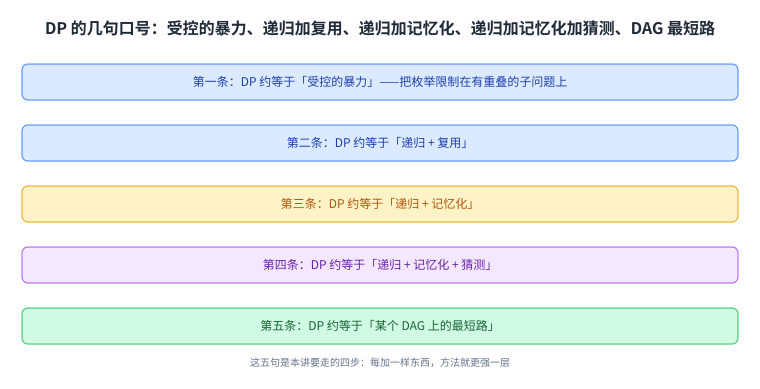
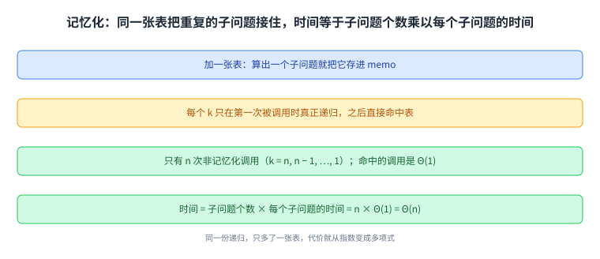
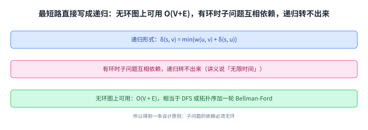
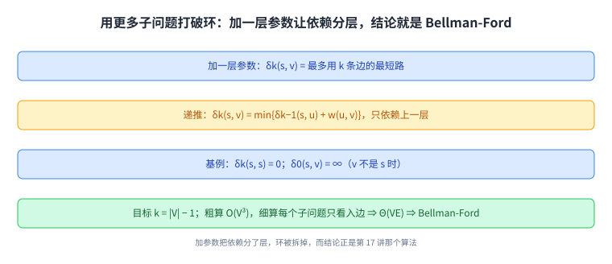
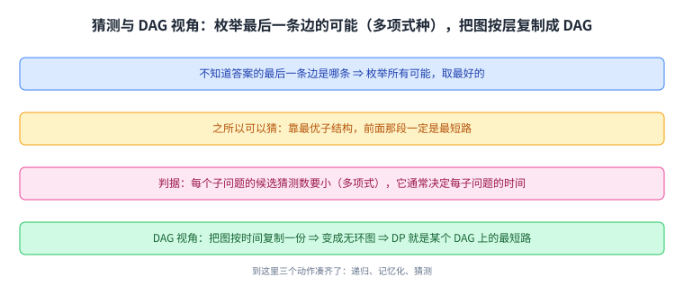

+++
title = "动态规划入门：记忆化、子问题与猜测"
lecture = 19
slug = "19-memoization-subproblems-fibonacci-shortest-paths"
status = "draft"
source_kind = "notes"
source_url = "https://ocw.mit.edu/courses/6-006-introduction-to-algorithms-fall-2011/resources/mit6_006f11_lec19/"
source_title = "Lecture 19: Memoization, subproblems, guessing, bottom-up; Fibonacci, shortest paths"
output_mode = "explanation"
+++

前六讲都在图上搜索：从 BFS 到 Dijkstra，再到 Bellman-Ford 与它的加速。这一讲换了一套方法，讲义把它标成「Dynamic Programming I」，也就是动态规划的第一讲（一共四讲）。它不再是「沿着图走」，而是「把问题拆成子问题，再把子问题的答案存起来复用」。

Lecture Overview 列了三件事：记忆化与子问题、两个例子（Fibonacci 与最短路）、猜测与 DAG 视角。而这一讲最该先记住的是讲义反复给的那几句口号：[[term:dynamic-programming]] 约等于「受控的暴力」，约等于「递归加复用」，约等于「递归加[[term:memoization]]」，最后约等于「某个 DAG 上的最短路」。**这几句话不是修辞，它们对应本讲的三次递进。**

## 一、这一讲要解决什么：DP 是干什么的

讲义先给这个方法定位，用的是三条并列的性质：

> 原文：Dynamic Programming (DP): Big idea, hard, yet simple. Powerful algorithmic design technique. Large class of seemingly exponential problems have a polynomial solution ("only") via DP. Particularly for optimization problems (min / max) (e.g., shortest paths). DP ≈ "controlled brute force". DP ≈ recursion + re-use

翻成中文：它是一种很强的设计技术；一大批看起来必须指数时间的问题，用 DP 能有多项式解法；它特别适合求最值的问题；而它的本质是「受控的[[term:brute-force]]」与「递归加复用」。这里「受控」两个字是关键：暴力枚举所有可能一般不可行，而 DP 把枚举限制在**有重叠的子问题**上。

讲义还讲了一段历史，主角是 Richard E. Bellman（1920 到 1984 年），他在 1979 年获得 IEEE 荣誉奖章。至于「动态规划」这个名字的来历，讲义引了两句回忆：

> 原文："Bellman . . . explained that he invented the name 'dynamid programming' to hide the fact that he was doing mathematical research at RAND under a Secretary of Defense who 'had a pathological fear and hatred of the term, research'"

> 原文："He settled on the term 'dynamic programming' because it would be difficult to give a 'pejorative meaning' and because 'it was something not even a Congressman could object to'" [John Rust 2006]

大意是：他当时在 RAND 做数学研究，而上级对「研究」这个词有近乎病态的厌恶，于是他用一个听起来无害的名字把它藏起来；最终选「dynamic programming」的原因是这个词不容易被赋予贬义，连国会议员也挑不出毛病。

这里有一处要提前说明：引文里的 `dynamid programming` 是原文的拼写（来源处即为如此），读者按 `dynamic programming` 理解即可，这条也登记进了溯源。

这张图把本讲要走的四步先摆出来：每加一样东西，方法就更强一层。

## 二、例子一：Fibonacci 的朴素递归为什么是指数

斐波那契数列的定义只有一行：

> 原文：F1 = F2 = 1; Fn = Fn−1 + Fn−2. Goal: compute Fn

直接照定义写递归是最自然的做法，而讲义立刻给了它的代价：

> 原文：T(n) = T(n − 1) + T(n − 2) + O(1) ≥ Fn ≈ φ^n ≥ 2T(n − 2) + O(1) ≥ 2^(n/2). EXPONENTIAL — BAD!

读法是：这个递归调用的次数本身就长得和 \(F_n\) 一样快，而 \(F_n\) 随 \(n\) 指数增长；把下界放宽一点，至少是 \(2^{n/2}\)。**同一个子问题被反复计算，是这份代价的全部来源**：算 \(F_n\) 要算 \(F_{n-1}\) 与 \(F_{n-2}\)，而 \(F_{n-2}\) 又会被 \(F_{n-1}\) 那条分支再算一遍。

这张图要看的不是树有多大，而是**同一批节点出现的次数**：重复出现的那些子问题就是被浪费的工作。

## 三、记忆化：同样的递归，加一张表

修法小得出人意料：在递归外面放一个字典，算过的答案就存下来。

> 原文：memo = { }; fib(n): if n in memo: return memo[n]; else: if n ≤ 2: f = 1; else: f = fib(n − 1) + fib(n − 2); memo[n] = f; return f

效果是决定性的：

> 原文：⇒ fib(k) only recurses first time called, ∀k. ⇒ only n nonmemoized calls: k = n, n − 1, …, 1. memoized calls free (Θ(1) time). ⇒ Θ(1) time per call (ignoring recursion). POLYNOMIAL — GOOD!

读法是：每个 \(k\) 只在第一次被调用时真正递归下去，之后都直接命中表；于是「真正干活的调用」只有 \(n\) 次。而 DP 的分析就落在一个通用公式上：

> 原文：memoize (remember) & re-use solutions to subproblems that help solve problem — in Fibonacci, subproblems are F1, F2, …, Fn. ⇒ time = # of subproblems · time/subproblem

**时间等于[[term:subproblem]]个数乘以每个子问题的时间。** 对 Fibonacci 来说就是 \(n\) 个子问题，每个 Θ(1)，合计 Θ(n)。这条公式是后面所有 DP 题目的算账方式。

这张图的重点在最后那个乘法：DP 的代价分析从此变成「数子问题」和「算子问题」两件事。

## 四、自底向上：把递归展开成循环

记忆化是从上往下的写法。讲义接着给了等价的另一种写法，也就是[[term:bottom-up]]：反过来从小到大填表，

> 原文：fib = {}; for k in [1, 2, …, n]: if k ≤ 2: f = 1; else: f = fib[k − 1] + fib[k − 2]; fib[k] = f; return fib[n]

讲义强调它与记忆化版本做的事完全一样，只是把递归「展开」了；而在一般情况下，这个顺序就是**子问题依赖图的一个拓扑排序**（第 14 讲那个概念在这里再次出现）。自底向上还多三个好处：

> 原文：practically faster: no recursion; analysis more obvious; can save space: just remember last 2 fibs ⇒ Θ(1)

也就是：没有递归开销所以更快、代价分析更直白、而且可以省空间（只留最近两个值就是 Θ(1)）。讲义还加了一条旁注：Fibonacci 其实还有 \(O(\lg n)\) 的算法，但那用的是别的技术，不属于 DP。

这张图把「填表顺序」与「拓扑序」画成一件事：顺序对了，每个子问题被算的时候它的依赖都已经就绪。

## 五、例子二：最短路的递归形式，以及「有环就无限」

换到[[term:shortest-path]]问题，同一个套路先写成[[term:recursion]]形式：

> 原文：Recursive formulation: δ(s, v) = min{w(u, v) + δ(s, u) : (u, v) ∈ E}

意思是：从 \(s\) 到 \(v\) 的最短距离，等于「先到某个前驱 \(u\)、再走最后一条边」里的最小值。但讲义马上指出这条路走不通：

> 原文：Memoized DP algorithm: takes infinite time if cycles! in some sense necessary to handle negative cycles. … works for directed acyclic graphs in O(V + E)

原因是子问题之间会互相依赖：如果图里有环，\(u\) 的距离要靠 \(v\)，\(v\) 的距离又可能要靠 \(u\)，递归就转不出来。而在无环图上它能用，代价是 \(O(V + E)\)，讲义把它描述成「DFS 或拓扑排序加上一轮 Bellman-Ford，被卷进一次递归里」。

这里是这一讲最重要的一条设计原则：

> 原文：Subproblem dependency should be acyclic

**子问题的依赖关系必须无环**，这是 DP 能成立的前提，也是后面所有技巧的出发点。

这张图把「依赖无环」标成红线的理由说清了：它不是实现细节，而是递归能否终止的条件。

## 六、用「更多子问题」打破环：Bellman-Ford 的再发现

既然环会卡住依赖，那就把子问题定义得更细一些，让依赖变回无环。讲义的做法是给子问题加一个参数：

> 原文：more subproblems remove cyclic dependence: δk(s, v) = shortest s → v path using ≤ k edges. Recurrence: δk(s, v) = min{δk−1(s, u) + w(u, v) : (u, v) ∈ E}; δ0(s, v) = ∞ for s ≠ v; δk(s, s) = 0 for any k. Goal: δ(s, v) = δ|V|−1(s, v)

读法是：\(\delta_k(s, v)\) 表示「最多用 \(k\) 条[[term:edge]]」的最短距离。这样一来，第 \(k\) 个子问题只依赖第 \(k-1\) 层，层次之间是单向的，环被拆掉了。两个基例也很自然：不走边的时候，自己到自己是 0，到别人都是无穷大。而目标就是取 \(k = |V| - 1\)：如果图里没有负环，那么最短路径一定能在 \(|V|-1\) 条边以内走完。

时间上，讲义先给一个粗略的算法与一个更细的算法：

> 原文：time: # subproblems · time/subproblem ||V|·|V|·O(v) = O(V³) … actually Θ(indegree(v)) for δk(s, v) • ⇒ time = Θ(V · Σ_{v∈V} indegree(v)) = Θ(VE). BELLMAN-FORD!

粗算是 \(|V| \cdot |V|\) 个子问题、每个 \(O(V)\)，得到 \(O(V^3)\)；细算则是每个子问题只看它的入边，总共 \(\Theta(VE)\)。**而这个式子与第 17 讲那个算法完全一致** —— 讲义在这里用大写字母给出了结论：Bellman-Ford。**它不是被重新发明的另一个算法，而是「把子问题加一层参数」这个 DP 套路的结果。**

这张图与第 17 讲那张是同一件事的两个视角：那边讲「松弛 |V|−1 轮」，这边讲「第 k 层的子问题」。

## 七、猜测与 DAG 视角

最后讲义回答了「递推式是怎么想出来的」这个问题，而这里的「递推式」就是 [[term:recurrence]]。它的答案是一个动作：[[term:guessing]]。

> 原文：How to design recurrence: want shortest s → v path; what is the last edge in path? dunno; guess it is (u, v); path is shortest s → u path + edge (u, v) # by optimal substructure; cost is δk−1(s, u) + w(u, v) # another subproblem; to find best guess, try all (|V| choices) and use best

也就是说：不知道答案的最后一条边是哪条，那就枚举所有可能是最后一条边的选择，取其中最好的。而这个「猜」之所以有效，靠的是第 15 讲到第 17 讲反复用到的[[term:optimal-substructure]]：如果最后一条边是 \((u, v)\)，那么前面那段一定是从 \(s\) 到 \(u\) 的最短路。

讲义给了一条很实际的判据：

> 原文：key: small (polynomial) # possible guesses per subproblem — typically this dominates time/subproblem

**每个子问题的候选猜测数必须小（多项式），因为它通常就是「每个子问题的时间」。** 到这里，DP 的三个动作就凑齐了：递归、记忆化、猜测。

至于 DAG 视角，讲义把它说成「把图按时间复制一份」：状态 \((v, k)\) 是新的顶点，只从第 \(k-1\) 层连到第 \(k\) 层，于是原来带环的图变成了一个无环图，问题回到上一节那种「无环图上求最短路」的形式。

这张图是整讲的收束：前面几节的方法在这里合成了一个统一说法 —— DP 就是在某个 DAG 上求最短路。

## 读完应该能回答

- 朴素递归算 Fibonacci 为什么是指数时间，浪费在哪里；
- 记忆化只加了一张表，为什么代价就变成多项式；
- DP 的代价公式由哪两个因子的乘积构成，自底向上比记忆化多哪三个好处；
- 最短路写成递归形式时，「子问题依赖必须无环」为什么是硬要求；
- 加一层参数 \(\delta_k\) 之后，Bellman-Ford 是怎么被推出来的；
- 「猜测」在递推式设计里扮演什么角色，什么样的猜测数是可接受的。

## 脉络回顾

这一讲是整门课的一次方法转变。前六讲（第 13 讲到第 18 讲）都在图上搜索：BFS 按层、DFS 深入并给出拓扑序、Dijkstra 每次取最小、Bellman-Ford 反复松弛、再到加速技巧。而那些算法的共同点是**沿着已有的图走**，图本身是给定的。

这一讲把「图」换成了「子问题的依赖图」：状态是顶点，依赖是边，而解法变成「按依赖顺序把每个状态的答案填出来」。这么一换，前面几讲的东西全都重新出现了一次：拓扑排序（第 14 讲）成了自底向上的填表顺序，Bellman-Ford（第 17 讲）成了「给子问题加一层参数」的结果，而最优子结构（第 15 讲）成了「猜测最后一条边」之所以合法的依据。**所以这一讲不是又讲了一个算法，而是把前面那些算法看成同一件事的不同侧面。**

要分清的是，DP 能用的前提是子问题依赖无环；一旦有环，要么换子问题的定义（像 \(\delta_k\) 那样加参数），要么就回到 Bellman-Ford 那种迭代做法。而这一讲只是四讲里的第一讲，后面三讲会把「猜测」用在更多题型上。

## 溯源

本讲的内容来自 MIT 6.006 Fall 2011 的 Lecture 19: Dynamic Programming I: Memoization, Fibonacci, Shortest Paths, Guessing 讲义（6 页 typed notes；第 6 页是 OCW 版权页；讲义自身页眉写作 Dynamic Programming I of IV、标题写作 Lecture 19: Dynamic Programming I: Memoization, Fibonacci, Shortest Paths, Guessing，而 OCW 资源页的标题是 Memoization, subproblems, guessing, bottom-up; Fibonacci, shortest paths，本页 front matter 用后者、正文按讲义内容写）。本讲的事实都能在上述讲义里逐条对上：Lecture Overview 的三项；DP 的三条定位与两句口号（controlled brute force、recursion + re-use）；Bellman 的生卒年、1979 年 IEEE 荣誉奖章与他给方法起名的那段引文（含 John Rust 2006 这个出处）；Fibonacci 的定义与朴素递归的代价推导（\(T(n) = T(n-1) + T(n-2) + O(1) \ge F_n \approx \phi^n \ge 2T(n-2) + O(1) \ge 2^{n/2}\)）；记忆化版本的三条推论与「时间 = 子问题数 × 每个子问题的时间」这个公式；自底向上版本的伪代码与其三项好处（不用递归、分析更直白、只留最近两个值可省到 Θ(1)），以及「递归展开」与「子问题依赖 DAG 的拓扑排序」这个说法和那条 \(O(\lg n)\) 的旁注；最短路递归形式、有环时「无限时间」的警告、无环图上的 O(V+E) 与「依赖必须无环」这条原则；\(\delta_k\) 的定义与递推式、两个基例、目标 \(k = |V|-1\)、粗算 O(V³) 与细算 Θ(VE) 并点出 BELLMAN-FORD；以及「猜测」那一节的五步（最后一条边不知道、猜它是 (u, v)、靠最优子结构、代价是另一个子问题、枚举所有选择取最好）与「每个子问题的猜测数要小」这条判据、DAG 视角。

讲义没有写的部分，以下是我们补的：这篇中文讲解本身（讲义是英文提纲），全部配图（讲义里的示意图一律重画，不转载），以及三处展开说明：

1. 「重复出现的子问题就是被浪费的工作」这个说法（讲义画了那棵树并从代价推出指数，没有用这句话点出原因）；
2. 「子问题加一层参数就是把依赖分层」这个解释，以及它与第 17 讲「松弛 |V|−1 轮」是同一件事的两个视角；
3. 「前六讲沿着给定的图走、这一讲换成子问题的依赖图」这个收尾对照。

另外四处登记：一是引文里的 `dynamid programming` 是来源的拼写（John Rust 2006 的转述中即为如此），本页在引文之前先行说明、照录原文、并在此登记；二是讲义把 \(\delta_0(s, v) = \infty\) 写成 \(s = v\)（应为 \(s \ne v\)），本页按「不走边时自己到自己是 0、到别人是无穷大」表述；三是讲义 Figure 1 与 Figure 2 的图内文字在文本层只读出零散字母，本页只复述讲义正文给出的式子；四是资料来源里的 `_orig` 手写版讲义我们只登记、未使用。
