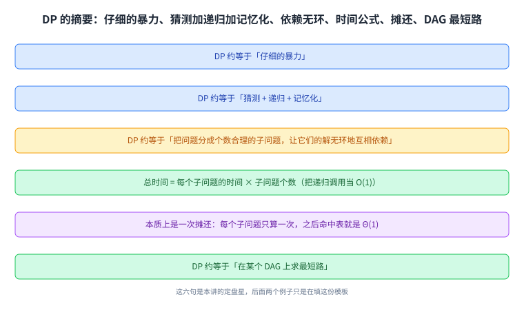
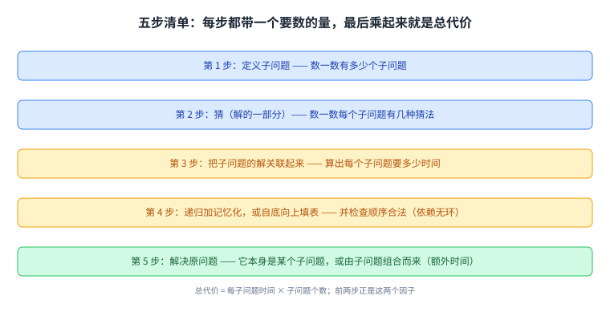
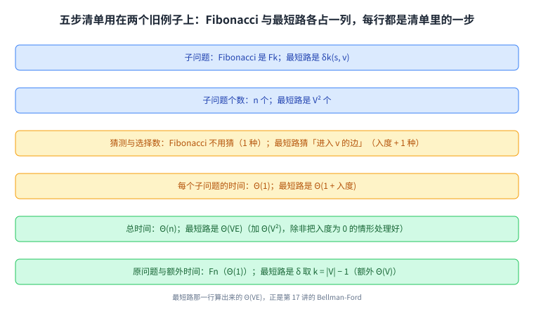
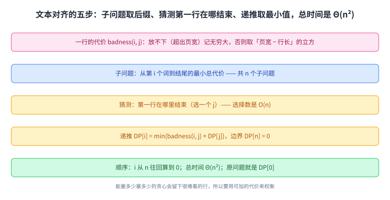
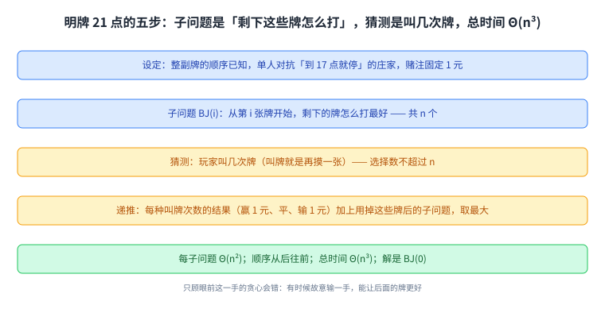
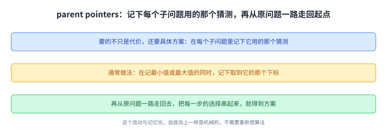

+++
title = "动态规划（二）：文本对齐与明牌 21 点"
lecture = 20
slug = "20-parent-pointers-text-justification-blackjack"
status = "draft"
source_kind = "notes"
source_url = "https://ocw.mit.edu/courses/6-006-introduction-to-algorithms-fall-2011/resources/mit6_006f11_lec20/"
source_title = "Lecture 20: Parent pointers; text justification, perfect-information blackjack"
output_mode = "explanation"
+++

第 19 讲用 Fibonacci 与最短路开了[[term:dynamic-programming]]的头。这一讲是 DP 的第二讲，它做了两件事：把方法固定成一张五步清单，然后拿两个看起来毫无关系的新例子（把文本排成好看的行、明牌 21 点）各走一遍。

Lecture Overview 列了四项：五步清单、文本对齐、明牌 21 点、父指针（从表里把解还原出来）。

## 一、这一讲要解决什么：把方法固定成五步

讲义开头先给了一段摘要，把前两讲攒下的东西压成几句话：

> 原文：DP ≈ "careful brute force". DP ≈ guessing + recursion + memoization. DP ≈ dividing into reasonable # subproblems whose solutions relate — acyclicly — usually via guessing parts of solution. time = # subproblems × time/subproblem. DP ≈ shortest paths in some DAG

其中「合理的子问题个数」与「依赖无环」是两句限制，那个乘法公式仍然是唯一的算账方式，而「仔细的[[term:brute-force]]」与「[[term:recursion]] 加记忆化」这两句则是方法的两面。紧接着它说清了这个公式为什么成立：本质上是一次摊还分析，每个子问题只算一次，之后再遇到就直接命中表，代价 Θ(1)。

这张图把前两讲攒下的结论一次列全：它既是本讲的开场，也是后面两个例子要照着填的模板。

然后是这一讲的核心，也就是那五步：

> 原文：1. define subproblems — count # subproblems. 2. guess (part of solution) — count # choices. 3. relate subproblem solutions — compute time/subproblem. 4. recurse + memoize — time = time/subproblem · # subproblems, OR build DP table bottom-up, check subproblems acyclic/topological order. 5. solve original problem: = a subproblem, OR by combining subproblem solutions ⇒ extra time

这张清单的好处是每一步都带一个**要数的量**：第一步数[[term:subproblem]]个数，第二步数每个子问题的[[term:guessing]]种数，第三步算子问题的时间，第四步排出一个合法的计算顺序（要么递归加[[term:memoization]]，要么像 [[term:bottom-up]] 那样填表），第五步说明原问题怎么由子问题拼出来（如果原问题本身就是某个子问题，那就不用额外时间）。

这张图里的清单不是流程建议，而是一份**算账模板**：前两步给出乘法的两个因子，第四步验证顺序合法。

## 二、用这张清单重看 Fibonacci 与最短路

讲义用它自己的表格把第 19 讲的两个例子又过了一遍，每一行都对应清单里的一步：

> 原文：Fibonacci: 子问题 Fk（# 子问题 n），猜测「没有」（# 选择 1），递推 Fk = Fk−1 + Fk−2（每子问题 Θ(1)），顺序 k = 1…n，总时间 Θ(n)，原问题 Fn，额外时间 Θ(1)。Shortest Paths: 子问题 δk(s, v)（# 子问题 V²），猜测「进入 v 的那条边」（# 选择 indegree(v) + 1），递推 δk(s, v) = min{δk−1(s, u) + w(u, v)}（每子问题 Θ(1 + indegree(v))），顺序 k = 0…|V|−1、对每个 v，总时间 Θ(VE)，原问题 δ|V|−1(s, v)，额外时间 Θ(V)

**这两行与第 19 讲是同一个例子**（同一批子问题、同一条递推式），只是换成了清单的读法；而第二行算出来的 Θ(VE) 就是第 17 讲的 Bellman-Ford。顺带两句对照：如果边都没有权重，那一行就退化成按层数走的 BFS，而「检查依赖无环、排一个顺序」这一步在有向无环图上用的就是第 14 讲 DFS 给出的拓扑序；另外，讲义这两段的伪代码都是 Python 风格（`DP[i]`、`range(i + 1, n + 1)`），而这种「枚举最后一步的所有猜测」的表格思路与第 16 讲 Dijkstra 的贪心是两条路：**Dijkstra 不枚举全部猜测，它靠「每次取最小」直接跳过大部分可能。**

这张表的作用是校准：两个熟悉的问题在清单里长什么样，后面两个陌生的问题照着填就行。

## 三、例子一：文本对齐

第一个新问题是排版，也就是[[term:text-justification]]：把一段词分成若干行，让整体「好看」。讲义先批评了最自然的做法：

> 原文：obvious (MS Word/Open Office) algorithm: put as many words that fit on first line, repeat. but this can make very bad lines

也就是「每行能塞多少塞多少」。问题是它会把最后一行搞得很难看，或者把一个超长的词单独挤在一行。所以要先定义**一行有多糟**：

> 原文：Define badness(i, j) for line of words[i : j]. For example, ∞ if total length > page width, else (page width − total length)³

读法是：如果这一行放不下（超出页宽），代价记作无穷大，等于禁止这种排法；否则代价是「剩余空间的立方」。取立方而不是线性，是为了让「空得太多」的行被罚得更重。目标则是把整段词切成若干行，使代价之和最小。

照着清单走一遍：子问题取「从第 \(i\) 个词开始到结尾的最小代价」，一共 \(n\) 个子问题（\(n\) 是词数）；猜测是「第一行在哪里结束」，也就是选一个 \(j\)，选择数是 \(O(n)\)；递推是 \(DP[i] = \min(\text{badness}(i, j) + DP[j])\)，边界 \(DP[n] = 0\)；顺序是从 \(n\) 往回算到 0，这样算 \(DP[i]\) 时右边的值都已经就绪；总时间是子问题数乘以每子问题时间，也就是 \(\Theta(n^2)\)；原问题就是 \(DP[0]\)，它本身就是一个子问题，所以不需要额外时间。

这张图把「一行多糟」的定义与五步串起来：先有一个可加的代价，后面的拆分才谈得上最优。

## 四、例子二：明牌 21 点

第二个新例子更意外：一副[[term:blackjack]]牌的顺序完全公开，一个人跟一个「到 17 点就停」的庄家玩 21 点，赌注固定为 1 元，问怎么玩收益最大。

> 原文：Given entire deck order: c0, c1, …, cn−1. 1-player game against stand-on-17 dealer. when should you hit or stand? GUESS. goal: maximize winnings for fixed bet $1. may benefit from losing one hand to improve future hands!

最后那句是关键：**有时候故意输掉这一手反而对后面有利**，所以不能贪心地只顾眼前这一手。这个「不贪心」正是 DP 存在的理由。

同样按清单走：子问题取 \(BJ(i)\)，表示「从第 \(i\) 张牌开始，剩下的牌怎么打最好」，一共 \(n\) 个；猜测是「玩家叫几次牌」，选择数不超过 \(n\)；递推是把每种叫牌次数的结果（赢 1 元、平、输 1 元）加上「用掉这些牌之后」的子问题，再取最大值，而每个子问题要枚举的叫牌次数与庄家的补牌过程合起来是 \(\Theta(n^2)\)；顺序是从后往前；总时间是 \(\Theta(n^3)\)；解就是 \(BJ(0)\)。

讲义的详细伪代码还处理了两处规则细节：玩家爆牌之后不能再叫，庄家到 17 点就停。那些细节没有改变量级，只是把「哪些猜测是合法的」写清楚。

这张图要看的是一件事：**「只顾眼前」的贪心在这里会错，而 DP 靠枚举「叫几次」把未来算进来。**

## 五、还原解：parent pointers

到这里五步只算了代价，还没给出「具体怎么排」「具体怎么叫」。讲义最后讲的就是这一步：

> 原文：To recover actual solution in addition to cost, store parent pointers (which guess used at each subproblem) & walk back. typically: remember argmin/argmax in addition to min/max

做法是：在算每个子问题时，顺手记下它用的是哪个猜测（取最小或最大时的那个下标），之后再从原问题一路「回着走」，把每一步的选择串起来。

讲义用文本对齐给了具体写法：把表里存的从「一个数」变成「（代价，下一步）」，边界写成 \(DP[n] = (0, \text{None})\)，然后从 \(i = 0\) 出发，边走边输出每一行的结束位置，直到指针为 None 为止。它还给了一句让人安心的评语：

> 原文：just like memoization & bottom-up, this transformation is automatic, no thinking required

也就是：从「只算代价」到「同时还原解」这个改动是**机械的**，不需要重新想算法。而它听起来耳熟，是因为第 15 讲与第 16 讲的[[term:shortest-path]]算法早就用过同一招：那边叫[[term:predecessor]]数组 \(\Pi\)，这边叫 parent pointer。

这张图与第 16 讲的 \(\Pi\) 是同一个动作：代价表负责「值多少」，父指针表负责「怎么走」。

## 读完应该能回答

- 五步清单里每一步分别要数什么，总代价公式的两个因子从哪来；
- 文本对齐里「一行的代价」怎么定义，为什么用立方而不是线性；
- 明牌 21 点为什么会「故意输一手」，这个性质对算法意味着什么；
- 两个新例子的总时间各是多少，它们各自的时间大头花在哪一步；
- 为什么「同时还原解」这个改动不需要重新设计算法。

## 脉络回顾

这一讲把第 19 讲的 DP 从「一个例子」推进成「一套清单」。第 19 讲用 Fibonacci 说明重复子问题的浪费、用最短路说明「子问题依赖必须无环」，而这一讲先把方法压成五步，再拿两个**彼此毫无关系**的问题各走一遍：一个是排版（文本对齐），一个是牌局（明牌 21 点）。它们表面上一个属于文字处理、一个属于博弈，但在清单里长得几乎一样：都是「子问题取后缀、猜测第一个决策、递推取最值」，算出来的代价也都在平方或立方这一档。

要分清的是，这一讲没有引入新的算法思想，它引入的是**可复用的流程**。真正的难点仍然在第二步：猜测什么、以及猜测的种数是不是多项式。这个判断在文本对齐里是「第一行在哪结束」，在 21 点里是「叫几次牌」，而它们之所以能被穷举，是因为选择数都在多项式范围内。

另外，这一讲最后那节把 DP 与前面的图算法接上了：**从表里还原解用的 parent pointer，就是第 15、16 讲那个前驱数组**。也就是说，前三讲讲的最短路算法，可以从 DP 的角度重新推出来；而这一讲的两个新例子，又可以用同一套表结构来算。往后的三讲会继续在别的题型上用这张清单。

## 溯源

本讲的内容来自 MIT 6.006 Fall 2011 的 Lecture 20: Dynamic Programming II 讲义（6 页 typed notes；第 6 页是 OCW 版权页；讲义自身页眉写作 Dynamic Programming II of IV、标题写作 Lecture 20: Dynamic Programming II，而 OCW 资源页的标题是 Parent pointers; text justification, perfect-information blackjack，本页 front matter 用后者、正文按讲义内容写）。本讲的事实都能在上述讲义里逐条对上：Lecture Overview 的四项；那一组 DP 摘要（careful brute force、guessing + recursion + memoization、合理子问题数、依赖无环、time = # subproblems × time/subproblem、把它看成摊还、「DP 约等于某个 DAG 上的最短路」）；五步清单的每一条与它要求数的量；Fibonacci 与最短路那张逐行对照表上的全部数字（子问题数 \(n\) 与 \(V^2\)、选择数 1 与 \(\text{indegree}(v)+1\)、每子问题时间 \(\Theta(1)\) 与 \(\Theta(1+\text{indegree}(v))\)、总时间 \(\Theta(n)\) 与 \(\Theta(VE)+\Theta(V^2)\)、原问题与额外时间 \(\Theta(1)\) 与 \(\Theta(V)\)）；文本对齐的朴素做法与它的毛病、\(\text{badness}(i,j)\) 的定义（超出页宽记无穷大，否则取「页宽减行长」的立方）、DP 递推与 \(DP[n]=0\)、计算顺序与 \(\Theta(n^2)\) 的总时间、以及解是 \(DP[0]\)；明牌 21 点的设定（整副牌顺序已知、单人对抗「到 17 点就停」的庄家、赌注 1 元、可能故意输一手）、它的子问题 \(BJ(i)\) 与三步递推、每子问题 \(\Theta(n^2)\) 与总时间 \(\Theta(n^3)\)、解是 \(BJ(0)\)、以及详细伪代码里那两处规则细节（爆牌后不再叫、庄家到 17 点停）；最后是 parent pointers 这一节（存下每个子问题用的猜测并回走、记 argmin/argmax、文本对齐的具体写法与 \(DP[n]=(0,\text{None})\)、以及「这个改动是自动的」这句评语）。

讲义没有写的部分，以下是我们补的：这篇中文讲解本身（讲义是英文提纲），全部配图（讲义里的示意图一律重画，不转载），以及三处展开说明：

1. 「五步清单是一份算账模板」这个说法，以及「前两步给出乘法的两个因子、第四步验证顺序合法」这个对应；
2. 文本对齐里「取立方是为了让空得多的行被罚得更重」这个动机（讲义只给了式子）；
3. 「parent pointer 就是第 15、16 讲那个前驱数组 \(\Pi\)」这个跨讲对应，以及「前三讲的最短路算法可以从 DP 的角度重新推出来」这个收尾。

另外四处登记：一是讲义把五步清单的第五步写成两行（原问题本身就是子问题，或由子问题组合而成并付出额外时间），本页合并成一句话表述；二是明牌 21 点那段详细伪代码在文本层严重错位（括号、求和上下标与注释都散开了），本页只复述它的结构与两处规则细节，不逐行复述代码；三是讲义 Figure 1、Figure 2、Figure 3 的图内文字只读出零散片段（例如 blah 与 reallylongword 的对照），本页按文字描述的对比关系转述；四是资料来源里的 `_orig` 手写版讲义我们只登记、未使用。
