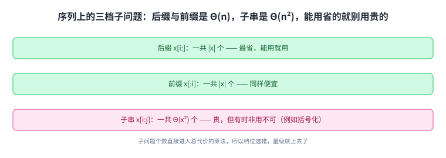
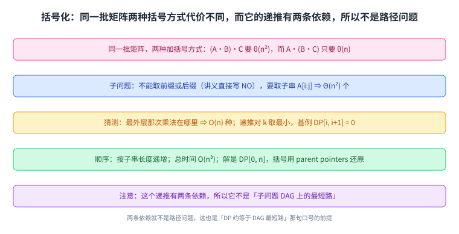
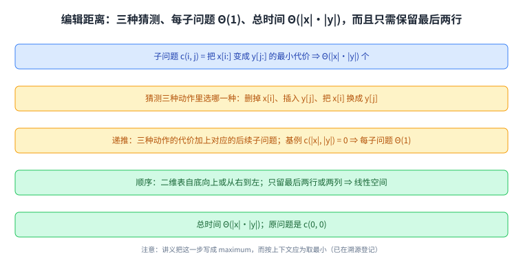
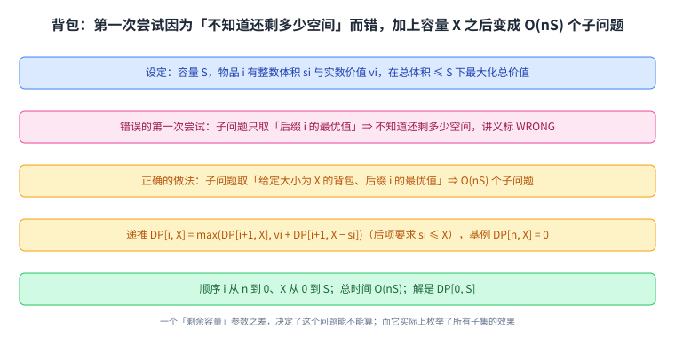
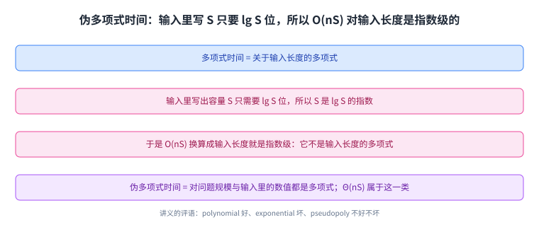

+++
title = "动态规划（三）：字符串子问题、括号化、编辑距离与背包"
lecture = 21
slug = "21-string-subproblems-edit-distance-knapsack"
status = "draft"
source_kind = "notes"
source_url = "https://ocw.mit.edu/courses/6-006-introduction-to-algorithms-fall-2011/resources/mit6_006f11_lec21/"
source_title = "Lecture 21: String subproblems, psuedopolynomial time; parenthesization, edit distance, knapsack"
output_mode = "explanation"
+++

第 19 讲开了[[term:dynamic-programming]]的头，第 20 讲把方法压成五步清单并用文本对齐与 21 点演示。这一讲是 DP 的第三讲，它把清单挪到字符串与序列上，一次给出三个例子；而在最后一个例子（背包）里，它第一次提出一个关于度量口径的新概念：伪多项式时间。

Lecture Overview 列了五项：字符串的子问题、括号化、编辑距离（以及最长公共子序列）、背包、伪多项式时间。有一处拼写要先说明：**本页标题按 OCW 资源页照录**，而那个页面里 `psuedopolynomial` 是 `pseudopolynomial` 的拼写错误（讲义正文用的是后一种写法）。这条也登记进了溯源。

## 一、这一讲要解决什么：序列上的子问题分三档

讲义先复习了那五步（定义[[term:subproblem]]、猜测、关联、[[term:memoization]]或自底向上、解决原问题），然后指出前两讲的问题有个共同点：

> 原文：problems from L20 (text justification, Blackjack) are on sequences (words, cards)

也就是说，[[term:text-justification]]处理的是词的序列，[[term:blackjack]]处理的是牌的序列。于是这一讲接着给出一份「序列上能取什么样的子问题」的清单：

> 原文：useful problems for strings/sequences x: suffixes x[i :] — Θ(|x|) ← cheaper ⇒ use if possible; prefixes x[: i]; substrings x[i : j] — Θ(x²)

三档的价值差别很大：后缀与前缀只有 \(|x|\) 个，而子串有 \(|x|^2\) 个。讲义在「更省」两个字后面加了「能用就用」，因为**子问题个数直接进入总代价的乘法**，能少一半的量级就别浪费。

这张图是这一讲的选型指南：后面三个例子正好各用其中一档。

## 二、例子一：括号化（矩阵链相乘）

第一个例子是[[term:parenthesization]]：给一个结合性表达式决定求值顺序，

> 原文：Optimal evaluation of associative expression A[0] · A[1] · · · A[n − 1] — e.g., multiplying rectangular matrices

乘法满足结合律，所以加括号的方式不影响结果，但影响代价。讲义的例子很直白：同样三个矩阵，\((A \cdot B) \cdot C\) 要 \(\theta(n^2)\) 的时间，而 \(A \cdot (B \cdot C)\) 只要 \(\theta(n)\)。同一批矩阵、同一批乘法，只是括号位置不同，代价就差一个量级。

照着清单走：子问题不能取前缀与后缀（讲义在这一步直接写了 NO），而要取子串 \(A[i : j]\) 的代价，一共 \(\Theta(n^2)\) 个；猜测是「最外层的那次乘法在哪里」，选择数是 \(O(n)\)；递推是 \(DP[i, j] = \min(DP[i, k] + DP[k, j] + \text{相乘代价})\)（对 \(k\) 从 \(i+1\) 到 \(j-1\) 取最小），基例 \(DP[i, i+1] = 0\)；每个子问题要试 \(O(n)\) 个 \(k\)，所以是 \(O(n)\)；顺序按子串长度递增；总时间是 \(O(n^3)\)；原问题是 \(DP[0, n]\)，而括号本身要用 parent pointers 才能还原出来。

这里有一段值得单独记住的提醒：

> 原文：NOTE: Above DP is not shortest paths in the subproblem DAG! Two dependencies =⇒ not path!

第 19 讲与第 20 讲反复说「DP 约等于某个 DAG 上的[[term:shortest-path]]」，而这一条把它限定住了：**那条口号只在递推式只有一条依赖时成立**。括号化的递推同时依赖左右两半，是两条边进入同一个子问题，所以它不是路径问题；第 16 讲的 Dijkstra 与第 17 讲的 Bellman-Ford 那类「沿一条路累加」的算法在这里帮不上忙。

这张图的两个重点：括号位置决定代价，以及「两条依赖」把这一节与前两讲的 DAG 口号区分开。

## 三、例子二：编辑距离

第二个例子处理两个字符串之间的差异，也就是[[term:edit-distance]]，它的用途清单很实际：

> 原文：Used for DNA comparison, diff, CVS/SVN/. . ., spellchecking (typos), plagiarism detection, etc.

问题本身是：给定字符串 \(x\) 与 \(y\)，用最便宜的一串编辑动作（插入一个字符、删除一个字符、把一个字符替换成另一个）把 \(x\) 变成 \(y\)。讲义的例子是 HIEROGLYPHOLOGY 与 MICHAELANGELO 之间能取出 HELLO。

这里有一个很漂亮的等价关系：

> 原文：If insert & delete cost 1, replace costs 0, minimum edit distance equivalent to finding longest common subsequence. Note that a subsequence is sequential but not necessarily contiguous.

也就是说，当「删除加插入」与「替换」的代价配成 1 与 0 时，编辑距离就等于最长公共子序列：允许把一个字符替换掉，等于允许两个字符不必相同也能对上。而这也就解释了为什么「子序列」这个词要加一句限定：它保持先后顺序，但不要求连续。

这张图把两个问题画成一件事：编辑距离允许「跳过」与「替换」，而最长公共子序列只关心哪些字符按序出现在两边。

子问题照清单来：\(c(i, j)\) 表示「把 \(x[i:]\) 变成 \(y[j:]\)」的最小代价，一共 \(\Theta(|x| \cdot |y|)\) 个；猜测是三种动作里选哪一种（删掉 \(x[i]\)、插入 \(y[j]\)、把 \(x[i]\) 换成 \(y[j]\)）；递推是三种动作各自的代价加上对应的后续子问题，基例 \(c(|x|, |y|) = 0\)；每个子问题只做常数次比较，所以是 \(\Theta(1)\)；顺序在二维表里自底向上（或从右到左），这个填表顺序就是第 14 讲 DFS 给出的那种拓扑序；而且只需要保留最后两行或两列，空间能压到线性；总时间是 \(\Theta(|x| \cdot |y|)\)；原问题是 \(c(0, 0)\)。实现上这张表就是一个数组，Python 里可以用 NumPy 来装它。

讲义在这里有一处要提前说明：**它把递推写成 `c(i, j) = maximum of:`**，而编辑距离是要找最小代价（同一页上面写的就是 the cheapest possible sequence）。按上下文，`maximum` 应当是 `minimum` 的笔误。本页照录原文，读者按「取最小」理解即可，这条也登记进了溯源。

这张图里最实用的是最后一格：二维表不必全存，只留两行就够。

## 四、例子三：背包

第三个例子是这一讲最有名的一个，也就是[[term:knapsack]]，它先给了一个错的起点：

> 原文：Knapsack of size S you want to pack. item i has integer size si & real value vi. goal: choose subset of items of maximum total value subject to total size ≤ S.

第一次尝试把子问题定义成「后缀 \(i\) 的最优值」，讲义直接标了 `WRONG`。原因是：**光知道「从第 \(i\) 件开始」还不够，因为不知道背包还剩多少空间**，也就没法判断第 \(i\) 件装不装得进去。修法就是把「剩余空间」也变成一个参数：

> 原文：Correct: 1. subproblem = value for suffix i: given knapsack of size X =⇒ # subproblems = O(nS)!

于是子问题变成 \(DP[i, X]\)，表示「在容量为 \(X\) 的背包里，从第 \(i\) 件开始能装出的最大价值」，个数是 \(O(nS)\)；猜测是「装不装第 \(i\) 件」（两种选择）；递推是 \(DP[i, X] = \max(DP[i+1, X], v_i + DP[i+1, X - s_i])\)（后一项只在 \(s_i \le X\) 时可用），基例 \(DP[n, X] = 0\)；每个子问题 \(O(1)\)；顺序是 \(i\) 从 \(n\) 到 0、套一层 \(X\) 从 0 到 \(S\)；总时间 \(O(nS)\)；原问题是 \(DP[0, S]\)，选了哪些物品则用 parent pointers 还原。

讲义对这件事的评价是：

> 原文：AMAZING: effectively trying all possible subsets! . . . but is this actually fast?

这句话就是下一节的引子：它实际上做了一次[[term:brute-force]]式的枚举（把所有子集的效果都算了一遍），而枚举所有子集本来是指数的。

这张图的对比就是这一节的全部内容：一个参数之差，决定了这个问题能不能算。

## 五、伪多项式时间：代价的多项式里带了一个数值

最后一节回答上一节那个问号。讲义先把[[term:polynomial-time]]的定义摆出来：

> 原文：Polynomial time = polynomial in input size. • here Θ(n) if number S fits in a word. • O(n lg S) in general. • S is exponential in lg S (not polynomial)

读法是关键的一句在最后：**\(S\) 是 \(\lg S\) 的指数**。因为输入里写出 \(S\) 只需要 \(\lg S\) 位，所以「\(O(nS)\)」这个式子里，\(S\) 相对于[[term:input-size]]是指数级的；把它换算成输入长度就是 \(O(n \cdot 2^{\lg S})\)，那不是输入长度的多项式。

于是讲义给出了这一讲的新名词：

> 原文：Pseudopolynomial time = polynomial in the problem size AND the numbers (here: S, si's, vi's) in input. Θ(nS) is pseudopolynomial. Remember: polynomial — GOOD; exponential — BAD; pseudopoly — SO SO

也就是说：\(O(nS)\) 对「物品个数 \(n\)」与「容量数值 \(S\)」都是多项式，但它对输入长度不是。这类算法被称为伪多项式，而讲义的评语很诚实：多项式好、指数坏，而伪多项式不好不坏。它成立的前提是容量的数值不太大；如果 \(S\) 是一个很大的数（比如容量是一亿），这个算法就不可用了。

这张图要把两个量分开看：数值 S 与它的位数 lg S，而复杂度的分母是后者。

## 读完应该能回答

- 序列上的子问题有哪三档，它们各有多少个，为什么「能用省的就别用贵的」；
- 括号化为什么必须用子串当子问题，而它的递推为什么不是「DAG 上的最短路」；
- 编辑距离的三种猜测各是什么，什么条件下它等价于最长公共子序列；
- 背包的第一次尝试错在哪里，加上容量参数之后为什么子问题数是 \(O(nS)\)；
- 伪多项式时间里的「伪」指的是什么，为什么 \(O(nS)\) 不是输入长度的多项式。

## 脉络回顾

这一讲把 DP 的三讲连成了一条线。第 19 讲用 Fibonacci 与最短路说明为什么要把子问题存起来；第 20 讲把方法压成五步清单，并用文本对齐与明牌 21 点演示清单怎么照填；而这一讲把清单挪到字符串上，一次给了三个例子：括号化、编辑距离、背包。它们的共同点是子问题都落在「一段序列」上（子串、后缀、以及后缀加一个数值参数），而这一讲开头那份「三档子问题」的清单就是为它们准备的。

三个例子各留下一条值得记住的边界。括号化说明**「DP 约等于 DAG 最短路」这句口号有前提**：递推只有一条依赖时才是路径问题，两条依赖就不是了。编辑距离说明子问题的种类可以相乘：一个字符串上是后缀，两个字符串上就变成「后缀对后缀」的二维表，而这张表还能把空间压到两行。而背包是这一讲真正的转折：**它第一次让「复杂度的分母」成为问题本身** —— 同样一个 \(O(nS)\)，对数值 \(S\) 是多项式，对输入长度却是指数级，于是有了「伪多项式」这个中间地带。

要分清的是，这一讲并没有给出解决背包的多项式算法（那件事不存在，除非 P 等于 NP），它给的是一个在容量数值不大时可用的算法，并把它的适用范围用「伪多项式」这个词说清楚。往后的最后一讲会把 DP 的清单继续用在别的题型上。

## 溯源

本讲的内容来自 MIT 6.006 Fall 2011 的 Lecture 21: Dynamic Programming III 讲义（6 页 typed notes；第 6 页是 OCW 版权页；讲义自身页眉写作 Dynamic Programming III of IV、标题写作 Lecture 21: Dynamic Programming III，而 OCW 资源页的标题是 String subproblems, psuedopolynomial time; parenthesization, edit distance, knapsack，本页 front matter 用后者、正文按讲义内容写）。本讲的事实都能在上述讲义里逐条对上：Lecture Overview 的五项；五步清单的复习与「第 20 讲的问题都是序列问题」这句话；序列上的三档子问题（后缀 \(\Theta(|x|)\)、前缀、子串 \(\Theta(x^2)\)）与「更省、能用就用」的注记；括号化的定义与矩形矩阵相乘这个例子、Figure 1 里 \((A \cdot B) \cdot C\) 的 \(\theta(n^2)\) 与 \(A \cdot (B \cdot C)\) 的 \(\theta(n)\)、五步的每一步（子问题取子串 \(\Theta(n^2)\)、猜测最外层乘法 \(O(n)\)、递推与基例 \(DP[i, i+1] = 0\)、按子串长度递增、总时间 \(O(n^3)\)、原问题 \(DP[0, n]\) 并用 parent pointers 还原括号）以及那句「两个依赖所以不是路径」的提醒；编辑距离的用途清单（DNA 比对、diff、版本控制、拼写纠错、抄袭检测）、问题定义与三种动作、代价值取决于字符对（DNA 里 C 到 G 是常见突变所以代价低）、「插入删除代价 1 且替换代价 0 时等价于最长公共子序列」与「子序列有序但不必连续」这条限定、HIEROGLYPHOLOGY 与 MICHAELANGELO 取出 HELLO 这个例子、多串子问题「组合后缀前缀子串、状态空间相乘、常数个串仍多项式」；编辑距离 DP 的五步（子问题 \(c(i, j)\) 有 \(\Theta(|x| \cdot |y|)\) 个、三种猜测、递推与基例 \(c(|x|, |y|) = 0\)、二维表的顺序与「只留最后两行或两列所以线性空间」、总时间 \(\Theta(|x| \cdot |y|)\)、原问题 \(c(0, 0)\)）；背包的设定（整数体积、实数值、容量 \(S\)）、第一次尝试的错误与原因（不知道还剩多少空间）、正确版本加上容量参数后子问题数为 \(O(nS)\)、递推与基例 \(DP[n, X] = 0\)、顺序与总时间 \(O(nS)\)、原问题 \(DP[0, S]\) 并用 parent pointers 还原子集、以及「它实际上枚举了所有子集，可是它真的快吗」这句反问；最后是多项式时间的定义（关于输入长度）、「\(S\) 能放进一个字时是 \(\Theta(n)\)、一般是 \(O(n \lg S)\)」、以及「\(S\) 是 \(\lg S\) 的指数」这一关键句与伪多项式时间的定义和三句评语。

讲义没有写的部分，以下是我们补的：这篇中文讲解本身（讲义是英文提纲），全部配图（讲义里的示意图一律重画，不转载），以及三处展开说明：

1. 「三档子问题是一份选型指南」这个说法，以及「子问题个数直接进入总代价的乘法，所以能用省的就别用贵的」这个理由；
2. 「『DP 约等于 DAG 上最短路』这句口号只在递推只有一条依赖时成立」这个限定，以及它把括号化与前两讲的口号区分开的方式；
3. 「背包这一讲真正的转折是让复杂度的分母成为问题本身」这个收尾，以及「这一讲没有给出解决背包的多项式算法」这条边界说明。

另外四处登记：一是资源页标题里的 `psuedopolynomial` 是 `pseudopolynomial` 的拼写错误（讲义正文用的是后一种写法），本页标题照录资源页、正文用正确拼写、并在此登记；二是编辑距离那一步讲义写成 `c(i, j) = maximum of`，而按上下文与该页「最便宜的一串编辑动作」这句话应为取最小，本页在引文之前先行说明、照录原文、并在此登记；三是讲义把第一次尝试的递推写成带叉号的 `DP[i] = max(DP[i + 1], vi + DP[i + 1] if si ≤ S?!)`，本页按其含义转述为「不知道还剩多少空间」；四是资料来源里的 `_orig` 手写版讲义我们只登记、未使用。
