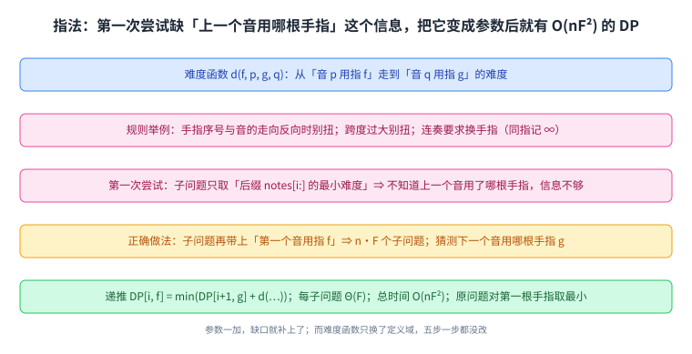
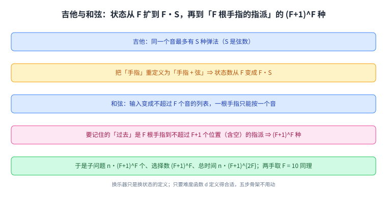
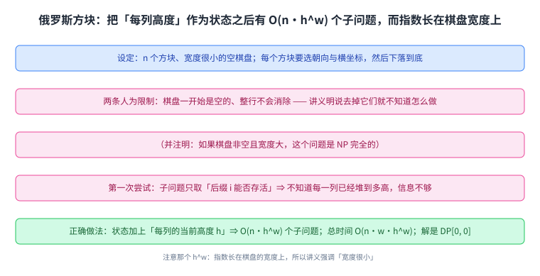
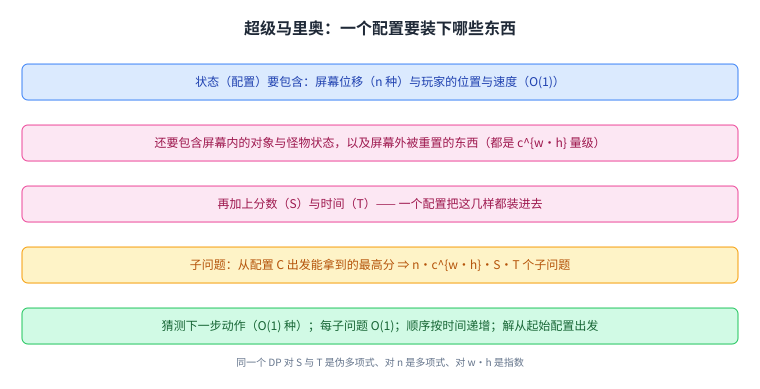

+++
title = "动态规划（四）：两类猜测与三个非典型例子"
lecture = 22
slug = "22-two-kinds-of-guessing-piano-tetris"
status = "draft"
source_kind = "notes"
source_url = "https://ocw.mit.edu/courses/6-006-introduction-to-algorithms-fall-2011/resources/mit6_006f11_lec22/"
source_title = "Lecture 22: Two kinds of guessing; piano/guitar fingering, Tetris training, Super Mario Bros."
output_mode = "explanation"
+++

第 19 讲到第 21 讲把 [[term:dynamic-programming]] 的骨架与三类例子讲完了。这一讲是 DP 的第四讲，也是收尾，它做两件事：把[[term:guessing]]这一步分成两类，然后拿三个非典型例子（钢琴与吉他指法、俄罗斯方块训练、超级马里奥）各走一遍。

Lecture Overview 列了四项：两类猜测、钢琴与吉他指法、俄罗斯方块训练、超级马里奥。

## 一、这一讲要解决什么：猜测有两种

讲义先复习五步清单，然后给出这一讲的新内容，也就是一个分类：

> 原文：2 kinds of guessing: (A) In (3), guess which other subproblems to use (used by every DP except Fibonacci). (B) In (1), create more subproblems to guess/remember more structure of solution used by knapsack DP. • effectively report many solutions to subproblem. • lets parent subproblem know features of solution.

读法要抓住括号里的步骤号：**A 类发生在第 3 步**（关联[[term:subproblem]]的解那一步），猜的是「这个子问题该用哪些别的子问题」；讲义说除了 Fibonacci，每个 DP 都在用它。**B 类发生在第 1 步**（定义子问题那一步），它不是「猜一个值」，而是造出更多的子问题，好让子问题把解的更多结构一起报上来；讲义点明[[term:knapsack]]用的就是这一类。

这两个类正好把前面几讲的例子分开了：[[term:edit-distance]]的「三种动作选哪种」与括号化的「最外层乘法在哪里」都是 A 类；而背包给子问题加上「剩余容量」这个参数、以及第 19 讲给最短路加上「用了至多几条边」，都是 B 类。A 类是在已有的子问题之间挑，B 类是先改变子问题的集合。

这张图是这一讲的总纲：后面三个例子都在做同一件事：先判断自己缺什么信息，再决定用 A 类还是 B 类补上。

## 二、例子一：钢琴与吉他指法

第一个例子来自音乐演奏，也就是[[term:fingering]]问题，讲义还列了三篇相关论文（1997、2000、2007 年各一篇）。问题本身是：给定一段用右手弹的 \(n\) 个单音，怎么安排手指最省力。人类的 \(F = 5\) 根手指，而「费力」由一个函数定义：

> 原文：metric d(f, p, g, q) of difficulty going from note p with finger f to note q with finger g. e.g., 1 < f < g & p > q =⇒ uncomfortable. stretch rule: p ≪ q =⇒ uncomfortable. legato (smooth) =⇒ ∞ if f = g. weak-finger rule: prefer to avoid g ∈ {4, 5}

读法是：难度是「从（音 \(p\)、指 \(f\)）走到（音 \(q\)、指 \(g\)）」的四元函数。规则里有三条很直观：手指序号与音的走向反向变化时别扭；两音跨度过大时别扭；连奏要求换手指，所以同一根手指连弹要记作无穷大；而第 4、5 指偏弱，能不用就不用。

第一次尝试很自然会写成「后缀 \(notes[i:]\) 的最小难度」，而讲义立刻指出它不够：

> 原文：1. subproblem = min. difficulty for suffix notes[i :] … DP[i] = min(DP[i + 1] + d(note[i], f, note[i + 1], ?) for f · · ·) → not enough information!

缺口就在那个问号里：要知道下一个音用哪根手指，才知道代价是多少，而只给「后缀」的子问题里没有这个信息。 这正是 B 类的用武之地：把「第一个音用指 \(f\)」也变成子问题的一部分。

修好之后是：子问题 \(DP[i, f]\) 表示「从第 \(i\) 个音开始、且第一个音用指 \(f\)」的最小难度，一共 \(n \cdot F\) 个；猜测下一个音用哪根手指 \(g\)（\(F\) 种）；递推是 \(DP[i, f] = \min(DP[i+1, g] + d(notes[i], f, notes[i+1], g))\)，基例 \(DP[n, f] = 0\)；每个子问题 \(\Theta(F)\)；顺序是 \(i\) 倒序、\(f\) 遍历；总时间 \(O(nF^2)\)；原问题要对最开始那根手指取一次最小。讲义这段伪代码是 Python 风格（`range(F)`），要存的表也就 \(n \cdot F\) 个格子。

这张图的对比就是 B 类的教科书式用法：参数一加，缺口就补上了。

## 三、从钢琴推广到吉他与和弦

吉他带来一个新变化：

> 原文：Guitar: Up to S ways to play same note! (where S is # strings). • redefine "finger" = finger playing note + string playing note. • =⇒ F → F · S

也就是说，同一个音在吉他有最多 \(S\) 种弹法（\(S\) 是弦数），于是把「手指」这个状态重定义为「手指加弦」，状态数从 \(F\) 变成 \(F \cdot S\)。难度函数 \(d\) 不用改，只要把定义域扩大。

再往前一步是同时弹多个音（和弦）。讲义这样描述它需要的状态：

> 原文：Multiple notes at once e.g. chords. • input: notes[i] = list of ≤ F notes (can't play > 1 note with a finger). • state we need to know about "past" now assignment of F fingers to ≤ F + 1 notes/null =⇒ (F + 1)^F such mappings

读法是：输入不再是一个音而是一个「不超过 \(F\) 个音」的列表；而为了知道「过去」发生了什么，需要记住的是把 \(F\) 根手指派给「不超过 \(F+1\) 个位置（含空）」的一种指派，这样的指派有 \((F+1)^F\) 种。于是量级变成：子问题 \(n \cdot (F+1)^F\) 个、选择数 \((F+1)^F\)、总时间 \(n \cdot (F+1)^{2F}\)。

讲义还补了两句很实用的注记：两只手就把 \(F\) 取成 10，做法完全一样；而换到别的乐器时，只要把难度函数 \(d\) 定义得合适，骨架不用动。

这张图是一条扩充链：换乐器只是换状态的定义，而 DP 的五步一步都没改。

## 四、例子二：俄罗斯方块训练

第二个例子看起来很不像算法题：给一串方块，让它们落在一个很窄的棋盘上。

> 原文：Tetris Training: • given sequence of n Tetris pieces & an empty board of small width w. • must choose orientation & x coordinate for each. • then must drop piece till it hits something. • full rows do not clear. without the above two artificialities WE DON'T KNOW! (but: if nonempty board & w large then NP-complete). • goal: survive i.e., stay within height h

这里最值得学的是讲义的态度：它先把问题削成可解的形状（棋盘是空的、整行不消除），然后明说去掉这两条人为限制之后我们不会做，并且注明相关情形的难度属于[[term:np-complete]]。先把边界说清楚，再讲算法。

第一次尝试同样失败：子问题取「后缀 \(i\) 能否活下来」，可答案是「不知道前缀长什么样」，因为能不能放下一个方块，取决于当前每一列被堆到多高。所以又一次用 B 类补参数：

> 原文：Correct: 1. subproblem = survive? in suffix i: given initial column occupancies h0, h1, · · · , hw−1, call it h =⇒ # subproblems = O(n · h^w)

读法是：把「每一[[term:column]]的当前高度」这个整体 \(h\) 作为子问题的一部分，子问题数变成 \(O(n \cdot h^w)\)；递推是 \(DP[i, h] = \max(DP[i, m])\)，对在这个 \(h\) 下方块 \(i\) 的所有合法落法 \(m\) 取最大；每个子问题的代价是 \(O(w)\)（要枚举横坐标）；总时间是 \(O(n \cdot w \cdot h^w)\)；解是 \(DP[0, 0]\)，落法用 parent pointers 还原。

**注意那个 \(h^w\)：指数长在棋盘的宽度上。** 这就是为什么讲义要强调「宽度很小」，因为这一讲后面还会在别处看到同一种形状的代价。实际实现时这张表会很大（\(h^w\) 个列高组合），即使用 NumPy 这样的数组库也存不下，所以只能取很小的宽度。

这张图把两次尝试摆在一起，并且标出 \(h^w\) 这个指数项来自哪里。

## 五、例子三：超级马里奥

第三个例子把同一个套路用在动作游戏上。给定整个关卡（对象、敌人等，规模是 \(n\)），而屏幕只有 \(w \times h\) 大。关键在「状态该包含什么」：

> 原文：configuration: screen shift (← n); player position & velocity (O(1)) (← w); object states, monster positions, etc. (← c^{w·h}); anything outside screen gets reset (← c^{w·h}); score (← S); time (← T). transition function δ: (config, action) → config'

读法是：一个「配置」要包含屏幕位移、玩家的位置与速度、屏幕内对象与怪物的状态、以及分数与时间；而屏幕外的东西会被重置，所以状态空间不必包含整个关卡。动作只有几种（不动、上、下、左、右、B、A 的按下与松开），转移函数把「配置加动作」映射到新配置。

照着清单走：子问题是「从配置 \(C\) 出发能拿到的最高分」，个数是 \(n \cdot c^{w \cdot h} \cdot S \cdot T\)；猜测是「下一步做什么动作」，只有 \(O(1)\) 种；递推分三种情况：已经踩到终点旗子就取当前分数、已经死掉或时间用完就不是解、否则对所有动作取最大值；每个子问题 \(O(1)\)。这里求的是分数最大，与第 16 讲 Dijkstra 求代价最小正好相反，所以取的是最大而不是最小；顺序按时间递增，这正是第 14 讲 DFS 给出的那种拓扑序；原问题是从起始配置出发。

而这一节的收尾是三层复杂度，写得很整齐：

> 原文：• pseudopolynomial in S & T. • polynomial in n. • exponential in w · h

读法是：**同一个 \(DP\)，对不同的输入参数处在三个不同的量级上。** 对分数上限 \(S\) 与时间上限 \(T\) 是伪多项式（第 21 讲刚讲过的那个概念），对关卡长度 \(n\) 是多项式，而对屏幕尺寸 \(w \cdot h\) 是指数级。也就是说，这个算法只在屏幕很小时可用。另外一句对照：如果把每个动作都看成单位代价、只问「最早什么时候能到终点」，那个状态图上用第 13 讲的 BFS 就够了；而这里要的是最高分，所以必须用 DP。

这张图把三句话并排画出来：同一份代码，换一个参数看就是另一个量级，而哪一层是瓶颈取决于游戏本身。

这张图是这一讲的收束：状态定义决定了量级，而量级决定了算法能不能用。

## 读完应该能回答

- 两类猜测分别发生在五步清单的第几步，各自猜的是什么；
- 指法问题第一次尝试缺了哪条信息，用什么参数把它补上；
- 从钢琴到吉他再到和弦，状态空间是怎么一步步放大的；
- 俄罗斯方块与超级马里奥这两个例子里，代价的指数项各长在哪个输入参数上；
- 为什么同一个 DP 可以同时对 S 是伪多项式、对 n 是多项式、对 w·h 是指数。

## 脉络回顾

这一讲收束了 DP 的四讲。第 19 讲给出「把子问题的答案存起来」这个起点，第 20 讲把方法压成五步清单，第 21 讲把清单搬到字符串上并引入伪多项式时间，而这一讲做的是对清单里第二步（猜测）本身的分类：A 类是在已有的子问题之间选，B 类是造出更多的子问题来记住更多结构。回头看，前面每一讲的「修法」其实都能归到这两类里：背包加容量参数、最短路加边数上限、指法加「上一个音用哪根手指」，都是 B 类；而编辑距离选动作、括号化选分割点，都是 A 类。

而这一讲选的三个例子也很说明问题：钢琴指法、俄罗斯方块、超级马里奥，这三个题目彼此毫无关系，但它们在清单里长得一样。它们共同的教学价值在于状态的选取：指法的状态是「哪根手指」、方块的状态是「每列多高」、马里奥的状态是「屏幕内的一切加分数与时间」。而这一讲最后一个例子的三层复杂度说明了一件事：DP 的可行性往往不取决于问题本身，而取决于你选了多大的状态。 屏幕小就能算，屏幕大就指数爆炸。

到这里图算法与动态规划两条主线都走完了。往后的两讲会离开具体算法，谈计算复杂度与算法研究本身。

## 溯源

本讲的内容来自 MIT 6.006 Fall 2011 的 Lecture 22: Dynamic Programming IV 讲义（6 页 typed notes；第 6 页是 OCW 版权页；讲义自身页眉写作 Dynamic Programming IV of IV、标题写作 Lecture 22: Dynamic Programming IV，而 OCW 资源页的标题是 Two kinds of guessing; piano/guitar fingering, Tetris training, Super Mario Bros.，本页 front matter 用后者、正文按讲义内容写）。本讲的事实都能在上述讲义里逐条对上：Lecture Overview 的四项；五步清单的复习与两类猜测的定义（A 类在第 3 步、除 Fibonacci 外每个 DP 都用；B 类在第 1 步、背包用的就是它，以及「让子问题报告多个解」「让父问题知道解的特征」这两句）；指法那一节引的三篇论文（1997、2000、2007 年）、\(F = 5\)、难度函数 \(d(f, p, g, q)\) 与四条规则（序号与走向反向、跨度、连奏要求换手指、弱指规则）、第一次尝试的失败与「信息不够」的结论、正确版本加上「第一个音用指 \(f\)」后 \(n \cdot F\) 个子问题与每子问题 \(\Theta(F)\)、总时间 \(O(nF^2)\)、以及原问题要对第一根手指取最小；吉他那一节「同一个音最多 \(S\) 种弹法」与把手指重定义为「手指加弦」所以 \(F \to F \cdot S\)；和弦的推广（输入变成不超过 \(F\) 个音的列表、\((F+1)^F\) 种指派、子问题 \(n \cdot (F+1)^F\)、选择数 \((F+1)^F\)、总时间 \(n \cdot (F+1)^{2F}\)、两手取 \(F = 10\)、只要把 \(d\) 定义好）；俄罗斯方块那一节的设定（\(n\) 个方块、宽度很小的空棋盘、要选朝向与横坐标、必须下落到底、整行不消除）、「去掉这两条人为限制我们不知道怎么做」与「非空棋盘且宽度大时是 NP 完全」这两句、目标是在[[term:height]] \(h\) 内存活、第一次尝试的失败、正确版本把「每列高度」当作状态后 \(O(n \cdot h^w)\) 个子问题与 \(O(w)\) 每子问题、总时间 \(O(n \cdot w \cdot h^w)\)、解是 \(DP[0, 0]\) 并用 parent pointers 还原落法；超级马里奥那一节的配置组成（屏幕位移、玩家位置与速度、对象与怪物状态、屏幕外重置、分数 \(S\)、时间 \(T\)）、七种动作与转移函数 \(\delta\)、子问题数 \(n \cdot c^{w \cdot h} \cdot S \cdot T\)、\(O(1)\) 种猜测与 \(O(1)\) 每子问题、按时间递增的顺序、以及最后那三行复杂度（对 \(S\) 与 \(T\) 伪多项式、对 \(n\) 多项式、对 \(w \cdot h\) 指数）。

讲义没有写的部分，以下是我们补的：这篇中文讲解本身（讲义是英文提纲），全部配图（讲义里的示意图一律重画，不转载），以及三处展开说明：

1. 「两类猜测正好把前面几讲的例子分开了」这个归纳，以及每一类各对应哪些例子；
2. 「换乐器只是换状态的定义，而五步一步都没改」这个说法；
3. 「DP 的可行性往往不取决于问题本身，而取决于你选了多大的状态」这个收尾。

另外四处登记：一是讲义把难度规则里的跨度一条写成 `stretch rule: p  q =⇒ uncomfortable`，其中那个关系符号在文本层没有抽出来（只剩下一个空格），本页按其含义转述为「两音跨度过大时别扭」，不做符号层面的复原；二是讲义在俄罗斯方块那节把目标写成 `survive i.e., stay within height h`，而第一次尝试里写着 `survive in suffix i:? WRONG`，本页按「能否存活」与「在高度 h 内」两个说法分别表述；三是讲义的和弦状态数写成 \((F+1)^F\)（即 \(F\) 根手指派给 \(F+1\) 个位置），本页照录这个式子；四是资料来源里的 `_orig` 手写版讲义我们只登记、未使用。
