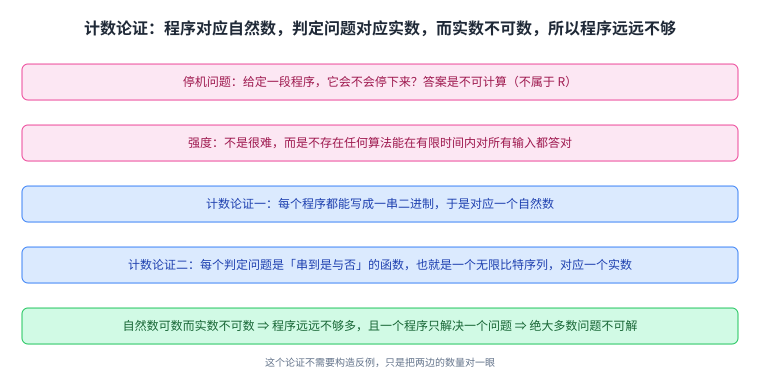
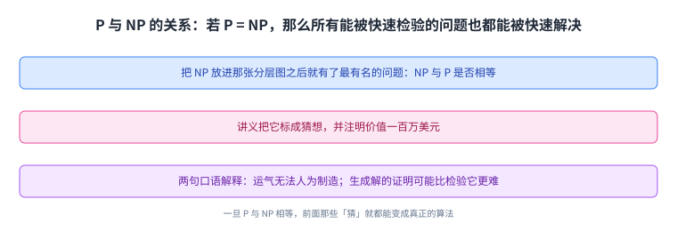
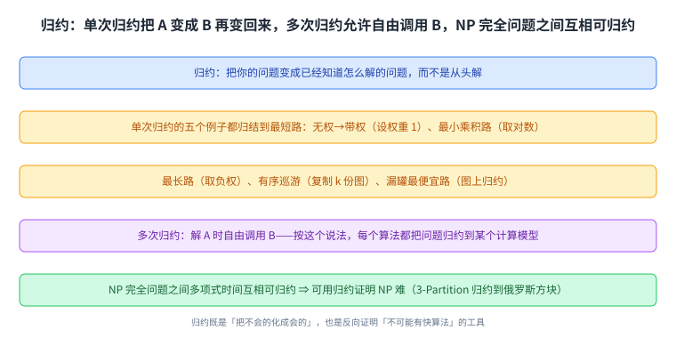

+++
title = "计算复杂度：P、EXP、NP 与归约"
lecture = 23
slug = "23-computational-complexity"
status = "draft"
source_kind = "notes"
source_url = "https://ocw.mit.edu/courses/6-006-introduction-to-algorithms-fall-2011/resources/mit6_006f11_lec23/"
source_title = "Lecture 23: Computational complexity"
output_mode = "explanation"
+++

前面二十几讲都在讲「怎么算得快」：从图搜索到动态规划，每一讲都在给一个问题找出更漂亮的代价。这一讲把问题反过来问：有些问题是不是根本算不快，甚至有些问题根本没有算法。它给的工具是三个复杂度类加两个概念（难与完全），以及一个贯穿全讲的动词：归约。

Lecture Overview 列了五项：P、EXP、R；大多数问题不可计算；NP；难与完全；归约。

## 一、这一讲要解决什么：先分三层（P、EXP 与 R）

讲义先把三个类定义清楚，它们是这一讲的坐标系：

> 原文：P = {problems solvable in polynomial (n^c) time} (what this class is all about). EXP = {problems solvable in exponential (2^{n^c}) time}. R = {problems solvable in finite time} "recursive" [Turing 1936; Church 1941]

读法是三档递进：[[term:polynomial-time]]能解的、指数时间能解的、以及只要能在有限时间内解出来的（最后一档允许任意慢）。它们之间是真包含关系，而这三个类的外面还有一大片区域，属于「不可计算」。

讲义用三个例子把这三档落到实处：[[term:negative-cycle]]检测属于 P；\(n \times n\) 的棋属于 EXP 但不属于 P（问题是从给定局面问「谁赢」）；而俄罗斯方块属于 EXP，但人们不知道它是否属于 P（问题是从给定棋盘问「给定这串方块能否活下来」）。

**俄罗斯方块正是第 22 讲那个例子。** 那一讲为了让它可解，加了「棋盘一开始是空的、整行不消除」两条人为限制；而这一讲问的是原始版本，于是它成了一个连「是否多项式可解」都不知道的问题。负权环检测则由第 17 讲的 Bellman-Ford 在多项式时间内解决，它是 P 那一档的实例。

这张图是这一讲的坐标：先看清自己在哪一档，再问这一档与下一档之间有没有空隙。

## 二、大多数问题根本不可计算

最著名的不可计算问题是停机问题：

> 原文：Halting Problem: Given a computer program, does it ever halt (stop)? • uncomputable (∉ R): no algorithm solves it (correctly in finite time on all inputs). • decision problem: answer is YES or NO

注意它的强度：不是「很难」，而是**不存在任何算法**能在有限时间内对所有输入都给出正确答案。这里的程序可以是任意语言的，比如一段 Python 代码。

而这是一个[[term:decision-problem]]。讲义接着给了一个计数论证，说明这种不可计算不是个别现象，而是绝大多数：

> 原文：program ≈ binary string ≈ nonneg. integer ∈ N. decision problem = a function from binary strings (≈ nonneg. integers) to {YES (1), NO (0)}. ≈ infinite sequence of bits ≈ real number ∈ R. |N| ≪ |R|: no assignment of unique nonneg. integers to real numbers (R uncountable). =⇒ not nearly enough programs for all problems. each program solves only one problem. =⇒ almost all problems cannot be solved

这条链值得慢慢读：每个程序都可以写成一串二进制，于是对应一个自然数；而每个判定问题是一个「从串到是与否」的函数，也就是一个无限长的比特序列，对应一个实数。自然数可数而实数不可数，所以程序的数量远远不够覆盖所有问题；再加上一个程序只解决一个问题，结论就是几乎所有问题都不可解。

这个论证完全不需要构造反例，它只是把两边的数量对一眼。所以「不可计算」是常态，能算才是例外。

这张图里的两条「数量尺」就是全部论证：一边可数，一边不可数。

## 三、NP：靠「幸运」在多项式时间内解决

第三层是 NP，讲义对它的定义有点特别：

> 原文：NP = {Decision problems solvable in polynomial time via a "lucky" algorithm}. The "lucky" algorithm can make lucky guesses, always "right" without trying all options. • nondeterministic model: algorithm makes guesses & then says YES or NO. • guesses guaranteed to lead to YES outcome if possible (no otherwise)

读法是：假设有一个运气极好的算法，它做选择时总能选到对的那条路，而不需要把所有可能都试一遍。如果这样一个算法能在多项式时间内给出答案，这个问题就属于 NP。它紧接着给了等价的第二种说法：

> 原文：In other words, NP = {decision problems with solutions that can be "checked" in polynomial time}. This means that when answer = YES, can "prove" it & polynomial-time algorithm can check proof

第二种说法更实用：解可以被快速检验。 当答案是「是」时，你能给出一份证明，而验证这份证明只需要多项式时间。讲义用俄罗斯方块演示了这两种说法是同一件事：幸运算法是「猜每一步怎么走，看是否活下来」，而证明就是把那串走法列出来（因为俄罗斯方块的规则本身很容易检查）。

这张图要把两种说法当成一个定义的两个面：一个讲「怎么找到」，一个讲「怎么验证」。

## 四、P 还是 NP：一个百万美元的猜想

把 NP 放进第一张图之后，就有了这一讲最有名的问题：NP 与 P 是否相等。讲义把它标成猜想，并且注明奖金：

> 原文：Big conjecture (worth $1,000,000). • ≈ cannot engineer luck. • ≈ generating (proofs of) solutions can be harder than checking them

两句解释都很口语但很准：这个猜想等价于说运气无法人为制造，也等价于说生成一份解的证明可能比检验它更难。而一旦 P 与 NP 真的相等，那么前面那些「猜」就都能变成真正的算法，整个密码学的地基也会跟着变化，比如 [[term:rsa]] 这类依赖「某些问题难解」的方案。

这张图只画一个问题：NP 那圈里除了 P 之外，到底还有没有东西。

## 五、难与完全：给问题排队

有了 P 与 NP，就可以说清「难」这个词的技术含义。

> 原文：Claim: If P ≠ NP, then Tetris ∈ NP - P [Breukelaar, Demaine, Hohenberger, Hoogeboom, Kosters, Liben-Nowell 2004]. Why: Tetris is NP-hard = "as hard as" every problem ∈ NP. In fact NP-complete = NP ∩ NP-hard

这里有一处排版要先说明：讲义这两句里的不等号在抽取出来的文本层里显示为等号（两个抽取引擎都是如此，本课第 16 讲的伪代码里也出现过同一类现象）。按上下文只能是「不等于」：如果 P 与 NP 相等，那么 NP 减去 P 就是空集，那句话也就没有内容了。本页按「不等于」叙述，并在溯源登记这一点。

读法上，两个术语的层次要分清：NP-hard 说的是「和 NP 里每个问题一样难」，它本身不要求属于 NP；[[term:np-complete]] 是「既属于 NP、又是 NP-hard」的交集。于是「若 P 不等于 NP，则俄罗斯方块在 NP 里但不在 P 里」这句话的含义就是：它是最难的那一档里的一个具体问题，而它的 NP 难性来自 2004 年那篇论文。

同样的框架可以往上挪一层：棋是 EXP 完全的，也就是 EXP 与 EXP-hard 的交集；而 EXP-hard 的意思是「和 EXP 里每个问题一样难」。讲义在这里又给了同一处排版现象的第二个实例（「如果 NP 不等于 EXP，那么棋不在 EXP 减去 NP 的那部分里」），并补了一句诚实的注记：NP 与 EXP 是否相等也是一个开放问题，只是没那么有名、也没那么重要。

这张图把「难」与「完全」分成两条线：难是一条下界，完全是下界加上「自己属于那个类」。

## 六、归约：把新问题变成旧问题

最后讲义给出这一讲真正可操作的技术：[[term:reduction]]。

> 原文：Reductions: Convert your problem into a problem you already know how to solve (instead of solving from scratch). • most common algorithm design technique

> 原文：unweighted shortest path → weighted (set weights = 1). • min-product path → shortest path (take logs) [PS6-1]. • longest path → shortest path (negate weights) [Quiz 2, P1k]

> 原文：shortest ordered tour → shortest path (k copies of the graph) [Quiz 2, P5]. • cheapest leaky-tank path → shortest path (graph reduction) [Quiz 2, P6]

这五个例子全都在做同一件事：把一个问题变成[[term:shortest-path]]。无权最短路（也就是第 13 讲 BFS 做的事）可以给每条边设[[term:weight]] 1 变成带权问题；求乘积最小的路可以取对数变成求和；求最长路可以把权重取负；而「有序巡游」与「漏罐最便宜路」则用复制图或图上小改造的办法解决。讲义把这一类叫做单次归约：A 问题变成 B 问题，解完 B 再把解变回 A。

它还给了更强的一类：

> 原文：Multicall reductions: solve A using free calls to B — in this sense, every algorithm reduces problem → model of computation. NP-complete problems are all interreducible using polynomial-time reductions (same difficulty). This implies that we can use reductions to prove NP-hardness — such as in 3-Partition → Tetris

多次归约是「解 A 的过程中随便调用 B」。按这个说法，**每个算法都可以看成把问题归约到了某个[[term:model-of-computation]]上**。而所有 NP 完全问题之间都能用多项式时间互相归约，所以它们难度相同；这也正是证明「某个问题 NP 难」的标准手法：把已知难的问题归约到它，比如从 3-Partition 归约到俄罗斯方块。

这张图与前面几讲的算法设计接上了：**归约是「把不会的化成会的」**，而这一讲用它来反向证明「有些问题不可能有快的算法」。

## 七、NP 完全问题清单

讲义最后列了一串大家熟悉的问题，它们全是 NP 完全的：

> 原文：Examples of NP-Complete Problems: • Knapsack (pseudopoly, not poly). • 3-Partition: given n integers, can you divide them into triples of equal sum?

> 原文：• Traveling Salesman Problem: shortest path that visits all vertices of a given graph — decision version: is minimum weight ≤ x? • longest common subsequence of k strings. • Minesweeper, Sudoku, and most puzzles

> 原文：• SAT: given a Boolean formula (and, or, not), is it ever true? x and not x → NO. • shortest paths amidst obstacles in 3D. • 3-coloring a given graph. • find largest clique in a given graph

这份清单里有几个老朋友：背包（也就是[[term:knapsack]]）在第 21 讲出现过，那讲给的是 [[term:dynamic-programming]] 的伪多项式算法，而这里注明它「不属于多项式」；\(k\) 个串的最长公共子序列正是第 21 讲编辑距离那个等价关系里出现的对象；三维空间里带障碍物的最短路说明第 16 讲 Dijkstra 那套在[[term:graph]]上没有这种约束时才有效。还有 SAT 那个例子写得很直观：一个布尔公式里同时出现 \(x\) 与「非 \(x\)」，那它永远不可能为真。

所以这一讲的结论不是「这些问题很难」，而是「它们难在同一个地方」：只要能快速解决其中任意一个，就能快速解决全部。

这张图与前面几讲的例子一一对得上：清单里出现的老朋友，正是前面讲过的那些算法在这里碰到的天花板。

## 读完应该能回答

- P、EXP、R 三档的定义，以及它们之间的包含关系；
- 停机问题为什么是「不存在算法」，而计数论证为什么能说明这是常态；
- NP 的两种说法分别是什么，它们为什么等价；
- 「NP-hard」与「NP-complete」的区别，棋与俄罗斯方块分别贴在哪一档；
- 单次归约与多次归约各是什么，归约怎么用来证明一个问题是 NP 难的。

## 脉络回顾

这一讲把整门课的两条主线接上了。第一条是图算法：第 13 讲的 BFS 解决无权最短路，第 16 讲的 Dijkstra 与第 17 讲的 Bellman-Ford 解决带权最短路，而这一讲开的归约清单里，五个例子全都归结到最短路，其中负权环检测还是 P 那一档的成员。第二条是动态规划：第 19 讲到第 22 讲用同一套骨架处理了序列、字符串与游戏，而这一讲给了其中两个例子一个「天花板」——俄罗斯方块不只是第 22 讲的那个游戏，它还是 EXP 完全的问题；背包不只是第 21 讲的一个 DP 练习，它还是 NP 完全的问题，那一讲算出的伪多项式时间正是它「难」的一种表现。

所以这一讲的位置很清楚：前面二十几讲回答「怎么算得快」，它回答「快到什么程度是极限」。而它的答案分三层：有些问题有多项式算法（P），有些问题我们知道怎么在指数时间内解但不知道有没有更快的（比如俄罗斯方块），而绝大多数问题连算法都不存在（不可计算）。夹在中间的 NP 与那个百万美元猜想，就是这一整门课最想留给学生的开放问题。

到这里 6.006 的主线就讲完了。最后一讲会离开这些具体的类与算法，谈算法研究本身在做什么。

## 溯源

本讲的内容来自 MIT 6.006 Fall 2011 的 Lecture 23: Computational Complexity 讲义（6 页 typed notes；第 6 页是 OCW 版权页；讲义自身页眉与标题写作 Computational Complexity，与 OCW 资源页的标题 Computational complexity 只有大小写差别，本页 front matter 用资源页的写法、正文按讲义内容写）。本讲的事实都能在上述讲义里逐条对上：Lecture Overview 的五项；三个类的定义（P 是多项式 \(n^c\) 时间、EXP 是指数 \(2^{n^c}\) 时间、R 是有限时间可解，并注明「recursive」与 Turing 1936、Church 1941 这两个出处）以及它们之间的真包含关系与三者之外的不可计算区域；三个例子（负权环检测属于 P、\(n \times n\) 棋属于 EXP 但不属于 P、俄罗斯方块属于 EXP 而是否属于 P 未知）；停机问题的表述与「不可计算（不属于 R）」的含义、以及「判定问题的答案是是或否」这条说明；那段计数论证的全部步骤（程序约等于二进制串约等于自然数、判定问题是到「是/否」的函数、约等于无限比特序列约等于实数、自然数远少于实数、程序不够多、每个程序只解决一个问题、所以几乎全部问题不可解）；NP 的两种说法（幸运算法与可检验性）、非确定性模型的表述、「若能通向是则猜测必定通向是」这条限定、以及俄罗斯方块属于 NP 的演示（猜每一步、证明就是列出走法）；「P 与 NP 是否相等」这个价值一百万美元的猜想与两句解释（无法人为制造运气、生成解的证明可能比检验更难）；难与完全那一节的全部内容（俄罗斯方块在 P 不等于 NP 时属于 NP 减去 P、2004 年那篇论文、NP-hard 的含义、NP-complete 是交集、棋是 EXP 完全、EXP-hard 的含义、NP 与 EXP 是否相等也是开放问题）；归约那一节（把问题转成已知问题、五个单次归约的例子与它们的出处标注、单次归约的定义、多次归约的定义与「每个算法都是把问题归约到某个计算模型」这个说法、NP 完全问题之间互相可归约以及用它证明 NP 难的手法与 3-Partition 到俄罗斯方块这个例子）；以及最后那份 NP 完全问题清单的全部条目（背包并注明是伪多项式而非多项式、3-Partition 的定义、旅行商问题的判定版本、\(k\) 个串的最长公共子序列、扫雷与数独及大多数谜题、SAT 与「\(x\) 且非 \(x\) 则不可能是真」这个例子、三维空间里带障碍物的最短路、三着色、最大团）。

讲义没有写的部分，以下是我们补的：这篇中文讲解本身（讲义是英文提纲），全部配图（讲义里的示意图一律重画，不转载），以及三处展开说明：

1. 「不可计算是常态、能算才是例外」这个总结，以及「这个论证完全不需要构造反例，只是把两边的数量对一眼」这个读法；
2. 「NP 的两种说法是一个定义的两个面，一个讲怎么找到、一个讲怎么验证」这个对应；
3. 收尾把整门课的两条主线接起来（归约清单里五个例子都归结到最短路；俄罗斯方块与背包分别是第 22 讲与第 21 讲的老朋友，而它们在这里各有一个天花板）。

另外四处登记：一是讲义那句关于俄罗斯方块的断言里，不等号在抽取出来的文本层里显示为等号（两个抽取引擎都如此，本课第 16 讲的伪代码里也出现过同类现象），按上下文只能是不等于，本页在引文之前先行说明、按「不等于」叙述、并在此登记；二是同一页关于棋的那句里再次出现同一种现象，处置相同；三是讲义把三个类的关系写在图里（本页转述为真包含关系），而图内文字在文本层只读出 \(P\)、\(EXP\)、\(R\)、\(NP\) 与两处「不可计算/不可判定」；四是资料来源里的 `_orig` 手写版讲义我们只登记、未使用。
