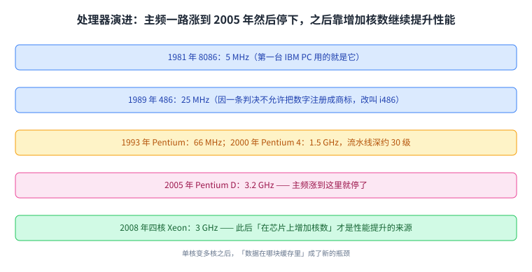
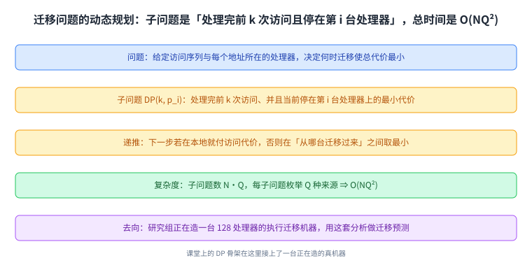
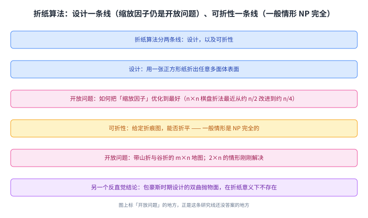
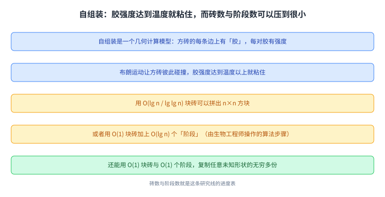
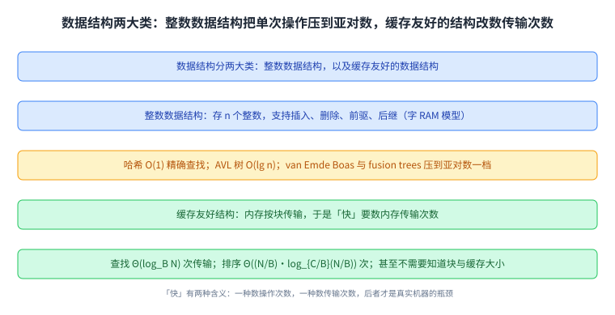
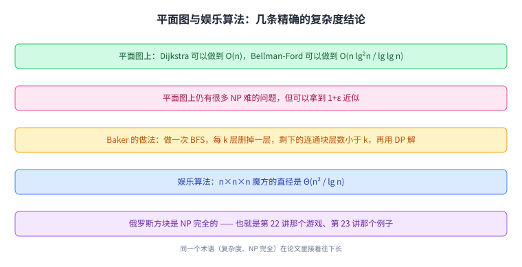
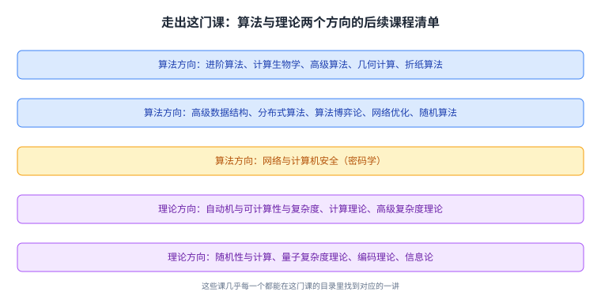

+++
title = "走出 6.006：并行处理器架构与算法研究"
lecture = 24
slug = "24-algorithms-research-topics"
status = "draft"
source_kind = "notes"
source_url = "https://ocw.mit.edu/courses/6-006-introduction-to-algorithms-fall-2011/resources/mit6_006f11_lec24/"
source_title = "Lecture 24: Parallel Processor Architecture & Algorithms"
output_mode = "explanation"
+++

这是全课的最后一讲。前面二十几讲都在教「怎么把一个问题算清楚」，而这一讲的页眉写着 **Beyond 6.006**，也就是「走出 6.006 之后」：它先给一个正在做的研究项目，再把研究方向与后续课程列一遍，最后用一张玩笑幻灯片收尾。

讲义自身的标题是「Lecture 24: Parallel Processor Architecture & Algorithms」，而仓库清单里这一讲登记的名字是 `Algorithms research topics`。**两者不一致**，本页按资源页与讲义自身的写法取标题，并在溯源里登记这处出入。

## 一、这一讲要解决什么：从「会算」走到「还在研究什么」

这一讲的结构与前面完全不同：它不引入新的算法套路，而是把课堂上那套语言（代价、DP、近似）搬到一个当下还没有定论的问题上，然后再摊开一张研究地图。读它的时候可以把前面每一讲都当成工具：当一个问题的答案不在课本里时，你手上的工具还在。

它开场用一段处理器演进史说明「为什么要换思路」：从 1981 年的 8086（5 MHz）一路到 2000 年的 Pentium 4（1.5 GHz，流水线深达约 30 级），再到 2005 年的 Pentium D（3.2 GHz）。而到了 2008 年的四核 Xeon（3 GHz），主频不再涨了，讲义点明从此「在芯片上增加核数」才是性能继续提升的来源。

顺带一个有趣的法律注记：486 之所以叫 i486，是因为有一条判决不允许把数字注册成商标。

这张图把这一讲的动机说清了：单核变多核之后，「数据在哪块缓存里」成了新的瓶颈。

## 二、一个具体的研究问题：执行迁移

多核之后，每个处理器都有自己的缓存。程序大部分时间访问本地缓存，而偶尔需要访问远程内存：

> 原文：Most of the time program running on the processor accesses local or "cache" memory. Every once in a while, it accesses remote memory. Round-trip required to obtain data

而讲义给出了这一讲的核心研究想法（要用到前面讲过的 [[term:subproblem]] 视角），它的取舍方向很有意思：

> 原文：Research Idea: Execution Migration. When program running on a processor needs to access cache memory of another processor, it migrates its "context" to the remote processor and executes there. One-way trip for data access. Context = ProgramCounter + RegisterFile + . . . (can be larger than data to be accessed)

读法是：**与其把数据搬过来，不如把自己搬过去。** 拿不到远程缓存里的数据时，程序把「上下文」迁到那台处理器上就地执行，这样数据访问变成一次[[term:one-way]]（单程）而不是往返。代价是上下文本身可能比要取的数据还大（讲义说它大约几 K 比特），而这正是问题所在。

讲义把两种代价写成两个函数：迁移的代价是「距离加上载入延迟」，其中延迟取决于上下文大小；而远程访问的代价是「两倍距离」（因为要往返）。如果源和目的相同，两者都定义为 0。

这张图就是这一讲的取舍：同样的远程数据，两条路，代价不同。

## 三、用动态规划决定何时迁移

有了代价函数，问题就变成一个[[term:decision-problem]]：

> 原文：Problem: Decide when to migrate to minimize total memory cost of trace. … What can we use to solve this problem? Dynamic Programming!

讲义先假设访问模式已知（一串内存地址，以及每个地址所在处理器），然后给出子问题与递推：

> 原文：Define DP(k, p_i) as cost of optimal solution for the prefix m1, . . . , mk of memory accesses when program starts at p1 and ends up at p_i. … Complexity? O(N · Q · Q) = O(NQ²)

读法是：子问题是「处理完前 \(k\) 次访问、并且当前停在第 \(i\) 台处理器上的最小代价」；下一步如果恰好访问本地就付访问代价，否则要在「从任意一台迁移过来」之间取最小。子问题数是 \(N \cdot Q\)（\(Q\) 是处理器数），每个子问题要枚举 \(Q\) 种来源，所以总数是 \(O(NQ^2)\)。

这里有一处要先说明：递推的两个分支在抽取出来的文本里都显示成 `if p_j = p(m_{k+1})`，而它们必须互斥（一个管本地访问、一个管迁移）。按上下文，其中一支应为「不等于」；这一类现象在讲义里已经是第三次出现（第 16 讲的伪代码、第 23 讲的两处条件句都出现过），本页按互斥理解并登记。

讲义最后交代了它的去向：这套分析用的就是第 19 讲到第 22 讲那套 [[term:dynamic-programming]]。研究组正在造一台 128 处理器的执行迁移机器，用这套分析做迁移预测。 于是第 19 讲到第 22 讲那套 DP 骨架，在一台真实的机器上找到了用处。

这张图把课堂上的 DP 与一台正在造的机器接在一起：代价模型不变，变的只是状态的含义。

## 四、研究地图（上）：折纸与自组装

讲义在讲完这套以 Python 代码为上下文的分析之后，把下一半换成了一张研究地图，先列了它自己的主要方向：计算几何、折纸算法、自组装、数据结构、图算法、娱乐算法，以及「算法雕塑」。其中两个方向给了细节。

折纸算法分两条线：一条是设计，也就是「用一张正方形纸折出任意多面体表面」，这里有一个开放问题：怎么把缩放因子做得最好（讲义举的例子是 \(n \times n\) 棋盘折法，最近从约 \(n/2\) 改进到约 \(n/4\)）；另一条是可折性，也就是「给定折痕图，能否折平」，一般情形是 NP 完全的，而带山折与谷折的 \(m \times n\) 地图还是开放问题，\(2 \times n\) 的情形刚刚解决。讲义还提到一个反直觉的结论：包豪斯时期设计过的一个双曲抛物面，在折纸意义下不存在。

这张图的两个「开放问题」标签是重点：这是一张研究地图，所以图上标的是还没有答案的地方。

自组装是一个几何计算模型：DNA 链或方砖上有「胶」，胶的强度达到温度以上就粘住，于是靠布朗运动自己拼起来。它的成果可以量化：用 \(O(\lg n / \lg\lg n)\) 块砖能拼出 \(n \times n\) 方块；或者用 \(O(1)\) 块砖加 \(O(\lg n)\) 个「阶段」（由生物工程师操作的算法步骤）；还能用 \(O(1)\) 块砖与 \(O(1)\) 个阶段复制任意未知形状的无穷多份。

这张图的三个数字（砖数、阶段数、复制份数）就是这条线的研究进度表。

## 五、研究地图（下）：数据结构、平面图与娱乐算法

数据结构那一节把它分成两类。一类是整数数据结构：存 \(n\) 个整数，支持插入、删除、前驱、后继，在字 RAM 模型上比大小。这一类的进度很直观：第 8 讲的哈希能做到 \(O(1)\) 精确查找，第 6 讲的 AVL 树能把所有操作做到 \(O(\lg n)\)，而 van Emde Boas 与 fusion trees 把单次操作压到了 \(O(\lg\lg u)\) 与 \(O(\lg n / \lg\lg u)\) 这一档。另一类是缓存友好的数据结构：内存是按块传输的，于是查找只需 \(\Theta(\log_B N)\) 次传输，排序只需 \(\Theta(\frac{N}{B}\log_{C/B}\frac{N}{B})\) 次，而且这些甚至不需要你知道块大小与缓存大小。

这张图把「快」的两种含义并排放：一种数操作次数，一种数内存传输次数，而后者才是真实机器上的瓶颈。

（几乎）[[term:graph]]那一节接着第 16、17 讲的[[term:shortest-path]]往下走：在平面图上，Dijkstra 能做到 \(O(n)\)，Bellman-Ford 能做到 \(O(n \lg^2 n / \lg\lg n)\)。而很多问题即使在平面图上也是 NP 难的，但可以做到 \(1+\varepsilon\) 近似：Baker 的做法是从任意[[term:vertex]]开始做一次第 13 讲那种 BFS（[[term:breadth-first-search]]），每 \(k\) 层删掉一层，剩下的连通块层数小于 \(k\)，于是可以用 DP 在约 \(2^k \cdot n\) 的时间内解掉，而误差只有 \(1 + 1/k\) 这个因子。

娱乐算法那一节列了几个熟悉的东西：\(n \times n \times n\) 魔方的直径是 \(\Theta(n^2 / \lg n)\)；俄罗斯方块是 [[term:np-complete]] 的（这正是第 22 讲的那个游戏、第 23 讲的那个 NP 完全例子）；此外还有给任意多面体扭气球、以及算法魔术。

这张图是研究地图的最后一格：同一个术语（复杂度、NP 完全）在论文里接着往下长。

## 六、走出这门课：后续课程与最后一页

讲义最后给了两份课程清单。算法方向有：进阶算法、计算生物学、高级算法、几何计算、折纸算法、高级数据结构、分布式算法、算法博弈论、网络优化、随机算法、网络与计算机安全。理论方向有：自动机与可计算性与复杂度、计算理论、高级复杂度理论、随机性与计算、量子复杂度理论、编码理论、信息论。

这些课的定位很清楚：它们每一个都能在这门课的目录里找到对应的一讲，高级数据结构对应第 6 到第 8 讲，网络优化与网络与计算机安全对应第 15 讲到第 17 讲与密码学（比如 [[term:rsa]] 那一类依赖「难解」的构造），分布式算法与随机算法则超出了这门课的范围。

而这份清单之后是真正的最后一页，一张玩笑幻灯片：「6.006 坐垫的十种用法」。它从「坐在上面可以在常数时间内得到灵感」一路排到「考试小抄」，其中第五条是「渐近最优的吸音板（用来练钢琴与吉他指法 DP）」—— 而这正是第 22 讲那个例子。

这张图是这门课的最后一张地图：它列的不是知识点，而是接下来可以往里走的门。

## 读完应该能回答

- 为什么多核之后「数据在哪块缓存里」变成了新的瓶颈；
- 执行迁移的基本取舍是什么，两种代价各由什么决定；
- 迁移决策为什么可以用 DP 做，子问题与总时间分别是什么；
- 折纸算法与自组装这两条研究线各自的开放问题在哪；
- 缓存友好的数据结构与整数数据结构在「快」的定义上有什么不同。

## 脉络回顾

这是全课的最后一讲，所以这里把整门课的线接一遍。第 1 到第 3 讲打地基：算法思维（峰值查找）、计算模型（RAM 与 Python 的代价模型）与文档距离，它们回答「我们怎么衡量代价」。第 4 到第 12 讲是工具箱：堆与堆排序、调度与二叉搜索树、AVL 树、哈希、排序（插入、归并、快排、计数）、以及数值计算（牛顿法、平方根、Karatsuba 乘法），它们把「同一件事的多种做法」摆开。第 13 到第 18 讲进入图：BFS、DFS 与拓扑排序、带权最短路与通用骨架、Dijkstra、Bellman-Ford，以及加速 Dijkstra 的三种技巧。第 19 到第 22 讲是动态规划四部曲：记忆化与子问题、五步清单、字符串子问题与伪多项式时间、两类猜测与五个例子。第 23 讲换了一个问法：把「算得快」推到极限，给出 P、EXP 与 NP，以及「难」与「完全」的定义。而这一讲是那个极限之外的出口：它展示的不是新算法，而是新问题。

回头看，这条线其实只有三个动作在反复出现：把问题建模（计算模型、图、子问题）、把代价算清（渐进界、摊还、伪多项式、复杂度类）、把不会的化成会的（归约、近似、划分）。这门课从头到尾在训练这三件事，而最后这一讲证明它们在一台正在造的 128 处理器机器上、在一张折纸的折痕图上、在自组装的 DNA 方砖上都还管用。

而这一讲也比前面任何一讲都更明确地承认：**清单上没有答案的那几项，才是研究开始的地方。**

## 溯源

本讲的内容来自 MIT 6.006 Fall 2011 的 Lecture 24: Parallel Processor Architecture & Algorithms 讲义（11 页 typed notes，是全课最长的一份；第 11 页是 OCW 版权页；讲义自身页眉写作 Beyond 6.006、标题写作 Lecture 24: Parallel Processor Architecture & Algorithms，而仓库清单里这一讲的登记名是 Algorithms research topics，本页 front matter 用资源页与讲义自身的标题、并在下文登记这处出入）。本讲的事实都能在上述讲义里逐条对上：处理器演进史那六个型号与频率（8086 的 5 MHz、486 的 25 MHz 与「不让把数字注册成商标」这条判决、Pentium 的 66 MHz、Pentium 4 的 1.5 GHz 与约 30 级流水线、Pentium D 的 3.2 GHz 与主频停止增长、四核 Xeon 的 3 GHz 与「增加核数」这个结论）；「SRAM 无法支持超过约 4 个并行内存请求」；本地缓存与远程访问的区别与一次往返；执行迁移的想法、上下文比数据可能更大（约几 K 比特）、以及两个代价函数（迁移是距离加取决于上下文大小的载入延迟、访问是两倍距离、源与目的相同时为 0）；迁移决策问题与「用动态规划」这个提示、子问题 \(DP(k, p_i)\) 的定义与两分支递推、复杂度 \(O(N \cdot Q \cdot Q) = O(NQ^2)\)、以及「研究组正在造一台 128 处理器的执行迁移机器并用它做迁移预测」；研究领域清单与折纸那一节的全部内容（设计与可折性两条线、任意多面体表面可折、缩放因子是开放问题、\(n \times n\) 棋盘从约 \(n/2\) 改进到约 \(n/4\)、可折性一般情形 NP 完全、山折谷折的 \(m \times n\) 地图是开放问题、\(2 \times n\) 刚解决、双曲抛物面不存在、折平加一刀可做任意直线图）；自组装那一节（胶与强度、方砖、布朗运动与温度、\(O(\lg n/\lg\lg n)\) 块砖、\(O(1)\) 块砖加 \(O(\lg n)\) 个阶段、以及用 \(O(1)\) 块砖与 \(O(1)\) 个阶段复制未知形状）；数据结构那一节（两类划分、整数数据结构的操作集合与哈希/AVL/van Emde Boas/fusion trees 的代价、块传输与查找排序的传输次数、以及「不知道块大小与缓存大小也能做到」）；平面图那一节（平面图上 Dijkstra 的 \(O(n)\)、Bellman-Ford 的 \(O(n \lg^2 n/\lg\lg n)\)、平面图上仍有 NP 难问题、\(1+\varepsilon\) 近似、以及 Baker 那套做法）；娱乐算法那一节（魔方直径 \(\Theta(n^2/\lg n)\)、俄罗斯方块 NP 完全、扭气球、算法魔术）；两份课程清单的全部条目；以及最后那张「6.006 坐垫的十种用法」玩笑清单（含第五条「渐近最优的吸音板（用来练钢琴与吉他指法 DP）」）。

讲义没有写的部分，以下是我们补的：这篇中文讲解本身（讲义是英文提纲），全部配图（讲义里的示意图一律重画，不转载），以及三处展开说明：

1. 「读这一讲时可以把前面每一讲都当成工具：当问题的答案不在课本里时，手上的工具还在」这个读法，以及收尾把全课的动作归纳成三件事（建模、算清代价、把不会的化成会的）；
2. 「两个开放问题标签是这一节的重点：这是一张研究地图，所以图上标的是还没有答案的地方」这个提示；
3. 「快有两种含义」这个对照（整数数据结构数操作次数、缓存友好结构数传输次数）。

另外四处登记：一是清单与资源页的标题不一致（清单写 Algorithms research topics，而资源页与讲义自身都写 Parallel Processor Architecture & Algorithms），本页按后者取标题，未改清单；二是迁移递推的两个分支在抽取出来的文本里都显示成 `if p_j = p(m_{k+1})`，而它们必须互斥，这一类不等号被抽取层渲染成等号的现象在本课已是第三次出现（第 16 讲、第 23 讲各有一处），本页按互斥理解并登记；三是讲义那一节的自组装砖数写成 \(O(\lg n/\lg\lg n)\)（本页照录），而同一页的排版把它拆成了两行；四是清单注明本讲的 `_orig` 手写版覆盖课程后半程，我们只登记、未使用。
